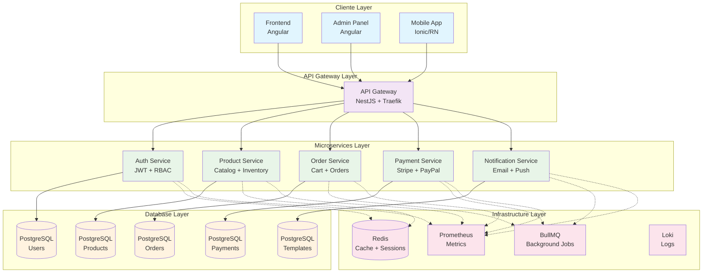
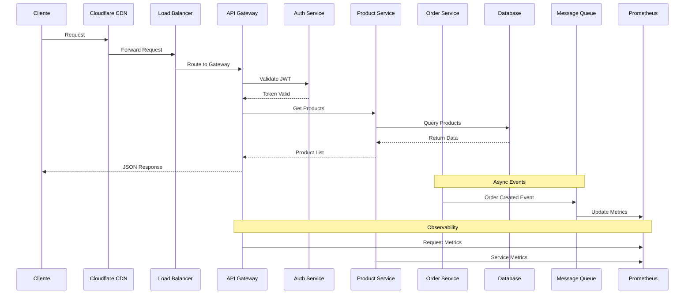

# 🛍️ Guía Profesional de Ecommerce con Microservicios

Una guía completa para desarrollar y desplegar ecommerce escalable usando tecnologías modernas, microservicios y mejores prácticas tanto para desarrollo como producción.

## 🎯 Alcance de la Guía

Esta guía cubre desde la optimización frontend hasta la infraestructura completa:

- **Frontend**: Angular con optimizaciones avanzadas
- **Backend**: Microservicios con NestJS
- **Infraestructura**: Kubernetes, Docker, CI/CD
- **Observabilidad**: Monitoring, logging y trazas
- **Seguridad**: TLS, autenticación y mejores prácticas

## 🧩 Stack Tecnológico

| Área                | Tecnologías                                      |
| ------------------- | ------------------------------------------------ |
| **Frontend**        | NX Monorepo + Angular + Optimizaciones avanzadas |
| **Backend**         | NX + NestJS + Microservicios + BullMQ            |
| **Infraestructura** | GCP (prod) + VPS (dev) + Kubernetes + Docker     |
| **Orquestación**    | Traefik + cert-manager + Let's Encrypt           |
| **CI/CD**           | GitHub Actions + Helm + Docker Registry          |
| **Observabilidad**  | Prometheus + Grafana + Loki + Jaeger             |

## 📚 Estructura de la Guía

### 🚀 Implementación Full-Stack

- **[Guía de Inicio Rápido](./GETTING_STARTED.md)** - Tu punto de entrada según rol y experiencia
- **[Roadmap de Implementación](./GETTING_STARTED.md#-roadmap-de-implementación-detallado)** - Plan paso a paso de 3-4 semanas
- **[Estructura del Proyecto](./PROJECT_STRUCTURE.md)** - Organización completa del repositorio

### 📚 Guías Especializadas por Área

#### ⚙️ Backend & Microservicios

- **[Arquitectura General](./docs/backend/README.md)** - 📄 Overview y patrones principales
- **[Microservices Architecture](./docs/backend/microservices-architecture.md)** - 📄 Implementación completa ✅
- **[NestJS Patterns](./docs/backend/nestjs-patterns.md)** - 📄 Patrones específicos de NestJS
- **[API Gateway](./docs/backend/api-gateway.md)** - 📄 Routing y autenticación
- **[Authentication](./docs/backend/authentication.md)** - 📄 JWT, RBAC y seguridad
- **[Event-Driven](./docs/backend/event-driven.md)** - 📄 BullMQ y comunicación
- **[Resilience](./docs/backend/resilience-patterns.md)** - 📄 Circuit breaker y retry

#### 🎨 Frontend & Performance

- **[Angular Overview](./docs/frontend/README.md)** - 📄 Arquitectura y setup
- **[Angular Optimization](./docs/frontend/angular-optimization.md)** - 📄 Performance y Core Web Vitals ✅
- **[State Management](./docs/frontend/state-management.md)** - 📄 NgRx patterns avanzados
- **[PWA & SEO](./docs/frontend/pwa-seo.md)** - 📄 Progressive Web App y SEO
- **[Design System](./docs/frontend/ui-design-system.md)** - 📄 Componentes y tokens

#### 🏗️ Infrastructure & DevOps

- **[Infrastructure Overview](./docs/infrastructure/README.md)** - 📄 Arquitectura general
- **[Docker Development](./docs/infrastructure/docker-development.md)** - 📄 Entorno local optimizado ✅
- **[Kubernetes Production](./docs/infrastructure/kubernetes-production.md)** - 📄 GKE y escalabilidad
- **[CI/CD Pipelines](./docs/infrastructure/ci-cd-pipelines.md)** - 📄 GitHub Actions avanzado
- **[Monitoring](./docs/infrastructure/monitoring-observability.md)** - 📄 Observabilidad completa
- **[Security](./docs/infrastructure/security-hardening.md)** - 📄 Hardening y best practices

#### 🏛️ Architecture & Decisions

- **[Tech Stack](./docs/architecture/tech-stack-decisions.md)** - 📄 Por qué elegimos cada tecnología
- **[Scalability](./docs/architecture/scalability-patterns.md)** - 📄 Patrones de escalabilidad
- **[Migration](./docs/architecture/migration-strategies.md)** - 📄 Migrar sistemas existentes

### 🛠️ Código y Templates

#### 📖 Ejemplos Funcionales

- **[Basic Setup](./examples/basic-setup/)** - 📖 Demo mínimo funcional
- **[Microservices Demo](./examples/microservices-demo/)** - 📖 Implementación completa
- **[Production Configs](./examples/production-configs/)** - 📖 Configuraciones reales

#### 📦 Templates Listos

- **[Service Template](./templates/service-template/)** - 📦 Microservicio base NestJS
- **[Frontend Template](./templates/frontend-template/)** - 📦 App Angular optimizada
- **[Infrastructure Template](./templates/infrastructure-template/)** - 📦 Setup completo K8s

#### 🔧 Herramientas

- **[Development Tools](./tools/)** - 🔧 Scripts y automatización

## 🌐 Entornos Soportados

### 🛠️ Desarrollo (VPS Vultr)

- Docker Compose con Traefik
- Subdominios `dev.*` con HTTPS automático
- Let's Encrypt integrado
- Configuración simplificada para desarrollo rápido

### ☁️ Producción (Google Cloud)

- Google Kubernetes Engine (GKE)
- Cert-manager + Let's Encrypt
- Cloudflare WAF + CDN + DDoS Protection
- Observabilidad completa (Prometheus, Grafana, Loki, Jaeger)
- Auto-scaling y alta disponibilidad

## 🚀 Inicio Rápido

**¿Primera vez aquí?** 👉 **[Guía de Inicio Rápido](./GETTING_STARTED.md)** - Te ayudamos a empezar según tu rol

### 📖 Cómo usar esta guía:

1. **📚 Explora la documentación** - Lee las guías específicas para tu área
2. **🛠️ Aplica en tu proyecto** - Usa los patrones y configuraciones
3. **📦 Copia templates** - Descarga y personaliza para tu caso
4. **🔧 Implementa gradualmente** - Adopta solo lo que necesites

### 🎯 Rutas de implementación:

```
👨‍💻 Frontend Developer:
   docs/frontend/ → Patrones Angular → PWA + SEO

🔧 Backend Developer:
   docs/backend/ → Microservicios NestJS → Event-driven

🚀 DevOps Engineer:
   docs/infrastructure/ → Docker + K8s → CI/CD

🏛️ Tech Lead:
   docs/architecture/ → Decisiones técnicas → Escalabilidad
```

### 🌐 URLs de referencia para tu implementación:

- **Frontend local**: `http://localhost:4200`
- **API Gateway local**: `http://localhost:3000`
- **Producción**: Según tu dominio configurado
- **Monitoreo**: `http://localhost:3001` (Grafana)

> **📝 Nota**: Esta es una **guía de implementación**. Los ejemplos y templates están diseñados para que los copies y adaptes a tu proyecto específico.

## 🏗️ Arquitectura de Referencia

### Microservicios Recomendados

El siguiente diagrama muestra la arquitectura completa de microservicios que implementaremos. Cada capa tiene responsabilidades específicas y se comunica de manera controlada con las otras capas.



#### 📋 Descripción de Capas

**🎨 Cliente Layer (Azul)**

- **Frontend Angular**: Aplicación principal del ecommerce para usuarios finales
- **Admin Panel**: Panel administrativo para gestión de productos, pedidos y usuarios
- **Mobile App**: Aplicación móvil (Ionic o React Native) con la misma funcionalidad

**🚪 API Gateway Layer (Púrpura)**

- **API Gateway**: Punto único de entrada que maneja autenticación, rate limiting, y routing
- Utiliza NestJS para lógica de negocio y Traefik para load balancing y SSL

**⚙️ Microservices Layer (Verde)**

- **Auth Service**: Gestiona autenticación JWT, autorización RBAC, y sesiones de usuario
- **Product Service**: Catálogo de productos, inventario, categorías y búsqueda
- **Order Service**: Carrito de compras, gestión de pedidos, y estado de órdenes
- **Payment Service**: Procesamiento de pagos con Stripe/PayPal, facturas
- **Notification Service**: Emails transaccionales, push notifications, SMS

**💾 Database Layer (Amarillo)**

- Cada microservicio tiene su propia base de datos PostgreSQL
- Aislamiento completo de datos siguiendo el pattern "Database per Service"
- Comunicación entre servicios solo a través de APIs o eventos

**🔧 Infrastructure Layer (Rosa)**

- **Redis**: Cache distribuido y almacenamiento de sesiones
- **BullMQ**: Cola de trabajos asíncronos para procesos pesados
- **Prometheus**: Recolección de métricas de todos los servicios
- **Loki**: Agregación centralizada de logs

#### 🔗 Tipos de Conexión

- **Líneas sólidas (→)**: Comunicación HTTP/REST directa
- **Líneas punteadas (-.->)**: Comunicación asíncrona o secundaria
- Todas las comunicaciones externas pasan por el API Gateway

### Flujo de Datos

Este diagrama muestra cómo fluye una petición típica a través de todo el sistema, desde el cliente hasta la base de datos, incluyendo aspectos de observabilidad.



#### 📋 Descripción del Flujo

**🌍 Edge Layer**

1. **Cliente** hace petición (web, móvil, admin)
2. **Cloudflare CDN** cachea contenido estático y protege contra ataques DDoS
3. **Load Balancer** distribuye tráfico entre múltiples instancias

**🚪 Gateway Processing** 4. **API Gateway** recibe todas las peticiones y actúa como proxy 5. **Auth Service** valida tokens JWT y permisos RBAC 6. Gateway enruta la petición al microservicio correspondiente

**⚙️ Business Logic** 7. **Product Service** procesa lógica de negocio específica 8. **Database** ejecuta queries optimizadas con índices 9. Respuesta viaja de vuelta siguiendo la misma ruta

**🔄 Procesamiento Asíncrono**

- **Order Service** envía eventos a colas para procesamiento posterior
- **Message Queue (BullMQ)** procesa trabajos pesados sin bloquear APIs

**📊 Observabilidad**

- **Prometheus** recolecta métricas de latencia, errores, y throughput
- Todos los servicios envían métricas para monitoreo en tiempo real

#### ⏱️ Tiempos Típicos de Respuesta

- **Cache hit en CDN**: 10-50ms
- **API Gateway + Auth**: 20-100ms
- **Microservicio + Database**: 50-200ms
- **End-to-end total**: 100-400ms

## 📋 Subdominios y Arquitectura

### Desarrollo

- `dev.implementos.cl` - Frontend principal
- `admin.dev.implementos.cl` - Panel administrativo
- `api.dev.implementos.cl` - API Gateway
- `auth.dev.implementos.cl` - Servicio autenticación
- `traefik.dev.implementos.cl` - Dashboard Traefik

### Producción

- `implementos.cl` - Frontend principal
- `admin.implementos.cl` - Panel administrativo
- `api.implementos.cl` - API Gateway
- `auth.implementos.cl` - Servicio autenticación

> 🌥️ Todos los subdominios pasan por Cloudflare con WAF, caché, y protección DDoS activados.

## 📖 Cómo usar esta guía

**🆕 ¿Nuevo aquí?** Lee primero la **[Guía de Inicio Rápido](./GETTING_STARTED.md)** para encontrar tu ruta de aprendizaje ideal.

### Para Desarrolladores Nuevos

1. **Comienza aquí**: [Guía de Inicio Rápido](./GETTING_STARTED.md) para encontrar tu ruta
2. **Explora por área**: Ve directamente a [frontend](./docs/frontend/), [backend](./docs/backend/) o [infrastructure](./docs/infrastructure/)
3. **Practica**: Usa los [ejemplos funcionales](./examples/) para experimentar
4. **Implementa**: Utiliza los [templates](./templates/) para tu proyecto

### Para Desarrolladores Experimentados

- **Frontend específico**: Consulta la [sección frontend completa](./docs/frontend/)
- **Backend específico**: Revisa todos los [patrones de backend](./docs/backend/)
- **DevOps/Infraestructura**: Profundiza en [infrastructure](./docs/infrastructure/)

### Para Arquitectos/Tech Leads

- **Decisiones técnicas**: Analiza [architecture decisions](./docs/architecture/)
- **Stack completo**: Revisa todas las áreas para decisiones informadas
- **Escalabilidad**: Consulta [scalability patterns](./docs/architecture/scalability-patterns.md)

## 🎯 Roadmap

### ✅ Completado

- [x] Estructura organizada
- [x] Guías por área especializada
- [x] Documentación navegable
- [x] Contenido técnico completo

### 🚧 En Progreso

- [ ] **Templates funcionales** por área
- [ ] **Ejemplos de código completos**
- [ ] **Scripts de automatización**

### 📅 Próximamente

- [ ] Guías especializadas avanzadas
- [ ] Herramientas de desarrollo
- [ ] Casos de estudio reales
- [ ] Video tutoriales

## 🤝 Contribución

Esta guía está en constante evolución. Contribuciones bienvenidas:

1. **Issues**: Reporta errores o sugiere mejoras
2. **Pull Requests**: Añade contenido o corrige documentación
3. **Discusiones**: Comparte experiencias y casos de uso

### Cómo contribuir:

```bash
git fork <repo>
git checkout -b feature/nueva-funcionalidad
# Realiza cambios
git commit -m "feat: añadir nueva funcionalidad"
git push origin feature/nueva-funcionalidad
# Crear Pull Request
```

## 📄 Licencia

MIT License - Úsala libremente para tus proyectos comerciales y personales.

---

## 💡 Tips y Consideraciones

> **🎯 Filosofía**: Esta guía prioriza **simplicidad en desarrollo** y **robustez en producción**. Cada tecnología elegida tiene un propósito específico y probado en entornos reales.

> **🔧 Flexibilidad**: Aunque recomendamos el stack completo, puedes adoptar solo las partes que necesites. La arquitectura es modular por diseño.

> **📈 Escalabilidad**: El diseño soporta desde MVPs hasta aplicaciones enterprise con millones de usuarios.

### Casos de Uso Ideales:

- ✅ Ecommerce B2C y B2B
- ✅ Marketplaces multi-vendor
- ✅ Aplicaciones SaaS con facturación
- ✅ Plataformas con múltiples frontends
- ✅ APIs que requieren alta disponibilidad

---

**¿Listo para empezar?** 👉 **[Guía de Inicio Rápido](./GETTING_STARTED.md)**
