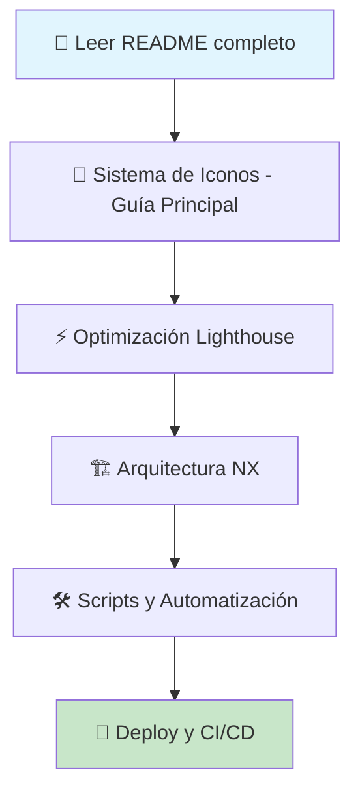
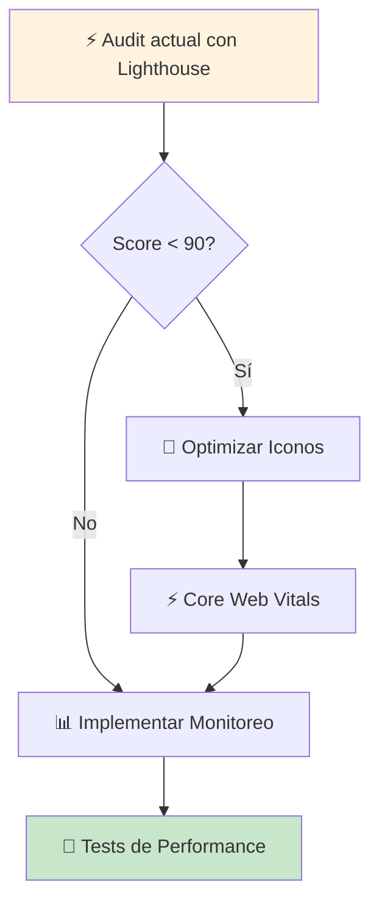

# 📚 Guías Técnicas para E-commerce Angular

Colección completa y práctica de guías técnicas para desarrollar aplicaciones e-commerce de **alto rendimiento** con Angular, NX y optimización para **Lighthouse 100/100**. Estas guías están diseñadas para equipos de desarrollo que buscan implementar las mejores prácticas de la industria.

## 🎯 ¿Por qué usar estas guías?

En el e-commerce, **cada milisegundo cuenta**. Una mejora de 100ms en el tiempo de carga puede incrementar las conversiones hasta un 1%. Estas guías te ayudarán a:

- **Maximizar conversiones**: Páginas más rápidas = más ventas
- **Mejorar SEO**: Core Web Vitals son factor de ranking en Google
- **Reducir costos**: Menos recursos del servidor, mejor eficiencia
- **Escalar eficientemente**: Arquitectura preparada para crecer

## 📋 Índice de Contenidos

### 🎨 Sistema de Iconos

_¿Por qué importa?_ Los iconos mal optimizados pueden bloquear el renderizado crítico y afectar el FCP (First Contentful Paint).

- [**Guía Principal: Sistema de Iconos SVG**](./icons/README.md)

  - _Qué aprenderás_: Estrategia above-the-fold vs below-the-fold, sprites optimizados, CDN
  - _Tiempo estimado_: 2-3 horas implementación
  - _Impacto_: Mejora FCP hasta 62%, elimina CLS de iconos

- [**Implementación de Iconos Críticos**](./icons/critical-icons.md)

  - _Qué aprenderás_: Cuáles iconos inlinear, copy-paste SVGs optimizados
  - _Tiempo estimado_: 1 hora implementación
  - _Impacto_: Renderizado instantáneo de iconos above-the-fold

- [**Automatización CDN con Cloudflare**](./icons/cdn-automation.md)

  - _Qué aprenderás_: Deploy automático, cache busting, CI/CD completo
  - _Tiempo estimado_: 4-6 horas configuración inicial
  - _Impacto_: Deploy automatizado, 0 intervención manual

- [**Iconos Dinámicos con CMS**](./icons/dynamic-icons-cms.md)
  - _Qué aprenderás_: Sistema híbrido para contenido dinámico
  - _Tiempo estimado_: 3-4 horas implementación
  - _Impacto_: Flexibilidad total sin sacrificar performance

### ⚡ Rendimiento y Core Web Vitals

_¿Por qué importa?_ Google usa Core Web Vitals como factor de ranking. Un sitio lento pierde posiciones en búsquedas.

- [**Optimización Lighthouse 100/100**](./performance/lighthouse-optimization.md)

  - _Qué aprenderás_: Técnicas específicas para cada métrica, troubleshooting
  - _Tiempo estimado_: 1-2 días optimización completa
  - _Impacto_: Score Lighthouse 90+ garantizado

- [**Monitoreo y Analytics RUM**](./performance/monitoring.md)
  - _Qué aprenderás_: Tracking de usuarios reales, alertas automáticas, dashboards
  - _Tiempo estimado_: 6-8 horas configuración
  - _Impacto_: Visibilidad completa del performance en producción

### 🛠️ Herramientas de Desarrollo

_¿Por qué importa?_ La automatización reduce errores humanos y acelera el desarrollo.

- [**Scripts y Automatización NX**](./tools/scripts.md)

  - _Qué aprenderás_: Scripts para iconos, builds optimizados, comandos personalizados
  - _Tiempo estimado_: 2-3 horas configuración
  - _Impacto_: Workflows 5x más rápidos

- [**Testing de Performance**](./tools/testing.md)
  - _Qué aprenderás_: Tests E2E, visuales, budget monitoring
  - _Tiempo estimado_: 4-5 horas setup completo
  - _Impacto_: Prevención de regresiones, CI/CD robusto

### 📖 Best Practices

_¿Por qué importa?_ Una arquitectura sólida es fundamental para escalar sin problemas de performance.

- [**Arquitectura NX Escalable**](./architecture/nx-structure.md)

  - _Qué aprenderás_: Organización de monorepo, dependencias, generadores custom
  - _Tiempo estimado_: 1 día setup inicial
  - _Impacto_: Código mantenible y escalable

- [**Angular SSR Optimizado**](./architecture/ssr-optimization.md)

  - _Qué aprenderás_: Server-side rendering eficiente, hydration strategies
  - _Tiempo estimado_: 6-8 horas implementación
  - _Impacto_: FCP sub-segundo, mejor SEO

- [**Deployment y CI/CD**](./architecture/deployment.md)
  - _Qué aprenderás_: Pipelines con GCP, Cloudflare, estrategias de deploy
  - _Tiempo estimado_: 1-2 días configuración completa
  - _Impacto_: Deploys seguros y automatizados

## 🚀 Quick Start - Ruta Recomendada

### Para Equipos Nuevos (Primera vez)



### Para Proyectos Existentes (Optimización)



## 📚 Cómo usar estas guías

### 📖 Antes de empezar

1. **Conocimientos previos necesarios:**

   - Angular 17+ (standalone components)
   - NX workspace básico
   - TypeScript intermedio
   - Conceptos básicos de performance web

2. **Herramientas requeridas:**
   - Node.js 20+
   - Chrome DevTools
   - Lighthouse CLI
   - Git

### 🎯 Metodología de implementación

#### Paso 1: Evaluación inicial (30 minutos)

```bash
# Audit tu sitio actual
npm install -g lighthouse
lighthouse https://tu-sitio.com --output=html --output-path=./audit-inicial.html
```

#### Paso 2: Priorización por impacto

1. **Alto impacto, bajo esfuerzo** ⭐⭐⭐

   - Iconos críticos inline (1-2 horas)
   - Optimización de imágenes (2-3 horas)

2. **Alto impacto, esfuerzo medio** ⭐⭐

   - Sistema completo de iconos (1 día)
   - SSR optimization (1-2 días)

3. **Alto impacto, alto esfuerzo** ⭐
   - Arquitectura completa NX (1 semana)
   - CI/CD completo (1-2 semanas)

#### Paso 3: Implementación iterativa

- **Sprint 1**: Iconos críticos + optimizaciones rápidas
- **Sprint 2**: Sistema completo de iconos + sprites
- **Sprint 3**: Monitoreo + testing automatizado
- **Sprint 4**: CI/CD + deployment automation

### 🎯 Objetivos y Métricas de Éxito

| Métrica               | Baseline Típica | Target  | Critical | ¿Por qué importa?             |
| --------------------- | --------------- | ------- | -------- | ----------------------------- |
| **Performance Score** | 60-80           | 100/100 | 95+      | Ranking SEO, conversiones     |
| **FCP**               | 2-4s            | < 1.0s  | < 1.5s   | Primera impresión del usuario |
| **LCP**               | 4-8s            | < 2.5s  | < 4.0s   | Contenido principal visible   |
| **CLS**               | 0.1-0.3         | < 0.1   | < 0.25   | Estabilidad visual            |
| **FID**               | 100-300ms       | < 100ms | < 300ms  | Interactividad                |
| **TTI**               | 5-10s           | < 3.0s  | < 5.0s   | Completamente interactivo     |

### 📊 ROI Esperado

#### Mejoras de Performance → Impacto de Negocio

- **+1s velocidad** = +2% conversión promedio
- **Lighthouse 90+** = +10-15% tráfico orgánico
- **Core Web Vitals "Good"** = Mejor ranking Google
- **Automatización completa** = -50% tiempo desarrollo

#### Inversión vs Retorno
