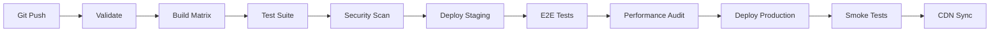

# 🚀 Deployment y CI/CD para E-commerce Angular

Guía completa para implementar pipelines de CI/CD optimizados para aplicaciones e-commerce Angular con NX, múltiples ambientes y optimización de performance.

## 🎯 Objetivos del Deployment

- **Zero Downtime**: Deployments sin interrupciones del servicio
- **Multi-Environment**: Dev, Staging, Production con configuraciones específicas
- **Performance First**: Optimización automática de assets y métricas
- **Security**: Validaciones de seguridad y dependency scanning
- **Rollback**: Capacidad de rollback automático ante fallos

## 📊 Pipeline Overview



## 🏗️ Estructura de CI/CD

### 1. GitHub Actions Workflow Principal

```yaml
# .github/workflows/ci-cd.yml
name: CI/CD Pipeline

on:
  push:
    branches: [main, develop]
  pull_request:
    branches: [main]
  workflow_dispatch:
    inputs:
      environment:
        description: "Target environment"
        required: true
        default: "staging"
        type: choice
        options:
          - staging
          - production
      skip_tests:
        description: "Skip tests (emergency deploy)"
        required: false
        default: false
        type: boolean

env:
  NODE_VERSION: "20"
  NX_CLOUD_ACCESS_TOKEN: ${{ secrets.NX_CLOUD_ACCESS_TOKEN }}
  HUSKY: 0

jobs:
  # ===============================
  # VALIDATION STAGE
  # ===============================
  validate:
    name: 🔍 Validate & Lint
    runs-on: ubuntu-latest
    outputs:
      affected-apps: ${{ steps.affected.outputs.apps }}
      affected-libs: ${{ steps.affected.outputs.libs }}
      has-changes: ${{ steps.affected.outputs.has-changes }}
    steps:
      - name: Checkout
        uses: actions/checkout@v4
        with:
          fetch-depth: 0

      - name: Setup Node.js
        uses: actions/setup-node@v4
        with:
          node-version: ${{ env.NODE_VERSION }}
          cache: "npm"

      - name: Install dependencies
        run: npm ci

      - name: Check affected projects
        id: affected
        run: |
          echo "apps=$(npx nx print-affected --select=projects --type=app --base=origin/main~1 --head=HEAD)" >> $GITHUB_OUTPUT
          echo "libs=$(npx nx print-affected --select=projects --type=lib --base=origin/main~1 --head=HEAD)" >> $GITHUB_OUTPUT
          echo "has-changes=$(npx nx print-affected --select=projects --base=origin/main~1 --head=HEAD | wc -l)" >> $GITHUB_OUTPUT

      - name: Lint affected projects
        run: npx nx affected --target=lint --base=origin/main~1 --head=HEAD --parallel=3

      - name: Type check
        run: npx nx affected --target=build --base=origin/main~1 --head=HEAD --configuration=development --parallel=3

      - name: Validate dependencies
        run: |
          echo "🔍 Checking for security vulnerabilities..."
          npm audit --audit-level=moderate
          echo "📦 Checking for outdated packages..."
          npm outdated || true

  # ===============================
  # SECURITY STAGE
  # ===============================
  security:
    name: 🛡️ Security Scan
    runs-on: ubuntu-latest
    needs: validate
    if: needs.validate.outputs.has-changes > 0
    steps:
      - name: Checkout
        uses: actions/checkout@v4

      - name: Setup Node.js
        uses: actions/setup-node@v4
        with:
          node-version: ${{ env.NODE_VERSION }}
          cache: "npm"

      - name: Install dependencies
        run: npm ci

      - name: Run Snyk security scan
        uses: snyk/actions/node@master
        env:
          SNYK_TOKEN: ${{ secrets.SNYK_TOKEN }}
        with:
          args: --severity-threshold=medium

      - name: CodeQL Analysis
        uses: github/codeql-action/analyze@v2
        with:
          languages: typescript, javascript

      - name: Check for secrets
        uses: trufflesecurity/trufflehog@main
        with:
          path: ./
          base: main
          head: HEAD

  # ===============================
  # BUILD MATRIX STAGE
  # ===============================
  build:
    name: 🏗️ Build (${{ matrix.app }})
    runs-on: ubuntu-latest
    needs: [validate, security]
    if: needs.validate.outputs.has-changes > 0
    strategy:
      matrix:
        app: ["ecommerce-angular", "admin-dashboard", "cms-dashboard"]
        include:
          - app: ecommerce-angular
            environment: production
            route: /
            critical: true
          - app: admin-dashboard
            environment: production
            route: /admin
            critical: false
          - app: cms-dashboard
            environment: staging
            route: /cms
            critical: false
    steps:
      - name: Checkout
        uses: actions/checkout@v4

      - name: Setup Node.js
        uses: actions/setup-node@v4
        with:
          node-version: ${{ env.NODE_VERSION }}
          cache: "npm"

      - name: Install dependencies
        run: npm ci

      - name: Build icons system
        run: npx nx icons-build icons

      - name: Build application
        run: |
          echo "🏗️ Building ${{ matrix.app }} for ${{ matrix.environment }}"
          npx nx build ${{ matrix.app }} --configuration=${{ matrix.environment }} --verbose

      - name: Generate build report
        run: |
          echo "📊 Analyzing bundle size for ${{ matrix.app }}"
          npx nx build ${{ matrix.app }} --configuration=${{ matrix.environment }} --stats-json
          npx webpack-bundle-analyzer dist/apps/${{ matrix.app }}/stats.json --report dist/apps/${{ matrix.app }}/bundle-report.html --mode static --no-open

      - name: Check bundle size limits
        run: |
          echo "🔍 Checking bundle size limits..."
          node scripts/check-bundle-size.mjs --app=${{ matrix.app }} --limit=1MB

      - name: Upload build artifacts
        uses: actions/upload-artifact@v3
        with:
          name: ${{ matrix.app }}-build-${{ github.sha }}
          path: |
            dist/apps/${{ matrix.app }}
            !dist/apps/${{ matrix.app }}/stats.json
          retention-days: 7

      - name: Upload bundle analysis
        uses: actions/upload-artifact@v3
        with:
          name: ${{ matrix.app }}-bundle-analysis-${{ github.sha }}
          path: dist/apps/${{ matrix.app }}/bundle-report.html
          retention-days: 14

  # ===============================
  # TEST STAGE
  # ===============================
  test:
    name: 🧪 Test Suite
    runs-on: ubuntu-latest
    needs: validate
    if: needs.validate.outputs.has-changes > 0 && !inputs.skip_tests
    strategy:
      matrix:
        test-type: ["unit", "integration", "e2e"]
    steps:
      - name: Checkout
        uses: actions/checkout@v4

      - name: Setup Node.js
        uses: actions/setup-node@v4
        with:
          node-version: ${{ env.NODE_VERSION }}
          cache: "npm"

      - name: Install dependencies
        run: npm ci

      - name: Run unit tests
        if: matrix.test-type == 'unit'
        run: |
          echo "🧪 Running unit tests..."
          npx nx affected --target=test --base=origin/main~1 --head=HEAD --parallel=3 --coverage --watch=false

      - name: Run integration tests
        if: matrix.test-type == 'integration'
        run: |
          echo "🔗 Running integration tests..."
          npx nx affected --target=integration-test --base=origin/main~1 --head=HEAD --parallel=2

      - name: Run E2E tests
        if: matrix.test-type == 'e2e'
        run: |
          echo "🌐 Running E2E tests..."
          npx nx affected --target=e2e --base=origin/main~1 --head=HEAD --parallel=1
        env:
          PLAYWRIGHT_WORKERS: 2

      - name: Upload test results
        if: always()
        uses: actions/upload-artifact@v3
        with:
          name: test-results-${{ matrix.test-type }}-${{ github.sha }}
          path: |
            coverage/
            test-results/
            playwright-report/
          retention-days: 7

  # ===============================
  # DEPLOY STAGING
  # ===============================
  deploy-staging:
    name: 🚀 Deploy to Staging
    runs-on: ubuntu-latest
    needs: [build, test]
    if: always() && (needs.build.result == 'success') && (needs.test.result == 'success' || inputs.skip_tests)
    environment:
      name: staging
      url: https://staging.miempresa.com
    steps:
      - name: Checkout
        uses: actions/checkout@v4

      - name: Download build artifacts
        uses: actions/download-artifact@v3
        with:
          pattern: "*-build-${{ github.sha }}"
          path: dist/

      - name: Configure AWS credentials
        uses: aws-actions/configure-aws-credentials@v4
        with:
          aws-access-key-id: ${{ secrets.AWS_ACCESS_KEY_ID }}
          aws-secret-access-key: ${{ secrets.AWS_SECRET_ACCESS_KEY }}
          aws-region: us-east-1

      - name: Deploy to S3 (Staging)
        run: |
          echo "🚀 Deploying to staging S3 bucket..."
          aws s3 sync dist/apps/ecommerce-angular/ s3://staging-ecommerce-bucket/ --delete --cache-control "public,max-age=31536000,immutable"
          aws s3 cp dist/apps/ecommerce-angular/index.html s3://staging-ecommerce-bucket/ --cache-control "public,max-age=0,must-revalidate"

      - name: Invalidate CloudFront (Staging)
        run: |
          echo "🔄 Invalidating CloudFront cache..."
          aws cloudfront create-invalidation --distribution-id ${{ secrets.STAGING_CLOUDFRONT_DISTRIBUTION_ID }} --paths "/*"

      - name: Deploy icons to CDN
        run: |
          echo "🎨 Deploying icons to CDN..."
          node scripts/deploy-icons.mjs --environment=staging
        env:
          CLOUDFLARE_ACCOUNT_ID: ${{ secrets.CLOUDFLARE_ACCOUNT_ID }}
          CLOUDFLARE_ACCESS_KEY_ID: ${{ secrets.CLOUDFLARE_ACCESS_KEY_ID }}
          CLOUDFLARE_SECRET_ACCESS_KEY: ${{ secrets.CLOUDFLARE_SECRET_ACCESS_KEY }}

      - name: Update deployment status
        run: |
          echo "✅ Staging deployment completed"
          echo "🌐 Available at: https://staging.miempresa.com"

  # ===============================
  # PERFORMANCE TESTING
  # ===============================
  performance-test:
    name: ⚡ Performance Audit
    runs-on: ubuntu-latest
    needs: deploy-staging
    if: always() && needs.deploy-staging.result == 'success'
    strategy:
      matrix:
        device: ["desktop", "mobile"]
        page: ["/", "/productos", "/producto/1"]
    steps:
      - name: Checkout
        uses: actions/checkout@v4

      - name: Setup Node.js
        uses: actions/setup-node@v4
        with:
          node-version: ${{ env.NODE_VERSION }}

      - name: Install Lighthouse CI
        run: npm install -g @lhci/cli

      - name: Wait for deployment
        run: |
          echo "⏳ Waiting for staging to be ready..."
          timeout 300 bash -c 'until curl -f -s https://staging.miempresa.com/health; do sleep 5; done'

      - name: Run Lighthouse audit
        run: |
          echo "🔍 Running Lighthouse audit for ${{ matrix.page }} on ${{ matrix.device }}"
          lhci autorun
        env:
          LHCI_GITHUB_APP_TOKEN: ${{ secrets.LHCI_GITHUB_APP_TOKEN }}
          LHCI_SERVER_BASE_URL: ${{ secrets.LHCI_SERVER_BASE_URL }}
          LHCI_BUILD_CONTEXT__CURRENT_HASH: ${{ github.sha }}
          LHCI_BUILD_CONTEXT__COMMIT_TIME: ${{ github.event.head_commit.timestamp }}

      - name: Performance budget check
        run: |
          echo "📊 Checking performance budgets..."
          node scripts/performance-budget-check.mjs --url=https://staging.miempresa.com${{ matrix.page }} --device=${{ matrix.device }}

      - name: Upload Lighthouse reports
        uses: actions/upload-artifact@v3
        with:
          name: lighthouse-reports-${{ matrix.device }}-${{ github.sha }}
          path: .lighthouseci/
          retention-days: 14

  # ===============================
  # DEPLOY PRODUCTION
  # ===============================
  deploy-production:
    name: 🌟 Deploy to Production
    runs-on: ubuntu-latest
    needs: [performance-test]
    if: (github.ref == 'refs/heads/main' || github.event_name == 'workflow_dispatch') && needs.performance-test.result == 'success'
    environment:
      name: production
      url: https://miempresa.com
    steps:
      - name: Checkout
        uses: actions/checkout@v4

      - name: Download build artifacts
        uses: actions/download-artifact@v3
        with:
          pattern: "*-build-${{ github.sha }}"
          path: dist/

      - name: Configure AWS credentials
        uses: aws-actions/configure-aws-credentials@v4
        with:
          aws-access-key-id: ${{ secrets.AWS_ACCESS_KEY_ID }}
          aws-secret-access-key: ${{ secrets.AWS_SECRET_ACCESS_KEY }}
          aws-region: us-east-1

      - name: Blue-Green deployment check
        run: |
          echo "🔵 Checking current production version..."
          CURRENT_VERSION=$(aws s3api head-object --bucket production-ecommerce-bucket --key version.txt --query 'Metadata.version' --output text || echo "none")
          echo "Current version: $CURRENT_VERSION"
          echo "New version: ${{ github.sha }}"

      - name: Deploy to S3 (Production)
        run: |
          echo "🚀 Deploying to production S3 bucket..."

          # Deploy with version metadata
          aws s3 sync dist/apps/ecommerce-angular/ s3://production-ecommerce-bucket/ \
            --delete \
            --cache-control "public,max-age=31536000,immutable" \
            --metadata "version=${{ github.sha }},deployment-time=$(date -u +%Y-%m-%dT%H:%M:%SZ)"

          # Update index.html separately with no-cache
          aws s3 cp dist/apps/ecommerce-angular/index.html s3://production-ecommerce-bucket/ \
            --cache-control "public,max-age=0,must-revalidate" \
            --metadata "version=${{ github.sha }}"

          # Update version file
          echo "${{ github.sha }}" | aws s3 cp - s3://production-ecommerce-bucket/version.txt \
            --metadata "version=${{ github.sha }}"

      - name: Gradual CloudFront invalidation
        run: |
          echo "🔄 Starting gradual CloudFront invalidation..."

          # Invalidate critical paths first
          aws cloudfront create-invalidation \
            --distribution-id ${{ secrets.PRODUCTION_CLOUDFRONT_DISTRIBUTION_ID }} \
            --paths "/index.html" "/version.txt" "/health"

          # Wait and then invalidate everything
          sleep 30
          aws cloudfront create-invalidation \
            --distribution-id ${{ secrets.PRODUCTION_CLOUDFRONT_DISTRIBUTION_ID }} \
            --paths "/*"

      - name: Deploy icons to production CDN
        run: |
          echo "🎨 Deploying icons to production CDN..."
          node scripts/deploy-icons.mjs --environment=production
        env:
          CLOUDFLARE_ACCOUNT_ID: ${{ secrets.CLOUDFLARE_ACCOUNT_ID }}
          CLOUDFLARE_ACCESS_KEY_ID: ${{ secrets.CLOUDFLARE_ACCESS_KEY_ID }}
          CLOUDFLARE_SECRET_ACCESS_KEY: ${{ secrets.CLOUDFLARE_SECRET_ACCESS_KEY }}

      - name: Health check
        run: |
          echo "🏥 Running production health checks..."
          timeout 300 bash -c 'until curl -f -s https://miempresa.com/health; do sleep 10; done'

          # Advanced health checks
          node scripts/health-check.mjs --url=https://miempresa.com --checks=critical

      - name: Smoke tests
        run: |
          echo "💨 Running production smoke tests..."
          npx playwright test --config=playwright.smoke.config.js
        env:
          PLAYWRIGHT_BASE_URL: https://miempresa.com

      - name: Update deployment tracking
        run: |
          echo "📊 Updating deployment tracking..."
          curl -X POST "${{ secrets.DEPLOYMENT_WEBHOOK_URL }}" \
            -H "Content-Type: application/json" \
            -d '{
              "version": "${{ github.sha }}",
              "environment": "production",
              "timestamp": "'$(date -u +%Y-%m-%dT%H:%M:%SZ)'",
              "deployer": "${{ github.actor }}",
              "repository": "${{ github.repository }}"
            }'

      - name: Create release
        uses: actions/create-release@v1
        env:
          GITHUB_TOKEN: ${{ secrets.GITHUB_TOKEN }}
        with:
          tag_name: v${{ github.run_number }}
          release_name: Release v${{ github.run_number }}
          body: |
            ## 🚀 Production Release v${{ github.run_number }}

            **Commit**: ${{ github.sha }}
            **Deployed by**: ${{ github.actor }}
            **Deployment time**: $(date -u +%Y-%m-%dT%H:%M:%SZ)

            ### 📊 Performance Metrics
            - Lighthouse Score: Check attached reports
            - Bundle Size: Check bundle analysis artifacts

            ### 🔗 Links
            - [Production Site](https://miempresa.com)
            - [Admin Dashboard](https://miempresa.com/admin)
            - [Performance Monitoring](https://monitoring.miempresa.com)
          draft: false
          prerelease: false

  # ===============================
  # ROLLBACK CAPABILITY
  # ===============================
  rollback:
    name: 🔄 Rollback
    runs-on: ubuntu-latest
    if: failure() && github.ref == 'refs/heads/main'
    needs: [deploy-production]
    environment:
      name: production-rollback
    steps:
      - name: Configure AWS credentials
        uses: aws-actions/configure-aws-credentials@v4
        with:
          aws-access-key-id: ${{ secrets.AWS_ACCESS_KEY_ID }}
          aws-secret-access-key: ${{ secrets.AWS_SECRET_ACCESS_KEY }}
          aws-region: us-east-1

      - name: Get previous version
        id: previous
        run: |
          echo "🔍 Finding previous stable version..."
          PREVIOUS_VERSION=$(aws s3 cp s3://production-ecommerce-bucket/previous-version.txt - || echo "")
          echo "previous-version=$PREVIOUS_VERSION" >> $GITHUB_OUTPUT

      - name: Rollback deployment
        if: steps.previous.outputs.previous-version != ''
        run: |
          echo "🔄 Rolling back to version: ${{ steps.previous.outputs.previous-version }}"

          # Here you would implement your rollback strategy
          # This could involve:
          # 1. Restoring from a backup
          # 2. Reverting to a previous S3 version
          # 3. Updating CloudFront to point to a previous origin

          aws cloudfront create-invalidation \
            --distribution-id ${{ secrets.PRODUCTION_CLOUDFRONT_DISTRIBUTION_ID }} \
            --paths "/*"

      - name: Notify rollback
        if: always()
        run: |
          echo "🚨 Rollback completed for production deployment"
          # Send notifications to team
```

### 2. Scripts de Automatización

```javascript
// scripts/check-bundle-size.mjs
import { readFileSync, statSync } from "fs";
import { glob } from "glob";
import chalk from "chalk";

const args = process.argv.slice(2);
const app = args.find((arg) => arg.startsWith("--app="))?.split("=")[1];
const limitStr = args.find((arg) => arg.startsWith("--limit="))?.split("=")[1];

if (!app || !limitStr) {
  console.error(
    "Usage: node check-bundle-size.mjs --app=ecommerce-angular --limit=1MB"
  );
  process.exit(1);
}

const limitBytes = parseSize(limitStr);
const distPath = `dist/apps/${app}`;

function parseSize(sizeStr) {
  const match = sizeStr.match(/^(\d+(?:\.\d+)?)(B|KB|MB|GB)$/i);
  if (!match) throw new Error(`Invalid size format: ${sizeStr}`);

  const [, size, unit] = match;
  const multipliers = { B: 1, KB: 1024, MB: 1024 ** 2, GB: 1024 ** 3 };

  return parseFloat(size) * multipliers[unit.toUpperCase()];
}

function formatSize(bytes) {
  const units = ["B", "KB", "MB", "GB"];
  let size = bytes;
  let unitIndex = 0;

  while (size >= 1024 && unitIndex < units.length - 1) {
    size /= 1024;
    unitIndex++;
  }

  return `${size.toFixed(2)}${units[unitIndex]}`;
}

async function checkBundleSize() {
  console.log(chalk.blue(`📊 Checking bundle size for ${app}...`));

  try {
    // Check main bundles
    const jsFiles = await glob(`${distPath}/**/*.js`);
    const cssFiles = await glob(`${distPath}/**/*.css`);

    let totalSize = 0;
    const files = [...jsFiles, ...cssFiles];

    const fileStats = files.map((file) => {
      const stats = statSync(file);
      totalSize += stats.size;

      return {
        file: file.replace(distPath + "/", ""),
        size: stats.size,
        formatted: formatSize(stats.size),
      };
    });

    // Sort by size (largest first)
    fileStats.sort((a, b) => b.size - a.size);

    console.log("\n📋 Bundle Analysis:");
    console.log("─".repeat(60));

    fileStats.slice(0, 10).forEach(({ file, formatted }) => {
      console.log(`${file.padEnd(40)} ${formatted.padStart(10)}`);
    });

    if (fileStats.length > 10) {
      console.log(`... and ${fileStats.length - 10} more files`);
    }

    console.log("─".repeat(60));
    console.log(`Total Size: ${formatSize(totalSize)}`);
    console.log(`Size Limit: ${limitStr}`);

    if (totalSize > limitBytes) {
      console.log(chalk.red(`❌ Bundle size exceeds limit!`));
      console.log(chalk.red(`   Actual: ${formatSize(totalSize)}`));
      console.log(chalk.red(`   Limit:  ${limitStr}`));
      console.log(
        chalk.red(`   Excess: ${formatSize(totalSize - limitBytes)}`)
      );

      // Suggestions for optimization
      console.log("\n💡 Optimization suggestions:");
      console.log("   • Enable tree shaking");
      console.log("   • Check for duplicate dependencies");
      console.log("   • Consider lazy loading for large modules");
      console.log("   • Optimize images and assets");

      process.exit(1);
    } else {
      console.log(chalk.green(`✅ Bundle size is within limits!`));
      console.log(
        chalk.green(`   ${formatSize(limitBytes - totalSize)} under limit`)
      );
    }
  } catch (error) {
    console.error(chalk.red("❌ Error checking bundle size:"), error);
    process.exit(1);
  }
}

checkBundleSize();
```

```javascript
// scripts/performance-budget-check.mjs
import { chromium } from "playwright";
import chalk from "chalk";

const args = process.argv.slice(2);
const url = args.find((arg) => arg.startsWith("--url="))?.split("=")[1];
const device =
  args.find((arg) => arg.startsWith("--device="))?.split("=")[1] || "desktop";

const PERFORMANCE_BUDGETS = {
  desktop: {
    fcp: 1000, // First Contentful Paint
    lcp: 2500, // Largest Contentful Paint
    cls: 0.1, // Cumulative Layout Shift
    tbt: 300, // Total Blocking Time
    fid: 100, // First Input Delay
  },
  mobile: {
    fcp: 1500,
    lcp: 3000,
    cls: 0.1,
    tbt: 500,
    fid: 100,
  },
};

async function checkPerformanceBudget() {
  console.log(chalk.blue(`⚡ Running performance budget check...`));
  console.log(`🌐 URL: ${url}`);
  console.log(`📱 Device: ${device}`);

  const browser = await chromium.launch({ headless: true });
  const context = await browser.newContext({
    ...(device === "mobile"
      ? {
          viewport: { width: 375, height: 667 },
          userAgent:
            "Mozilla/5.0 (iPhone; CPU iPhone OS 15_0 like Mac OS X) AppleWebKit/605.1.15",
        }
      : {
          viewport: { width: 1200, height: 800 },
        }),
  });

  const page = await context.newPage();

  try {
    // Navigate and measure Web Vitals
    const metrics = await page.evaluate(async (targetUrl) => {
      const { getCLS, getFCP, getLCP, getTTFB } = await import(
        "https://unpkg.com/web-vitals@3"
      );

      const results = {};

      return new Promise((resolve) => {
        let metricsCount = 0;
        const expectedMetrics = 4;

        const checkComplete = () => {
          metricsCount++;
          if (metricsCount === expectedMetrics) {
            resolve(results);
          }
        };

        getCLS((metric) => {
          results.cls = metric.value;
          checkComplete();
        });

        getFCP((metric) => {
          results.fcp = metric.value;
          checkComplete();
        });

        getLCP((metric) => {
          results.lcp = metric.value;
          checkComplete();
        });

        getTTFB((metric) => {
          results.ttfb = metric.value;
          checkComplete();
        });

        // Navigate to the page
        window.location.href = targetUrl;

        // Timeout fallback
        setTimeout(() => resolve(results), 10000);
      });
    }, url);

    const budget = PERFORMANCE_BUDGETS[device];
    const results = [];

    console.log("\n📊 Performance Metrics:");
    console.log("─".repeat(50));

    Object.entries(metrics).forEach(([metric, value]) => {
      const budget_value = budget[metric];
      const passed = value <= budget_value;
      const status = passed ? chalk.green("✅ PASS") : chalk.red("❌ FAIL");
      const formattedValue =
        metric === "cls" ? value.toFixed(3) : `${Math.round(value)}ms`;
      const formattedBudget =
        metric === "cls" ? budget_value.toFixed(1) : `${budget_value}ms`;

      console.log(
        `${metric.toUpperCase().padEnd(6)} ${formattedValue.padEnd(
          8
        )} (budget: ${formattedBudget}) ${status}`
      );

      results.push({
        metric: metric.toUpperCase(),
        value,
        budget: budget_value,
        passed,
      });
    });

    const failedMetrics = results.filter((r) => !r.passed);

    if (failedMetrics.length > 0) {
      console.log(
        chalk.red(
          `\n❌ ${failedMetrics.length} metrics failed budget constraints!`
        )
      );

      console.log("\n💡 Optimization recommendations:");
      failedMetrics.forEach(({ metric, value, budget }) => {
        switch (metric) {
          case "FCP":
            console.log("   • Optimize critical rendering path");
            console.log("   • Minimize render-blocking resources");
            break;
          case "LCP":
            console.log("   • Optimize largest contentful element");
            console.log("   • Preload critical resources");
            break;
          case "CLS":
            console.log("   • Set size attributes on images");
            console.log("   • Reserve space for dynamic content");
            break;
          case "TBT":
            console.log("   • Reduce JavaScript execution time");
            console.log("   • Code splitting and lazy loading");
            break;
        }
      });

      process.exit(1);
    } else {
      console.log(chalk.green("\n✅ All performance budgets passed!"));
    }
  } catch (error) {
    console.error(chalk.red("❌ Performance check failed:"), error);
    process.exit(1);
  } finally {
    await browser.close();
  }
}

if (!url) {
  console.error(
    "Usage: node performance-budget-check.mjs --url=https://example.com --device=desktop"
  );
  process.exit(1);
}

checkPerformanceBudget();
```

```javascript
// scripts/health-check.mjs
import fetch from "node-fetch";
import chalk from "chalk";

const args = process.argv.slice(2);
const url = args.find((arg) => arg.startsWith("--url="))?.split("=")[1];
const checks =
  args.find((arg) => arg.startsWith("--checks="))?.split("=")[1] || "basic";

const HEALTH_CHECKS = {
  basic: [
    { path: "/health", name: "Health Endpoint" },
    { path: "/", name: "Homepage" },
  ],
  critical: [
    { path: "/health", name: "Health Endpoint" },
    { path: "/", name: "Homepage" },
    { path: "/productos", name: "Products Page" },
    { path: "/api/health", name: "API Health" },
  ],
  comprehensive: [
    { path: "/health", name: "Health Endpoint" },
    { path: "/", name: "Homepage" },
    { path: "/productos", name: "Products Page" },
    { path: "/producto/1", name: "Product Detail" },
    { path: "/cart", name: "Shopping Cart" },
    { path: "/api/health", name: "API Health" },
    { path: "/api/products", name: "Products API" },
  ],
};

async function runHealthCheck(checkUrl, name) {
  const startTime = Date.now();

  try {
    const response = await fetch(checkUrl, {
      method: "GET",
      timeout: 10000,
      headers: {
        "User-Agent": "Health-Check-Bot/1.0",
      },
    });

    const duration = Date.now() - startTime;
    const status = response.status;

    if (status >= 200 && status < 300) {
      console.log(
        chalk.green(`✅ ${name.padEnd(20)} ${status} (${duration}ms)`)
      );
      return { success: true, duration, status };
    } else {
      console.log(chalk.red(`❌ ${name.padEnd(20)} ${status} (${duration}ms)`));
      return { success: false, duration, status };
    }
  } catch (error) {
    const duration = Date.now() - startTime;
    console.log(
      chalk.red(
        `❌ ${name.padEnd(20)} ERROR (${duration}ms) - ${error.message}`
      )
    );
    return { success: false, duration, error: error.message };
  }
}

async function performHealthChecks() {
  console.log(chalk.blue(`🏥 Running ${checks} health checks for ${url}...`));
  console.log("─".repeat(60));

  const checkList = HEALTH_CHECKS[checks] || HEALTH_CHECKS.basic;
  const results = [];

  for (const check of checkList) {
    const checkUrl = `${url}${check.path}`;
    const result = await runHealthCheck(checkUrl, check.name);
    results.push({ ...check, ...result });
  }

  console.log("─".repeat(60));

  const failed = results.filter((r) => !r.success);
  const totalDuration = results.reduce((sum, r) => sum + r.duration, 0);
  const avgDuration = totalDuration / results.length;

  console.log(
    `📊 Summary: ${results.length - failed.length}/${
      results.length
    } checks passed`
  );
  console.log(`⏱️  Average response time: ${avgDuration.toFixed(0)}ms`);

  if (failed.length > 0) {
    console.log(chalk.red(`\n❌ ${failed.length} health check(s) failed:`));
    failed.forEach((check) => {
      console.log(
        chalk.red(
          `   • ${check.name}: ${check.error || `HTTP ${check.status}`}`
        )
      );
    });

    // Alert if critical endpoints are down
    const criticalFailed = failed.filter(
      (f) => f.path === "/health" || f.path === "/" || f.path === "/api/health"
    );

    if (criticalFailed.length > 0) {
      console.log(chalk.red("\n🚨 CRITICAL: Essential endpoints are failing!"));
      process.exit(1);
    } else {
      console.log(
        chalk.yellow("\n⚠️  Some non-critical endpoints are failing.")
      );
      process.exit(0);
    }
  } else {
    console.log(chalk.green("\n✅ All health checks passed!"));
  }

  // Performance warnings
  if (avgDuration > 2000) {
    console.log(
      chalk.yellow(
        `⚠️  Average response time is slow (${avgDuration.toFixed(0)}ms)`
      )
    );
  }

  const slowChecks = results.filter((r) => r.duration > 3000);
  if (slowChecks.length > 0) {
    console.log(chalk.yellow(`⚠️  Slow endpoints detected:`));
    slowChecks.forEach((check) => {
      console.log(chalk.yellow(`   • ${check.name}: ${check.duration}ms`));
    });
  }
}

if (!url) {
  console.error(
    "Usage: node health-check.mjs --url=https://example.com --checks=critical"
  );
  process.exit(1);
}

performHealthChecks();
```

### 3. Configuración de Lighthouse CI

```javascript
// lighthouserc.js
module.exports = {
  ci: {
    collect: {
      url: [
        "https://staging.miempresa.com/",
        "https://staging.miempresa.com/productos",
        "https://staging.miempresa.com/producto/1",
      ],
      settings: {
        preset: "desktop",
        chromeFlags: "--no-sandbox --disable-dev-shm-usage",
        skipAudits: ["uses-http2"],
      },
      numberOfRuns: 3,
    },
    assert: {
      assertions: {
        "categories:performance": ["error", { minScore: 0.9 }],
        "categories:accessibility": ["error", { minScore: 0.9 }],
        "categories:best-practices": ["error", { minScore: 0.9 }],
        "categories:seo": ["error", { minScore: 0.9 }],
        "first-contentful-paint": ["error", { maxNumericValue: 1000 }],
        "largest-contentful-paint": ["error", { maxNumericValue: 2500 }],
        "cumulative-layout-shift": ["error", { maxNumericValue: 0.1 }],
        "total-blocking-time": ["error", { maxNumericValue: 300 }],
      },
    },
    upload: {
      target: "lhci",
      serverBaseUrl: process.env.LHCI_SERVER_BASE_URL,
      token: process.env.LHCI_BUILD_TOKEN,
    },
  },
};
```

### 4. Configuración de Playwright para Smoke Tests

```typescript
// playwright.smoke.config.js
import { defineConfig, devices } from "@playwright/test";

export default defineConfig({
  testDir: "./tests/smoke",
  fullyParallel: true,
  forbidOnly: !!process.env.CI,
  retries: process.env.CI ? 2 : 0,
  workers: process.env.CI ? 1 : undefined,
  reporter: [
    ["html", { outputFolder: "playwright-report/smoke" }],
    ["junit", { outputFile: "test-results/smoke-results.xml" }],
  ],
  use: {
    baseURL: process.env.PLAYWRIGHT_BASE_URL || "https://staging.miempresa.com",
    trace: "on-first-retry",
    screenshot: "only-on-failure",
  },
  projects: [
    {
      name: "chromium",
      use: { ...devices["Desktop Chrome"] },
    },
    {
      name: "Mobile Chrome",
      use: { ...devices["Pixel 5"] },
    },
  ],
  timeout: 30000,
  expect: {
    timeout: 10000,
  },
});
```

```typescript
// tests/smoke/critical-paths.spec.ts
import { test, expect } from "@playwright/test";

test.describe("Critical Path Smoke Tests", () => {
  test("Homepage loads successfully", async ({ page }) => {
    await page.goto("/");

    // Check critical elements are present
    await expect(page.locator("header")).toBeVisible();
    await expect(page.locator("h1")).toContainText("Black Friday");
    await expect(page.locator(".cta-primary")).toBeVisible();

    // Performance check
    const navigationPromise = page.waitForLoadState("networkidle");
    await navigationPromise;

    // Check no console errors
    const errors = [];
    page.on("console", (msg) => {
      if (msg.type() === "error") {
        errors.push(msg.text());
      }
    });

    expect(errors).toHaveLength(0);
  });

  test("Products page loads and search works", async ({ page }) => {
    await page.goto("/productos");

    // Check products are displayed
    await expect(page.locator(".product-card")).toHaveCount.greaterThan(0);

    // Test search functionality
    await page.fill('[placeholder="Buscar productos..."]', "auriculares");
    await page.press('[placeholder="Buscar productos..."]', "Enter");

    // Wait for search results
    await page.waitForSelector(".product-card", { timeout: 5000 });
  });

  test("Add to cart functionality", async ({ page }) => {
    await page.goto("/");

    // Click first "Agregar al Carrito" button
    await page.click(".add-to-cart-btn >> first");

    // Check cart counter updates
    await expect(page.locator(".cart-count")).toBeVisible();
    await expect(page.locator(".cart-count")).toContainText("1");
  });

  test("Cart page accessibility", async ({ page }) => {
    await page.goto("/cart");

    // Check ARIA labels and roles
    await expect(page.locator('[aria-label="Ver carrito"]')).toBeVisible();

    // Check keyboard navigation
    await page.keyboard.press("Tab");
    const focusedElement = await page.locator(":focus");
    await expect(focusedElement).toBeVisible();
  });
});
```

## 🎯 Checklist de Deployment

- [ ] **CI/CD Pipeline configurado**
- [ ] **Build matrix para múltiples apps**
- [ ] **Tests automatizados (unit, integration, E2E)**
- [ ] **Security scanning habilitado**
- [ ] **Performance budgets definidos**
- [ ] **Blue-green deployment implementado**
- [ ] **Health checks configurados**
- [ ] **Rollback automático funcional**
- [ ] **Monitoring y alertas activos**
- [ ] **CDN sync automatizado**

---

**Siguiente**: [Monitoring y Analytics](../performance/monitoring.md)
