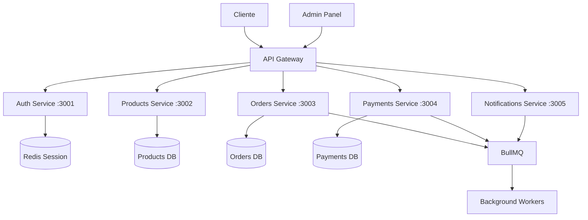

# ⚙️ Microservicios con NestJS - Guía Completa

Guía detallada para implementar una arquitectura de microservicios escalable usando NestJS, incluyendo patrones, comunicación entre servicios y mejores prácticas.

## 🎯 Objetivos

- Arquitectura de microservicios bien definida
- Comunicación eficiente entre servicios
- Escalabilidad horizontal
- Observabilidad completa
- Patrones de resiliencia

## 🏗️ Arquitectura de Microservicios

### Servicios Principales



### Responsabilidades por Servicio

| Servicio             | Puerto | Responsabilidades               | Base de Datos      |
| -------------------- | ------ | ------------------------------- | ------------------ |
| **API Gateway**      | 3000   | Routing, Auth, Rate Limiting    | -                  |
| **Auth Service**     | 3001   | Autenticación, JWT, RBAC        | Redis + PostgreSQL |
| **Products Service** | 3002   | Catálogo, inventario, búsqueda  | PostgreSQL         |
| **Orders Service**   | 3003   | Pedidos, carrito, checkout      | PostgreSQL         |
| **Payments Service** | 3004   | Pagos, facturación, webhooks    | PostgreSQL         |
| **Notifications**    | 3005   | Emails, SMS, push notifications | MongoDB            |

## 🧩 Estructura del Monorepo NX

```bash
apps/
├── api-gateway/           # Puerto 3000
│   ├── src/
│   │   ├── main.ts
│   │   ├── app.module.ts
│   │   ├── auth/          # Guards, interceptors
│   │   ├── proxy/         # Service proxy configs
│   │   └── middleware/    # Rate limiting, logging
│   └── Dockerfile
│
├── auth-service/          # Puerto 3001
│   ├── src/
│   │   ├── main.ts
│   │   ├── auth.module.ts
│   │   ├── users/         # User management
│   │   ├── tokens/        # JWT handling
│   │   ├── roles/         # RBAC system
│   │   └── strategies/    # Passport strategies
│   └── Dockerfile
│
├── products-service/      # Puerto 3002
│   ├── src/
│   │   ├── main.ts
│   │   ├── products.module.ts
│   │   ├── products/      # CRUD products
│   │   ├── categories/    # Product categories
│   │   ├── inventory/     # Stock management
│   │   └── search/        # ElasticSearch integration
│   └── Dockerfile
│
├── orders-service/        # Puerto 3003
│   ├── src/
│   │   ├── main.ts
│   │   ├── orders.module.ts
│   │   ├── orders/        # Order management
│   │   ├── cart/          # Shopping cart
│   │   ├── checkout/      # Checkout process
│   │   └── events/        # Order events
│   └── Dockerfile
│
├── payments-service/      # Puerto 3004
│   ├── src/
│   │   ├── main.ts
│   │   ├── payments.module.ts
│   │   ├── payments/      # Payment processing
│   │   ├── webhooks/      # Payment webhooks
│   │   ├── billing/       # Invoice generation
│   │   └── providers/     # Stripe, PayPal, etc
│   └── Dockerfile
│
├── notifications-service/ # Puerto 3005
│   ├── src/
│   │   ├── main.ts
│   │   ├── notifications.module.ts
│   │   ├── email/         # Email templates
│   │   ├── sms/           # SMS integration
│   │   ├── push/          # Push notifications
│   │   └── templates/     # Notification templates
│   └── Dockerfile
│
└── workers/               # BullMQ Workers
    ├── src/
    │   ├── main.ts
    │   ├── processors/
    │   │   ├── email.processor.ts
    │   │   ├── payment.processor.ts
    │   │   ├── inventory.processor.ts
    │   │   └── analytics.processor.ts
    │   └── queues/
    └── Dockerfile
```

## 🔌 API Gateway con NestJS

### Configuración Principal

```typescript
// apps/api-gateway/src/app.module.ts
@Module({
  imports: [
    ConfigModule.forRoot({ isGlobal: true }),
    ThrottlerModule.forRoot({
      ttl: 60,
      limit: 100,
    }),
    AuthModule,
    ProxyModule,
  ],
  providers: [
    {
      provide: APP_GUARD,
      useClass: ThrottlerGuard,
    },
    {
      provide: APP_INTERCEPTOR,
      useClass: LoggingInterceptor,
    },
  ],
})
export class AppModule {}
```

### Proxy a Microservicios

```typescript
// apps/api-gateway/src/proxy/proxy.service.ts
@Injectable()
export class ProxyService {
  private readonly httpService = new HttpService();

  async proxyRequest(
    serviceUrl: string,
    path: string,
    method: string,
    data?: any,
    headers?: any
  ) {
    const url = `${serviceUrl}${path}`;

    const response = await this.httpService
      .request({
        url,
        method,
        data,
        headers: {
          ...headers,
          "X-Gateway-Source": "api-gateway",
        },
        timeout: 5000,
      })
      .toPromise();

    return response.data;
  }
}

// Controlador de proxy
@Controller("api")
export class ProxyController {
  constructor(private proxyService: ProxyService) {}

  @Post("products/*")
  @UseGuards(JwtAuthGuard)
  async proxyToProducts(@Req() req, @Res() res) {
    const result = await this.proxyService.proxyRequest(
      process.env.PRODUCTS_SERVICE_URL,
      req.path.replace("/api/products", ""),
      req.method,
      req.body,
      req.headers
    );

    return res.json(result);
  }
}
```

## 🔐 Servicio de Autenticación

### JWT Strategy

```typescript
// apps/auth-service/src/strategies/jwt.strategy.ts
@Injectable()
export class JwtStrategy extends PassportStrategy(Strategy) {
  constructor(
    private userService: UserService,
    private redisService: RedisService
  ) {
    super({
      jwtFromRequest: ExtractJwt.fromAuthHeaderAsBearerToken(),
      ignoreExpiration: false,
      secretOrKey: process.env.JWT_SECRET,
    });
  }

  async validate(payload: any) {
    // Verificar si el token está en blacklist
    const blacklisted = await this.redisService.get(`blacklist:${payload.jti}`);
    if (blacklisted) {
      throw new UnauthorizedException("Token revoked");
    }

    const user = await this.userService.findById(payload.sub);
    if (!user) {
      throw new UnauthorizedException("User not found");
    }

    return {
      userId: payload.sub,
      email: payload.email,
      roles: payload.roles,
    };
  }
}
```

### RBAC (Role-Based Access Control)

```typescript
// apps/auth-service/src/guards/roles.guard.ts
@Injectable()
export class RolesGuard implements CanActivate {
  constructor(private reflector: Reflector) {}

  canActivate(context: ExecutionContext): boolean {
    const requiredRoles = this.reflector.getAllAndOverride<Role[]>("roles", [
      context.getHandler(),
      context.getClass(),
    ]);

    if (!requiredRoles) {
      return true;
    }

    const { user } = context.switchToHttp().getRequest();
    return requiredRoles.some((role) => user.roles?.includes(role));
  }
}

// Decorador para roles
export const Roles = (...roles: Role[]) => SetMetadata("roles", roles);

// Uso en controladores
@Controller("admin")
@UseGuards(JwtAuthGuard, RolesGuard)
export class AdminController {
  @Post("users")
  @Roles("ADMIN", "SUPER_ADMIN")
  async createUser(@Body() userData: CreateUserDto) {
    // Solo admins pueden crear usuarios
  }
}
```

## 📦 Comunicación Entre Servicios

### Event-Driven con BullMQ

```typescript
// libs/shared/src/events/order.events.ts
export interface OrderCreatedEvent {
  orderId: string;
  userId: string;
  items: OrderItem[];
  total: number;
  createdAt: Date;
}

export interface PaymentProcessedEvent {
  orderId: string;
  paymentId: string;
  status: "success" | "failed";
  amount: number;
}
```

### Producer de Eventos

```typescript
// apps/orders-service/src/orders/orders.service.ts
@Injectable()
export class OrdersService {
  constructor(
    @InjectQueue("order-events") private orderQueue: Queue,
    @InjectRepository(Order) private orderRepo: Repository<Order>
  ) {}

  async createOrder(orderData: CreateOrderDto): Promise<Order> {
    const order = await this.orderRepo.save(orderData);

    // Emitir evento de orden creada
    await this.orderQueue.add("order.created", {
      orderId: order.id,
      userId: order.userId,
      items: order.items,
      total: order.total,
      createdAt: order.createdAt,
    } as OrderCreatedEvent);

    return order;
  }
}
```

### Consumer de Eventos

```typescript
// apps/payments-service/src/processors/order.processor.ts
@Processor("order-events")
export class OrderProcessor {
  constructor(private paymentsService: PaymentsService) {}

  @Process("order.created")
  async handleOrderCreated(job: Job<OrderCreatedEvent>) {
    const { orderId, total, userId } = job.data;

    try {
      // Procesar pago automáticamente si hay método guardado
      const paymentMethod = await this.paymentsService.getDefaultPaymentMethod(
        userId
      );

      if (paymentMethod) {
        await this.paymentsService.processPayment({
          orderId,
          amount: total,
          paymentMethodId: paymentMethod.id,
        });
      }
    } catch (error) {
      throw new Error(
        `Failed to process payment for order ${orderId}: ${error.message}`
      );
    }
  }
}
```

## 🛡️ Patrones de Resiliencia

### Circuit Breaker

```typescript
// libs/shared/src/resilience/circuit-breaker.decorator.ts
export function CircuitBreaker(options: {
  threshold: number;
  timeout: number;
  resetTimeout: number;
}) {
  return function (
    target: any,
    propertyName: string,
    descriptor: PropertyDescriptor
  ) {
    const method = descriptor.value;
    let failureCount = 0;
    let lastFailureTime = 0;
    let circuitState: "CLOSED" | "OPEN" | "HALF_OPEN" = "CLOSED";

    descriptor.value = async function (...args: any[]) {
      const now = Date.now();

      // Verificar si el circuito debe cerrarse
      if (
        circuitState === "OPEN" &&
        now - lastFailureTime > options.resetTimeout
      ) {
        circuitState = "HALF_OPEN";
        failureCount = 0;
      }

      // Si está abierto, fallar rápido
      if (circuitState === "OPEN") {
        throw new Error("Circuit breaker is OPEN");
      }

      try {
        const result = await method.apply(this, args);

        // Éxito: resetear contador y cerrar circuito
        if (circuitState === "HALF_OPEN") {
          circuitState = "CLOSED";
        }
        failureCount = 0;

        return result;
      } catch (error) {
        failureCount++;
        lastFailureTime = now;

        // Abrir circuito si se supera el threshold
        if (failureCount >= options.threshold) {
          circuitState = "OPEN";
        }

        throw error;
      }
    };
  };
}

// Uso en servicios
@Injectable()
export class PaymentsService {
  @CircuitBreaker({ threshold: 5, timeout: 5000, resetTimeout: 60000 })
  async processPayment(paymentData: PaymentDto): Promise<Payment> {
    // Lógica de procesamiento que puede fallar
    return await this.stripeService.charge(paymentData);
  }
}
```

### Retry con Backoff

```typescript
// libs/shared/src/resilience/retry.decorator.ts
export function Retry(attempts: number = 3, delay: number = 1000) {
  return function (
    target: any,
    propertyName: string,
    descriptor: PropertyDescriptor
  ) {
    const method = descriptor.value;

    descriptor.value = async function (...args: any[]) {
      let lastError: Error;

      for (let attempt = 1; attempt <= attempts; attempt++) {
        try {
          return await method.apply(this, args);
        } catch (error) {
          lastError = error;

          if (attempt === attempts) {
            break;
          }

          // Exponential backoff
          const waitTime = delay * Math.pow(2, attempt - 1);
          await new Promise((resolve) => setTimeout(resolve, waitTime));
        }
      }

      throw lastError;
    };
  };
}
```

## 📊 Monitoreo y Observabilidad

### Health Checks

```typescript
// apps/products-service/src/health/health.controller.ts
@Controller("health")
export class HealthController {
  constructor(
    private health: HealthCheckService,
    private db: TypeOrmHealthIndicator,
    private redis: RedisHealthIndicator
  ) {}

  @Get()
  @HealthCheck()
  check() {
    return this.health.check([
      () => this.db.pingCheck("database"),
      () => this.redis.checkHealth("redis"),
      () => this.checkExternalService(),
    ]);
  }

  private async checkExternalService(): Promise<HealthIndicatorResult> {
    // Verificar servicios externos
    return { external_api: { status: "up" } };
  }
}
```

### Métricas con Prometheus

```typescript
// libs/shared/src/metrics/metrics.service.ts
@Injectable()
export class MetricsService {
  private readonly httpRequestDuration = new promClient.Histogram({
    name: "http_request_duration_ms",
    help: "Duration of HTTP requests in ms",
    labelNames: ["method", "route", "status_code", "service"],
  });

  private readonly businessMetrics = new promClient.Counter({
    name: "business_operations_total",
    help: "Total business operations",
    labelNames: ["operation", "service", "status"],
  });

  recordHttpRequest(
    method: string,
    route: string,
    statusCode: number,
    duration: number,
    service: string
  ) {
    this.httpRequestDuration
      .labels(method, route, statusCode.toString(), service)
      .observe(duration);
  }

  recordBusinessOperation(
    operation: string,
    service: string,
    status: "success" | "error"
  ) {
    this.businessMetrics.labels(operation, service, status).inc();
  }
}
```

## 🚀 Deployment con Docker

### Dockerfile Multi-Stage

```dockerfile
# apps/products-service/Dockerfile
FROM node:18-alpine AS builder

WORKDIR /app
COPY package*.json ./
COPY nx.json ./
COPY tsconfig*.json ./

RUN npm ci --only=production && npm cache clean --force

COPY apps/products-service ./apps/products-service
COPY libs ./libs

RUN npx nx build products-service --prod

FROM node:18-alpine AS runtime

WORKDIR /app

RUN addgroup -g 1001 -S nodejs
RUN adduser -S nestjs -u 1001

COPY --from=builder --chown=nestjs:nodejs /app/dist/apps/products-service ./
COPY --from=builder --chown=nestjs:nodejs /app/node_modules ./node_modules

USER nestjs

EXPOSE 3002

CMD ["node", "main.js"]
```

## 🔗 Enlaces y Próximos Pasos

### Recursos Relacionados

- [🚀 Guía Completa Full-Stack](./new.md)
- [🏗️ Infraestructura y Deployment](./infrastructure-deployment.md) (próximamente)
- [🎨 Frontend Angular](./frontend-optimization.md) (próximamente)

### Próximos Temas

- [ ] Patrones avanzados de microservicios
- [ ] Testing de microservicios
- [ ] Seguridad avanzada y OAuth2
- [ ] Performance optimization
- [ ] Migración de monolito a microservicios

---

> 💡 **Tip**: Esta arquitectura está diseñada para escalar. Comienza con pocos servicios y divide conforme crezca la complejidad del negocio.
