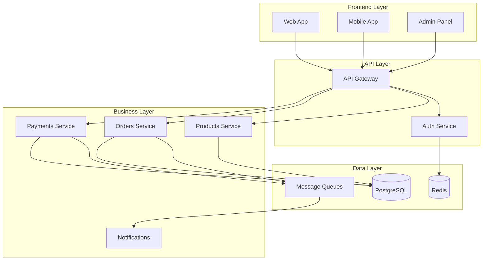

# 🏛️ Architecture & Decisions - Guía Completa

Documentación de decisiones arquitectónicas, patrones de escalabilidad y estrategias de migración.

## 🎯 Objetivos

- 📋 Documentar decisiones técnicas
- 📈 Patrones de escalabilidad
- 🔄 Estrategias de migración
- 🎯 Trade-offs y justificaciones
- 🚀 Roadmaps tecnológicos

## 📚 Guías Especializadas

### 🛠️ **Decisiones Técnicas**

- **[Tech Stack Decisions](./tech-stack-decisions.md)** - Por qué elegimos cada tecnología
- **[Migration Strategies](./migration-strategies.md)** - Cómo migrar sistemas existentes

### 📈 **Escalabilidad**

- **[Scalability Patterns](./scalability-patterns.md)** - Patrones para crecimiento

### 🏗️ **Organización del Código**

- **[NX Structure](./nx-structure.md)** - Arquitectura NX para ecommerce escalable

## 🧩 Stack Tecnológico Justificado

### Frontend Stack

| Tecnología  | Alternativas      | Por qué la elegimos                              |
| ----------- | ----------------- | ------------------------------------------------ |
| **Angular** | React, Vue        | Ecosystem maduro, TypeScript nativo, CLI robusto |
| **NX**      | Lerna, Rush       | Monorepo tools, optimization automática          |
| **NgRx**    | Akita, Elf        | DevTools excelentes, patterns establecidos       |
| **SCSS**    | Styled-components | Compatibilidad Angular, Variables CSS            |

### Backend Stack

| Tecnología     | Alternativas     | Por qué la elegimos                             |
| -------------- | ---------------- | ----------------------------------------------- |
| **NestJS**     | Express, Fastify | Arquitectura escalable, TypeScript, decoradores |
| **PostgreSQL** | MySQL, MongoDB   | ACID, performance, JSON support                 |
| **Redis**      | Memcached        | Estructuras de datos, pub/sub, persistence      |
| **BullMQ**     | Agenda, Kue      | Performance, Redis native, UI dashboard         |

### Infrastructure Stack

| Tecnología     | Alternativas        | Por qué la elegimos                       |
| -------------- | ------------------- | ----------------------------------------- |
| **Docker**     | Podman, LXC         | Ecosystem maduro, registry support        |
| **Kubernetes** | Docker Swarm, Nomad | Cloud native, auto-scaling, ecosystem     |
| **Traefik**    | NGINX, HAProxy      | Auto-discovery, SSL automático, dashboard |
| **Prometheus** | DataDog, New Relic  | Open source, flexible, Kubernetes native  |

## 🏗️ Patrones Arquitectónicos

### 🔄 **Microservices Patterns**



### 📊 **Data Flow Patterns**

- **Command Query Responsibility Segregation (CQRS)**
- **Event Sourcing** para auditoría
- **Saga Pattern** para transacciones distribuidas
- **Database per Service** para independencia

### 🛡️ **Security Patterns**

- **Defense in Depth**: Múltiples capas de seguridad
- **Zero Trust**: Verificar todo, confiar en nada
- **Principle of Least Privilege**: Permisos mínimos necesarios

## 🎯 Trade-offs y Decisiones

### ✅ **Microservices vs Monolito**

**Por qué Microservices:**

- ✅ Escalabilidad independiente por servicio
- ✅ Tecnologías específicas por contexto
- ✅ Equipos independientes
- ✅ Tolerancia a fallos aislada

**Trade-offs:**

- ❌ Complejidad operacional
- ❌ Overhead de comunicación
- ❌ Debugging distribuido
- ❌ Consistencia eventual

### ✅ **PostgreSQL vs NoSQL**

**Por qué PostgreSQL:**

- ✅ ACID transactions para ecommerce
- ✅ JSON support para flexibilidad
- ✅ Performance excelente
- ✅ Ecosystem maduro

**Cuando usamos NoSQL:**

- 📊 Logs y analytics (MongoDB)
- 🚀 Cache y sessions (Redis)
- 📈 Time series data (InfluxDB)

### ✅ **Kubernetes vs Serverless**

**Por qué Kubernetes:**

- ✅ Control total sobre infraestructura
- ✅ Vendor agnostic
- ✅ Predictable pricing
- ✅ Stateful applications support

**Cuando considerar Serverless:**

- ⚡ Functions esporádicas
- 🎯 Event-driven computing
- 💰 Workloads impredecibles

## 📈 Estrategias de Escalabilidad

### 🔄 **Horizontal Scaling**

```yaml
# Kubernetes HPA
apiVersion: autoscaling/v2
kind: HorizontalPodAutoscaler
metadata:
  name: products-service-hpa
spec:
  scaleTargetRef:
    apiVersion: apps/v1
    kind: Deployment
    name: products-service
  minReplicas: 3
  maxReplicas: 50
  metrics:
    - type: Resource
      resource:
        name: cpu
        target:
          type: Utilization
          averageUtilization: 70
```

### 📊 **Database Scaling**

- **Read Replicas**: Para queries de lectura
- **Sharding**: Por región o tenant
- **Connection Pooling**: Para eficiencia
- **Query Optimization**: Índices estratégicos

### 🌍 **Global Scaling**

- **Multi-region deployment**
- **CDN para assets estáticos**
- **Database replication**
- **Edge computing**

## 🚀 Migration Roadmap

### 📅 **Fase 1: Assessment (Semana 1)**

- [ ] Auditoría del sistema actual
- [ ] Identificar bounded contexts
- [ ] Mapear dependencias
- [ ] Definir migration strategy

### 📅 **Fase 2: Foundation (Semana 2-3)**

- [ ] Setup infrastructure base
- [ ] Implementar API Gateway
- [ ] Migrar Authentication
- [ ] Setup monitoring

### 📅 **Fase 3: Services (Semana 4-8)**

- [ ] Extraer Products Service
- [ ] Extraer Orders Service
- [ ] Extraer Payments Service
- [ ] Setup event-driven communication

### 📅 **Fase 4: Optimization (Semana 9-12)**

- [ ] Performance tuning
- [ ] Security hardening
- [ ] Cost optimization
- [ ] Team training

## 🔗 Enlaces Rápidos

### Implementación

- [📊 Scalability Examples](../../examples/production-configs/scaling/) - Configuraciones de scaling
- [🔄 Migration Tools](../../tools/migration/) - Scripts de migración

### Otras Áreas

- [⚙️ Backend Implementation](../backend/) - Implementación de patrones
- [🏗️ Infrastructure](../infrastructure/) - Deploy de arquitectura
- [🎨 Frontend](../frontend/) - Arquitectura frontend

---

**🎯 Próximo paso**: Revisa [Tech Stack Decisions](./tech-stack-decisions.md) para entender nuestras elecciones técnicas.
