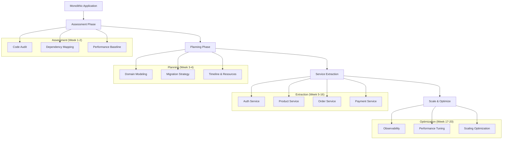

# 🔄 Migration Strategies - Estrategias de Migración

Guía completa para migrar de arquitecturas monolíticas a microservicios, desde planning hasta execution.

## 🎯 Objetivos de Migración

- **📉 Risk Mitigation**: Minimizar riesgo durante la transición
- **🔄 Zero Downtime**: Migración sin interrumpir el servicio
- **📈 Incremental Value**: Cada paso debe agregar valor
- **👥 Team Productivity**: Mantener velocity durante migración
- **💰 Cost Control**: ROI positivo en cada fase

## 🗺️ Migration Roadmap Overview



## 📊 Phase 1: Assessment & Analysis

### 1.1 Code Audit

```typescript
// tools/code-analyzer.ts
interface CodeMetrics {
  linesOfCode: number;
  cyclomaticComplexity: number;
  dependencies: string[];
  testCoverage: number;
  technicalDebt: number;
}

interface DomainBoundary {
  name: string;
  files: string[];
  dependencies: string[];
  coupling: number;
  cohesion: number;
}

class MonolithAnalyzer {
  async analyzeCodebase(rootPath: string): Promise<CodeMetrics> {
    const analysis = await this.runStaticAnalysis(rootPath);

    return {
      linesOfCode: analysis.loc,
      cyclomaticComplexity: analysis.complexity,
      dependencies: analysis.deps,
      testCoverage: await this.calculateTestCoverage(),
      technicalDebt: await this.assessTechnicalDebt(),
    };
  }

  async identifyDomainBoundaries(): Promise<DomainBoundary[]> {
    // Analyze module structure to identify natural boundaries
    const modules = await this.analyzeModuleStructure();

    return modules.map((module) => ({
      name: module.name,
      files: module.files,
      dependencies: this.getDependencies(module),
      coupling: this.calculateCoupling(module),
      cohesion: this.calculateCohesion(module),
    }));
  }

  // Detectar anti-patterns que dificultan migración
  async detectAntiPatterns(): Promise<string[]> {
    const antiPatterns = [];

    if (await this.hasGodClasses()) {
      antiPatterns.push("God Classes detected");
    }

    if (await this.hasCircularDependencies()) {
      antiPatterns.push("Circular Dependencies found");
    }

    if (await this.hasTightCoupling()) {
      antiPatterns.push("Tight Coupling between modules");
    }

    return antiPatterns;
  }
}
```

### 1.2 Performance Baseline

```typescript
// monitoring/baseline-metrics.ts
interface BaselineMetrics {
  responseTime: {
    p50: number;
    p95: number;
    p99: number;
  };
  throughput: {
    requestsPerSecond: number;
    peakRPS: number;
  };
  resources: {
    cpuUsage: number;
    memoryUsage: number;
    diskIO: number;
  };
  businessMetrics: {
    conversionRate: number;
    checkoutTime: number;
    searchLatency: number;
  };
}

class BaselineCollector {
  async collectBaseline(duration: number = 7): Promise<BaselineMetrics> {
    console.log(`Collecting baseline metrics for ${duration} days...`);

    const metrics = await Promise.all([
      this.collectResponseTimes(duration),
      this.collectThroughputMetrics(duration),
      this.collectResourceUsage(duration),
      this.collectBusinessMetrics(duration),
    ]);

    return {
      responseTime: metrics[0],
      throughput: metrics[1],
      resources: metrics[2],
      businessMetrics: metrics[3],
    };
  }

  // Establecer SLOs para no degradar durante migración
  async defineSLOs(baseline: BaselineMetrics): Promise<SLO[]> {
    return [
      {
        metric: "response_time_p95",
        target: baseline.responseTime.p95 * 1.1, // Max 10% degradation
        alertThreshold: baseline.responseTime.p95 * 1.05,
      },
      {
        metric: "error_rate",
        target: 0.1, // Max 0.1% error rate
        alertThreshold: 0.05,
      },
      {
        metric: "availability",
        target: 99.9, // 99.9% availability
        alertThreshold: 99.5,
      },
    ];
  }
}
```

## 🎯 Phase 2: Planning & Strategy

### 2.1 Domain-Driven Design

```typescript
// domains/domain-model.ts
interface BoundedContext {
  name: string;
  responsibilities: string[];
  entities: Entity[];
  events: DomainEvent[];
  services: DomainService[];
  integrations: Integration[];
}

interface Entity {
  name: string;
  attributes: Attribute[];
  businessRules: string[];
  lifecycle: EntityLifecycle;
}

class DomainModeler {
  async modelEcommerceDomains(): Promise<BoundedContext[]> {
    return [
      {
        name: "User Management",
        responsibilities: [
          "User registration and authentication",
          "Profile management",
          "Preferences and settings",
        ],
        entities: [
          {
            name: "User",
            attributes: ["id", "email", "profile", "preferences"],
            businessRules: [
              "Email must be unique",
              "Password must meet security requirements",
            ],
            lifecycle: "aggregate-root",
          },
        ],
        events: [
          { name: "UserRegistered", data: ["userId", "email"] },
          { name: "UserProfileUpdated", data: ["userId", "changes"] },
        ],
        services: ["AuthenticationService", "UserProfileService"],
        integrations: ["Email service", "Identity provider"],
      },

      {
        name: "Product Catalog",
        responsibilities: [
          "Product information management",
          "Inventory tracking",
          "Search and discovery",
        ],
        entities: [
          {
            name: "Product",
            attributes: ["id", "name", "description", "price", "inventory"],
            businessRules: [
              "Price must be positive",
              "Cannot sell negative inventory",
            ],
            lifecycle: "aggregate-root",
          },
        ],
        events: [
          { name: "ProductCreated", data: ["productId", "details"] },
          { name: "InventoryUpdated", data: ["productId", "quantity"] },
        ],
        services: ["ProductService", "InventoryService", "SearchService"],
        integrations: ["Search engine", "Image CDN"],
      },

      // Order Management, Payment, etc...
    ];
  }
}
```

### 2.2 Migration Patterns

#### Strangler Fig Pattern

```typescript
// patterns/strangler-fig.ts
class StranglerFigPattern {
  private routingRules: RoutingRule[] = [];

  // Gradualmente redirigir tráfico del monolito al microservicio
  async addStranglerRoute(
    pattern: string,
    microserviceUrl: string,
    percentage: number = 100
  ): Promise<void> {
    this.routingRules.push({
      pattern,
      destination: microserviceUrl,
      percentage,
      fallback: "monolith",
      createdAt: new Date(),
    });

    await this.updateLoadBalancerConfig();
  }

  // Middleware para routing inteligente
  async routeRequest(req: Request): Promise<string> {
    const path = req.path;

    for (const rule of this.routingRules) {
      if (this.matchesPattern(path, rule.pattern)) {
        // Feature flag o A/B testing
        if (this.shouldRouteToMicroservice(rule.percentage)) {
          return rule.destination;
        }
      }
    }

    return "monolith"; // Fallback al monolito
  }

  private shouldRouteToMicroservice(percentage: number): boolean {
    return Math.random() * 100 < percentage;
  }
}
```

#### Branch by Abstraction

```typescript
// patterns/branch-by-abstraction.ts
interface PaymentProvider {
  processPayment(amount: number, method: PaymentMethod): Promise<PaymentResult>;
}

// Abstracción que permite cambiar implementación gradualmente
class PaymentService {
  constructor(
    private legacyProvider: LegacyPaymentProvider,
    private newProvider: NewPaymentProvider,
    private featureFlag: FeatureFlagService
  ) {}

  async processPayment(
    amount: number,
    method: PaymentMethod
  ): Promise<PaymentResult> {
    // Feature flag para controlar qué implementación usar
    const useNewProvider = await this.featureFlag.isEnabled(
      "new-payment-service"
    );

    if (useNewProvider) {
      try {
        return await this.newProvider.processPayment(amount, method);
      } catch (error) {
        // Fallback a implementación legacy en caso de error
        console.warn("New provider failed, falling back to legacy:", error);
        return await this.legacyProvider.processPayment(amount, method);
      }
    }

    return await this.legacyProvider.processPayment(amount, method);
  }
}
```

## 🔧 Phase 3: Service Extraction

### 3.1 Extract User Authentication Service

```typescript
// extraction/auth-service-extraction.ts
class AuthServiceExtraction {
  async extractAuthenticationService(): Promise<void> {
    console.log("Starting Authentication Service extraction...");

    // Step 1: Create new NestJS microservice
    await this.createMicroservice("auth-service", {
      port: 3001,
      database: "auth_db",
      features: ["jwt", "oauth", "rbac"],
    });

    // Step 2: Extract auth-related entities
    await this.extractEntities([
      "User",
      "Role",
      "Permission",
      "Session",
      "RefreshToken",
    ]);

    // Step 3: Setup dual writes
    await this.setupDualWrites("auth");

    // Step 4: Migrate auth endpoints
    await this.migrateEndpoints([
      "POST /auth/login",
      "POST /auth/register",
      "POST /auth/refresh",
      "DELETE /auth/logout",
      "GET /auth/profile",
    ]);

    // Step 5: Update API Gateway routing
    await this.updateApiGatewayRoutes("auth", "http://auth-service:3001");

    console.log("Auth service extraction completed");
  }

  private async createMicroservice(name: string, config: any): Promise<void> {
    // Generate NestJS service using NX
    await this.execCommand(`nx generate @nrwl/nest:application ${name}`);

    // Setup database connection
    await this.setupDatabase(name, config.database);

    // Configure service-specific features
    await this.configureFeatures(name, config.features);
  }
}
```

### 3.2 Data Migration Strategies

```typescript
// migration/data-migration.ts
class DataMigrationStrategy {
  // Dual Write Pattern para zero-downtime migration
  async setupDualWrites(serviceName: string): Promise<void> {
    const writeInterceptor = new DualWriteInterceptor(serviceName);

    // Intercept todas las escrituras
    await this.attachInterceptor(writeInterceptor, [
      "create",
      "update",
      "delete",
    ]);
  }

  // Event-driven synchronization
  async setupEventSync(fromService: string, toService: string): Promise<void> {
    const eventBridge = new EventBridge();

    // Subscribe to relevant events
    await eventBridge.subscribe(`${fromService}.*.created`, async (event) => {
      await this.syncToNewService(toService, event.data);
    });

    await eventBridge.subscribe(`${fromService}.*.updated`, async (event) => {
      await this.updateInNewService(toService, event.data);
    });
  }

  // Batch migration para datos históricos
  async migrateBatchData(
    fromDb: string,
    toDb: string,
    batchSize = 1000
  ): Promise<void> {
    let offset = 0;
    let hasMore = true;

    while (hasMore) {
      const batch = await this.fetchBatch(fromDb, offset, batchSize);

      if (batch.length === 0) {
        hasMore = false;
        break;
      }

      // Transform data for new schema
      const transformedData = await this.transformBatch(batch);

      // Insert into new database
      await this.insertBatch(toDb, transformedData);

      // Validate migration
      await this.validateBatchMigration(batch, transformedData);

      offset += batchSize;

      // Rate limiting para no sobrecargar sistema
      await this.sleep(100);
    }
  }
}
```

## 📊 Phase 4: Validation & Rollback

### 4.1 Migration Validation

```bash
#!/bin/bash
# scripts/validate-migration.sh

MIGRATION_NAME=$1
NEW_SERVICE_URL=$2
LEGACY_ENDPOINT=$3

echo "🧪 Validating migration: $MIGRATION_NAME"

# 1. Data consistency check
echo "📊 Checking data consistency..."
LEGACY_COUNT=$(curl -s "$LEGACY_ENDPOINT/count" | jq '.count')
NEW_COUNT=$(curl -s "$NEW_SERVICE_URL/count" | jq '.count')

if [ "$LEGACY_COUNT" != "$NEW_COUNT" ]; then
    echo "❌ Data count mismatch: Legacy=$LEGACY_COUNT, New=$NEW_COUNT"
    exit 1
fi

# 2. Performance validation
echo "⚡ Validating performance..."
RESPONSE_TIME=$(curl -o /dev/null -s -w '%{time_total}' "$NEW_SERVICE_URL/health")
if (( $(echo "$RESPONSE_TIME > 1.0" | bc -l) )); then
    echo "❌ High response time: ${RESPONSE_TIME}s"
    exit 1
fi

# 3. Business logic validation
echo "💼 Testing business logic..."
SAMPLE_DATA='{"test": true}'
LEGACY_RESULT=$(curl -s -X POST "$LEGACY_ENDPOINT/test" -d "$SAMPLE_DATA" -H "Content-Type: application/json")
NEW_RESULT=$(curl -s -X POST "$NEW_SERVICE_URL/test" -d "$SAMPLE_DATA" -H "Content-Type: application/json")

if [ "$LEGACY_RESULT" != "$NEW_RESULT" ]; then
    echo "❌ Business logic mismatch"
    echo "Legacy: $LEGACY_RESULT"
    echo "New: $NEW_RESULT"
    exit 1
fi

echo "✅ Migration validation successful!"
```

### 4.2 Automated Rollback

```typescript
// rollback/rollback-manager.ts
class RollbackManager {
  async performRollback(migrationId: string): Promise<void> {
    console.log(`🔙 Starting rollback for migration: ${migrationId}`);

    const migration = await this.getMigrationDetails(migrationId);

    try {
      // 1. Switch traffic back to legacy system
      await this.switchTrafficToLegacy(migration.serviceName);

      // 2. Stop dual writes
      await this.stopDualWrites(migration.serviceName);

      // 3. Clean up new service resources
      await this.cleanupNewService(migration.serviceName);

      // 4. Restore database state if needed
      if (migration.hadDataMigration) {
        await this.restoreDatabaseState(migration.backupId);
      }

      // 5. Update monitoring and alerts
      await this.updateMonitoringForRollback(migration.serviceName);

      console.log(`✅ Rollback completed for ${migrationId}`);
    } catch (error) {
      console.error(`❌ Rollback failed: ${error.message}`);
      await this.alertOpsTeam(migrationId, error);
      throw error;
    }
  }

  private async switchTrafficToLegacy(serviceName: string): Promise<void> {
    // Update load balancer configuration
    await this.updateLoadBalancer({
      service: serviceName,
      target: "legacy",
      percentage: 100,
    });

    // Wait for propagation
    await this.sleep(30000);

    // Validate traffic switch
    const metrics = await this.getTrafficMetrics(serviceName);
    if (metrics.newServiceTraffic > 5) {
      throw new Error("Traffic switch to legacy failed");
    }
  }
}
```

## 🎯 Best Practices

### 1. Risk Mitigation

```typescript
// best-practices/risk-mitigation.ts
class RiskMitigationStrategies {
  // Feature flags para control granular
  async setupFeatureFlags(serviceName: string): Promise<void> {
    const flags = [
      `${serviceName}-read-enabled`,
      `${serviceName}-write-enabled`,
      `${serviceName}-traffic-percentage`,
    ];

    for (const flag of flags) {
      await this.featureFlagService.createFlag({
        name: flag,
        defaultValue: false,
        description: `Migration control for ${serviceName}`,
      });
    }
  }

  // Circuit breaker para nuevos servicios
  async setupCircuitBreaker(serviceName: string): Promise<void> {
    const circuitBreaker = new CircuitBreaker({
      name: serviceName,
      failureThreshold: 5,
      recoveryTimeout: 30000,
      onOpen: () => this.fallbackToLegacy(serviceName),
      onHalfOpen: () => this.testServiceHealth(serviceName),
    });

    this.circuitBreakers.set(serviceName, circuitBreaker);
  }

  // Canary deployments
  async setupCanaryDeployment(serviceName: string): Promise<void> {
    const canaryConfig = {
      stages: [
        { percentage: 5, duration: "10m" },
        { percentage: 25, duration: "20m" },
        { percentage: 50, duration: "30m" },
        { percentage: 100, duration: "complete" },
      ],
      successCriteria: {
        errorRate: "<1%",
        responseTime: "<500ms",
        availability: ">99.9%",
      },
    };

    await this.canaryService.deploy(serviceName, canaryConfig);
  }
}
```

### 2. Monitoring During Migration

```yaml
# monitoring/migration-alerts.yml
apiVersion: monitoring.coreos.com/v1
kind: PrometheusRule
metadata:
  name: migration-alerts
spec:
  groups:
    - name: migration.rules
      rules:
        - alert: MigrationDataInconsistency
          expr: |
            abs(
              legacy_service_record_count - 
              new_service_record_count
            ) > 10
          for: 5m
          labels:
            severity: critical
          annotations:
            summary: "Data inconsistency detected during migration"
            description: "Legacy service has {{ $labels.legacy_count }} records, new service has {{ $labels.new_count }}"

        - alert: MigrationPerformanceDegradation
          expr: |
            histogram_quantile(0.95, 
              rate(http_request_duration_seconds_bucket{service="new-service"}[5m])
            ) > 
            histogram_quantile(0.95, 
              rate(http_request_duration_seconds_bucket{service="legacy-service"}[5m])
            ) * 1.5
          for: 10m
          labels:
            severity: warning
          annotations:
            summary: "Performance degradation in new service"

        - alert: MigrationErrorRateHigh
          expr: |
            rate(http_requests_total{service="new-service",status=~"5.."}[5m]) / 
            rate(http_requests_total{service="new-service"}[5m]) > 0.05
          for: 5m
          labels:
            severity: critical
          annotations:
            summary: "High error rate in new service during migration"
```

## 📋 Migration Checklist

### Pre-Migration

- [ ] **Assessment Complete**

  - [ ] Code audit finished
  - [ ] Dependencies mapped
  - [ ] Performance baseline established
  - [ ] Domain boundaries identified

- [ ] **Planning Done**

  - [ ] Migration strategy defined
  - [ ] Timeline and milestones set
  - [ ] Risk mitigation strategies in place
  - [ ] Rollback procedures documented

- [ ] **Infrastructure Ready**
  - [ ] New service infrastructure provisioned
  - [ ] Monitoring and alerting configured
  - [ ] Feature flags implemented
  - [ ] Circuit breakers configured

### During Migration

- [ ] **Service Extraction**

  - [ ] New service developed and tested
  - [ ] Dual writes implemented
  - [ ] Data migration scripts validated
  - [ ] API Gateway routing updated

- [ ] **Traffic Migration**
  - [ ] Canary deployment configured
  - [ ] Traffic gradually shifted
  - [ ] Performance monitoring active
  - [ ] Error rates within SLA

### Post-Migration

- [ ] **Validation Complete**

  - [ ] Data consistency verified
  - [ ] Performance meets SLA
  - [ ] Business logic validated
  - [ ] End-to-end tests passing

- [ ] **Cleanup Done**
  - [ ] Legacy code removed
  - [ ] Dual writes disabled
  - [ ] Monitoring updated
  - [ ] Documentation updated

---

**🎯 Próximo paso**: Adapta esta estrategia a tu caso específico y comienza con el assessment de tu monolito actual.
