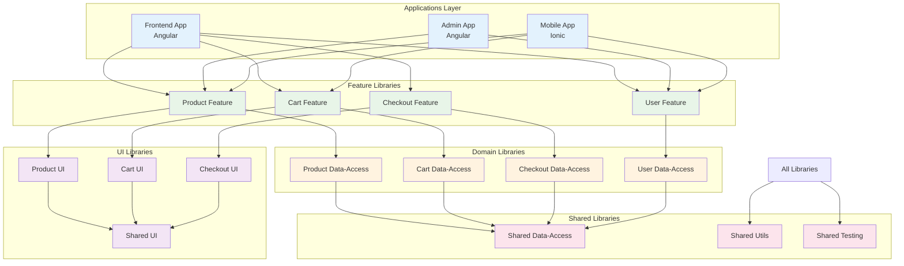

# 🏗️ NX Structure - Arquitectura NX para Ecommerce Escalable

Guía completa para estructurar un monorepo NX optimizado para aplicaciones ecommerce con múltiples frontends y microservicios.

## 🎯 Objetivos de la Estructura NX

- **🔄 Code Sharing**: Máxima reutilización entre apps y libs
- **📦 Modularity**: Arquitectura modular y mantenible
- **⚡ Build Performance**: Builds incrementales y cache inteligente
- **👥 Team Scalability**: Equipos independientes trabajando en paralelo
- **🎯 Type Safety**: TypeScript end-to-end con interfaces compartidas

## 🏗️ Arquitectura NX Visual



#### 📋 Descripción de Capas

**🎨 Applications Layer (Azul)**

- **Frontend App**: Aplicación principal del ecommerce para usuarios finales
- **Admin App**: Panel administrativo para gestión interna
- **Mobile App**: Aplicación móvil que reutiliza las mismas features

**🔧 Feature Libraries (Verde)**

- **Product Feature**: Componentes inteligentes para gestión de productos
- **Cart Feature**: Lógica y UI del carrito de compras
- **Checkout Feature**: Proceso completo de checkout
- **User Feature**: Gestión de perfiles y autenticación de usuario

**💾 Domain Libraries (Amarillo)**

- **Data-Access**: Servicios de API, NgRx state management, y modelos de datos
- Cada dominio tiene su propia librería de datos aislada
- Comunicación con APIs backend y gestión de estado local

**🎨 UI Libraries (Púrpura)**

- **Feature UI**: Componentes tontos específicos de cada dominio
- **Shared UI**: Componentes reutilizables (botones, modales, formularios)
- Design system y componentes de bajo nivel

**🔄 Shared Libraries (Rosa)**

- **Shared Data-Access**: Servicios HTTP base, interceptors, guards
- **Utils**: Funciones utilitarias, validators, helpers
- **Testing**: Mocks, fixtures, testing utilities

## 📂 Estructura NX Recomendada

```
ecommerce-workspace/
├── apps/                              # Aplicaciones principales
│   ├── frontend/                      # App principal del ecommerce
│   │   ├── src/
│   │   │   ├── app/
│   │   │   │   ├── core/              # Servicios core y guards
│   │   │   │   ├── features/          # Módulos de features
│   │   │   │   │   ├── product/       # Feature products
│   │   │   │   │   ├── cart/          # Feature cart
│   │   │   │   │   ├── checkout/      # Feature checkout
│   │   │   │   │   └── user/          # Feature user
│   │   │   │   ├── shared/            # Componentes compartidos
│   │   │   │   └── layout/            # Layout components
│   │   │   ├── assets/
│   │   │   └── environments/
│   │   ├── project.json
│   │   └── tsconfig.app.json
│   │
│   ├── admin/                         # Panel administrativo
│   │   ├── src/
│   │   │   ├── app/
│   │   │   │   ├── dashboard/
│   │   │   │   ├── products/
│   │   │   │   ├── orders/
│   │   │   │   ├── users/
│   │   │   │   └── analytics/
│   │   │   └── environments/
│   │   └── project.json
│   │
│   ├── mobile/                        # App móvil (Ionic)
│   │   ├── src/
│   │   │   ├── app/
│   │   │   │   ├── tabs/
│   │   │   │   ├── products/
│   │   │   │   └── profile/
│   │   │   └── environments/
│   │   └── project.json
│   │
│   └── e2e/                          # Tests end-to-end
│       ├── frontend-e2e/
│       ├── admin-e2e/
│       └── mobile-e2e/
│
├── libs/                             # Librerías compartidas
│   ├── shared/                       # Utilidades generales
│   │   ├── data-access/              # Servicios de datos
│   │   │   ├── src/
│   │   │   │   ├── lib/
│   │   │   │   │   ├── api/          # HTTP clients
│   │   │   │   │   ├── state/        # NgRx stores
│   │   │   │   │   └── models/       # Interfaces y tipos
│   │   │   │   └── index.ts
│   │   │   └── project.json
│   │   │
│   │   ├── ui/                       # Componentes UI
│   │   │   ├── src/
│   │   │   │   ├── lib/
│   │   │   │   │   ├── components/   # Componentes reutilizables
│   │   │   │   │   ├── directives/   # Directivas
│   │   │   │   │   └── pipes/        # Pipes
│   │   │   │   └── index.ts
│   │   │   └── project.json
│   │   │
│   │   ├── utils/                    # Utilidades
│   │   │   ├── src/
│   │   │   │   ├── lib/
│   │   │   │   │   ├── validators/
│   │   │   │   │   ├── helpers/
│   │   │   │   │   └── constants/
│   │   │   │   └── index.ts
│   │   │   └── project.json
│   │   │
│   │   └── testing/                  # Testing utilities
│   │       ├── src/
│   │       │   ├── lib/
│   │       │   │   ├── mocks/
│   │       │   │   ├── fixtures/
│   │       │   │   └── test-utils/
│   │       │   └── index.ts
│   │       └── project.json
│   │
│   ├── features/                     # Feature libraries
│   │   ├── product/                  # Feature Product
│   │   │   ├── data-access/          # Product API & State
│   │   │   │   ├── src/
│   │   │   │   │   ├── lib/
│   │   │   │   │   │   ├── +state/   # NgRx feature state
│   │   │   │   │   │   ├── api/      # Product API service
│   │   │   │   │   │   └── models/   # Product interfaces
│   │   │   │   │   └── index.ts
│   │   │   │   └── project.json
│   │   │   │
│   │   │   ├── feature/              # Product feature components
│   │   │   │   ├── src/
│   │   │   │   │   ├── lib/
│   │   │   │   │   │   ├── product-list/
│   │   │   │   │   │   ├── product-detail/
│   │   │   │   │   │   └── product-search/
│   │   │   │   │   └── index.ts
│   │   │   │   └── project.json
│   │   │   │
│   │   │   └── ui/                   # Product UI components
│   │   │       ├── src/
│   │   │       │   ├── lib/
│   │   │       │   │   ├── product-card/
│   │   │       │   │   ├── product-gallery/
│   │   │       │   │   └── product-rating/
│   │   │       │   └── index.ts
│   │   │       └── project.json
│   │   │
│   │   ├── cart/                     # Feature Cart
│   │   │   ├── data-access/
│   │   │   ├── feature/
│   │   │   └── ui/
│   │   │
│   │   ├── checkout/                 # Feature Checkout
│   │   │   ├── data-access/
│   │   │   ├── feature/
│   │   │   └── ui/
│   │   │
│   │   └── user/                     # Feature User
│   │       ├── data-access/
│   │       ├── feature/
│   │       └── ui/
│   │
│   └── backend/                      # Backend libs (si usas NX fullstack)
│       ├── api-interfaces/           # Interfaces compartidas
│       ├── auth/                     # Auth utilities
│       └── database/                 # Database utilities
│
├── tools/                           # Custom tools y scripts
│   ├── generators/                  # Custom NX generators
│   │   ├── feature/
│   │   ├── lib/
│   │   └── component/
│   │
│   ├── executors/                   # Custom NX executors
│   │   ├── deploy/
│   │   └── test/
│   │
│   └── scripts/                     # Build y deployment scripts
│       ├── build-all.sh
│       ├── deploy.sh
│       └── e2e.sh
│
├── nx.json                          # NX configuration
├── workspace.json                   # Workspace configuration
├── tsconfig.base.json              # Base TypeScript config
├── package.json                    # Dependencies
└── README.md                       # Documentación
```

## 🏗️ Patrones de Arquitectura NX

### 1. Feature-Driven Development

```typescript
// libs/features/product/data-access/src/lib/+state/product.actions.ts
export const ProductActions = createActionGroup({
  source: "Product",
  events: {
    "Load Products": props<{ filter?: ProductFilter }>(),
    "Load Products Success": props<{ products: Product[] }>(),
    "Load Products Failure": props<{ error: string }>(),
    "Load Product Detail": props<{ id: string }>(),
    "Load Product Detail Success": props<{ product: Product }>(),
    "Load Product Detail Failure": props<{ error: string }>(),
  },
});
```

```typescript
// libs/features/product/data-access/src/lib/+state/product.effects.ts
@Injectable()
export class ProductEffects {
  loadProducts$ = createEffect(() =>
    this.actions$.pipe(
      ofType(ProductActions.loadProducts),
      switchMap(({ filter }) =>
        this.productApi.getProducts(filter).pipe(
          map((products) => ProductActions.loadProductsSuccess({ products })),
          catchError((error) =>
            of(ProductActions.loadProductsFailure({ error: error.message }))
          )
        )
      )
    )
  );

  constructor(
    private actions$: Actions,
    private productApi: ProductApiService
  ) {}
}
```

### 2. Shared Data Access Pattern

```typescript
// libs/shared/data-access/src/lib/api/base-api.service.ts
@Injectable({
  providedIn: "root",
})
export abstract class BaseApiService<T> {
  protected abstract baseUrl: string;

  constructor(protected http: HttpClient) {}

  getAll(params?: any): Observable<T[]> {
    return this.http.get<T[]>(this.baseUrl, { params });
  }

  getById(id: string): Observable<T> {
    return this.http.get<T>(`${this.baseUrl}/${id}`);
  }

  create(item: Partial<T>): Observable<T> {
    return this.http.post<T>(this.baseUrl, item);
  }

  update(id: string, item: Partial<T>): Observable<T> {
    return this.http.put<T>(`${this.baseUrl}/${id}`, item);
  }

  delete(id: string): Observable<void> {
    return this.http.delete<void>(`${this.baseUrl}/${id}`);
  }
}
```

```typescript
// libs/features/product/data-access/src/lib/api/product-api.service.ts
@Injectable({
  providedIn: "root",
})
export class ProductApiService extends BaseApiService<Product> {
  protected baseUrl = "/api/products";

  constructor(http: HttpClient) {
    super(http);
  }

  searchProducts(query: string): Observable<Product[]> {
    return this.http.get<Product[]>(`${this.baseUrl}/search`, {
      params: { q: query },
    });
  }

  getProductsByCategory(categoryId: string): Observable<Product[]> {
    return this.http.get<Product[]>(`${this.baseUrl}/category/${categoryId}`);
  }
}
```

### 3. UI Component Libraries

```typescript
// libs/shared/ui/src/lib/components/button/button.component.ts
@Component({
  selector: "ecommerce-button",
  standalone: true,
  imports: [CommonModule],
  template: `
    <button
      [class]="buttonClasses"
      [disabled]="disabled"
      [type]="type"
      (click)="onClick.emit($event)"
    >
      <ng-content></ng-content>
    </button>
  `,
  styleUrls: ["./button.component.scss"],
})
export class ButtonComponent {
  @Input() variant: "primary" | "secondary" | "danger" = "primary";
  @Input() size: "sm" | "md" | "lg" = "md";
  @Input() disabled = false;
  @Input() type: "button" | "submit" | "reset" = "button";
  @Output() onClick = new EventEmitter<Event>();

  get buttonClasses(): string {
    return `btn btn-${this.variant} btn-${this.size}`;
  }
}
```

### 4. Type-Safe API Interfaces

```typescript
// libs/shared/data-access/src/lib/models/product.interface.ts
export interface Product {
  id: string;
  name: string;
  description: string;
  price: number;
  categoryId: string;
  category?: Category;
  images: ProductImage[];
  inventory: ProductInventory;
  attributes: ProductAttribute[];
  createdAt: Date;
  updatedAt: Date;
}

export interface ProductFilter {
  categoryId?: string;
  priceRange?: PriceRange;
  inStock?: boolean;
  search?: string;
  sortBy?: ProductSortField;
  sortOrder?: "asc" | "desc";
}

export interface CreateProductDto {
  name: string;
  description: string;
  price: number;
  categoryId: string;
  images: CreateProductImageDto[];
  inventory: CreateProductInventoryDto;
  attributes: CreateProductAttributeDto[];
}
```

## 🔧 NX Configuration

### nx.json Configuration

```json
{
  "extends": "nx/presets/npm.json",
  "$schema": "./node_modules/nx/schemas/nx-schema.json",
  "affected": {
    "defaultBase": "origin/main"
  },
  "targetDefaults": {
    "build": {
      "dependsOn": ["^build"],
      "inputs": ["production", "^production"],
      "cache": true
    },
    "test": {
      "inputs": ["default", "^production", "{workspaceRoot}/jest.preset.js"],
      "cache": true
    },
    "lint": {
      "inputs": ["default", "{workspaceRoot}/.eslintrc.json"],
      "cache": true
    }
  },
  "namedInputs": {
    "default": ["{projectRoot}/**/*", "sharedGlobals"],
    "production": [
      "default",
      "!{projectRoot}/**/?(*.)+(spec|test).[jt]s?(x)?(.snap)",
      "!{projectRoot}/tsconfig.spec.json",
      "!{projectRoot}/jest.config.[jt]s",
      "!{projectRoot}/.eslintrc.json"
    ],
    "sharedGlobals": []
  },
  "generators": {
    "@nrwl/angular:application": {
      "style": "scss",
      "linter": "eslint",
      "unitTestRunner": "jest",
      "e2eTestRunner": "cypress"
    },
    "@nrwl/angular:library": {
      "linter": "eslint",
      "unitTestRunner": "jest"
    },
    "@nrwl/angular:component": {
      "style": "scss"
    }
  }
}
```

### tsconfig.base.json

```json
{
  "compileOnSave": false,
  "compilerOptions": {
    "rootDir": ".",
    "sourceMap": true,
    "declaration": false,
    "moduleResolution": "node",
    "emitDecoratorMetadata": true,
    "experimentalDecorators": true,
    "importHelpers": true,
    "target": "es2022",
    "module": "esnext",
    "lib": ["es2022", "dom"],
    "skipLibCheck": true,
    "skipDefaultLibCheck": true,
    "baseUrl": ".",
    "paths": {
      // Shared libraries
      "@ecommerce/shared/data-access": ["libs/shared/data-access/src/index.ts"],
      "@ecommerce/shared/ui": ["libs/shared/ui/src/index.ts"],
      "@ecommerce/shared/utils": ["libs/shared/utils/src/index.ts"],
      "@ecommerce/shared/testing": ["libs/shared/testing/src/index.ts"],

      // Feature libraries - Product
      "@ecommerce/product/data-access": [
        "libs/features/product/data-access/src/index.ts"
      ],
      "@ecommerce/product/feature": [
        "libs/features/product/feature/src/index.ts"
      ],
      "@ecommerce/product/ui": ["libs/features/product/ui/src/index.ts"],

      // Feature libraries - Cart
      "@ecommerce/cart/data-access": [
        "libs/features/cart/data-access/src/index.ts"
      ],
      "@ecommerce/cart/feature": ["libs/features/cart/feature/src/index.ts"],
      "@ecommerce/cart/ui": ["libs/features/cart/ui/src/index.ts"],

      // Feature libraries - Checkout
      "@ecommerce/checkout/data-access": [
        "libs/features/checkout/data-access/src/index.ts"
      ],
      "@ecommerce/checkout/feature": [
        "libs/features/checkout/feature/src/index.ts"
      ],
      "@ecommerce/checkout/ui": ["libs/features/checkout/ui/src/index.ts"],

      // Feature libraries - User
      "@ecommerce/user/data-access": [
        "libs/features/user/data-access/src/index.ts"
      ],
      "@ecommerce/user/feature": ["libs/features/user/feature/src/index.ts"],
      "@ecommerce/user/ui": ["libs/features/user/ui/src/index.ts"]
    }
  },
  "exclude": ["node_modules", "tmp"]
}
```

## 📦 Custom NX Generators

### Feature Generator

```typescript
// tools/generators/feature/schema.json
{
  "$schema": "http://json-schema.org/schema",
  "cli": "nx",
  "id": "feature",
  "type": "object",
  "properties": {
    "name": {
      "type": "string",
      "description": "Feature name",
      "$default": {
        "$source": "argv",
        "index": 0
      }
    },
    "directory": {
      "type": "string",
      "description": "Directory where the feature will be generated",
      "default": "features"
    },
    "withDataAccess": {
      "type": "boolean",
      "description": "Generate data access library",
      "default": true
    },
    "withFeature": {
      "type": "boolean",
      "description": "Generate feature library",
      "default": true
    },
    "withUi": {
      "type": "boolean",
      "description": "Generate UI library",
      "default": true
    }
  },
  "required": ["name"]
}
```

```typescript
// tools/generators/feature/index.ts
import {
  Tree,
  formatFiles,
  generateFiles,
  installPackagesTask,
} from "@nrwl/devkit";
import { libraryGenerator } from "@nrwl/angular/generators";

interface FeatureGeneratorSchema {
  name: string;
  directory: string;
  withDataAccess: boolean;
  withFeature: boolean;
  withUi: boolean;
}

export default async function (tree: Tree, options: FeatureGeneratorSchema) {
  const normalizedOptions = normalizeOptions(options);

  // Generate data-access library
  if (options.withDataAccess) {
    await libraryGenerator(tree, {
      name: `${options.name}-data-access`,
      directory: `${options.directory}/${options.name}`,
      tags: `scope:${options.name},type:data-access`,
      buildable: true,
      publishable: false,
    });

    // Generate NgRx feature state
    generateFiles(
      tree,
      path.join(__dirname, "files/data-access"),
      `libs/${options.directory}/${options.name}/data-access/src/lib`,
      {
        ...normalizedOptions,
        tmpl: "",
      }
    );
  }

  // Generate feature library
  if (options.withFeature) {
    await libraryGenerator(tree, {
      name: `${options.name}-feature`,
      directory: `${options.directory}/${options.name}`,
      tags: `scope:${options.name},type:feature`,
      buildable: true,
      publishable: false,
    });
  }

  // Generate UI library
  if (options.withUi) {
    await libraryGenerator(tree, {
      name: `${options.name}-ui`,
      directory: `${options.directory}/${options.name}`,
      tags: `scope:${options.name},type:ui`,
      buildable: true,
      publishable: false,
    });
  }

  await formatFiles(tree);
  return () => {
    installPackagesTask(tree);
  };
}
```

## 🎯 Build Optimization

### Project Configuration

```json
// libs/features/product/data-access/project.json
{
  "name": "product-data-access",
  "$schema": "../../../../node_modules/nx/schemas/project-schema.json",
  "projectType": "library",
  "sourceRoot": "libs/features/product/data-access/src",
  "prefix": "ecommerce",
  "targets": {
    "build": {
      "executor": "@nrwl/angular:ng-packagr-lite",
      "outputs": ["dist/libs/features/product/data-access"],
      "options": {
        "project": "libs/features/product/data-access/ng-package.json"
      },
      "configurations": {
        "production": {
          "tsConfig": "libs/features/product/data-access/tsconfig.lib.prod.json"
        },
        "development": {
          "tsConfig": "libs/features/product/data-access/tsconfig.lib.json"
        }
      },
      "defaultConfiguration": "production"
    },
    "test": {
      "executor": "@nrwl/jest:jest",
      "outputs": ["coverage/libs/features/product/data-access"],
      "options": {
        "jestConfig": "libs/features/product/data-access/jest.config.ts",
        "passWithNoTests": true
      }
    },
    "lint": {
      "executor": "@nrwl/linter:eslint",
      "options": {
        "lintFilePatterns": [
          "libs/features/product/data-access/**/*.ts",
          "libs/features/product/data-access/**/*.html"
        ]
      }
    }
  },
  "tags": ["scope:product", "type:data-access"]
}
```

### Dependency Graph Constraints

```json
// .eslintrc.json
{
  "extends": ["@nrwl/nx/angular", "@nrwl/nx/typescript"],
  "rules": {
    "@nrwl/nx/enforce-module-boundaries": [
      "error",
      {
        "enforceBuildableLibDependency": true,
        "allow": [],
        "depConstraints": [
          {
            "sourceTag": "scope:shared",
            "onlyDependOnLibsWithTags": ["scope:shared"]
          },
          {
            "sourceTag": "scope:product",
            "onlyDependOnLibsWithTags": ["scope:shared", "scope:product"]
          },
          {
            "sourceTag": "scope:cart",
            "onlyDependOnLibsWithTags": [
              "scope:shared",
              "scope:cart",
              "scope:product"
            ]
          },
          {
            "sourceTag": "type:feature",
            "onlyDependOnLibsWithTags": [
              "type:data-access",
              "type:ui",
              "type:utils"
            ]
          },
          {
            "sourceTag": "type:ui",
            "onlyDependOnLibsWithTags": ["type:utils"]
          },
          {
            "sourceTag": "type:data-access",
            "onlyDependOnLibsWithTags": ["type:utils"]
          }
        ]
      }
    ]
  }
}
```

## 🚀 Commands y Scripts

### Development Commands

```bash
# Generar nueva feature completa
nx g @ecommerce/tools:feature payment --withDataAccess --withFeature --withUi

# Build específico de una app
nx build frontend

# Build de todas las libs afectadas
nx affected:build

# Test de componentes específicos
nx test product-ui

# Lint de feature completa
nx run-many --target=lint --projects=product-data-access,product-feature,product-ui

# Serve con hot reload
nx serve frontend

# E2E testing
nx e2e frontend-e2e

# Dependency graph visualization
nx dep-graph

# Affected graph
nx affected:dep-graph
```

### CI/CD Integration

```yaml
# .github/workflows/ci.yml
name: CI
on:
  push:
    branches: [main]
  pull_request:
    branches: [main]

jobs:
  main:
    runs-on: ubuntu-latest
    steps:
      - uses: actions/checkout@v3
        with:
          fetch-depth: 0

      - uses: nrwl/nx-set-shas@v3

      - uses: actions/setup-node@v3
        with:
          node-version: "18"
          cache: "npm"

      - run: npm ci

      - run: npx nx affected --target=lint --parallel=3
      - run: npx nx affected --target=test --parallel=3 --ci --code-coverage
      - run: npx nx affected --target=build --parallel=3
      - run: npx nx affected --target=e2e --parallel=1
```

## 🎯 Best Practices

### 1. Library Boundaries

- **Feature libraries** solo pueden importar de `data-access`, `ui` y `utils`
- **UI libraries** solo pueden importar de `utils`
- **Data-access libraries** solo pueden importar de `utils`
- **Utils libraries** no dependen de nada más

### 2. Naming Conventions

- **Apps**: `kebab-case` (frontend, admin, mobile)
- **Libraries**: `feature-type` (product-data-access, cart-ui)
- **Tags**: `scope:feature,type:library-type`

### 3. Code Organization

- **Smart components** en feature libraries
- **Dumb components** en UI libraries
- **Business logic** en data-access libraries
- **Utilities** en utils libraries

### 4. Import Paths

```typescript
// ✅ Correcto - usar barrel exports
import { ProductService } from "@ecommerce/product/data-access";
import { ProductCardComponent } from "@ecommerce/product/ui";

// ❌ Incorrecto - importar directamente
import { ProductService } from "../../../libs/features/product/data-access/src/lib/services/product.service";
```

## 📊 Performance y Escalabilidad

### Affected Commands

```bash
# Solo testear lo que cambió
nx affected:test

# Solo buildear apps afectadas
nx affected:build

# Ver qué se afectó
nx affected:dep-graph

# Lint solo archivos afectados
nx affected:lint
```

### Build Cache

```json
// nx.json - Cache configuration
{
  "tasksRunnerOptions": {
    "default": {
      "runner": "nx/tasks-runners/default",
      "options": {
        "cacheableOperations": ["build", "lint", "test", "e2e"],
        "parallel": 3,
        "maxParallel": 3
      }
    }
  }
}
```

### Remote Caching (Opcional)

```bash
# Setup Nx Cloud para cache distribuido
nx connect-to-nx-cloud

# O configurar cache personalizado
export NX_CACHE_DIRECTORY="/shared/nx-cache"
```

## 🎯 Roadmap de Implementación

### Fase 1: Setup Base (Semana 1)

```bash
# 1. Crear workspace
npx create-nx-workspace@latest ecommerce --preset=empty

# 2. Añadir plugins
npm install @nrwl/angular @nrwl/nest @ionic/angular

# 3. Crear estructura shared
nx g @nrwl/angular:lib shared-data-access
nx g @nrwl/angular:lib shared-ui
nx g @nrwl/angular:lib shared-utils
```

### Fase 2: Feature Libraries (Semana 2)

```bash
# 4. Crear features principales
nx g @nrwl/angular:lib product-data-access --directory=features/product
nx g @nrwl/angular:lib product-feature --directory=features/product
nx g @nrwl/angular:lib product-ui --directory=features/product

# 5. Repetir para cart, checkout, user
```

### Fase 3: Applications (Semana 3)

```bash
# 6. Crear aplicaciones
nx g @nrwl/angular:app frontend
nx g @nrwl/angular:app admin
nx g @ionic/angular:app mobile
```

### Fase 4: Integration & Testing (Semana 4)

```bash
# 7. Setup E2E
nx g @nrwl/cypress:e2e frontend-e2e --project=frontend

# 8. Custom generators
nx g @nrwl/workspace:workspace-generator feature

# 9. CI/CD setup
```

---

**🎯 Próximo paso**: Implementa esta estructura gradualmente, empezando por las shared libraries y luego las features más simples. Utiliza `nx dep-graph` para visualizar las dependencias mientras construyes.
