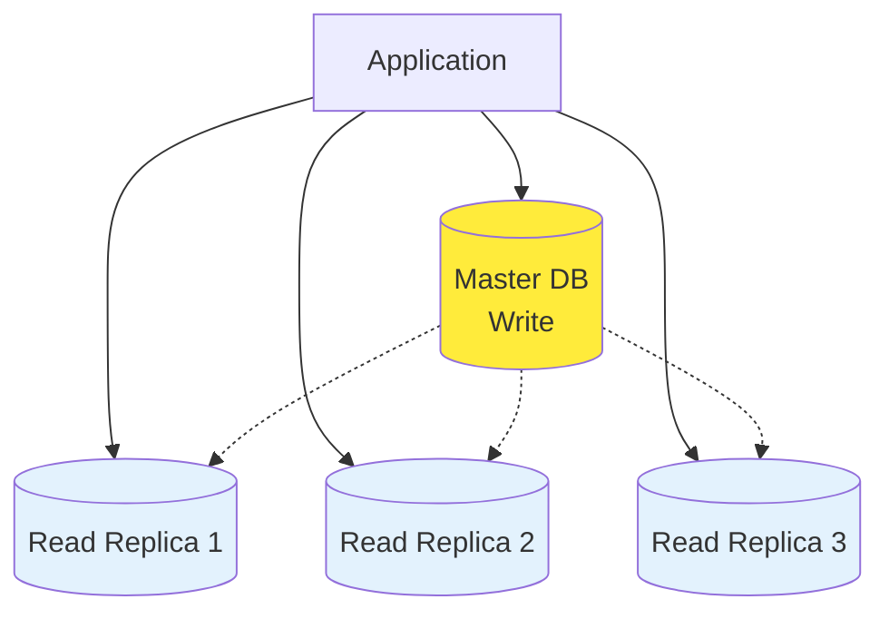
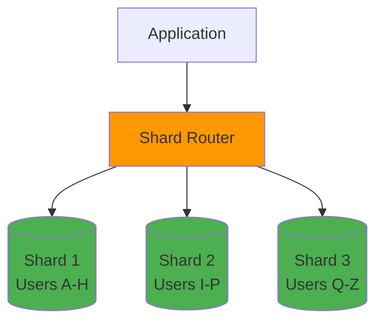
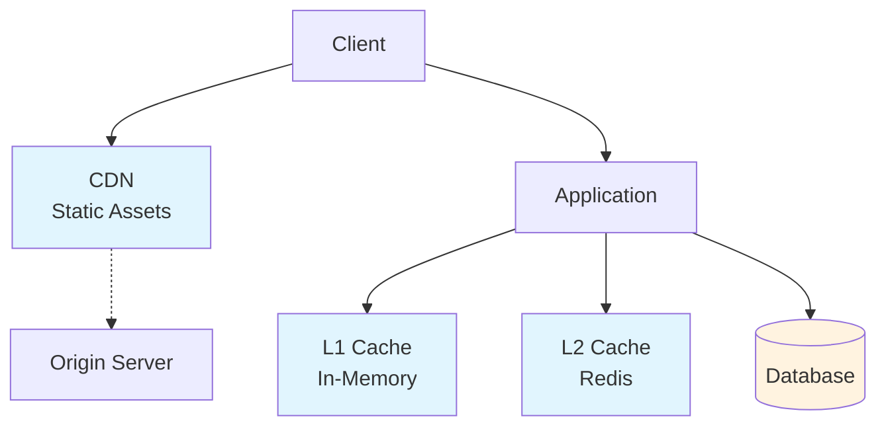

# 📈 Scalability Patterns - Patrones de Escalabilidad

Guía completa de patrones y estrategias para escalar aplicaciones ecommerce desde MVPs hasta enterprise.

## 🎯 Objetivos de Escalabilidad

- **📊 Performance**: Mantener response times < 100ms
- **👥 Concurrent Users**: Soportar 10K+ usuarios simultáneos
- **📈 Growth**: Escalar 10x sin refactoring mayor
- **💰 Cost Efficiency**: Linear cost scaling con usage
- **🔄 Availability**: 99.99% uptime (52 min downtime/year)

## 🏗️ Patrones de Arquitectura

### 1. Database Scaling Patterns

#### Read Replicas Pattern



**Implementación PostgreSQL:**

```yaml
# docker-compose.yml
version: "3.8"
services:
  postgres-master:
    image: postgres:15
    environment:
      POSTGRES_REPLICATION_USER: replicator
      POSTGRES_REPLICATION_PASSWORD: password
    command: |
      postgres 
      -c wal_level=replica 
      -c max_wal_senders=3 
      -c max_replication_slots=3

  postgres-replica-1:
    image: postgres:15
    environment:
      PGUSER: postgres
      POSTGRES_MASTER_SERVICE: postgres-master
    command: |
      bash -c "
      until pg_basebackup --pgdata=/var/lib/postgresql/data -R --slot=replication_slot_1 --host=postgres-master --port=5432
      do
        echo 'Waiting for master to be ready...'
        sleep 1s
      done
      postgres"
```

**NestJS Database Router:**

```typescript
@Injectable()
export class DatabaseService {
  constructor(
    @InjectDataSource("master") private masterDb: DataSource,
    @InjectDataSource("replica") private replicaDb: DataSource
  ) {}

  // Para operaciones de escritura
  async save<T>(entity: T): Promise<T> {
    return this.masterDb.manager.save(entity);
  }

  // Para operaciones de lectura
  async find<T>(entityClass: any, options?: FindManyOptions): Promise<T[]> {
    return this.replicaDb.manager.find(entityClass, options);
  }

  // Query decorator para routing automático
  @ReadReplica()
  async getProducts(): Promise<Product[]> {
    // Automáticamente usa replica
    return this.find(Product);
  }

  @Master()
  async createOrder(orderData: CreateOrderDto): Promise<Order> {
    // Automáticamente usa master
    return this.save(new Order(orderData));
  }
}
```

#### Database Sharding Pattern



**Sharding Strategy:**

```typescript
@Injectable()
export class ShardingService {
  private readonly shards = {
    shard1: { min: "A", max: "H", connection: "shard1_db" },
    shard2: { min: "I", max: "P", connection: "shard2_db" },
    shard3: { min: "Q", max: "Z", connection: "shard3_db" },
  };

  getShardByUserId(userId: string): string {
    const firstLetter = userId.charAt(0).toUpperCase();

    for (const [shardName, config] of Object.entries(this.shards)) {
      if (firstLetter >= config.min && firstLetter <= config.max) {
        return config.connection;
      }
    }

    throw new Error(`No shard found for user: ${userId}`);
  }

  @Get("/user/:id")
  async getUser(@Param("id") userId: string) {
    const shardConnection = this.getShardByUserId(userId);
    const dataSource = this.getDataSource(shardConnection);

    return dataSource.manager.findOne(User, {
      where: { id: userId },
    });
  }
}
```

### 2. Caching Patterns

#### Multi-Level Caching



**Cache-Aside Pattern:**

```typescript
@Injectable()
export class ProductService {
  private memoryCache = new Map<string, any>();

  constructor(
    private redisService: RedisService,
    private productRepository: ProductRepository
  ) {}

  async getProduct(id: string): Promise<Product> {
    // L1: Memory Cache
    if (this.memoryCache.has(id)) {
      return this.memoryCache.get(id);
    }

    // L2: Redis Cache
    const cached = await this.redisService.get(`product:${id}`);
    if (cached) {
      const product = JSON.parse(cached);
      this.memoryCache.set(id, product);
      return product;
    }

    // L3: Database
    const product = await this.productRepository.findOne({ where: { id } });

    if (product) {
      // Cache en ambos niveles
      this.memoryCache.set(id, product);
      await this.redisService.setex(
        `product:${id}`,
        3600, // 1 hora TTL
        JSON.stringify(product)
      );
    }

    return product;
  }

  async updateProduct(id: string, data: UpdateProductDto): Promise<Product> {
    const product = await this.productRepository.save({ id, ...data });

    // Invalidar caché
    this.memoryCache.delete(id);
    await this.redisService.del(`product:${id}`);

    return product;
  }
}
```

#### Write-Through vs Write-Behind

```typescript
// Write-Through: Siempre actualiza cache y DB juntos
@Injectable()
export class WriteThroughService {
  async updateProduct(id: string, data: any): Promise<Product> {
    // 1. Actualizar DB
    const product = await this.productRepository.save({ id, ...data });

    // 2. Actualizar cache (sincrono)
    await this.redisService.setex(
      `product:${id}`,
      3600,
      JSON.stringify(product)
    );

    return product;
  }
}

// Write-Behind: Actualiza cache primero, DB después (async)
@Injectable()
export class WriteBehindService {
  async updateProduct(id: string, data: any): Promise<Product> {
    // 1. Actualizar cache inmediatamente
    const product = { id, ...data };
    await this.redisService.setex(
      `product:${id}`,
      3600,
      JSON.stringify(product)
    );

    // 2. Queue DB update (asincrono)
    await this.queueService.add("update-product", { id, data });

    return product;
  }
}
```

### 3. Load Balancing Patterns

#### Horizontal Pod Autoscaling (HPA)

```yaml
# k8s/hpa.yaml
apiVersion: autoscaling/v2
kind: HorizontalPodAutoscaler
metadata:
  name: api-gateway-hpa
spec:
  scaleTargetRef:
    apiVersion: apps/v1
    kind: Deployment
    name: api-gateway
  minReplicas: 3
  maxReplicas: 50
  metrics:
    - type: Resource
      resource:
        name: cpu
        target:
          type: Utilization
          averageUtilization: 70
    - type: Resource
      resource:
        name: memory
        target:
          type: Utilization
          averageUtilization: 80
    - type: Pods
      pods:
        metric:
          name: requests_per_second
        target:
          type: AverageValue
          averageValue: "100"
  behavior:
    scaleUp:
      stabilizationWindowSeconds: 60
      policies:
        - type: Percent
          value: 100
          periodSeconds: 15
    scaleDown:
      stabilizationWindowSeconds: 300
      policies:
        - type: Percent
          value: 10
          periodSeconds: 60
```

#### Circuit Breaker Pattern

```typescript
@Injectable()
export class CircuitBreakerService {
  private circuits = new Map<string, CircuitBreaker>();

  private createCircuit(serviceName: string): CircuitBreaker {
    return new CircuitBreaker(
      async (data: any) => {
        return this.callExternalService(serviceName, data);
      },
      {
        timeout: 3000,
        errorThresholdPercentage: 50,
        resetTimeout: 30000,
        minimumCallsToTrip: 10,
        statisticalWindowLength: 10,
        onOpen: () => console.log(`Circuit ${serviceName} opened`),
        onHalfOpen: () => console.log(`Circuit ${serviceName} half-open`),
        onClose: () => console.log(`Circuit ${serviceName} closed`),
      }
    );
  }

  async callService(serviceName: string, data: any): Promise<any> {
    if (!this.circuits.has(serviceName)) {
      this.circuits.set(serviceName, this.createCircuit(serviceName));
    }

    const circuit = this.circuits.get(serviceName);

    try {
      return await circuit.fire(data);
    } catch (error) {
      // Fallback strategy
      return this.getFallbackResponse(serviceName, data);
    }
  }

  private getFallbackResponse(serviceName: string, data: any): any {
    switch (serviceName) {
      case "payment-service":
        return {
          status: "pending",
          message: "Payment will be processed later",
        };
      case "inventory-service":
        return { available: false, message: "Stock check unavailable" };
      default:
        return { error: "Service temporarily unavailable" };
    }
  }
}
```

### 4. Microservices Scaling Patterns

#### Saga Pattern para Transacciones Distribuidas

```typescript
@Injectable()
export class OrderSagaService {
  async processOrder(orderData: CreateOrderDto): Promise<void> {
    const saga = new SagaBuilder()
      .step("reserve-inventory")
      .invoke((data) =>
        this.inventoryService.reserve(data.productId, data.quantity)
      )
      .withCompensation((data) =>
        this.inventoryService.release(data.productId, data.quantity)
      )
      .step("process-payment")
      .invoke((data) =>
        this.paymentService.charge(data.paymentMethod, data.amount)
      )
      .withCompensation((data) =>
        this.paymentService.refund(data.transactionId)
      )
      .step("create-order")
      .invoke((data) => this.orderService.create(data))
      .withCompensation((data) => this.orderService.cancel(data.orderId))
      .step("send-confirmation")
      .invoke((data) =>
        this.notificationService.sendConfirmation(data.userId, data.orderId)
      )
      .build();

    try {
      await saga.execute(orderData);
    } catch (error) {
      console.error("Saga failed, executing compensations:", error);
      await saga.compensate();
      throw new Error("Order processing failed");
    }
  }
}
```

#### Event-Driven Scaling

```typescript
@Injectable()
export class EventDrivenScalingService {
  constructor(private eventBus: EventBus) {}

  @EventPattern("order.created")
  async handleOrderCreated(data: OrderCreatedEvent): Promise<void> {
    // Parallel processing for scaling
    await Promise.all([
      this.updateInventory(data.productId, data.quantity),
      this.sendNotification(data.userId, data.orderId),
      this.updateAnalytics(data),
      this.triggerRecommendations(data.userId),
    ]);
  }

  @EventPattern("high.load.detected")
  async handleHighLoad(data: HighLoadEvent): Promise<void> {
    // Auto-scaling trigger
    if (data.metric === "cpu" && data.value > 80) {
      await this.kubernetesService.scaleDeployment(
        data.serviceName,
        data.currentReplicas * 2
      );
    }
  }
}
```

## 📊 Performance Optimization Patterns

### 1. Database Query Optimization

```typescript
@Injectable()
export class OptimizedProductService {
  // N+1 Query Problem Solution
  async getProductsWithCategories(): Promise<Product[]> {
    // ❌ N+1 Problem
    // const products = await this.productRepo.find();
    // for (const product of products) {
    //   product.category = await this.categoryRepo.findOne(product.categoryId);
    // }

    // ✅ Single Query with JOIN
    return this.productRepo
      .createQueryBuilder("product")
      .leftJoinAndSelect("product.category", "category")
      .leftJoinAndSelect("product.images", "images")
      .where("product.active = :active", { active: true })
      .orderBy("product.createdAt", "DESC")
      .getMany();
  }

  // Pagination with Cursor
  async getProductsPaginated(
    cursor?: string,
    limit = 20
  ): Promise<ProductPage> {
    const qb = this.productRepo
      .createQueryBuilder("product")
      .orderBy("product.id", "ASC")
      .limit(limit + 1); // +1 para detectar if hay más

    if (cursor) {
      qb.where("product.id > :cursor", { cursor });
    }

    const products = await qb.getMany();
    const hasNextPage = products.length > limit;

    if (hasNextPage) {
      products.pop(); // Remove extra item
    }

    return {
      items: products,
      hasNextPage,
      nextCursor: hasNextPage ? products[products.length - 1].id : null,
    };
  }
}
```

### 2. Connection Pooling

```typescript
// database.config.ts
export const databaseConfig: TypeOrmModuleOptions = {
  type: "postgres",
  host: process.env.DB_HOST,
  port: parseInt(process.env.DB_PORT),
  username: process.env.DB_USER,
  password: process.env.DB_PASSWORD,
  database: process.env.DB_NAME,

  // Connection Pooling for Scaling
  extra: {
    connectionLimit: 100, // Max connections
    acquireConnectionTimeout: 60000, // 60 seconds
    timeout: 60000,
    reconnect: true,

    // Pool configuration
    min: 10, // Minimum connections
    max: 100, // Maximum connections
    idle: 10000, // Idle timeout
    acquire: 60000, // Acquire timeout
    evict: 1000, // Eviction interval
  },

  // Performance settings
  cache: {
    duration: 30000, // 30 seconds query cache
  },

  logging: process.env.NODE_ENV === "development",
  synchronize: false, // Never true in production
  migrationsRun: true,
};
```

## 🌍 Global Scaling Patterns

### Multi-Region Deployment

```yaml
# k8s/multi-region/us-east.yaml
apiVersion: apps/v1
kind: Deployment
metadata:
  name: api-gateway-us-east
  labels:
    region: us-east
spec:
  replicas: 10
  selector:
    matchLabels:
      app: api-gateway
      region: us-east
  template:
    metadata:
      labels:
        app: api-gateway
        region: us-east
    spec:
      nodeSelector:
        topology.kubernetes.io/region: us-east-1
      containers:
        - name: api-gateway
          image: ecommerce/api-gateway:latest
          env:
            - name: REGION
              value: "us-east"
            - name: DB_HOST
              value: "postgres-us-east.internal"
          resources:
            requests:
              memory: "256Mi"
              cpu: "250m"
            limits:
              memory: "512Mi"
              cpu: "500m"
---
# Similar for us-west, eu-west, asia-southeast
```

### CDN Integration

```typescript
@Controller("assets")
export class AssetController {
  @Get("/image/:id")
  async getImage(@Param("id") id: string, @Res() res: Response): Promise<void> {
    // Set cache headers for CDN
    res.set({
      "Cache-Control": "public, max-age=31536000", // 1 year
      ETag: `"${id}-${Date.now()}"`,
      Vary: "Accept-Encoding",
    });

    // Get optimized image based on region
    const region = this.getRegionFromRequest(res);
    const imageUrl = this.getRegionalImageUrl(id, region);

    res.redirect(301, imageUrl);
  }

  private getRegionalImageUrl(id: string, region: string): string {
    const cdnUrls = {
      us: "https://cdn-us.ecommerce.com",
      eu: "https://cdn-eu.ecommerce.com",
      asia: "https://cdn-asia.ecommerce.com",
    };

    return `${cdnUrls[region] || cdnUrls.us}/images/${id}`;
  }
}
```

## 📈 Monitoring y Metrics

### Custom Metrics for Scaling

```typescript
@Injectable()
export class ScalingMetricsService {
  constructor(@Inject("PROMETHEUS_REGISTRY") private registry: Registry) {
    this.setupMetrics();
  }

  private activeConnections = new Gauge({
    name: "active_connections_total",
    help: "Total number of active connections",
    labelNames: ["service", "region"],
    registers: [this.registry],
  });

  private requestDuration = new Histogram({
    name: "http_request_duration_seconds",
    help: "Duration of HTTP requests in seconds",
    labelNames: ["method", "route", "status_code"],
    buckets: [0.1, 0.5, 1, 2, 5, 10],
    registers: [this.registry],
  });

  private businessMetrics = new Counter({
    name: "business_events_total",
    help: "Total number of business events",
    labelNames: ["event_type", "status"],
    registers: [this.registry],
  });

  @EventPattern("*")
  async recordBusinessEvent(pattern: string, data: any): Promise<void> {
    this.businessMetrics.labels(pattern, data.status || "success").inc();
  }

  async recordScalingMetrics(): Promise<void> {
    // Custom metrics que triggean auto-scaling
    const queueLength = await this.getQueueLength();
    const dbConnections = await this.getActiveDbConnections();
    const memoryUsage = process.memoryUsage();

    this.activeConnections
      .labels("database", process.env.REGION || "unknown")
      .set(dbConnections);

    // Si queue muy largo, trigger scaling
    if (queueLength > 1000) {
      await this.triggerScaling("worker-service", queueLength);
    }
  }
}
```

## 🔧 Scaling Automation

### Auto-Scaling Based on Custom Metrics

```yaml
# k8s/custom-hpa.yaml
apiVersion: autoscaling/v2
kind: HorizontalPodAutoscaler
metadata:
  name: api-gateway-custom-hpa
spec:
  scaleTargetRef:
    apiVersion: apps/v1
    kind: Deployment
    name: api-gateway
  minReplicas: 3
  maxReplicas: 100
  metrics:
    # CPU/Memory metrics
    - type: Resource
      resource:
        name: cpu
        target:
          type: Utilization
          averageUtilization: 70
    # Custom business metrics
    - type: Object
      object:
        metric:
          name: requests_per_second
        target:
          type: AverageValue
          averageValue: "50"
    - type: Object
      object:
        metric:
          name: queue_length
        target:
          type: AverageValue
          averageValue: "10"
  behavior:
    scaleUp:
      stabilizationWindowSeconds: 60
      policies:
        - type: Percent
          value: 50
          periodSeconds: 60
        - type: Pods
          value: 5
          periodSeconds: 60
      selectPolicy: Max
    scaleDown:
      stabilizationWindowSeconds: 300
      policies:
        - type: Percent
          value: 10
          periodSeconds: 60
```

## 🎯 Scaling Best Practices

### 1. Graceful Degradation

```typescript
@Injectable()
export class GracefulDegradationService {
  async getProductRecommendations(userId: string): Promise<Product[]> {
    try {
      // Primary: ML-based recommendations
      return await this.mlRecommendationService.getRecommendations(userId);
    } catch (error) {
      console.warn("ML service unavailable, falling back to rule-based");

      try {
        // Fallback: Rule-based recommendations
        return await this.ruleBasedRecommendations(userId);
      } catch (error) {
        console.warn("Rule-based service unavailable, using popular products");

        // Final fallback: Popular products
        return await this.getPopularProducts();
      }
    }
  }

  private async getPopularProducts(): Promise<Product[]> {
    // Cached popular products - always available
    return this.cacheService.get("popular-products") || [];
  }
}
```

### 2. Load Testing Strategy

```typescript
// load-test/scenarios.ts
export const loadTestScenarios = {
  // Normal load
  baseline: {
    users: 100,
    rampUp: "5m",
    duration: "10m",
    scenarios: {
      browse: 60, // 60% browsing
      search: 25, // 25% searching
      purchase: 15, // 15% purchasing
    },
  },

  // Peak load (Black Friday)
  peak: {
    users: 10000,
    rampUp: "2m",
    duration: "30m",
    scenarios: {
      browse: 40,
      search: 35,
      purchase: 25,
    },
  },

  // Stress testing
  stress: {
    users: 50000,
    rampUp: "5m",
    duration: "15m",
    scenarios: {
      browse: 50,
      search: 30,
      purchase: 20,
    },
  },
};
```

## 📋 Scaling Checklist

### Pre-Launch Checklist

- [ ] **Database Optimization**

  - [ ] Indices optimizados
  - [ ] Connection pooling configurado
  - [ ] Read replicas setup
  - [ ] Query performance analyzed

- [ ] **Caching Strategy**

  - [ ] Multi-level caching implementado
  - [ ] Cache invalidation strategy
  - [ ] CDN configurado
  - [ ] Static asset optimization

- [ ] **Auto-Scaling Configuration**

  - [ ] HPA configurado con metrics correctos
  - [ ] VPA configurado para right-sizing
  - [ ] Cluster autoscaler habilitado
  - [ ] Custom metrics implementados

- [ ] **Resilience Patterns**

  - [ ] Circuit breakers implementados
  - [ ] Retry policies configuradas
  - [ ] Graceful degradation tested
  - [ ] Fallback strategies ready

- [ ] **Load Testing**
  - [ ] Baseline performance established
  - [ ] Peak load scenarios tested
  - [ ] Stress testing completed
  - [ ] Capacity planning done

### Post-Launch Monitoring

- [ ] **Real-time Metrics**

  - [ ] Response time monitoring
  - [ ] Error rate tracking
  - [ ] Resource utilization alerts
  - [ ] Business metrics dashboard

- [ ] **Capacity Planning**
  - [ ] Growth projection analysis
  - [ ] Resource scaling timeline
  - [ ] Cost optimization review
  - [ ] Performance regression testing

---

**🎯 Próximo paso**: Implementa estos patrones gradualmente, empezando por los que den mayor ROI para tu caso específico.
