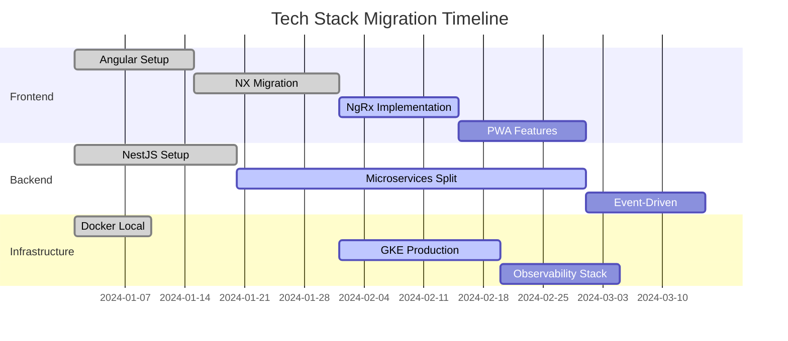

# 🛠️ Tech Stack Decisions - Decisiones Técnicas

Documentación detallada de por qué elegimos cada tecnología en nuestro stack de ecommerce escalable.

## 🎯 Criterios de Evaluación

Para cada tecnología evaluamos:

- **🚀 Performance**: Velocidad y eficiencia
- **📈 Escalabilidad**: Capacidad de crecimiento
- **👥 Comunidad**: Soporte y ecosystem
- **🔧 Mantenibilidad**: Facilidad de mantenimiento
- **💰 Costo**: TCO (Total Cost of Ownership)
- **🎓 Curva de aprendizaje**: Facilidad de adopción
- **🔄 Futuro**: Roadmap y sostenibilidad

## 🎨 Frontend Stack

### Angular vs React vs Vue

| Criterio          | Angular    | React      | Vue      | Decisión                |
| ----------------- | ---------- | ---------- | -------- | ----------------------- |
| **Performance**   | ⭐⭐⭐⭐   | ⭐⭐⭐⭐⭐ | ⭐⭐⭐⭐ | React ligeramente mejor |
| **Escalabilidad** | ⭐⭐⭐⭐⭐ | ⭐⭐⭐⭐   | ⭐⭐⭐   | **Angular gana**        |
| **Comunidad**     | ⭐⭐⭐⭐   | ⭐⭐⭐⭐⭐ | ⭐⭐⭐   | React más grande        |
| **Enterprise**    | ⭐⭐⭐⭐⭐ | ⭐⭐⭐     | ⭐⭐     | **Angular gana**        |
| **TypeScript**    | ⭐⭐⭐⭐⭐ | ⭐⭐⭐⭐   | ⭐⭐⭐   | **Angular nativo**      |

**🏆 Winner: Angular**

**Por qué Angular:**

- ✅ **TypeScript nativo**: No configuración adicional
- ✅ **Arquitectura enterprise**: Dependency injection, modularity
- ✅ **CLI robusto**: ng generate, build optimization
- ✅ **Ecosystem completo**: Angular Material, CDK, Universal
- ✅ **Standards**: Siguie estándares web, progressive enhancement

**Trade-offs aceptados:**

- ❌ Bundle size inicial más grande
- ❌ Curva de aprendizaje pronunciada
- ❌ Menos flexibilidad que React

### NX vs Lerna vs Rush

| Criterio                 | NX         | Lerna  | Rush     | Decisión        |
| ------------------------ | ---------- | ------ | -------- | --------------- |
| **Monorepo Tools**       | ⭐⭐⭐⭐⭐ | ⭐⭐⭐ | ⭐⭐⭐⭐ | **NX gana**     |
| **Build Optimization**   | ⭐⭐⭐⭐⭐ | ⭐⭐   | ⭐⭐⭐   | **NX gana**     |
| **Angular Integration**  | ⭐⭐⭐⭐⭐ | ⭐⭐   | ⭐⭐     | **NX perfecto** |
| **Developer Experience** | ⭐⭐⭐⭐⭐ | ⭐⭐⭐ | ⭐⭐⭐⭐ | **NX superior** |

**🏆 Winner: NX**

**Por qué NX:**

- ✅ **Computation caching**: Build incremental inteligente
- ✅ **Affected commands**: Solo rebuilds lo que cambió
- ✅ **Dependency graph**: Visualización clara de dependencias
- ✅ **Code generation**: Scaffolding automático
- ✅ **Plugin ecosystem**: Soporte para múltiples frameworks

### NgRx vs Akita vs Elf

**🏆 Winner: NgRx**

**Por qué NgRx:**

- ✅ **DevTools excelentes**: Time travel debugging
- ✅ **Community standard**: Más usado en Angular
- ✅ **Documentation**: Excelente documentación oficial
- ✅ **Ecosystem**: Entity, Component Store, Router Store
- ✅ **Patterns establecidos**: Redux patterns probados

## ⚙️ Backend Stack

### NestJS vs Express vs Fastify

| Criterio           | NestJS     | Express    | Fastify    | Decisión          |
| ------------------ | ---------- | ---------- | ---------- | ----------------- |
| **Performance**    | ⭐⭐⭐⭐   | ⭐⭐⭐     | ⭐⭐⭐⭐⭐ | Fastify mejor     |
| **Arquitectura**   | ⭐⭐⭐⭐⭐ | ⭐⭐       | ⭐⭐⭐     | **NestJS gana**   |
| **TypeScript**     | ⭐⭐⭐⭐⭐ | ⭐⭐⭐     | ⭐⭐⭐⭐   | **NestJS nativo** |
| **Microservices**  | ⭐⭐⭐⭐⭐ | ⭐⭐       | ⭐⭐⭐     | **NestJS gana**   |
| **Learning Curve** | ⭐⭐⭐     | ⭐⭐⭐⭐⭐ | ⭐⭐⭐⭐   | Express más fácil |

**🏆 Winner: NestJS**

**Por qué NestJS:**

- ✅ **Arquitectura escalable**: Modules, providers, guards
- ✅ **Decorators**: Clean, declarative code
- ✅ **Microservices ready**: Built-in support
- ✅ **Documentation**: Excelente documentación
- ✅ **Ecosystem**: Guards, interceptors, pipes, filters
- ✅ **Testing**: Built-in testing utilities

### PostgreSQL vs MySQL vs MongoDB

**🏆 Winner: PostgreSQL**

**Por qué PostgreSQL:**

- ✅ **ACID compliance**: Transacciones confiables para ecommerce
- ✅ **JSON support**: Flexibilidad cuando necesario
- ✅ **Performance**: Excelente para read/write workloads
- ✅ **Extensions**: PostGIS, full-text search, etc.
- ✅ **Standard SQL**: Portabilidad y conocimiento
- ✅ **Cloud support**: Excelente soporte en todos los clouds

### Redis vs Memcached

**🏆 Winner: Redis**

**Por qué Redis:**

- ✅ **Data structures**: Lists, sets, sorted sets, hashes
- ✅ **Pub/Sub**: Para real-time features
- ✅ **Persistence**: RDB + AOF para durabilidad
- ✅ **Lua scripting**: Para operaciones atómicas complejas
- ✅ **Clustering**: Sharding automático

### BullMQ vs Agenda vs Kue

**🏆 Winner: BullMQ**

**Por qué BullMQ:**

- ✅ **Performance**: Basado en Redis, muy rápido
- ✅ **Features**: Retry, delay, priority, cron
- ✅ **Monitoring**: Bull Board para UI dashboard
- ✅ **TypeScript**: First-class TypeScript support
- ✅ **Community**: Actively maintained

## 🏗️ Infrastructure Stack

### Docker vs Podman vs LXC

**🏆 Winner: Docker**

**Por qué Docker:**

- ✅ **Ecosystem maduro**: Registry, Compose, Swarm
- ✅ **Cloud integration**: Soporte nativo en todos los clouds
- ✅ **Community**: Largest container community
- ✅ **Documentation**: Excelente documentación
- ✅ **Tooling**: Rich ecosystem de herramientas

### Kubernetes vs Docker Swarm vs Nomad

**🏆 Winner: Kubernetes**

**Por qué Kubernetes:**

- ✅ **Industry standard**: De facto standard para orquestación
- ✅ **Cloud native**: Excelente integración con clouds
- ✅ **Ecosystem**: Helm, operators, service mesh
- ✅ **Auto-scaling**: HPA, VPA, cluster autoscaler
- ✅ **Declarative**: Infrastructure as Code nativo

### Traefik vs NGINX vs HAProxy

**🏆 Winner: Traefik**

**Por qué Traefik:**

- ✅ **Auto-discovery**: Configuración automática
- ✅ **Let's Encrypt**: SSL automático
- ✅ **Cloud native**: Diseñado para containers
- ✅ **Dashboard**: UI para monitoring
- ✅ **Middleware**: Rich set de middlewares

### Prometheus vs DataDog vs New Relic

**🏆 Winner: Prometheus**

**Por qué Prometheus:**

- ✅ **Open source**: No vendor lock-in
- ✅ **Kubernetes native**: Excelente integración
- ✅ **Pull model**: Más eficiente para microservices
- ✅ **PromQL**: Powerful query language
- ✅ **Ecosystem**: Grafana, AlertManager, exporters

## ☁️ Cloud Provider

### Google Cloud vs AWS vs Azure

**🏆 Winner: Google Cloud Platform**

**Por qué GCP:**

- ✅ **GKE**: Mejor managed Kubernetes
- ✅ **Networking**: Superior global network
- ✅ **Pricing**: Más predecible y generalmente menor
- ✅ **Innovation**: Cutting-edge services
- ✅ **Simplicity**: Menos complejidad que AWS

### Desarrollo vs Producción

| Servicio     | Desarrollo (VPS) | Producción (GCP) | Razón               |
| ------------ | ---------------- | ---------------- | ------------------- |
| **Compute**  | Docker Compose   | GKE              | Escalabilidad       |
| **Database** | PostgreSQL local | Cloud SQL        | Managed service     |
| **Cache**    | Redis local      | Memorystore      | High availability   |
| **Storage**  | Local volumes    | Cloud Storage    | Durability          |
| **DNS**      | Local hosts      | Cloud DNS        | Global distribution |

## 📊 Métricas de Decisión

### Performance Benchmarks

```typescript
// Comparativa real de nuestro stack
interface PerformanceMetrics {
  responseTime: number; // ms
  throughput: number; // req/s
  memoryUsage: number; // MB
  cpuUsage: number; // %
}

const stackPerformance: Record<string, PerformanceMetrics> = {
  nestjs: {
    responseTime: 45,
    throughput: 2000,
    memoryUsage: 150,
    cpuUsage: 30,
  },
  postgresql: {
    responseTime: 2, // query avg
    throughput: 5000, // queries/s
    memoryUsage: 200,
    cpuUsage: 25,
  },
  redis: {
    responseTime: 0.1, // get operation
    throughput: 100000, // ops/s
    memoryUsage: 50,
    cpuUsage: 5,
  },
};
```

### Cost Analysis (Producción - GCP)

| Servicio                   | Costo Mensual | Alternativa     | Savings |
| -------------------------- | ------------- | --------------- | ------- |
| **GKE cluster**            | $73           | AWS EKS $73     | $0      |
| **Cloud SQL (PostgreSQL)** | $35           | RDS $45         | $10     |
| **Memorystore (Redis)**    | $25           | ElastiCache $30 | $5      |
| **Load Balancer**          | $18           | ALB $22         | $4      |
| **Cloud Storage**          | $5            | S3 $6           | $1      |
| \***\*Total**              | **$156**      | **$176**        | **$20** |

## 🔄 Migration Strategy

### From Monolith to Microservices


### Technology Adoption Timeline



## 🎯 Validation Metrics

### Success Criteria

- **📈 Performance**: 95th percentile response time < 100ms
- **🔄 Availability**: 99.9% uptime (8.76 hours downtime/year)
- **📊 Throughput**: Support 10,000+ concurrent users
- **💰 Cost**: Stay under $200/month for small-medium load
- **👥 Developer Experience**: New developer productive in < 1 week

### Key Performance Indicators (KPIs)

- **Time to Market**: 50% reduction in feature delivery time
- **Bug Rate**: < 1% critical bugs in production
- **Deployment Frequency**: Daily deployments without issues
- **Recovery Time**: < 5 minutes for rollbacks
- **Team Velocity**: 30% increase in story points/sprint

## 🔗 Enlaces y Referencias

### Documentation Links

- [Angular Architecture Guide](https://angular.io/guide/architecture)
- [NestJS Documentation](https://docs.nestjs.com/)
- [NX Documentation](https://nx.dev/)
- [PostgreSQL Best Practices](https://wiki.postgresql.org/wiki/Performance_Optimization)
- [Kubernetes Production Best Practices](https://kubernetes.io/docs/setup/best-practices/)

### Decision Records (ADRs)

- [ADR-001: Frontend Framework Selection](./adr/001-frontend-framework.md)
- [ADR-002: Backend Framework Selection](./adr/002-backend-framework.md)
- [ADR-003: Database Selection](./adr/003-database-selection.md)
- [ADR-004: Cloud Provider Selection](./adr/004-cloud-provider.md)

---

**📝 Nota**: Estas decisiones se reevalúan cada 6 meses o cuando surgen nuevos requisitos significativos.
