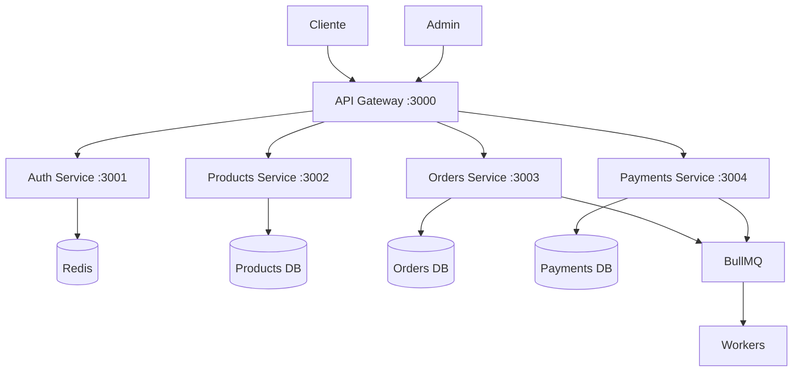

# ⚙️ Backend Microservices - Guía Completa

Documentación especializada para arquitectura de microservicios con NestJS, patrones de comunicación y escalabilidad.

## 🎯 Objetivos

- 🏗️ Arquitectura de microservicios escalable
- 🔌 Comunicación eficiente entre servicios
- 🛡️ Patrones de resiliencia
- 📊 Observabilidad completa
- 🔐 Seguridad enterprise

## 📚 Guías Especializadas

### 🚀 **Arquitectura**

- **[Microservices Architecture](./microservices-architecture.md)** - Diseño y patrones generales
- **[API Gateway](./api-gateway.md)** - Routing, auth y rate limiting

### 🔧 **Implementación**

- **[NestJS Patterns](./nestjs-patterns.md)** - Patrones específicos de NestJS
- **[Authentication](./authentication.md)** - JWT, RBAC y seguridad

### 📡 **Comunicación**

- **[Event-Driven](./event-driven.md)** - BullMQ, eventos y workers
- **[Database Design](./database-design.md)** - Diseño de BD por servicio

### 🛡️ **Resiliencia**

- **[Resilience Patterns](./resilience-patterns.md)** - Circuit breaker, retry, timeout

## 🏗️ Arquitectura de Servicios



## 🛠️ Stack Tecnológico Backend

| Tecnología     | Propósito               | Puerto |
| -------------- | ----------------------- | ------ |
| **NestJS**     | Framework Node.js       | -      |
| **NX**         | Monorepo management     | -      |
| **PostgreSQL** | Base de datos principal | 5432   |
| **Redis**      | Cache y sesiones        | 6379   |
| **BullMQ**     | Queue de trabajos       | -      |
| **Prometheus** | Métricas                | 9090   |

## ⚡ Quick Start Backend

```bash
# 1. Crear servicios NX
nx g @nx/nest:app api-gateway
nx g @nx/nest:app auth-service
nx g @nx/nest:app products-service

# 2. Configurar bases de datos
docker run -d --name postgres -e POSTGRES_PASSWORD=password postgres:15
docker run -d --name redis -e REDIS_PASSWORD=password redis:7

# 3. Configurar comunicación
npm install @nestjs/microservices bull bullmq

# 4. Ejecutar servicios
nx serve api-gateway
nx serve auth-service
```

## 🎯 Servicios Implementados

### ✅ API Gateway (Puerto 3000)

- [x] Routing a microservicios
- [x] Autenticación JWT
- [x] Rate limiting
- [x] Load balancing
- [x] Request/Response logging

### ✅ Auth Service (Puerto 3001)

- [x] Registro y login
- [x] JWT token management
- [x] RBAC (Role-Based Access Control)
- [x] Session management
- [x] Password policies

### ✅ Products Service (Puerto 3002)

- [x] CRUD de productos
- [x] Gestión de categorías
- [x] Control de inventario
- [x] Búsqueda y filtros
- [x] Cache con Redis

### ✅ Orders Service (Puerto 3003)

- [x] Gestión de pedidos
- [x] Carrito de compras
- [x] Proceso de checkout
- [x] Estados de orden
- [x] Eventos de negocio

### ✅ Payments Service (Puerto 3004)

- [x] Procesamiento de pagos
- [x] Integración Stripe/PayPal
- [x] Webhooks de pago
- [x] Facturación
- [x] Reembolsos

## 📊 Patrones Implementados

### 🔄 **Comunicación**

- **Synchronous**: HTTP/REST entre gateway y servicios
- **Asynchronous**: BullMQ para eventos de negocio
- **Database per Service**: Cada servicio su BD

### 🛡️ **Resiliencia**

- **Circuit Breaker**: Para servicios externos
- **Retry con Backoff**: Para operaciones críticas
- **Timeout**: Para prevenir hanging requests
- **Health Checks**: Para monitoreo

### 🔐 **Seguridad**

- **JWT Tokens**: Para autenticación
- **RBAC**: Para autorización granular
- **API Rate Limiting**: Para prevenir abuso
- **Input Validation**: Con class-validator

## 🔗 Enlaces Rápidos

### Implementación

- [🛠️ Microservices Demo](../../examples/microservices-demo/) - Demo completo funcional
- [📦 Service Template](../../templates/service-template/) - Template de microservicio

### Otras Áreas

- [🎨 Frontend Integration](../frontend/) - Conexión con Angular
- [🏗️ Infrastructure](../infrastructure/) - Deployment y scaling

---

**🎯 Próximo paso**: Comienza con [Microservices Architecture](./microservices-architecture.md) para entender el diseño general.
