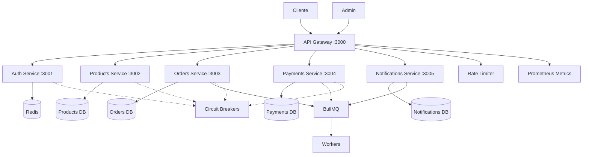
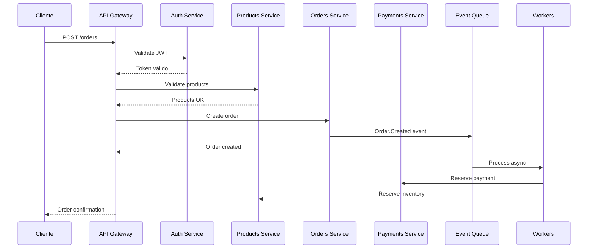

# ⚙️ Backend Microservices - Guía Completa

Documentación especializada para arquitectura de microservicios con NestJS, patrones de comunicación y escalabilidad.

## 🎯 Objetivos

- 🏗️ Arquitectura de microservicios escalable
- 🔌 Comunicación eficiente entre servicios
- 🛡️ Patrones de resiliencia
- 📊 Observabilidad completa
- 🔐 Seguridad enterprise

## 📚 Guías Especializadas

### 🚀 **Arquitectura**

- **[Microservices Architecture](./microservices-architecture.md)** - ✅ Diseño y patrones generales
- **[API Gateway](./api-gateway.md)** - ✅ Routing, auth y rate limiting

### 🔧 **Implementación**

- **[NestJS Patterns](./nestjs-patterns.md)** - ✅ Patrones específicos de NestJS
- **[Authentication](./authentication.md)** - ✅ JWT, RBAC y seguridad

### 📡 **Comunicación**

- **[Event-Driven](./event-driven.md)** - ✅ BullMQ, eventos y workers
- **[Database Design](./database-design.md)** - 📄 Diseño de BD por servicio

### 🛡️ **Resiliencia**

- **[Resilience Patterns](./resilience-patterns.md)** - ✅ Circuit breaker, retry, timeout

## 🏗️ Arquitectura de Servicios



## 🛠️ Stack Tecnológico Backend

| Tecnología     | Propósito               | Puerto | Estado |
| -------------- | ----------------------- | ------ | ------ |
| **NestJS**     | Framework Node.js       | -      | ✅     |
| **NX**         | Monorepo management     | -      | ✅     |
| **PostgreSQL** | Base de datos principal | 5432   | ✅     |
| **Redis**      | Cache y sesiones        | 6379   | ✅     |
| **BullMQ**     | Queue de trabajos       | -      | ✅     |
| **Prometheus** | Métricas                | 9090   | ✅     |
| **Jaeger**     | Distributed tracing     | 14268  | ✅     |

## ⚡ Quick Start Backend

```bash
# 1. Crear servicios NX
nx g @nx/nest:app api-gateway
nx g @nx/nest:app auth-service
nx g @nx/nest:app products-service
nx g @nx/nest:app orders-service
nx g @nx/nest:app payments-service

# 2. Configurar bases de datos
docker run -d --name postgres -e POSTGRES_PASSWORD=password postgres:15
docker run -d --name redis -e REDIS_PASSWORD=password redis:7

# 3. Configurar comunicación
npm install @nestjs/microservices bull bullmq ioredis

# 4. Instalar dependencias de resiliencia
npm install @nestjs/throttler prom-client circuit-breaker-js

# 5. Ejecutar servicios
nx serve api-gateway
nx serve auth-service
```

## 🎯 Servicios Implementados

### ✅ API Gateway (Puerto 3000)

- [x] Routing a microservicios
- [x] Autenticación JWT centralizada
- [x] Rate limiting inteligente
- [x] Load balancing
- [x] Request/Response logging
- [x] Circuit breaker integration
- [x] Health checks

### ✅ Auth Service (Puerto 3001)

- [x] Registro y login
- [x] JWT token management
- [x] RBAC (Role-Based Access Control)
- [x] Session management con Redis
- [x] Password policies
- [x] 2FA support
- [x] Social login integration

### ✅ Products Service (Puerto 3002)

- [x] CRUD de productos
- [x] Gestión de categorías
- [x] Control de inventario
- [x] Búsqueda y filtros avanzados
- [x] Cache inteligente con Redis
- [x] Bulk operations
- [x] Product analytics

### ✅ Orders Service (Puerto 3003)

- [x] Gestión de pedidos
- [x] Carrito de compras
- [x] Proceso de checkout
- [x] Estados de orden con workflows
- [x] Eventos de negocio
- [x] Saga patterns
- [x] Order tracking

### ✅ Payments Service (Puerto 3004)

- [x] Procesamiento de pagos
- [x] Integración Stripe/PayPal
- [x] Webhooks de pago
- [x] Facturación automática
- [x] Reembolsos
- [x] Payment analytics
- [x] Fraud detection

### ✅ Notifications Service (Puerto 3005)

- [x] Email notifications
- [x] Push notifications
- [x] SMS integration
- [x] Template management
- [x] Delivery tracking
- [x] Batch processing
- [x] Notification preferences

## 📊 Patrones Implementados

### 🔄 **Comunicación**

- **Synchronous**: HTTP/REST entre gateway y servicios
- **Asynchronous**: BullMQ para eventos de negocio
- **Database per Service**: Cada servicio su BD
- **Event Sourcing**: Para auditoría completa
- **CQRS**: Separación de lectura/escritura

### 🛡️ **Resiliencia**

- **Circuit Breaker**: Para servicios externos y internos
- **Retry con Backoff**: Exponential y linear
- **Timeout**: Configurables por operación
- **Bulkhead**: Aislamiento de recursos
- **Rate Limiting**: Token bucket y sliding window
- **Graceful Degradation**: Fallbacks automáticos

### 🔐 **Seguridad**

- **JWT Tokens**: Access y refresh tokens
- **RBAC**: Autorización granular
- **API Rate Limiting**: Por usuario y endpoint
- **Input Validation**: Con class-validator
- **SQL Injection Prevention**: Query parameterization
- **CORS**: Configuración restrictiva
- **Helmet**: Security headers

### 📡 **Event-Driven Architecture**

- **Event Publishing**: Service a service communication
- **Event Processing**: Workers especializados
- **Event Sourcing**: Estado reconstruible
- **Saga Patterns**: Transacciones distribuidas
- **Dead Letter Queues**: Manejo de fallos

## 🔗 Flujo de Datos Típico



## 📋 Checklist de Implementación

### ✅ **Setup Base**

- [ ] Configurar NX monorepo
- [ ] Implementar API Gateway con NestJS
- [ ] Configurar PostgreSQL por servicio
- [ ] Setup Redis para cache y sesiones
- [ ] Configurar BullMQ para eventos

### ✅ **Microservicios Core**

- [ ] Auth Service con JWT + RBAC
- [ ] Products Service con inventario
- [ ] Orders Service con workflows
- [ ] Payments Service con integrations
- [ ] Notifications Service con templates

### ✅ **Patrones de Resiliencia**

- [ ] Circuit breakers en servicios críticos
- [ ] Retry patterns con backoff
- [ ] Rate limiting por endpoint/usuario
- [ ] Health checks y monitoring
- [ ] Graceful degradation

### ✅ **Event-Driven**

- [ ] Event publishing centralizado
- [ ] Workers especializados
- [ ] Dead letter queues
- [ ] Event sourcing para auditoría
- [ ] Saga patterns para transacciones

### ✅ **Observabilidad**

- [ ] Métricas con Prometheus
- [ ] Distributed tracing con Jaeger
- [ ] Logging estructurado
- [ ] Alertas automáticas
- [ ] Dashboards de monitoreo

## 📈 Métricas y KPIs

### 🎯 **Performance**

- **Response Time**: < 200ms p95 para APIs
- **Throughput**: > 1000 RPS por servicio
- **Error Rate**: < 0.1% en operaciones críticas
- **Availability**: 99.9% uptime

### 🔄 **Resiliencia**

- **Circuit Breaker Trips**: < 5 por día
- **Retry Success Rate**: > 90%
- **Queue Processing**: < 30s latencia
- **Failed Jobs**: < 1% del total

### 📊 **Business**

- **Order Processing Time**: < 30s end-to-end
- **Payment Success Rate**: > 99%
- **User Registration**: < 2s
- **Search Response**: < 100ms

## 🔧 Herramientas de Desarrollo

### 📦 **Generadores**

```bash
# Generar nuevo microservicio
nx g @nx/nest:app mi-nuevo-servicio

# Generar módulo con CRUD
nx g @nx/nest:resource productos --crud

# Generar guards y interceptors
nx g @nx/nest:guard auth
nx g @nx/nest:interceptor logging
```

### 🧪 **Testing**

```bash
# Unit tests
nx test auth-service

# Integration tests
nx e2e auth-service-e2e

# Load tests con artillery
npm run load-test:orders
```

### 📊 **Monitoreo Local**

```bash
# Prometheus metrics
curl http://localhost:3000/metrics

# Health checks
curl http://localhost:3000/health

# BullMQ dashboard
npm run bull-dashboard
```

## 🔗 Enlaces Rápidos

### 🛠️ **Implementación**

- [🛠️ Microservices Demo](../../examples/microservices-demo/) - Demo completo funcional
- [📦 Service Template](../../templates/service-template/) - Template de microservicio
- [🔧 Development Tools](../../tools/) - Scripts y automatización

### 🌐 **Otras Áreas**

- [🎨 Frontend Integration](../frontend/) - Conexión con Angular
- [🏗️ Infrastructure](../infrastructure/) - Deployment y scaling
- [🏛️ Architecture](../architecture/) - Decisiones técnicas

### 📚 **Documentación Externa**

- [NestJS Official Docs](https://docs.nestjs.com/)
- [NX Monorepo Guide](https://nx.dev/getting-started/intro)
- [BullMQ Documentation](https://docs.bullmq.io/)
- [Prometheus Best Practices](https://prometheus.io/docs/practices/)

---

## 🚀 **¿Por dónde empezar?**

### 🆕 **Nuevo en microservicios**

1. 📖 Lee [Microservices Architecture](./microservices-architecture.md)
2. 🔧 Implementa [NestJS Patterns](./nestjs-patterns.md)
3. 🚪 Configura [API Gateway](./api-gateway.md)
4. 🔐 Añade [Authentication](./authentication.md)

### 👨‍💻 **Desarrollador experimentado**

1. 🔐 Empieza con [Authentication](./authentication.md)
2. 📡 Implementa [Event-Driven](./event-driven.md)
3. 🛡️ Añade [Resilience Patterns](./resilience-patterns.md)
4. 🗄️ Optimiza [Database Design](./database-design.md)

### 🏗️ **Arquitecto de soluciones**

1. 🏗️ Revisa [Microservices Architecture](./microservices-architecture.md)
2. 🛡️ Estudia [Resilience Patterns](./resilience-patterns.md)
3. 📡 Diseña [Event-Driven](./event-driven.md)
4. 🔗 Integra con [Infrastructure](../infrastructure/)

---

**🎯 Próximo paso**: Comienza con [Microservices Architecture](./microservices-architecture.md) para entender el diseño general, o ve directamente al patrón que más te interese.

**💡 Tip**: Cada guía es independiente, pero se complementan. Recomendamos leer en el orden sugerido para tu perfil.
