# 🚪 API Gateway con NestJS

Guía completa para implementar un API Gateway escalable que centraliza autenticación, routing, rate limiting y comunicación con microservicios usando NestJS y Traefik.

## 🎯 ¿Por qué un API Gateway?

En arquitectura de microservicios, el API Gateway es el **punto de entrada único** que:

- **🔐 Centraliza autenticación** - Un solo lugar para validar tokens
- **🚦 Gestiona rate limiting** - Previene abuso y protege servicios
- **🔀 Enruta inteligentemente** - Dirige peticiones al servicio correcto
- **📊 Agrega métricas** - Observabilidad centralizada
- **⚡ Cachea respuestas** - Mejora performance
- **🛡️ Valida requests** - Filtro de seguridad

### Sin API Gateway vs Con API Gateway

```mermaid
graph TD
    subgraph "❌ Sin API Gateway - Problemático"
        CLIENT1[Cliente Web] --> AUTH1[Auth Service]
        CLIENT1 --> PROD1[Product Service]
        CLIENT1 --> ORDER1[Order Service]
        MOBILE1[App Móvil] --> AUTH1
        MOBILE1 --> PROD1
        ADMIN1[Admin Panel] --> AUTH1
        ADMIN1 --> ORDER1
    end

    subgraph "✅ Con API Gateway - Organizado"
        CLIENT2[Cliente Web] --> GW[API Gateway]
        MOBILE2[App Móvil] --> GW
        ADMIN2[Admin Panel] --> GW

        GW --> AUTH2[Auth Service]
        GW --> PROD2[Product Service]
        GW --> ORDER2[Order Service]
        GW --> PAY2[Payment Service]
    end

    style GW fill:#4caf50,color:#fff
    style CLIENT1 fill:#f44336,color:#fff
    style MOBILE1 fill:#f44336,color:#fff
    style ADMIN1 fill:#f44336,color:#fff
```



## 🏗️ Arquitectura del API Gateway

### Componentes Principales

```typescript
// apps/api-gateway/src/main.ts
import { NestFactory } from "@nestjs/core";
import { ValidationPipe, Logger } from "@nestjs/common";
import { SwaggerModule, DocumentBuilder } from "@nestjs/swagger";
import { ConfigService } from "@nestjs/config";
import helmet from "helmet";
import rateLimit from "express-rate-limit";

import { AppModule } from "./app.module";
import { HttpExceptionFilter } from "@ecommerce/shared";

async function bootstrap() {
  const app = await NestFactory.create(AppModule);
  const configService = app.get(ConfigService);
  const logger = new Logger("Gateway");

  // Configuración de seguridad
  app.use(
    helmet({
      contentSecurityPolicy: {
        directives: {
          defaultSrc: ["'self'"],
          styleSrc: ["'self'", "'unsafe-inline'"],
          scriptSrc: ["'self'"],
          imgSrc: ["'self'", "data:", "https:"],
        },
      },
    })
  );

  // Rate limiting global
  app.use(
    rateLimit({
      windowMs: 15 * 60 * 1000, // 15 minutos
      max: 1000, // 1000 requests por IP por ventana
      message: {
        error: "Too many requests",
        message: "Rate limit exceeded. Try again later.",
      },
      standardHeaders: true,
      legacyHeaders: false,
    })
  );

  // CORS configurado
  app.enableCors({
    origin: configService.get("ALLOWED_ORIGINS")?.split(",") || [
      "http://localhost:4200",
    ],
    credentials: true,
    methods: ["GET", "POST", "PUT", "DELETE", "PATCH", "OPTIONS"],
    allowedHeaders: ["Content-Type", "Authorization", "x-api-key"],
  });

  // Pipes globales
  app.useGlobalPipes(
    new ValidationPipe({
      whitelist: true,
      forbidNonWhitelisted: true,
      transform: true,
      transformOptions: {
        enableImplicitConversion: true,
      },
    })
  );

  // Filtros globales
  app.useGlobalFilters(new HttpExceptionFilter());

  // Swagger para documentación
  const config = new DocumentBuilder()
    .setTitle("E-commerce API Gateway")
    .setDescription("Unified API for all e-commerce microservices")
    .setVersion("1.0")
    .addBearerAuth(
      {
        type: "http",
        scheme: "bearer",
        bearerFormat: "JWT",
        name: "JWT",
        description: "Enter JWT token",
        in: "header",
      },
      "JWT-auth"
    )
    .build();

  const document = SwaggerModule.createDocument(app, config);
  SwaggerModule.setup("api/docs", app, document);

  const port = configService.get("PORT", 3000);
  await app.listen(port);

  logger.log(`🚀 API Gateway running on port ${port}`);
  logger.log(`📚 API Documentation: http://localhost:${port}/api/docs`);
}

bootstrap();
```

### Estructura del Gateway Module

```typescript
// apps/api-gateway/src/app.module.ts
import { Module, MiddlewareConsumer, RequestMethod } from "@nestjs/common";
import { ConfigModule, ConfigService } from "@nestjs/config";
import { ThrottlerModule } from "@nestjs/throttler";
import { RedisModule } from "@nestjs-modules/ioredis";

import { AuthModule } from "./auth/auth.module";
import { ProductsModule } from "./products/products.module";
import { OrdersModule } from "./orders/orders.module";
import { PaymentsModule } from "./payments/payments.module";
import { UsersModule } from "./users/users.module";
import { HealthModule } from "./health/health.module";

import { LoggerMiddleware } from "./middleware/logger.middleware";
import { ProxyMiddleware } from "./middleware/proxy.middleware";
import { SharedModule } from "@ecommerce/shared";

@Module({
  imports: [
    // Configuración global
    ConfigModule.forRoot({
      isGlobal: true,
      envFilePath: [".env.local", ".env"],
    }),

    // Rate limiting avanzado
    ThrottlerModule.forRootAsync({
      imports: [ConfigModule],
      inject: [ConfigService],
      useFactory: (config: ConfigService) => ({
        ttl: config.get("THROTTLE_TTL", 60),
        limit: config.get("THROTTLE_LIMIT", 100),
        storage: config.get("REDIS_URL") ? "redis" : "memory",
      }),
    }),

    // Redis para cache y sessions
    RedisModule.forRootAsync({
      imports: [ConfigModule],
      useFactory: (configService: ConfigService) => ({
        config: {
          host: configService.get("REDIS_HOST", "localhost"),
          port: configService.get("REDIS_PORT", 6379),
          password: configService.get("REDIS_PASSWORD"),
          retryDelayOnFailover: 100,
          maxRetriesPerRequest: 3,
        },
      }),
      inject: [ConfigService],
    }),

    // Módulos de negocio (proxies a microservicios)
    AuthModule,
    ProductsModule,
    OrdersModule,
    PaymentsModule,
    UsersModule,
    HealthModule,
    SharedModule,
  ],
})
export class AppModule {
  configure(consumer: MiddlewareConsumer) {
    consumer
      .apply(LoggerMiddleware)
      .forRoutes({ path: "*", method: RequestMethod.ALL });
  }
}
```

## 🔐 Autenticación Centralizada

### JWT Strategy Global

```typescript
// apps/api-gateway/src/auth/strategies/jwt.strategy.ts
import { Injectable, UnauthorizedException } from "@nestjs/common";
import { PassportStrategy } from "@nestjs/passport";
import { Strategy, ExtractJwt } from "passport-jwt";
import { ConfigService } from "@nestjs/config";
import { InjectRedis, Redis } from "@nestjs-modules/ioredis";

import { AuthService } from "../auth.service";
import { JwtPayload } from "../interfaces/jwt-payload.interface";

@Injectable()
export class JwtStrategy extends PassportStrategy(Strategy) {
  constructor(
    private authService: AuthService,
    private configService: ConfigService,
    @InjectRedis() private redis: Redis
  ) {
    super({
      jwtFromRequest: ExtractJwt.fromAuthHeaderAsBearerToken(),
      secretOrKey: configService.get("JWT_SECRET"),
      passReqToCallback: true,
    });
  }

  async validate(req: Request, payload: JwtPayload) {
    const { userId, sessionId, type } = payload;

    // Verificar tipo de token
    if (type !== "access") {
      throw new UnauthorizedException("Invalid token type");
    }

    // Verificar sesión activa
    const sessionKey = `session:${sessionId}`;
    const sessionData = await this.redis.get(sessionKey);

    if (!sessionData) {
      throw new UnauthorizedException("Session expired");
    }

    // Verificar token en blacklist
    const token = ExtractJwt.fromAuthHeaderAsBearerToken()(req);
    const isBlacklisted = await this.redis.get(`blacklist:${token}`);

    if (isBlacklisted) {
      throw new UnauthorizedException("Token has been revoked");
    }

    // Obtener usuario con cache
    const userCacheKey = `user:${userId}`;
    let userData = await this.redis.get(userCacheKey);

    if (!userData) {
      // Si no está en cache, buscar en el servicio de auth
      const user = await this.authService.validateUser(userId);
      if (!user) {
        throw new UnauthorizedException("User not found");
      }

      // Cachear por 15 minutos
      await this.redis.setex(userCacheKey, 900, JSON.stringify(user));
      userData = JSON.stringify(user);
    }

    const user = JSON.parse(userData);

    // Extender sesión si es necesario
    const session = JSON.parse(sessionData);
    if (
      session.lastActivity &&
      Date.now() - session.lastActivity > 5 * 60 * 1000
    ) {
      // 5 minutos

      session.lastActivity = Date.now();
      await this.redis.setex(sessionKey, 3600, JSON.stringify(session)); // 1 hora
    }

    return {
      id: user.id,
      email: user.email,
      roles: user.roles,
      permissions: user.permissions,
      sessionId,
    };
  }
}
```

### Auth Module del Gateway

```typescript
// apps/api-gateway/src/auth/auth.module.ts
import { Module } from "@nestjs/common";
import { JwtModule } from "@nestjs/jwt";
import { PassportModule } from "@nestjs/passport";
import { ConfigModule, ConfigService } from "@nestjs/config";

import { AuthController } from "./auth.controller";
import { AuthService } from "./auth.service";
import { JwtStrategy } from "./strategies/jwt.strategy";
import { ApiKeyStrategy } from "./strategies/api-key.strategy";
import { SharedModule } from "@ecommerce/shared";

@Module({
  imports: [
    PassportModule.register({ defaultStrategy: "jwt" }),
    JwtModule.registerAsync({
      imports: [ConfigModule],
      useFactory: (configService: ConfigService) => ({
        secret: configService.get("JWT_SECRET"),
        signOptions: {
          expiresIn: configService.get("JWT_EXPIRES_IN", "1h"),
        },
      }),
      inject: [ConfigService],
    }),
    SharedModule,
  ],
  controllers: [AuthController],
  providers: [AuthService, JwtStrategy, ApiKeyStrategy],
  exports: [AuthService, JwtStrategy],
})
export class AuthModule {}
```

### Auth Controller - Proxy a Auth Service

```typescript
// apps/api-gateway/src/auth/auth.controller.ts
import {
  Controller,
  Post,
  Get,
  Body,
  UseGuards,
  Request,
  HttpStatus,
  HttpCode,
} from "@nestjs/common";
import {
  ApiTags,
  ApiOperation,
  ApiResponse,
  ApiBearerAuth,
} from "@nestjs/swagger";
import { ThrottlerGuard } from "@nestjs/throttler";

import { AuthService } from "./auth.service";
import { JwtAuthGuard } from "./guards/jwt-auth.guard";
import { LoginDto, RegisterDto, RefreshTokenDto } from "./dto";
import { Public } from "@ecommerce/shared";

@ApiTags("Authentication")
@Controller("auth")
@UseGuards(ThrottlerGuard)
export class AuthController {
  constructor(private authService: AuthService) {}

  @Public()
  @Post("register")
  @HttpCode(HttpStatus.CREATED)
  @ApiOperation({ summary: "Register new user" })
  @ApiResponse({ status: 201, description: "User registered successfully" })
  @ApiResponse({ status: 400, description: "Invalid input data" })
  @ApiResponse({ status: 409, description: "Email already exists" })
  async register(@Body() registerDto: RegisterDto) {
    return this.authService.register(registerDto);
  }

  @Public()
  @Post("login")
  @HttpCode(HttpStatus.OK)
  @ApiOperation({ summary: "User login" })
  @ApiResponse({ status: 200, description: "Login successful" })
  @ApiResponse({ status: 401, description: "Invalid credentials" })
  async login(@Body() loginDto: LoginDto) {
    return this.authService.login(loginDto);
  }

  @Public()
  @Post("refresh")
  @HttpCode(HttpStatus.OK)
  @ApiOperation({ summary: "Refresh access token" })
  @ApiResponse({ status: 200, description: "Token refreshed successfully" })
  @ApiResponse({ status: 401, description: "Invalid refresh token" })
  async refresh(@Body() refreshTokenDto: RefreshTokenDto) {
    return this.authService.refreshToken(refreshTokenDto.refreshToken);
  }

  @Post("logout")
  @UseGuards(JwtAuthGuard)
  @ApiBearerAuth("JWT-auth")
  @HttpCode(HttpStatus.OK)
  @ApiOperation({ summary: "User logout" })
  @ApiResponse({ status: 200, description: "Logout successful" })
  async logout(@Request() req) {
    const token = req.headers.authorization?.replace("Bearer ", "");
    return this.authService.logout(token, req.user.sessionId);
  }

  @Get("me")
  @UseGuards(JwtAuthGuard)
  @ApiBearerAuth("JWT-auth")
  @ApiOperation({ summary: "Get current user profile" })
  @ApiResponse({ status: 200, description: "User profile retrieved" })
  async getProfile(@Request() req) {
    return this.authService.getProfile(req.user.id);
  }

  @Post("verify-email")
  @Public()
  @HttpCode(HttpStatus.OK)
  @ApiOperation({ summary: "Verify email address" })
  async verifyEmail(@Body() body: { token: string }) {
    return this.authService.verifyEmail(body.token);
  }

  @Post("forgot-password")
  @Public()
  @HttpCode(HttpStatus.OK)
  @ApiOperation({ summary: "Request password reset" })
  async forgotPassword(@Body() body: { email: string }) {
    return this.authService.forgotPassword(body.email);
  }

  @Post("reset-password")
  @Public()
  @HttpCode(HttpStatus.OK)
  @ApiOperation({ summary: "Reset password" })
  async resetPassword(@Body() body: { token: string; password: string }) {
    return this.authService.resetPassword(body.token, body.password);
  }
}
```

## 🔀 Routing y Proxy a Microservicios

### Products Module - Proxy Pattern

```typescript
// apps/api-gateway/src/products/products.controller.ts
import {
  Controller,
  Get,
  Post,
  Put,
  Delete,
  Body,
  Param,
  Query,
  UseGuards,
  Request,
} from "@nestjs/common";
import {
  ApiTags,
  ApiOperation,
  ApiBearerAuth,
  ApiResponse,
} from "@nestjs/swagger";

import { ProductsService } from "./products.service";
import { JwtAuthGuard } from "../auth/guards/jwt-auth.guard";
import { RolesGuard } from "@ecommerce/shared/guards/roles.guard";
import { Roles, Public } from "@ecommerce/shared";
import { Role } from "@ecommerce/shared/enums/role.enum";
import { CreateProductDto, UpdateProductDto, ProductQueryDto } from "./dto";

@ApiTags("Products")
@Controller("products")
export class ProductsController {
  constructor(private productsService: ProductsService) {}

  @Public()
  @Get()
  @ApiOperation({ summary: "Get all products" })
  @ApiResponse({ status: 200, description: "Products retrieved successfully" })
  async findAll(@Query() query: ProductQueryDto) {
    return this.productsService.findAll(query);
  }

  @Public()
  @Get("search")
  @ApiOperation({ summary: "Search products" })
  async search(@Query("q") searchTerm: string, @Query() filters: any) {
    return this.productsService.search(searchTerm, filters);
  }

  @Public()
  @Get("categories")
  @ApiOperation({ summary: "Get product categories" })
  async getCategories() {
    return this.productsService.getCategories();
  }

  @Public()
  @Get(":id")
  @ApiOperation({ summary: "Get product by ID" })
  @ApiResponse({ status: 200, description: "Product found" })
  @ApiResponse({ status: 404, description: "Product not found" })
  async findOne(@Param("id") id: string) {
    return this.productsService.findOne(id);
  }

  @Post()
  @UseGuards(JwtAuthGuard, RolesGuard)
  @Roles(Role.ADMIN, Role.MANAGER)
  @ApiBearerAuth("JWT-auth")
  @ApiOperation({ summary: "Create new product" })
  @ApiResponse({ status: 201, description: "Product created successfully" })
  async create(@Body() createProductDto: CreateProductDto, @Request() req) {
    return this.productsService.create(createProductDto, req.user.id);
  }

  @Put(":id")
  @UseGuards(JwtAuthGuard, RolesGuard)
  @Roles(Role.ADMIN, Role.MANAGER)
  @ApiBearerAuth("JWT-auth")
  @ApiOperation({ summary: "Update product" })
  async update(
    @Param("id") id: string,
    @Body() updateProductDto: UpdateProductDto,
    @Request() req
  ) {
    return this.productsService.update(id, updateProductDto, req.user.id);
  }

  @Delete(":id")
  @UseGuards(JwtAuthGuard, RolesGuard)
  @Roles(Role.ADMIN)
  @ApiBearerAuth("JWT-auth")
  @ApiOperation({ summary: "Delete product" })
  async remove(@Param("id") id: string, @Request() req) {
    return this.productsService.remove(id, req.user.id);
  }

  @Post(":id/reviews")
  @UseGuards(JwtAuthGuard)
  @ApiBearerAuth("JWT-auth")
  @ApiOperation({ summary: "Add product review" })
  async addReview(
    @Param("id") productId: string,
    @Body() reviewDto: any,
    @Request() req
  ) {
    return this.productsService.addReview(productId, {
      ...reviewDto,
      userId: req.user.id,
    });
  }

  @Get(":id/reviews")
  @Public()
  @ApiOperation({ summary: "Get product reviews" })
  async getReviews(@Param("id") productId: string, @Query() query: any) {
    return this.productsService.getReviews(productId, query);
  }
}
```

### Products Service - Comunicación con Microservicio

```typescript
// apps/api-gateway/src/products/products.service.ts
import { Injectable, NotFoundException, Logger } from "@nestjs/common";
import { ConfigService } from "@nestjs/config";
import { InjectRedis, Redis } from "@nestjs-modules/ioredis";
import { MicroserviceClientService } from "@ecommerce/shared";

@Injectable()
export class ProductsService {
  private readonly logger = new Logger(ProductsService.name);

  constructor(
    private microserviceClient: MicroserviceClientService,
    private configService: ConfigService,
    @InjectRedis() private redis: Redis
  ) {}

  async findAll(query: any) {
    try {
      // Generar clave de cache
      const cacheKey = `products:list:${JSON.stringify(query)}`;

      // Verificar cache primero
      const cached = await this.redis.get(cacheKey);
      if (cached) {
        this.logger.debug(`Cache hit for products list`);
        return JSON.parse(cached);
      }

      // Si no está en cache, consultar microservicio
      const products = await this.microserviceClient.send(
        "products",
        "products.findAll",
        query
      );

      // Cachear resultado por 5 minutos
      await this.redis.setex(cacheKey, 300, JSON.stringify(products));

      return products;
    } catch (error) {
      this.logger.error(`Error fetching products: ${error.message}`);
      throw error;
    }
  }

  async findOne(id: string) {
    try {
      const cacheKey = `product:${id}`;

      // Verificar cache
      const cached = await this.redis.get(cacheKey);
      if (cached) {
        return JSON.parse(cached);
      }

      const product = await this.microserviceClient.send(
        "products",
        "products.findOne",
        id
      );

      if (!product) {
        throw new NotFoundException(`Product with ID ${id} not found`);
      }

      // Cachear por 10 minutos
      await this.redis.setex(cacheKey, 600, JSON.stringify(product));

      return product;
    } catch (error) {
      this.logger.error(`Error fetching product ${id}: ${error.message}`);
      throw error;
    }
  }

  async search(searchTerm: string, filters: any) {
    try {
      const cacheKey = `search:${searchTerm}:${JSON.stringify(filters)}`;

      const cached = await this.redis.get(cacheKey);
      if (cached) {
        return JSON.parse(cached);
      }

      const results = await this.microserviceClient.send(
        "products",
        "products.search",
        { searchTerm, filters }
      );

      // Cachear búsquedas por 2 minutos
      await this.redis.setex(cacheKey, 120, JSON.stringify(results));

      return results;
    } catch (error) {
      this.logger.error(`Error searching products: ${error.message}`);
      throw error;
    }
  }

  async create(createProductDto: any, userId: string) {
    try {
      const product = await this.microserviceClient.send(
        "products",
        "products.create",
        { ...createProductDto, createdBy: userId }
      );

      // Invalidar cache relacionado
      await this.invalidateProductsCache();

      return product;
    } catch (error) {
      this.logger.error(`Error creating product: ${error.message}`);
      throw error;
    }
  }

  async update(id: string, updateProductDto: any, userId: string) {
    try {
      const product = await this.microserviceClient.send(
        "products",
        "products.update",
        { id, updateProductDto, updatedBy: userId }
      );

      // Invalidar cache específico
      await this.redis.del(`product:${id}`);
      await this.invalidateProductsCache();

      return product;
    } catch (error) {
      this.logger.error(`Error updating product ${id}: ${error.message}`);
      throw error;
    }
  }

  async remove(id: string, userId: string) {
    try {
      const result = await this.microserviceClient.send(
        "products",
        "products.remove",
        { id, deletedBy: userId }
      );

      // Invalidar cache
      await this.redis.del(`product:${id}`);
      await this.invalidateProductsCache();

      return result;
    } catch (error) {
      this.logger.error(`Error deleting product ${id}: ${error.message}`);
      throw error;
    }
  }

  async getCategories() {
    try {
      const cacheKey = "product:categories";

      const cached = await this.redis.get(cacheKey);
      if (cached) {
        return JSON.parse(cached);
      }

      const categories = await this.microserviceClient.send(
        "products",
        "products.getCategories",
        {}
      );

      // Cachear categorías por 1 hora
      await this.redis.setex(cacheKey, 3600, JSON.stringify(categories));

      return categories;
    } catch (error) {
      this.logger.error(`Error fetching categories: ${error.message}`);
      throw error;
    }
  }

  async addReview(productId: string, reviewDto: any) {
    try {
      const review = await this.microserviceClient.send(
        "products",
        "products.addReview",
        { productId, reviewDto }
      );

      // Invalidar cache del producto
      await this.redis.del(`product:${productId}`);

      return review;
    } catch (error) {
      this.logger.error(`Error adding review: ${error.message}`);
      throw error;
    }
  }

  async getReviews(productId: string, query: any) {
    try {
      const cacheKey = `reviews:${productId}:${JSON.stringify(query)}`;

      const cached = await this.redis.get(cacheKey);
      if (cached) {
        return JSON.parse(cached);
      }

      const reviews = await this.microserviceClient.send(
        "products",
        "products.getReviews",
        { productId, query }
      );

      // Cachear por 5 minutos
      await this.redis.setex(cacheKey, 300, JSON.stringify(reviews));

      return reviews;
    } catch (error) {
      this.logger.error(`Error fetching reviews: ${error.message}`);
      throw error;
    }
  }

  private async invalidateProductsCache() {
    // Invalidar patrones de cache de productos
    const keys = await this.redis.keys("products:list:*");
    if (keys.length > 0) {
      await this.redis.del(...keys);
    }

    // Invalidar búsquedas
    const searchKeys = await this.redis.keys("search:*");
    if (searchKeys.length > 0) {
      await this.redis.del(...searchKeys);
    }
  }
}
```

## 🚦 Rate Limiting Avanzado

### Rate Limiting por Endpoint

```typescript
// apps/api-gateway/src/decorators/rate-limit.decorator.ts
import { SetMetadata } from '@nestjs/common';

export interface RateLimitOptions {
  ttl: number;      // Time to live en segundos
  limit: number;    // Número máximo de requests
  keyGenerator?: (req: any) => string;
}

export const RATE_LIMIT_KEY = 'rate-limit';
export const RateLimit = (options: RateLimitOptions) =>
  SetMetadata(RATE_LIMIT_KEY, options);

// Uso en controllers
@RateLimit({ ttl: 60, limit: 10 })  // 10 requests por minuto
@Post('create-order')
async createOrder() {
  // ...
}
```

### Rate Limit Guard Personalizado

```typescript
// apps/api-gateway/src/guards/rate-limit.guard.ts
import {
  Injectable,
  CanActivate,
  ExecutionContext,
  HttpException,
  HttpStatus,
} from "@nestjs/common";
import { Reflector } from "@nestjs/core";
import { InjectRedis, Redis } from "@nestjs-modules/ioredis";
import {
  RATE_LIMIT_KEY,
  RateLimitOptions,
} from "../decorators/rate-limit.decorator";

@Injectable()
export class RateLimitGuard implements CanActivate {
  constructor(
    private reflector: Reflector,
    @InjectRedis() private redis: Redis
  ) {}

  async canActivate(context: ExecutionContext): Promise<boolean> {
    const rateLimitOptions = this.reflector.getAllAndOverride<RateLimitOptions>(
      RATE_LIMIT_KEY,
      [context.getHandler(), context.getClass()]
    );

    if (!rateLimitOptions) {
      return true; // No rate limit configurado
    }

    const request = context.switchToHttp().getRequest();
    const key = this.generateKey(request, rateLimitOptions);

    const current = await this.redis.incr(key);

    if (current === 1) {
      // Primera petición, establecer TTL
      await this.redis.expire(key, rateLimitOptions.ttl);
    }

    if (current > rateLimitOptions.limit) {
      const ttl = await this.redis.ttl(key);
      throw new HttpException(
        {
          message: "Rate limit exceeded",
          retryAfter: ttl,
        },
        HttpStatus.TOO_MANY_REQUESTS
      );
    }

    // Añadir headers informativos
    const response = context.switchToHttp().getResponse();
    response.header("X-RateLimit-Limit", rateLimitOptions.limit);
    response.header(
      "X-RateLimit-Remaining",
      Math.max(0, rateLimitOptions.limit - current)
    );
    response.header(
      "X-RateLimit-Reset",
      new Date(Date.now() + (await this.redis.ttl(key)) * 1000).toISOString()
    );

    return true;
  }

  private generateKey(request: any, options: RateLimitOptions): string {
    if (options.keyGenerator) {
      return options.keyGenerator(request);
    }

    // Key por defecto: IP + endpoint + usuario (si está autenticado)
    const ip = request.ip || request.connection.remoteAddress;
    const endpoint = `${request.method}:${request.route?.path || request.path}`;
    const userId = request.user?.id || "anonymous";

    return `rate_limit:${ip}:${endpoint}:${userId}`;
  }
}
```

## 📊 Health Checks y Monitoreo

### Health Module

```typescript
// apps/api-gateway/src/health/health.controller.ts
import { Controller, Get } from "@nestjs/common";
import { ApiTags, ApiOperation } from "@nestjs/swagger";
import {
  HealthCheckService,
  HealthCheck,
  TypeOrmHealthIndicator,
  MicroserviceHealthIndicator,
} from "@nestjs/terminus";
import { ConfigService } from "@nestjs/config";
import { Transport } from "@nestjs/microservices";

import { Public } from "@ecommerce/shared";

@ApiTags("Health")
@Controller("health")
export class HealthController {
  constructor(
    private health: HealthCheckService,
    private microservice: MicroserviceHealthIndicator,
    private configService: ConfigService
  ) {}

  @Get()
  @Public()
  @HealthCheck()
  @ApiOperation({ summary: "Health check" })
  check() {
    return this.health.check([
      // Verificar servicios críticos
      () =>
        this.microservice.pingCheck("auth-service", {
          transport: Transport.TCP,
          options: {
            host: this.configService.get("AUTH_SERVICE_HOST"),
            port: this.configService.get("AUTH_SERVICE_PORT"),
          },
        }),
      () =>
        this.microservice.pingCheck("products-service", {
          transport: Transport.TCP,
          options: {
            host: this.configService.get("PRODUCTS_SERVICE_HOST"),
            port: this.configService.get("PRODUCTS_SERVICE_PORT"),
          },
        }),
      () =>
        this.microservice.pingCheck("orders-service", {
          transport: Transport.TCP,
          options: {
            host: this.configService.get("ORDERS_SERVICE_HOST"),
            port: this.configService.get("ORDERS_SERVICE_PORT"),
          },
        }),
    ]);
  }

  @Get("readiness")
  @Public()
  @HealthCheck()
  @ApiOperation({ summary: "Readiness probe" })
  readiness() {
    return this.health.check([
      // Checks más básicos para readiness
      () => Promise.resolve({ status: "up", gateway: { status: "up" } }),
    ]);
  }

  @Get("liveness")
  @Public()
  @ApiOperation({ summary: "Liveness probe" })
  liveness() {
    return { status: "ok", timestamp: new Date().toISOString() };
  }
}
```

## 🎯 Checklist de Implementación

### ✅ Setup Base

- [ ] Configurar proyecto NestJS para Gateway
- [ ] Implementar configuración con ConfigModule
- [ ] Configurar Redis para cache y rate limiting
- [ ] Añadir Swagger para documentación

### ✅ Autenticación

- [ ] Implementar JWT Strategy global
- [ ] Configurar Guards (JWT, Roles, Permissions)
- [ ] Añadir manejo de sesiones con Redis
- [ ] Implementar blacklist de tokens

### ✅ Routing y Proxy

- [ ] Crear módulos proxy para cada microservicio
- [ ] Implementar comunicación TCP con servicios
- [ ] Añadir cache inteligente con Redis
- [ ] Configurar manejo de errores

### ✅ Rate Limiting

- [ ] Configurar rate limiting global
- [ ] Implementar rate limiting por endpoint
- [ ] Añadir rate limiting por usuario/IP
- [ ] Configurar headers informativos

### ✅ Monitoreo

- [ ] Health checks para microservicios
- [ ] Métricas con Prometheus
- [ ] Logging centralizado
- [ ] Alertas automáticas

---

**🎯 Próximo paso**: Implementa [Authentication](./authentication.md) para profundizar en JWT y RBAC.
