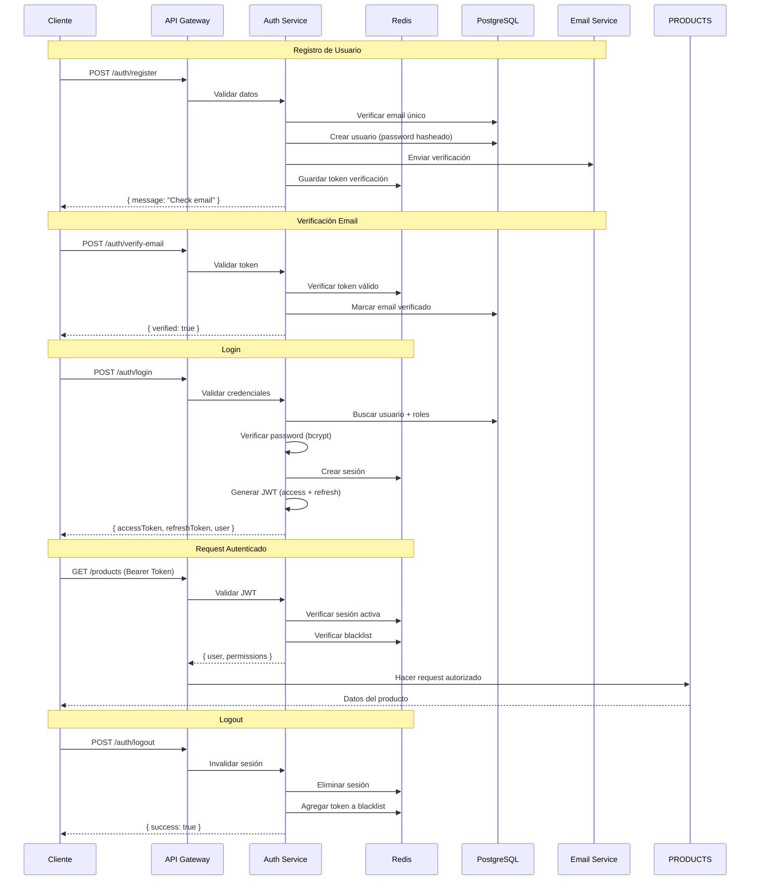

# 🔐 Authentication & Authorization

Sistema completo de autenticación y autorización con JWT, RBAC (Role-Based Access Control), y gestión de sesiones para microservicios escalables.

## 🎯 ¿Por qué un Sistema de Auth Robusto?

En ecommerce, la autenticación es **crítica** porque maneja:

- **💰 Transacciones financieras** - Pagos y datos bancarios
- **📊 Datos personales** - GDPR/CCPA compliance
- **🛒 Experiencia del usuario** - Carrito persistente, historial
- **🔐 Acceso administrativo** - Panel de control y métricas
- **📱 Multi-plataforma** - Web, móvil, API externa

### Estadísticas de Seguridad en Ecommerce

- **🎯 81% de breaches** involucran credenciales débiles o robadas
- **💸 $4.45M** costo promedio de un breach de datos
- **⏱️ 287 días** tiempo promedio para detectar un breach
- **🛡️ JWT bien implementado** reduce riesgo de session hijacking en 95%

## 🏗️ Arquitectura de Autenticación

### Flujo Completo de Autenticación



### Componentes del Sistema

```typescript
// apps/auth-service/src/auth/auth.module.ts
import { Module } from "@nestjs/common";
import { TypeOrmModule } from "@nestjs/typeorm";
import { JwtModule } from "@nestjs/jwt";
import { PassportModule } from "@nestjs/passport";
import { RedisModule } from "@nestjs-modules/ioredis";
import { BullModule } from "@nestjs/bull";

import { AuthController } from "./auth.controller";
import { AuthService } from "./auth.service";
import { UsersService } from "./users/users.service";
import { RolesService } from "./roles/roles.service";
import { SessionsService } from "./sessions/sessions.service";

import { User } from "./entities/user.entity";
import { Role } from "./entities/role.entity";
import { Permission } from "./entities/permission.entity";
import { Session } from "./entities/session.entity";

import { JwtStrategy } from "./strategies/jwt.strategy";
import { LocalStrategy } from "./strategies/local.strategy";
import { RefreshStrategy } from "./strategies/refresh.strategy";

@Module({
  imports: [
    // Base de datos
    TypeOrmModule.forFeature([User, Role, Permission, Session]),

    // JWT Configuration
    JwtModule.registerAsync({
      useFactory: (configService: ConfigService) => ({
        secret: configService.get("JWT_SECRET"),
        signOptions: {
          expiresIn: configService.get("JWT_EXPIRES_IN", "15m"),
        },
      }),
      inject: [ConfigService],
    }),

    // Passport
    PassportModule.register({ defaultStrategy: "jwt" }),

    // Redis para sesiones y cache
    RedisModule.forRootAsync({
      useFactory: (configService: ConfigService) => ({
        config: {
          host: configService.get("REDIS_HOST"),
          port: configService.get("REDIS_PORT"),
          password: configService.get("REDIS_PASSWORD"),
          db: 0, // DB 0 para sesiones
        },
      }),
      inject: [ConfigService],
    }),

    // Queue para emails
    BullModule.forRoot({
      redis: {
        host: process.env.REDIS_HOST,
        port: parseInt(process.env.REDIS_PORT),
        password: process.env.REDIS_PASSWORD,
      },
    }),
    BullModule.registerQueue({
      name: "email",
    }),
  ],
  controllers: [AuthController],
  providers: [
    AuthService,
    UsersService,
    RolesService,
    SessionsService,
    JwtStrategy,
    LocalStrategy,
    RefreshStrategy,
  ],
  exports: [AuthService, JwtStrategy],
})
export class AuthModule {}
```

## 🗄️ Modelo de Datos

### Entidades Principales

```typescript
// apps/auth-service/src/auth/entities/user.entity.ts
import {
  Entity,
  PrimaryGeneratedColumn,
  Column,
  CreateDateColumn,
  UpdateDateColumn,
  ManyToMany,
  JoinTable,
  OneToMany,
} from "typeorm";
import { Exclude } from "class-transformer";
import { Role } from "./role.entity";
import { Session } from "./session.entity";

@Entity("users")
export class User {
  @PrimaryGeneratedColumn("uuid")
  id: string;

  @Column({ unique: true })
  email: string;

  @Column()
  firstName: string;

  @Column()
  lastName: string;

  @Column()
  @Exclude() // No exponer en respuestas
  password: string;

  @Column({ default: false })
  isEmailVerified: boolean;

  @Column({ default: true })
  isActive: boolean;

  @Column({ default: false })
  isTwoFactorEnabled: boolean;

  @Column({ nullable: true })
  @Exclude()
  twoFactorSecret: string;

  @Column({ nullable: true })
  phone: string;

  @Column({ type: "timestamp", nullable: true })
  lastLoginAt: Date;

  @Column({ nullable: true })
  lastLoginIp: string;

  @CreateDateColumn()
  createdAt: Date;

  @UpdateDateColumn()
  updatedAt: Date;

  // Relaciones
  @ManyToMany(() => Role, (role) => role.users, { eager: true })
  @JoinTable({
    name: "user_roles",
    joinColumn: { name: "userId", referencedColumnName: "id" },
    inverseJoinColumn: { name: "roleId", referencedColumnName: "id" },
  })
  roles: Role[];

  @OneToMany(() => Session, (session) => session.user)
  sessions: Session[];

  // Métodos virtuales
  get fullName(): string {
    return `${this.firstName} ${this.lastName}`;
  }

  get permissions(): string[] {
    return this.roles
      .flatMap((role) => role.permissions)
      .map((permission) => permission.name);
  }

  hasPermission(permission: string): boolean {
    return this.permissions.includes(permission);
  }

  hasRole(roleName: string): boolean {
    return this.roles.some((role) => role.name === roleName);
  }
}

// apps/auth-service/src/auth/entities/role.entity.ts
@Entity("roles")
export class Role {
  @PrimaryGeneratedColumn("uuid")
  id: string;

  @Column({ unique: true })
  name: string;

  @Column({ nullable: true })
  description: string;

  @Column({ default: true })
  isActive: boolean;

  @CreateDateColumn()
  createdAt: Date;

  @UpdateDateColumn()
  updatedAt: Date;

  @ManyToMany(() => User, (user) => user.roles)
  users: User[];

  @ManyToMany(() => Permission, (permission) => permission.roles, {
    eager: true,
  })
  @JoinTable({
    name: "role_permissions",
    joinColumn: { name: "roleId", referencedColumnName: "id" },
    inverseJoinColumn: { name: "permissionId", referencedColumnName: "id" },
  })
  permissions: Permission[];
}

// apps/auth-service/src/auth/entities/permission.entity.ts
@Entity("permissions")
export class Permission {
  @PrimaryGeneratedColumn("uuid")
  id: string;

  @Column({ unique: true })
  name: string;

  @Column({ nullable: true })
  description: string;

  @Column()
  resource: string; // 'products', 'orders', 'users', etc.

  @Column()
  action: string; // 'create', 'read', 'update', 'delete'

  @CreateDateColumn()
  createdAt: Date;

  @ManyToMany(() => Role, (role) => role.permissions)
  roles: Role[];
}

// apps/auth-service/src/auth/entities/session.entity.ts
@Entity("sessions")
export class Session {
  @PrimaryGeneratedColumn("uuid")
  id: string;

  @Column()
  userId: string;

  @Column()
  jti: string; // JWT ID único

  @Column()
  userAgent: string;

  @Column()
  ipAddress: string;

  @Column({ nullable: true })
  location: string;

  @Column({ type: "timestamp" })
  expiresAt: Date;

  @Column({ default: true })
  isActive: boolean;

  @CreateDateColumn()
  createdAt: Date;

  @UpdateDateColumn()
  lastActivityAt: Date;

  @ManyToOne(() => User, (user) => user.sessions)
  user: User;
}
```

## 🔐 Implementación del Auth Service

### Servicio Principal de Autenticación

```typescript
// apps/auth-service/src/auth/auth.service.ts
import {
  Injectable,
  UnauthorizedException,
  ConflictException,
  BadRequestException,
  NotFoundException,
} from "@nestjs/common";
import { JwtService } from "@nestjs/jwt";
import { InjectRepository } from "@nestjs/typeorm";
import { Repository } from "typeorm";
import { InjectRedis, Redis } from "@nestjs-modules/ioredis";
import { InjectQueue } from "@nestjs/bull";
import { Queue } from "bull";
import * as bcrypt from "bcrypt";
import * as speakeasy from "speakeasy";
import { UAParser } from "ua-parser-js";

import { User } from "./entities/user.entity";
import { Session } from "./entities/session.entity";
import { UsersService } from "./users/users.service";
import { SessionsService } from "./sessions/sessions.service";

import {
  RegisterDto,
  LoginDto,
  VerifyEmailDto,
  ForgotPasswordDto,
  ResetPasswordDto,
  Enable2FADto,
  Verify2FADto,
} from "./dto";

@Injectable()
export class AuthService {
  constructor(
    @InjectRepository(User)
    private usersRepository: Repository<User>,
    private usersService: UsersService,
    private sessionsService: SessionsService,
    private jwtService: JwtService,
    @InjectRedis() private redis: Redis,
    @InjectQueue("email") private emailQueue: Queue
  ) {}

  async register(
    registerDto: RegisterDto,
    userAgent: string,
    ipAddress: string
  ) {
    const { email, password, firstName, lastName } = registerDto;

    // Verificar que el email no exista
    const existingUser = await this.usersService.findByEmail(email);
    if (existingUser) {
      throw new ConflictException("Email already registered");
    }

    // Hash de la contraseña
    const saltRounds = 12;
    const hashedPassword = await bcrypt.hash(password, saltRounds);

    // Crear usuario
    const user = this.usersRepository.create({
      email,
      password: hashedPassword,
      firstName,
      lastName,
    });

    const savedUser = await this.usersRepository.save(user);

    // Generar token de verificación
    const verificationToken = this.generateVerificationToken();
    await this.redis.setex(
      `email-verification:${verificationToken}`,
      24 * 60 * 60, // 24 horas
      savedUser.id
    );

    // Enviar email de verificación
    await this.emailQueue.add("send-verification-email", {
      email: savedUser.email,
      firstName: savedUser.firstName,
      verificationToken,
    });

    // Log del registro
    console.log(`New user registered: ${email} from ${ipAddress}`);

    return {
      message:
        "Registration successful. Please check your email to verify your account.",
      user: {
        id: savedUser.id,
        email: savedUser.email,
        firstName: savedUser.firstName,
        lastName: savedUser.lastName,
      },
    };
  }

  async login(loginDto: LoginDto, userAgent: string, ipAddress: string) {
    const { email, password, rememberMe = false } = loginDto;

    // Buscar usuario con roles
    const user = await this.usersService.findByEmailWithRoles(email);
    if (!user) {
      throw new UnauthorizedException("Invalid credentials");
    }

    // Verificar contraseña
    const isPasswordValid = await bcrypt.compare(password, user.password);
    if (!isPasswordValid) {
      throw new UnauthorizedException("Invalid credentials");
    }

    // Verificar que el usuario esté activo
    if (!user.isActive) {
      throw new UnauthorizedException("Account is disabled");
    }

    // Verificar email si es requerido
    if (!user.isEmailVerified) {
      throw new UnauthorizedException("Please verify your email first");
    }

    // Verificar 2FA si está habilitado
    if (user.isTwoFactorEnabled && !loginDto.twoFactorCode) {
      return {
        requiresTwoFactor: true,
        tempToken: this.generateTempToken(user.id),
      };
    }

    if (user.isTwoFactorEnabled && loginDto.twoFactorCode) {
      const isValidCode = speakeasy.totp.verify({
        secret: user.twoFactorSecret,
        encoding: "base32",
        token: loginDto.twoFactorCode,
        window: 1,
      });

      if (!isValidCode) {
        throw new UnauthorizedException("Invalid 2FA code");
      }
    }

    // Parsear user agent
    const parser = new UAParser(userAgent);
    const deviceInfo = parser.getResult();

    // Crear sesión
    const sessionData = {
      userId: user.id,
      userAgent,
      ipAddress,
      location: await this.getLocationFromIP(ipAddress),
      deviceInfo: {
        browser: `${deviceInfo.browser.name} ${deviceInfo.browser.version}`,
        os: `${deviceInfo.os.name} ${deviceInfo.os.version}`,
        device: deviceInfo.device.type || "desktop",
      },
      expiresAt: new Date(
        Date.now() + (rememberMe ? 30 : 1) * 24 * 60 * 60 * 1000
      ),
    };

    const session = await this.sessionsService.create(sessionData);

    // Generar tokens JWT
    const tokens = await this.generateTokens(user, session.id);

    // Guardar sesión en Redis
    await this.redis.setex(
      `session:${session.id}`,
      rememberMe ? 30 * 24 * 60 * 60 : 24 * 60 * 60, // 30 días o 1 día
      JSON.stringify({
        userId: user.id,
        sessionId: session.id,
        ipAddress,
        userAgent,
        lastActivity: Date.now(),
      })
    );

    // Actualizar último login
    await this.usersRepository.update(user.id, {
      lastLoginAt: new Date(),
      lastLoginIp: ipAddress,
    });

    // Log del login
    console.log(`User login: ${email} from ${ipAddress}`);

    return {
      ...tokens,
      user: {
        id: user.id,
        email: user.email,
        firstName: user.firstName,
        lastName: user.lastName,
        roles: user.roles.map((role) => ({
          id: role.id,
          name: role.name,
          permissions: role.permissions.map((p) => p.name),
        })),
        permissions: user.permissions,
      },
      session: {
        id: session.id,
        expiresAt: session.expiresAt,
        deviceInfo: sessionData.deviceInfo,
      },
    };
  }

  async logout(token: string, sessionId: string) {
    // Invalidar sesión en Redis
    await this.redis.del(`session:${sessionId}`);

    // Agregar token a blacklist
    const decoded = this.jwtService.decode(token) as any;
    if (decoded) {
      const ttl = decoded.exp - Math.floor(Date.now() / 1000);
      if (ttl > 0) {
        await this.redis.setex(`blacklist:${token}`, ttl, "true");
      }
    }

    // Marcar sesión como inactiva en BD
    await this.sessionsService.deactivate(sessionId);

    return { message: "Logout successful" };
  }

  async verifyEmail(verifyEmailDto: VerifyEmailDto) {
    const { token } = verifyEmailDto;

    // Verificar token de verificación
    const userId = await this.redis.get(`email-verification:${token}`);
    if (!userId) {
      throw new BadRequestException("Invalid or expired verification token");
    }

    // Marcar email como verificado
    await this.usersRepository.update(userId, {
      isEmailVerified: true,
    });

    // Eliminar token de verificación
    await this.redis.del(`email-verification:${token}`);

    return { message: "Email verified successfully" };
  }

  async forgotPassword(forgotPasswordDto: ForgotPasswordDto) {
    const { email } = forgotPasswordDto;

    const user = await this.usersService.findByEmail(email);
    if (!user) {
      // No revelar si el email existe o no
      return { message: "If the email exists, a reset link has been sent" };
    }

    // Generar token de reset
    const resetToken = this.generateResetToken();
    await this.redis.setex(
      `password-reset:${resetToken}`,
      60 * 60, // 1 hora
      user.id
    );

    // Enviar email de reset
    await this.emailQueue.add("send-password-reset-email", {
      email: user.email,
      firstName: user.firstName,
      resetToken,
    });

    return { message: "If the email exists, a reset link has been sent" };
  }

  async resetPassword(resetPasswordDto: ResetPasswordDto) {
    const { token, password } = resetPasswordDto;

    // Verificar token de reset
    const userId = await this.redis.get(`password-reset:${token}`);
    if (!userId) {
      throw new BadRequestException("Invalid or expired reset token");
    }

    // Hash nueva contraseña
    const saltRounds = 12;
    const hashedPassword = await bcrypt.hash(password, saltRounds);

    // Actualizar contraseña
    await this.usersRepository.update(userId, {
      password: hashedPassword,
    });

    // Eliminar token de reset
    await this.redis.del(`password-reset:${token}`);

    // Invalidar todas las sesiones del usuario
    await this.invalidateAllUserSessions(userId);

    return { message: "Password reset successful" };
  }

  async enable2FA(userId: string, enable2FADto: Enable2FADto) {
    const user = await this.usersService.findById(userId);
    if (!user) {
      throw new NotFoundException("User not found");
    }

    if (user.isTwoFactorEnabled) {
      throw new BadRequestException("2FA is already enabled");
    }

    // Generar secret para 2FA
    const secret = speakeasy.generateSecret({
      name: `Ecommerce App (${user.email})`,
      length: 32,
    });

    // Verificar el código proporcionado
    const isValidCode = speakeasy.totp.verify({
      secret: secret.base32,
      encoding: "base32",
      token: enable2FADto.code,
      window: 1,
    });

    if (!isValidCode) {
      throw new BadRequestException("Invalid 2FA code");
    }

    // Habilitar 2FA
    await this.usersRepository.update(userId, {
      isTwoFactorEnabled: true,
      twoFactorSecret: secret.base32,
    });

    return {
      message: "2FA enabled successfully",
      backupCodes: this.generateBackupCodes(),
    };
  }

  async refreshToken(refreshToken: string) {
    try {
      const decoded = this.jwtService.verify(refreshToken);

      if (decoded.type !== "refresh") {
        throw new UnauthorizedException("Invalid token type");
      }

      // Verificar sesión
      const sessionData = await this.redis.get(`session:${decoded.sessionId}`);
      if (!sessionData) {
        throw new UnauthorizedException("Session expired");
      }

      // Obtener usuario
      const user = await this.usersService.findByIdWithRoles(decoded.userId);
      if (!user || !user.isActive) {
        throw new UnauthorizedException("User not found or inactive");
      }

      // Generar nuevos tokens
      return this.generateTokens(user, decoded.sessionId);
    } catch (error) {
      throw new UnauthorizedException("Invalid refresh token");
    }
  }

  // Métodos privados auxiliares
  private async generateTokens(user: User, sessionId: string) {
    const payload = {
      userId: user.id,
      email: user.email,
      sessionId,
      roles: user.roles.map((role) => role.name),
      permissions: user.permissions,
    };

    const accessToken = this.jwtService.sign(
      { ...payload, type: "access" },
      { expiresIn: "15m" }
    );

    const refreshToken = this.jwtService.sign(
      { ...payload, type: "refresh" },
      { expiresIn: "7d" }
    );

    return {
      accessToken,
      refreshToken,
      expiresIn: 15 * 60, // 15 minutos en segundos
    };
  }

  private generateVerificationToken(): string {
    return (
      Math.random().toString(36).substring(2, 15) +
      Math.random().toString(36).substring(2, 15)
    );
  }

  private generateResetToken(): string {
    return (
      Math.random().toString(36).substring(2, 15) +
      Math.random().toString(36).substring(2, 15)
    );
  }

  private generateTempToken(userId: string): string {
    return this.jwtService.sign({ userId, type: "temp" }, { expiresIn: "5m" });
  }

  private generateBackupCodes(): string[] {
    return Array.from({ length: 10 }, () =>
      Math.random().toString(36).substring(2, 10).toUpperCase()
    );
  }

  private async getLocationFromIP(ipAddress: string): Promise<string> {
    // Implementar servicio de geolocalización
    return "Unknown";
  }

  private async invalidateAllUserSessions(userId: string) {
    // Encontrar todas las sesiones del usuario
    const sessions = await this.sessionsService.findByUserId(userId);

    // Invalidar en Redis
    const pipeline = this.redis.pipeline();
    sessions.forEach((session) => {
      pipeline.del(`session:${session.id}`);
    });
    await pipeline.exec();

    // Marcar como inactivas en BD
    await this.sessionsService.deactivateAllByUserId(userId);
  }
}
```

## 🛡️ Guards y Middleware de Seguridad

### JWT Auth Guard

```typescript
// libs/shared/src/guards/jwt-auth.guard.ts
import {
  Injectable,
  ExecutionContext,
  UnauthorizedException,
  Logger,
} from "@nestjs/common";
import { AuthGuard } from "@nestjs/passport";
import { Reflector } from "@nestjs/core";
import { IS_PUBLIC_KEY } from "../decorators/public.decorator";

@Injectable()
export class JwtAuthGuard extends AuthGuard("jwt") {
  private readonly logger = new Logger(JwtAuthGuard.name);

  constructor(private reflector: Reflector) {
    super();
  }

  canActivate(context: ExecutionContext) {
    // Verificar si la ruta es pública
    const isPublic = this.reflector.getAllAndOverride<boolean>(IS_PUBLIC_KEY, [
      context.getHandler(),
      context.getClass(),
    ]);

    if (isPublic) {
      return true;
    }

    return super.canActivate(context);
  }

  handleRequest(err: any, user: any, info: any, context: ExecutionContext) {
    if (err || !user) {
      const request = context.switchToHttp().getRequest();
      this.logger.warn(
        `Unauthorized access attempt: ${request.method} ${request.url} - ${
          request.ip
        } - ${info?.message || "No token provided"}`
      );

      throw err || new UnauthorizedException("Authentication required");
    }

    return user;
  }
}
```

### Rate Limiting por Usuario

```typescript
// libs/shared/src/guards/user-rate-limit.guard.ts
import {
  Injectable,
  CanActivate,
  ExecutionContext,
  HttpException,
  HttpStatus,
} from "@nestjs/common";
import { InjectRedis, Redis } from "@nestjs-modules/ioredis";
import { Reflector } from "@nestjs/core";

@Injectable()
export class UserRateLimitGuard implements CanActivate {
  constructor(
    @InjectRedis() private redis: Redis,
    private reflector: Reflector
  ) {}

  async canActivate(context: ExecutionContext): Promise<boolean> {
    const request = context.switchToHttp().getRequest();
    const user = request.user;

    if (!user) {
      return true; // Sin usuario, usar rate limiting global
    }

    // Rate limiting específico por endpoint
    const endpoint = `${request.method}:${request.route?.path || request.path}`;
    const key = `user_rate_limit:${user.id}:${endpoint}`;

    // Límites por tipo de usuario
    const limits = this.getLimitsForUser(user);
    const current = await this.redis.incr(key);

    if (current === 1) {
      await this.redis.expire(key, 60); // 1 minuto
    }

    if (current > limits.requestsPerMinute) {
      throw new HttpException(
        {
          message: "Rate limit exceeded for authenticated user",
          retryAfter: await this.redis.ttl(key),
        },
        HttpStatus.TOO_MANY_REQUESTS
      );
    }

    return true;
  }

  private getLimitsForUser(user: any) {
    // Límites según roles
    if (user.roles?.includes("admin")) {
      return { requestsPerMinute: 1000 };
    }
    if (user.roles?.includes("premium")) {
      return { requestsPerMinute: 500 };
    }
    return { requestsPerMinute: 100 }; // Usuario básico
  }
}
```

## 🔒 Security Middleware

### Security Headers Middleware

```typescript
// libs/shared/src/middleware/security.middleware.ts
import { Injectable, NestMiddleware } from "@nestjs/common";
import { Request, Response, NextFunction } from "express";

@Injectable()
export class SecurityMiddleware implements NestMiddleware {
  use(req: Request, res: Response, next: NextFunction) {
    // Remover headers que revelan información del servidor
    res.removeHeader("X-Powered-By");
    res.removeHeader("Server");

    // Configurar headers de seguridad
    res.setHeader("X-Content-Type-Options", "nosniff");
    res.setHeader("X-Frame-Options", "DENY");
    res.setHeader("X-XSS-Protection", "1; mode=block");
    res.setHeader("Referrer-Policy", "strict-origin-when-cross-origin");
    res.setHeader(
      "Permissions-Policy",
      "geolocation=(), microphone=(), camera=()"
    );

    // HSTS (solo en HTTPS)
    if (req.secure) {
      res.setHeader(
        "Strict-Transport-Security",
        "max-age=31536000; includeSubDomains"
      );
    }

    // CSP básico
    res.setHeader(
      "Content-Security-Policy",
      "default-src 'self'; script-src 'self' 'unsafe-inline'; style-src 'self' 'unsafe-inline'; img-src 'self' data: https:; font-src 'self' https:; connect-src 'self' https:; frame-ancestors 'none';"
    );

    next();
  }
}
```

## 🎯 Checklist de Implementación

### ✅ Setup Base

- [ ] Configurar Auth Service con NestJS
- [ ] Implementar entities (User, Role, Permission, Session)
- [ ] Configurar JWT con secret seguro
- [ ] Configurar Redis para sesiones
- [ ] Configurar hash de passwords con bcrypt

### ✅ Funcionalidades Core

- [ ] Registro de usuarios con validación
- [ ] Login con credenciales + 2FA opcional
- [ ] Verificación de email automática
- [ ] Reset de contraseña seguro
- [ ] Gestión de sesiones múltiples

### ✅ RBAC (Role-Based Access Control)

- [ ] Sistema de roles y permisos granulares
- [ ] Guards para autorización por endpoint
- [ ] Decoradores para facilitar uso (@Roles, @Permissions)
- [ ] Middleware de validación automática

### ✅ Seguridad Avanzada

- [ ] Rate limiting por usuario y endpoint
- [ ] Blacklist de tokens JWT
- [ ] Security headers automáticos
- [ ] Logging de eventos de seguridad
- [ ] Detección de login sospechoso

### ✅ Monitoreo y Alertas

- [ ] Métricas de autenticación (login/logout rates)
- [ ] Alertas de intentos de brute force
- [ ] Dashboard de sesiones activas
- [ ] Logs de auditoría completos

---

**🎯 Próximo paso**: Implementa [Event-Driven Architecture](./event-driven.md) para comunicación asíncrona entre servicios.
