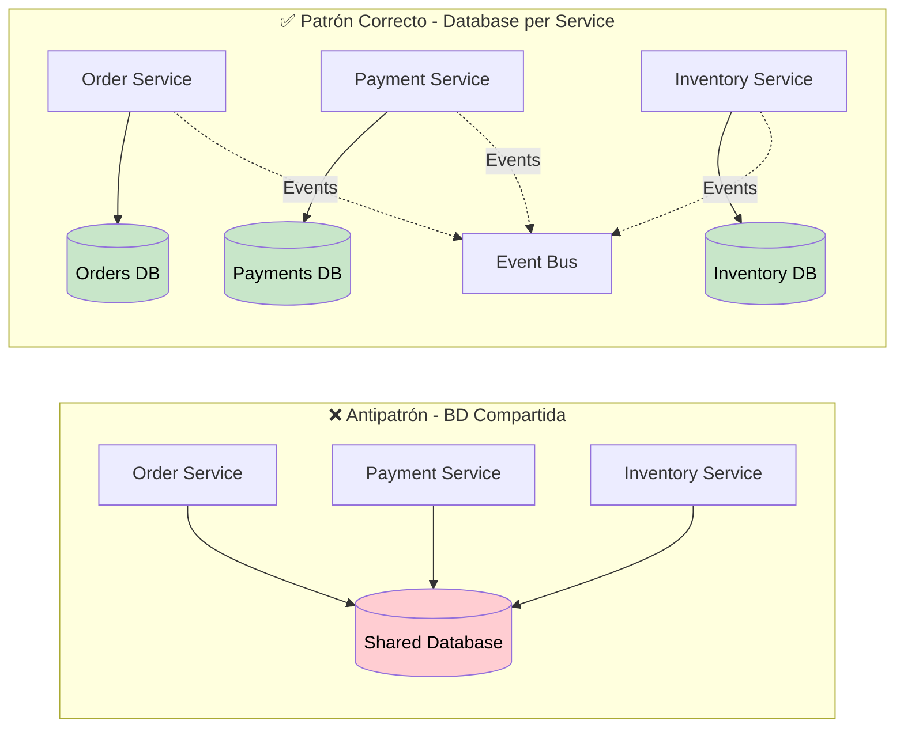

# 🗄️ Database Design para Microservicios

Guía completa de diseño de bases de datos en arquitectura de microservicios: Database per Service, transacciones distribuidas, migraciones y optimización.

## 🎯 ¿Por qué Database per Service?

En ecommerce, cada microservicio debe **poseer sus propios datos**:

- **🔒 Autonomía completa** - Cada servicio evoluciona independientemente
- **⚡ Performance optimizado** - Esquemas específicos por dominio
- **🛡️ Fault isolation** - Fallo en una BD no afecta otros servicios
- **📈 Escalabilidad granular** - Escalar solo la BD que lo necesita
- **🔧 Tecnología específica** - PostgreSQL, MongoDB, Redis según necesidad

### Problema: Transacciones Distribuidas



## 🏗️ Diseño de Esquemas por Servicio

### Auth Service Database

```sql
-- apps/auth-service/src/database/migrations/001_initial_schema.sql

-- Users table
CREATE TABLE users (
    id UUID PRIMARY KEY DEFAULT gen_random_uuid(),
    email VARCHAR(255) UNIQUE NOT NULL,
    password_hash VARCHAR(255) NOT NULL,
    first_name VARCHAR(100) NOT NULL,
    last_name VARCHAR(100) NOT NULL,
    phone VARCHAR(20),
    is_email_verified BOOLEAN DEFAULT FALSE,
    is_active BOOLEAN DEFAULT TRUE,
    is_two_factor_enabled BOOLEAN DEFAULT FALSE,
    two_factor_secret VARCHAR(255),
    last_login_at TIMESTAMP WITH TIME ZONE,
    last_login_ip INET,
    created_at TIMESTAMP WITH TIME ZONE DEFAULT NOW(),
    updated_at TIMESTAMP WITH TIME ZONE DEFAULT NOW()
);

-- Roles table
CREATE TABLE roles (
    id UUID PRIMARY KEY DEFAULT gen_random_uuid(),
    name VARCHAR(50) UNIQUE NOT NULL,
    description TEXT,
    is_active BOOLEAN DEFAULT TRUE,
    created_at TIMESTAMP WITH TIME ZONE DEFAULT NOW(),
    updated_at TIMESTAMP WITH TIME ZONE DEFAULT NOW()
);

-- Permissions table
CREATE TABLE permissions (
    id UUID PRIMARY KEY DEFAULT gen_random_uuid(),
    name VARCHAR(100) UNIQUE NOT NULL,
    description TEXT,
    resource VARCHAR(50) NOT NULL,
    action VARCHAR(50) NOT NULL,
    created_at TIMESTAMP WITH TIME ZONE DEFAULT NOW()
);

-- User-Role junction table
CREATE TABLE user_roles (
    user_id UUID REFERENCES users(id) ON DELETE CASCADE,
    role_id UUID REFERENCES roles(id) ON DELETE CASCADE,
    created_at TIMESTAMP WITH TIME ZONE DEFAULT NOW(),
    PRIMARY KEY (user_id, role_id)
);

-- Role-Permission junction table
CREATE TABLE role_permissions (
    role_id UUID REFERENCES roles(id) ON DELETE CASCADE,
    permission_id UUID REFERENCES permissions(id) ON DELETE CASCADE,
    created_at TIMESTAMP WITH TIME ZONE DEFAULT NOW(),
    PRIMARY KEY (role_id, permission_id)
);

-- Sessions table for JWT tracking
CREATE TABLE sessions (
    id UUID PRIMARY KEY DEFAULT gen_random_uuid(),
    user_id UUID REFERENCES users(id) ON DELETE CASCADE,
    jti VARCHAR(255) UNIQUE NOT NULL,
    user_agent TEXT,
    ip_address INET,
    location VARCHAR(255),
    expires_at TIMESTAMP WITH TIME ZONE NOT NULL,
    is_active BOOLEAN DEFAULT TRUE,
    created_at TIMESTAMP WITH TIME ZONE DEFAULT NOW(),
    last_activity_at TIMESTAMP WITH TIME ZONE DEFAULT NOW()
);

-- Password reset tokens
CREATE TABLE password_reset_tokens (
    id UUID PRIMARY KEY DEFAULT gen_random_uuid(),
    user_id UUID REFERENCES users(id) ON DELETE CASCADE,
    token VARCHAR(255) UNIQUE NOT NULL,
    expires_at TIMESTAMP WITH TIME ZONE NOT NULL,
    used_at TIMESTAMP WITH TIME ZONE,
    created_at TIMESTAMP WITH TIME ZONE DEFAULT NOW()
);

-- Indexes para performance
CREATE INDEX idx_users_email ON users(email);
CREATE INDEX idx_users_active ON users(is_active) WHERE is_active = TRUE;
CREATE INDEX idx_sessions_user_id ON sessions(user_id);
CREATE INDEX idx_sessions_jti ON sessions(jti);
CREATE INDEX idx_sessions_active ON sessions(is_active, expires_at) WHERE is_active = TRUE;
CREATE INDEX idx_password_reset_token ON password_reset_tokens(token);
CREATE INDEX idx_password_reset_expires ON password_reset_tokens(expires_at);

-- Trigger para updated_at automático
CREATE OR REPLACE FUNCTION update_updated_at_column()
RETURNS TRIGGER AS $$
BEGIN
    NEW.updated_at = NOW();
    RETURN NEW;
END;
$$ language 'plpgsql';

CREATE TRIGGER update_users_updated_at BEFORE UPDATE ON users
    FOR EACH ROW EXECUTE FUNCTION update_updated_at_column();

CREATE TRIGGER update_roles_updated_at BEFORE UPDATE ON roles
    FOR EACH ROW EXECUTE FUNCTION update_updated_at_column();
```

### Products Service Database

```sql
-- apps/products-service/src/database/migrations/001_initial_schema.sql

-- Categories table
CREATE TABLE categories (
    id UUID PRIMARY KEY DEFAULT gen_random_uuid(),
    name VARCHAR(255) NOT NULL,
    slug VARCHAR(255) UNIQUE NOT NULL,
    description TEXT,
    parent_id UUID REFERENCES categories(id),
    image_url VARCHAR(500),
    is_active BOOLEAN DEFAULT TRUE,
    sort_order INTEGER DEFAULT 0,
    seo_title VARCHAR(255),
    seo_description TEXT,
    created_at TIMESTAMP WITH TIME ZONE DEFAULT NOW(),
    updated_at TIMESTAMP WITH TIME ZONE DEFAULT NOW()
);

-- Products table
CREATE TABLE products (
    id UUID PRIMARY KEY DEFAULT gen_random_uuid(),
    name VARCHAR(255) NOT NULL,
    slug VARCHAR(255) UNIQUE NOT NULL,
    description TEXT,
    short_description TEXT,
    sku VARCHAR(100) UNIQUE NOT NULL,
    barcode VARCHAR(100),
    price DECIMAL(10,2) NOT NULL,
    compare_price DECIMAL(10,2),
    cost_price DECIMAL(10,2),
    track_inventory BOOLEAN DEFAULT TRUE,
    inventory_quantity INTEGER DEFAULT 0,
    low_stock_threshold INTEGER DEFAULT 5,
    weight DECIMAL(8,2),
    dimensions JSONB, -- {length, width, height, unit}
    is_active BOOLEAN DEFAULT TRUE,
    is_featured BOOLEAN DEFAULT FALSE,
    is_digital BOOLEAN DEFAULT FALSE,
    requires_shipping BOOLEAN DEFAULT TRUE,
    taxable BOOLEAN DEFAULT TRUE,
    vendor VARCHAR(255),
    product_type VARCHAR(100),
    tags TEXT[], -- Array de tags
    images JSONB, -- Array de URLs de imágenes
    variants_count INTEGER DEFAULT 0,
    options JSONB, -- Color, Size, etc.
    seo_title VARCHAR(255),
    seo_description TEXT,
    created_at TIMESTAMP WITH TIME ZONE DEFAULT NOW(),
    updated_at TIMESTAMP WITH TIME ZONE DEFAULT NOW(),
    published_at TIMESTAMP WITH TIME ZONE
);

-- Product variants table
CREATE TABLE product_variants (
    id UUID PRIMARY KEY DEFAULT gen_random_uuid(),
    product_id UUID REFERENCES products(id) ON DELETE CASCADE,
    title VARCHAR(255) NOT NULL,
    sku VARCHAR(100) UNIQUE NOT NULL,
    barcode VARCHAR(100),
    price DECIMAL(10,2) NOT NULL,
    compare_price DECIMAL(10,2),
    cost_price DECIMAL(10,2),
    inventory_quantity INTEGER DEFAULT 0,
    weight DECIMAL(8,2),
    option1 VARCHAR(255), -- Color
    option2 VARCHAR(255), -- Size
    option3 VARCHAR(255), -- Material
    image_url VARCHAR(500),
    position INTEGER DEFAULT 0,
    is_active BOOLEAN DEFAULT TRUE,
    created_at TIMESTAMP WITH TIME ZONE DEFAULT NOW(),
    updated_at TIMESTAMP WITH TIME ZONE DEFAULT NOW()
);

-- Product-Category junction table
CREATE TABLE product_categories (
    product_id UUID REFERENCES products(id) ON DELETE CASCADE,
    category_id UUID REFERENCES categories(id) ON DELETE CASCADE,
    created_at TIMESTAMP WITH TIME ZONE DEFAULT NOW(),
    PRIMARY KEY (product_id, category_id)
);

-- Product reviews
CREATE TABLE product_reviews (
    id UUID PRIMARY KEY DEFAULT gen_random_uuid(),
    product_id UUID REFERENCES products(id) ON DELETE CASCADE,
    user_id UUID NOT NULL, -- Reference to auth service user
    rating INTEGER CHECK (rating >= 1 AND rating <= 5),
    title VARCHAR(255),
    content TEXT,
    is_verified_purchase BOOLEAN DEFAULT FALSE,
    is_approved BOOLEAN DEFAULT FALSE,
    helpful_count INTEGER DEFAULT 0,
    created_at TIMESTAMP WITH TIME ZONE DEFAULT NOW(),
    updated_at TIMESTAMP WITH TIME ZONE DEFAULT NOW()
);

-- Inventory movements for tracking
CREATE TABLE inventory_movements (
    id UUID PRIMARY KEY DEFAULT gen_random_uuid(),
    product_variant_id UUID REFERENCES product_variants(id),
    movement_type VARCHAR(50) NOT NULL, -- 'sale', 'restock', 'adjustment', 'return'
    quantity INTEGER NOT NULL,
    reference_id UUID, -- Order ID, Purchase Order ID, etc.
    reference_type VARCHAR(50), -- 'order', 'purchase_order', 'adjustment'
    notes TEXT,
    created_at TIMESTAMP WITH TIME ZONE DEFAULT NOW(),
    created_by UUID -- User who made the movement
);

-- Search optimization - Full text search
ALTER TABLE products ADD COLUMN search_vector tsvector;

CREATE INDEX idx_products_search ON products USING gin(search_vector);
CREATE INDEX idx_products_active ON products(is_active) WHERE is_active = TRUE;
CREATE INDEX idx_products_featured ON products(is_featured) WHERE is_featured = TRUE;
CREATE INDEX idx_products_category ON product_categories(category_id);
CREATE INDEX idx_products_sku ON products(sku);
CREATE INDEX idx_products_slug ON products(slug);
CREATE INDEX idx_product_variants_sku ON product_variants(sku);
CREATE INDEX idx_product_reviews_product ON product_reviews(product_id);
CREATE INDEX idx_product_reviews_user ON product_reviews(user_id);
CREATE INDEX idx_inventory_movements_variant ON inventory_movements(product_variant_id);
CREATE INDEX idx_inventory_movements_type ON inventory_movements(movement_type);

-- Function to update search vector
CREATE OR REPLACE FUNCTION update_product_search_vector()
RETURNS TRIGGER AS $$
BEGIN
    NEW.search_vector :=
        setweight(to_tsvector('english', COALESCE(NEW.name, '')), 'A') ||
        setweight(to_tsvector('english', COALESCE(NEW.description, '')), 'B') ||
        setweight(to_tsvector('english', COALESCE(NEW.sku, '')), 'C') ||
        setweight(to_tsvector('english', COALESCE(array_to_string(NEW.tags, ' '), '')), 'D');
    RETURN NEW;
END;
$$ language 'plpgsql';

CREATE TRIGGER update_product_search_vector_trigger
    BEFORE INSERT OR UPDATE ON products
    FOR EACH ROW EXECUTE FUNCTION update_product_search_vector();

-- Triggers para updated_at
CREATE TRIGGER update_categories_updated_at BEFORE UPDATE ON categories
    FOR EACH ROW EXECUTE FUNCTION update_updated_at_column();

CREATE TRIGGER update_products_updated_at BEFORE UPDATE ON products
    FOR EACH ROW EXECUTE FUNCTION update_updated_at_column();

CREATE TRIGGER update_product_variants_updated_at BEFORE UPDATE ON product_variants
    FOR EACH ROW EXECUTE FUNCTION update_updated_at_column();
```

### Orders Service Database

```sql
-- apps/orders-service/src/database/migrations/001_initial_schema.sql

-- Orders table
CREATE TABLE orders (
    id UUID PRIMARY KEY DEFAULT gen_random_uuid(),
    order_number VARCHAR(100) UNIQUE NOT NULL,
    user_id UUID NOT NULL, -- Reference to auth service
    email VARCHAR(255) NOT NULL,
    status VARCHAR(50) DEFAULT 'pending',
    financial_status VARCHAR(50) DEFAULT 'pending',
    fulfillment_status VARCHAR(50) DEFAULT 'unfulfilled',

    -- Pricing
    subtotal_price DECIMAL(10,2) NOT NULL,
    total_tax DECIMAL(10,2) DEFAULT 0,
    total_discounts DECIMAL(10,2) DEFAULT 0,
    shipping_price DECIMAL(10,2) DEFAULT 0,
    total_price DECIMAL(10,2) NOT NULL,
    currency VARCHAR(3) DEFAULT 'USD',

    -- Addresses (stored as JSONB for flexibility)
    billing_address JSONB NOT NULL,
    shipping_address JSONB NOT NULL,

    -- Shipping
    shipping_method VARCHAR(100),
    tracking_number VARCHAR(255),
    tracking_url VARCHAR(500),

    -- Metadata
    notes TEXT,
    tags TEXT[],
    source VARCHAR(50) DEFAULT 'web', -- web, mobile, admin, api
    referring_site VARCHAR(500),
    landing_site VARCHAR(500),

    -- Timestamps
    processed_at TIMESTAMP WITH TIME ZONE,
    shipped_at TIMESTAMP WITH TIME ZONE,
    delivered_at TIMESTAMP WITH TIME ZONE,
    cancelled_at TIMESTAMP WITH TIME ZONE,
    created_at TIMESTAMP WITH TIME ZONE DEFAULT NOW(),
    updated_at TIMESTAMP WITH TIME ZONE DEFAULT NOW()
);

-- Order line items
CREATE TABLE order_line_items (
    id UUID PRIMARY KEY DEFAULT gen_random_uuid(),
    order_id UUID REFERENCES orders(id) ON DELETE CASCADE,
    product_id UUID NOT NULL, -- Reference to products service
    variant_id UUID, -- Reference to product variant
    quantity INTEGER NOT NULL,
    price DECIMAL(10,2) NOT NULL,
    original_price DECIMAL(10,2) NOT NULL,
    total_discount DECIMAL(10,2) DEFAULT 0,

    -- Product snapshot (for historical accuracy)
    title VARCHAR(255) NOT NULL,
    variant_title VARCHAR(255),
    sku VARCHAR(100),
    vendor VARCHAR(255),
    product_type VARCHAR(100),
    weight DECIMAL(8,2),

    -- Fulfillment
    fulfillment_status VARCHAR(50) DEFAULT 'unfulfilled',
    fulfillment_service VARCHAR(100),

    created_at TIMESTAMP WITH TIME ZONE DEFAULT NOW()
);

-- Shopping carts (for abandoned cart recovery)
CREATE TABLE shopping_carts (
    id UUID PRIMARY KEY DEFAULT gen_random_uuid(),
    user_id UUID, -- NULL for guest carts
    session_id VARCHAR(255), -- For guest identification
    email VARCHAR(255),

    -- Pricing (calculated)
    subtotal_price DECIMAL(10,2) DEFAULT 0,
    total_price DECIMAL(10,2) DEFAULT 0,
    currency VARCHAR(3) DEFAULT 'USD',

    -- Recovery
    abandoned_checkout_url VARCHAR(500),
    recovered_at TIMESTAMP WITH TIME ZONE,

    created_at TIMESTAMP WITH TIME ZONE DEFAULT NOW(),
    updated_at TIMESTAMP WITH TIME ZONE DEFAULT NOW(),
    expires_at TIMESTAMP WITH TIME ZONE DEFAULT NOW() + INTERVAL '30 days'
);

-- Cart line items
CREATE TABLE cart_line_items (
    id UUID PRIMARY KEY DEFAULT gen_random_uuid(),
    cart_id UUID REFERENCES shopping_carts(id) ON DELETE CASCADE,
    product_id UUID NOT NULL,
    variant_id UUID,
    quantity INTEGER NOT NULL,
    price DECIMAL(10,2) NOT NULL,

    -- Product snapshot
    title VARCHAR(255) NOT NULL,
    variant_title VARCHAR(255),
    sku VARCHAR(100),
    image_url VARCHAR(500),

    created_at TIMESTAMP WITH TIME ZONE DEFAULT NOW(),
    updated_at TIMESTAMP WITH TIME ZONE DEFAULT NOW()
);

-- Order history/events for audit trail
CREATE TABLE order_events (
    id UUID PRIMARY KEY DEFAULT gen_random_uuid(),
    order_id UUID REFERENCES orders(id) ON DELETE CASCADE,
    event_type VARCHAR(100) NOT NULL, -- 'created', 'paid', 'shipped', 'cancelled'
    description TEXT,
    data JSONB, -- Additional event data
    created_by UUID, -- User who triggered the event
    created_at TIMESTAMP WITH TIME ZONE DEFAULT NOW()
);

-- Discounts applied to orders
CREATE TABLE order_discounts (
    id UUID PRIMARY KEY DEFAULT gen_random_uuid(),
    order_id UUID REFERENCES orders(id) ON DELETE CASCADE,
    discount_code VARCHAR(100),
    discount_type VARCHAR(50), -- 'percentage', 'fixed_amount', 'free_shipping'
    discount_value DECIMAL(10,2) NOT NULL,
    title VARCHAR(255),
    description TEXT,
    created_at TIMESTAMP WITH TIME ZONE DEFAULT NOW()
);

-- Indexes para performance
CREATE INDEX idx_orders_user_id ON orders(user_id);
CREATE INDEX idx_orders_status ON orders(status);
CREATE INDEX idx_orders_financial_status ON orders(financial_status);
CREATE INDEX idx_orders_created_at ON orders(created_at);
CREATE INDEX idx_orders_order_number ON orders(order_number);
CREATE INDEX idx_order_line_items_order_id ON order_line_items(order_id);
CREATE INDEX idx_order_line_items_product_id ON order_line_items(product_id);
CREATE INDEX idx_shopping_carts_user_id ON shopping_carts(user_id);
CREATE INDEX idx_shopping_carts_session_id ON shopping_carts(session_id);
CREATE INDEX idx_shopping_carts_expires_at ON shopping_carts(expires_at);
CREATE INDEX idx_cart_line_items_cart_id ON cart_line_items(cart_id);
CREATE INDEX idx_order_events_order_id ON order_events(order_id);
CREATE INDEX idx_order_events_type ON order_events(event_type);

-- Function para generar order number
CREATE OR REPLACE FUNCTION generate_order_number()
RETURNS TEXT AS $$
DECLARE
    new_number TEXT;
    prefix TEXT := 'ORD';
    suffix TEXT;
BEGIN
    -- Generate a number based on current timestamp and random component
    suffix := LPAD((EXTRACT(EPOCH FROM NOW())::BIGINT % 100000)::TEXT, 5, '0') ||
              LPAD((RANDOM() * 1000)::INTEGER::TEXT, 3, '0');
    new_number := prefix || '-' || suffix;

    -- Ensure uniqueness
    WHILE EXISTS (SELECT 1 FROM orders WHERE order_number = new_number) LOOP
        suffix := LPAD((RANDOM() * 100000)::INTEGER::TEXT, 5, '0') ||
                  LPAD((RANDOM() * 1000)::INTEGER::TEXT, 3, '0');
        new_number := prefix || '-' || suffix;
    END LOOP;

    RETURN new_number;
END;
$$ LANGUAGE plpgsql;

-- Trigger para auto-generar order number
CREATE OR REPLACE FUNCTION set_order_number()
RETURNS TRIGGER AS $$
BEGIN
    IF NEW.order_number IS NULL OR NEW.order_number = '' THEN
        NEW.order_number := generate_order_number();
    END IF;
    RETURN NEW;
END;
$$ LANGUAGE plpgsql;

CREATE TRIGGER set_order_number_trigger
    BEFORE INSERT ON orders
    FOR EACH ROW EXECUTE FUNCTION set_order_number();

-- Triggers para updated_at
CREATE TRIGGER update_orders_updated_at BEFORE UPDATE ON orders
    FOR EACH ROW EXECUTE FUNCTION update_updated_at_column();

CREATE TRIGGER update_shopping_carts_updated_at BEFORE UPDATE ON shopping_carts
    FOR EACH ROW EXECUTE FUNCTION update_updated_at_column();

CREATE TRIGGER update_cart_line_items_updated_at BEFORE UPDATE ON cart_line_items
    FOR EACH ROW EXECUTE FUNCTION update_updated_at_column();
```

## 🔄 Saga Pattern para Transacciones Distribuidas

### Order Processing Saga

```typescript
// apps/orders-service/src/sagas/order-processing.saga.ts
import { Injectable, Logger } from "@nestjs/common";
import { InjectRepository } from "@nestjs/typeorm";
import { Repository } from "typeorm";
import { EventPublisherService } from "@ecommerce/shared";

interface SagaStep {
  action: string;
  service: string;
  compensationAction?: string;
  status: "pending" | "completed" | "failed" | "compensated";
  data?: any;
  error?: string;
}

interface SagaTransaction {
  id: string;
  orderId: string;
  status: "active" | "completed" | "failed" | "compensating";
  steps: SagaStep[];
  createdAt: Date;
  updatedAt: Date;
}

@Injectable()
export class OrderProcessingSaga {
  private readonly logger = new Logger(OrderProcessingSaga.name);

  constructor(
    @InjectRepository(SagaTransaction)
    private sagaRepository: Repository<SagaTransaction>,
    private eventPublisher: EventPublisherService
  ) {}

  async startOrderProcessing(orderId: string, orderData: any): Promise<void> {
    const sagaId = this.generateSagaId();

    const sagaTransaction: SagaTransaction = {
      id: sagaId,
      orderId,
      status: "active",
      steps: [
        {
          action: "validateProducts",
          service: "products-service",
          compensationAction: "releaseProductValidation",
          status: "pending",
          data: { products: orderData.items },
        },
        {
          action: "reserveInventory",
          service: "products-service",
          compensationAction: "releaseInventory",
          status: "pending",
          data: { orderId, items: orderData.items },
        },
        {
          action: "processPayment",
          service: "payments-service",
          compensationAction: "refundPayment",
          status: "pending",
          data: {
            orderId,
            amount: orderData.totalAmount,
            paymentMethod: orderData.paymentMethod,
          },
        },
        {
          action: "updateOrderStatus",
          service: "orders-service",
          status: "pending",
          data: { orderId, status: "confirmed" },
        },
        {
          action: "sendConfirmationEmail",
          service: "notifications-service",
          status: "pending",
          data: { orderId, email: orderData.email },
        },
      ],
      createdAt: new Date(),
      updatedAt: new Date(),
    };

    await this.sagaRepository.save(sagaTransaction);
    await this.executeNextStep(sagaTransaction);
  }

  private async executeNextStep(saga: SagaTransaction): Promise<void> {
    const nextStep = saga.steps.find((step) => step.status === "pending");

    if (!nextStep) {
      // All steps completed
      saga.status = "completed";
      await this.sagaRepository.save(saga);
      this.logger.log(`Saga ${saga.id} completed successfully`);
      return;
    }

    try {
      this.logger.log(`Executing step: ${nextStep.action} for saga ${saga.id}`);

      await this.eventPublisher.publish({
        type: `saga.${nextStep.action}` as any,
        payload: {
          sagaId: saga.id,
          stepAction: nextStep.action,
          ...nextStep.data,
        },
      });

      nextStep.status = "completed";
      saga.updatedAt = new Date();

      await this.sagaRepository.save(saga);

      // Execute next step
      await this.executeNextStep(saga);
    } catch (error) {
      this.logger.error(
        `Step ${nextStep.action} failed for saga ${saga.id}: ${error.message}`
      );

      nextStep.status = "failed";
      nextStep.error = error.message;
      saga.status = "compensating";

      await this.sagaRepository.save(saga);
      await this.startCompensation(saga);
    }
  }

  private async startCompensation(saga: SagaTransaction): Promise<void> {
    this.logger.warn(`Starting compensation for saga ${saga.id}`);

    // Execute compensation actions in reverse order
    const completedSteps = saga.steps
      .filter((step) => step.status === "completed" && step.compensationAction)
      .reverse();

    for (const step of completedSteps) {
      try {
        this.logger.log(
          `Compensating step: ${step.action} with ${step.compensationAction}`
        );

        await this.eventPublisher.publish({
          type: `saga.${step.compensationAction}` as any,
          payload: {
            sagaId: saga.id,
            originalAction: step.action,
            ...step.data,
          },
        });

        step.status = "compensated";
      } catch (error) {
        this.logger.error(
          `Compensation failed for step ${step.action}: ${error.message}`
        );
        // Log but continue with other compensations
      }
    }

    saga.status = "failed";
    saga.updatedAt = new Date();
    await this.sagaRepository.save(saga);

    this.logger.error(`Saga ${saga.id} failed and compensation completed`);
  }

  async handleStepCompletion(
    sagaId: string,
    stepAction: string,
    success: boolean,
    error?: string
  ): Promise<void> {
    const saga = await this.sagaRepository.findOne({ where: { id: sagaId } });

    if (!saga) {
      this.logger.error(`Saga ${sagaId} not found`);
      return;
    }

    const step = saga.steps.find((s) => s.action === stepAction);
    if (!step) {
      this.logger.error(`Step ${stepAction} not found in saga ${sagaId}`);
      return;
    }

    if (success) {
      step.status = "completed";
      await this.sagaRepository.save(saga);
      await this.executeNextStep(saga);
    } else {
      step.status = "failed";
      step.error = error;
      saga.status = "compensating";
      await this.sagaRepository.save(saga);
      await this.startCompensation(saga);
    }
  }

  private generateSagaId(): string {
    return `saga_${Date.now()}_${Math.random().toString(36).substring(2, 15)}`;
  }
}
```

## 📊 Database Migration Strategy

### Migration Management per Service

```typescript
// libs/shared/src/database/migration-manager.service.ts
import { Injectable, Logger } from "@nestjs/common";
import { DataSource } from "typeorm";
import { ConfigService } from "@nestjs/config";
import * as fs from "fs";
import * as path from "path";

@Injectable()
export class MigrationManagerService {
  private readonly logger = new Logger(MigrationManagerService.name);

  constructor(
    private dataSource: DataSource,
    private configService: ConfigService
  ) {}

  async runMigrations(serviceName: string): Promise<void> {
    const migrationsPath = path.join(
      process.cwd(),
      "apps",
      serviceName,
      "src",
      "database",
      "migrations"
    );

    if (!fs.existsSync(migrationsPath)) {
      this.logger.warn(`No migrations directory found for ${serviceName}`);
      return;
    }

    const migrationFiles = fs
      .readdirSync(migrationsPath)
      .filter((file) => file.endsWith(".sql"))
      .sort();

    for (const migrationFile of migrationFiles) {
      await this.runMigration(serviceName, migrationFile, migrationsPath);
    }
  }

  private async runMigration(
    serviceName: string,
    fileName: string,
    migrationsPath: string
  ): Promise<void> {
    const migrationId = `${serviceName}_${fileName}`;

    // Check if migration already executed
    const executedMigration = await this.dataSource.query(
      "SELECT * FROM migration_history WHERE migration_id = $1",
      [migrationId]
    );

    if (executedMigration.length > 0) {
      this.logger.debug(`Migration ${migrationId} already executed`);
      return;
    }

    const migrationPath = path.join(migrationsPath, fileName);
    const migrationSql = fs.readFileSync(migrationPath, "utf8");

    try {
      await this.dataSource.query("BEGIN");

      // Execute migration
      await this.dataSource.query(migrationSql);

      // Record migration execution
      await this.dataSource.query(
        "INSERT INTO migration_history (migration_id, service_name, file_name, executed_at) VALUES ($1, $2, $3, NOW())",
        [migrationId, serviceName, fileName]
      );

      await this.dataSource.query("COMMIT");

      this.logger.log(`Migration ${migrationId} executed successfully`);
    } catch (error) {
      await this.dataSource.query("ROLLBACK");
      this.logger.error(`Migration ${migrationId} failed: ${error.message}`);
      throw error;
    }
  }

  async createMigrationHistoryTable(): Promise<void> {
    const tableExists = await this.dataSource.query(`
      SELECT EXISTS (
        SELECT FROM information_schema.tables 
        WHERE table_schema = 'public' 
        AND table_name = 'migration_history'
      );
    `);

    if (!tableExists[0].exists) {
      await this.dataSource.query(`
        CREATE TABLE migration_history (
          id SERIAL PRIMARY KEY,
          migration_id VARCHAR(255) UNIQUE NOT NULL,
          service_name VARCHAR(100) NOT NULL,
          file_name VARCHAR(255) NOT NULL,
          executed_at TIMESTAMP WITH TIME ZONE DEFAULT NOW()
        );
        
        CREATE INDEX idx_migration_history_service ON migration_history(service_name);
        CREATE INDEX idx_migration_history_executed_at ON migration_history(executed_at);
      `);

      this.logger.log("Migration history table created");
    }
  }
}
```

### Database Configuration per Service

```typescript
// apps/auth-service/src/database/database.module.ts
import { Module } from "@nestjs/common";
import { TypeOrmModule } from "@nestjs/typeorm";
import { ConfigModule, ConfigService } from "@nestjs/config";

@Module({
  imports: [
    TypeOrmModule.forRootAsync({
      imports: [ConfigModule],
      useFactory: (configService: ConfigService) => ({
        type: "postgres",
        host: configService.get("AUTH_DB_HOST", "localhost"),
        port: configService.get("AUTH_DB_PORT", 5432),
        username: configService.get("AUTH_DB_USERNAME", "postgres"),
        password: configService.get("AUTH_DB_PASSWORD", "password"),
        database: configService.get("AUTH_DB_NAME", "auth_service"),
        entities: [__dirname + "/../**/*.entity{.ts,.js}"],
        synchronize: false, // Always use migrations in production
        logging: configService.get("NODE_ENV") === "development",
        ssl: configService.get("NODE_ENV") === "production",
        extra: {
          max: 20, // Maximum number of connections
          idleTimeoutMillis: 30000,
          connectionTimeoutMillis: 2000,
        },
      }),
      inject: [ConfigService],
    }),
  ],
})
export class DatabaseModule {}
```

## 🔍 Query Optimization

### Repository Pattern con Optimizaciones

```typescript
// apps/products-service/src/products/products.repository.ts
import { Injectable } from "@nestjs/common";
import { InjectRepository } from "@nestjs/typeorm";
import { Repository, SelectQueryBuilder } from "typeorm";
import { InjectRedis, Redis } from "@nestjs-modules/ioredis";

import { Product } from "./entities/product.entity";
import { ProductQueryDto } from "./dto/product-query.dto";

@Injectable()
export class ProductsRepository {
  constructor(
    @InjectRepository(Product)
    private repository: Repository<Product>,
    @InjectRedis() private redis: Redis
  ) {}

  async findWithFilters(query: ProductQueryDto): Promise<{
    products: Product[];
    total: number;
    hasNextPage: boolean;
  }> {
    // Generate cache key
    const cacheKey = `products:filtered:${JSON.stringify(query)}`;

    // Try cache first
    const cached = await this.redis.get(cacheKey);
    if (cached) {
      return JSON.parse(cached);
    }

    const queryBuilder = this.repository
      .createQueryBuilder("product")
      .leftJoinAndSelect("product.categories", "category")
      .leftJoinAndSelect("product.variants", "variant")
      .where("product.isActive = :isActive", { isActive: true });

    // Apply filters
    this.applyFilters(queryBuilder, query);

    // Apply sorting
    this.applySorting(queryBuilder, query.sortBy, query.sortOrder);

    // Get total count
    const total = await queryBuilder.getCount();

    // Apply pagination
    const { page = 1, limit = 20 } = query;
    queryBuilder.skip((page - 1) * limit).take(limit);

    const products = await queryBuilder.getMany();

    const result = {
      products,
      total,
      hasNextPage: page * limit < total,
    };

    // Cache for 5 minutes
    await this.redis.setex(cacheKey, 300, JSON.stringify(result));

    return result;
  }

  private applyFilters(
    queryBuilder: SelectQueryBuilder<Product>,
    query: ProductQueryDto
  ): void {
    if (query.categoryIds?.length) {
      queryBuilder.andWhere("category.id IN (:...categoryIds)", {
        categoryIds: query.categoryIds,
      });
    }

    if (query.priceMin !== undefined) {
      queryBuilder.andWhere("product.price >= :priceMin", {
        priceMin: query.priceMin,
      });
    }

    if (query.priceMax !== undefined) {
      queryBuilder.andWhere("product.price <= :priceMax", {
        priceMax: query.priceMax,
      });
    }

    if (query.tags?.length) {
      queryBuilder.andWhere("product.tags && :tags", {
        tags: query.tags,
      });
    }

    if (query.vendor) {
      queryBuilder.andWhere("product.vendor ILIKE :vendor", {
        vendor: `%${query.vendor}%`,
      });
    }

    if (query.inStock !== undefined) {
      if (query.inStock) {
        queryBuilder.andWhere("product.inventoryQuantity > 0");
      } else {
        queryBuilder.andWhere("product.inventoryQuantity = 0");
      }
    }

    if (query.search) {
      queryBuilder.andWhere(
        "product.searchVector @@ plainto_tsquery(:search) OR product.name ILIKE :searchLike",
        {
          search: query.search,
          searchLike: `%${query.search}%`,
        }
      );
    }
  }

  private applySorting(
    queryBuilder: SelectQueryBuilder<Product>,
    sortBy: string = "createdAt",
    sortOrder: "ASC" | "DESC" = "DESC"
  ): void {
    switch (sortBy) {
      case "price":
        queryBuilder.orderBy("product.price", sortOrder);
        break;
      case "name":
        queryBuilder.orderBy("product.name", sortOrder);
        break;
      case "popularity":
        // Assuming we have a popularity score
        queryBuilder.orderBy("product.popularityScore", sortOrder);
        break;
      case "rating":
        // Join with reviews and order by average rating
        queryBuilder
          .leftJoin("product.reviews", "review")
          .addSelect("AVG(review.rating)", "avgRating")
          .groupBy("product.id")
          .orderBy("avgRating", sortOrder);
        break;
      default:
        queryBuilder.orderBy("product.createdAt", sortOrder);
    }
  }

  async findBySlugWithCache(slug: string): Promise<Product | null> {
    const cacheKey = `product:slug:${slug}`;

    // Try cache first
    const cached = await this.redis.get(cacheKey);
    if (cached) {
      return JSON.parse(cached);
    }

    const product = await this.repository.findOne({
      where: { slug, isActive: true },
      relations: ["categories", "variants", "reviews"],
    });

    if (product) {
      // Cache for 1 hour
      await this.redis.setex(cacheKey, 3600, JSON.stringify(product));
    }

    return product;
  }

  async updateInventoryQuantity(
    productId: string,
    quantity: number
  ): Promise<void> {
    await this.repository.query(
      "UPDATE products SET inventory_quantity = $1, updated_at = NOW() WHERE id = $2",
      [quantity, productId]
    );

    // Invalidate cache
    await this.invalidateProductCache(productId);
  }

  async bulkUpdatePrices(
    updates: Array<{ id: string; price: number }>
  ): Promise<void> {
    const queryRunner = this.repository.manager.connection.createQueryRunner();
    await queryRunner.connect();
    await queryRunner.startTransaction();

    try {
      for (const update of updates) {
        await queryRunner.query(
          "UPDATE products SET price = $1, updated_at = NOW() WHERE id = $2",
          [update.price, update.id]
        );
      }

      await queryRunner.commitTransaction();

      // Invalidate cache for all updated products
      const pipeline = this.redis.pipeline();
      updates.forEach((update) => {
        pipeline.del(`product:${update.id}`);
      });
      await pipeline.exec();
    } catch (error) {
      await queryRunner.rollbackTransaction();
      throw error;
    } finally {
      await queryRunner.release();
    }
  }

  private async invalidateProductCache(productId: string): Promise<void> {
    const keys = await this.redis.keys(`product:*${productId}*`);
    if (keys.length > 0) {
      await this.redis.del(...keys);
    }
  }
}
```

## 📊 Database Monitoring

### Performance Monitoring Service

```typescript
// libs/shared/src/database/database-monitor.service.ts
import { Injectable, Logger } from "@nestjs/common";
import { DataSource } from "typeorm";
import * as client from "prom-client";

@Injectable()
export class DatabaseMonitorService {
  private readonly logger = new Logger(DatabaseMonitorService.name);

  private queryDurationHistogram: client.Histogram<string>;
  private connectionPoolGauge: client.Gauge<string>;
  private slowQueryCounter: client.Counter<string>;

  constructor(private dataSource: DataSource) {
    this.initializeMetrics();
    this.startMonitoring();
  }

  private initializeMetrics() {
    this.queryDurationHistogram = new client.Histogram({
      name: "database_query_duration_seconds",
      help: "Database query duration in seconds",
      labelNames: ["service", "query_type", "table"],
      buckets: [0.001, 0.01, 0.1, 0.5, 1, 2, 5],
    });

    this.connectionPoolGauge = new client.Gauge({
      name: "database_connection_pool_size",
      help: "Database connection pool size",
      labelNames: ["service", "status"],
    });

    this.slowQueryCounter = new client.Counter({
      name: "database_slow_queries_total",
      help: "Number of slow database queries",
      labelNames: ["service", "table"],
    });
  }

  private startMonitoring() {
    // Monitor connection pool every 30 seconds
    setInterval(async () => {
      try {
        await this.monitorConnectionPool();
      } catch (error) {
        this.logger.error("Error monitoring connection pool:", error);
      }
    }, 30000);

    // Monitor slow queries
    setInterval(async () => {
      try {
        await this.monitorSlowQueries();
      } catch (error) {
        this.logger.error("Error monitoring slow queries:", error);
      }
    }, 60000);
  }

  private async monitorConnectionPool() {
    // Get connection pool stats
    const driver = this.dataSource.driver as any;
    const pool = driver.master;

    if (pool) {
      this.connectionPoolGauge.set(
        { service: process.env.SERVICE_NAME || "unknown", status: "total" },
        pool.totalCount || 0
      );

      this.connectionPoolGauge.set(
        { service: process.env.SERVICE_NAME || "unknown", status: "idle" },
        pool.idleCount || 0
      );

      this.connectionPoolGauge.set(
        { service: process.env.SERVICE_NAME || "unknown", status: "waiting" },
        pool.waitingCount || 0
      );
    }
  }

  private async monitorSlowQueries() {
    // Query pg_stat_statements for slow queries (requires extension)
    try {
      const slowQueries = await this.dataSource.query(`
        SELECT 
          query,
          calls,
          total_time,
          mean_time,
          rows
        FROM pg_stat_statements 
        WHERE mean_time > 1000 -- Queries slower than 1 second
        ORDER BY mean_time DESC 
        LIMIT 10
      `);

      slowQueries.forEach((query: any) => {
        this.slowQueryCounter.inc({
          service: process.env.SERVICE_NAME || "unknown",
          table: this.extractTableName(query.query),
        });

        this.logger.warn(`Slow query detected: ${query.mean_time}ms`, {
          query: query.query.substring(0, 100),
          calls: query.calls,
          meanTime: query.mean_time,
        });
      });
    } catch (error) {
      // pg_stat_statements might not be available
      this.logger.debug("Could not monitor slow queries:", error.message);
    }
  }

  recordQueryMetrics(
    serviceName: string,
    queryType: string,
    table: string,
    duration: number
  ) {
    this.queryDurationHistogram.observe(
      { service: serviceName, query_type: queryType, table },
      duration / 1000 // Convert to seconds
    );

    if (duration > 1000) {
      // Slow query threshold: 1 second
      this.slowQueryCounter.inc({ service: serviceName, table });
    }
  }

  private extractTableName(query: string): string {
    // Simple regex to extract table name from query
    const match = query.match(
      /(?:FROM|UPDATE|INSERT INTO|DELETE FROM)\s+(\w+)/i
    );
    return match ? match[1] : "unknown";
  }
}
```

## 🎯 Checklist de Implementación

### ✅ **Database Setup**

- [ ] Configurar PostgreSQL por servicio
- [ ] Diseñar schemas específicos por dominio
- [ ] Implementar migration system
- [ ] Configurar conexion pooling
- [ ] Setup índices de performance

### ✅ **Transacciones Distribuidas**

- [ ] Implementar Saga pattern
- [ ] Configurar event sourcing
- [ ] Manejo de compensaciones
- [ ] Dead letter queues
- [ ] Monitoring de sagas

### ✅ **Optimización**

- [ ] Query optimization con índices
- [ ] Cache strategy con Redis
- [ ] Bulk operations para high volume
- [ ] Connection pooling tuning
- [ ] Slow query monitoring

### ✅ **Monitoreo**

- [ ] Database metrics con Prometheus
- [ ] Slow query detection
- [ ] Connection pool monitoring
- [ ] Query performance tracking
- [ ] Alertas automáticas

---

**🎯 Próximo paso**: Con todas las guías de backend completadas, considera revisar [Infrastructure](../infrastructure/) para el deployment, o [Frontend](../frontend/) para la integración completa.
