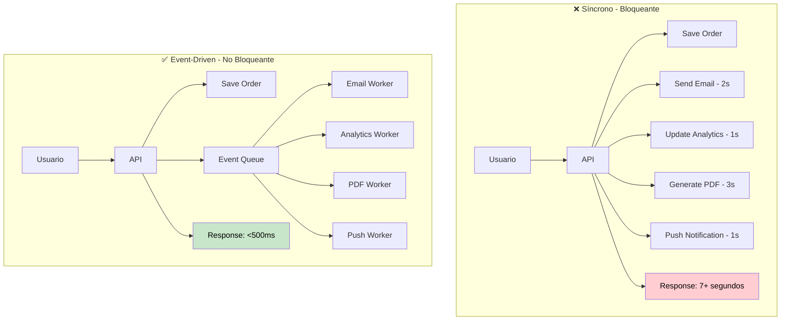

# 📡 Event-Driven Architecture con BullMQ

Guía completa para implementar arquitectura orientada a eventos usando BullMQ, Redis y NestJS para comunicación asíncrona escalable entre microservicios.

## 🎯 ¿Por qué Event-Driven Architecture?

En ecommerce, muchas operaciones son **inherentemente asíncronas**:

- **📧 Enviar emails** - No debe bloquear el checkout
- **📊 Actualizar analytics** - Procesar fuera de línea
- **🎁 Procesar recomendaciones** - Machine learning pesado
- **📱 Push notifications** - Envío en batch
- **🧾 Generar facturas** - PDFs y contabilidad

### Beneficios Clave

- **⚡ Response time mejorado** - Las APIs no esperan por operaciones lentas
- **🔄 Resilience** - Los eventos se reintentan automáticamente
- **📈 Scalability** - Workers pueden escalar independientemente
- **🛡️ Fault tolerance** - Un servicio caído no afecta a otros
- **📊 Observability** - Tracking completo de eventos

### Flujo Event-Driven vs Síncrono



## 🏗️ Arquitectura de Eventos

### Componentes Principales

```typescript
// apps/shared/src/events/event-bus.module.ts
import { Module, Global } from "@nestjs/common";
import { BullModule } from "@nestjs/bull";
import { ConfigModule, ConfigService } from "@nestjs/config";

@Global()
@Module({
  imports: [
    BullModule.forRootAsync({
      imports: [ConfigModule],
      useFactory: (configService: ConfigService) => ({
        redis: {
          host: configService.get("REDIS_HOST"),
          port: configService.get("REDIS_PORT"),
          password: configService.get("REDIS_PASSWORD"),
          retryDelayOnFailover: 100,
          maxRetriesPerRequest: 3,
          lazyConnect: true,
        },
        defaultJobOptions: {
          removeOnComplete: 100, // Mantener últimos 100 jobs completados
          removeOnFail: 50, // Mantener últimos 50 jobs fallidos
          attempts: 3, // Reintentar 3 veces
          backoff: {
            type: "exponential",
            delay: 2000, // Empezar con 2 segundos
          },
        },
      }),
      inject: [ConfigService],
    }),

    // Registrar todas las queues
    BullModule.registerQueue(
      { name: "email" },
      { name: "analytics" },
      { name: "invoices" },
      { name: "notifications" },
      { name: "inventory" },
      { name: "recommendations" }
    ),
  ],
  exports: [BullModule],
})
export class EventBusModule {}
```

### Event Registry - Tipos de Eventos

```typescript
// apps/shared/src/events/event-types.ts
export enum EventType {
  // User Events
  USER_REGISTERED = "user.registered",
  USER_EMAIL_VERIFIED = "user.email.verified",
  USER_PASSWORD_RESET = "user.password.reset",

  // Order Events
  ORDER_CREATED = "order.created",
  ORDER_PAID = "order.paid",
  ORDER_SHIPPED = "order.shipped",
  ORDER_DELIVERED = "order.delivered",
  ORDER_CANCELLED = "order.cancelled",

  // Payment Events
  PAYMENT_PROCESSED = "payment.processed",
  PAYMENT_FAILED = "payment.failed",
  PAYMENT_REFUNDED = "payment.refunded",

  // Product Events
  PRODUCT_CREATED = "product.created",
  PRODUCT_UPDATED = "product.updated",
  PRODUCT_OUT_OF_STOCK = "product.out_of_stock",
  PRODUCT_BACK_IN_STOCK = "product.back_in_stock",

  // Inventory Events
  INVENTORY_RESERVED = "inventory.reserved",
  INVENTORY_RELEASED = "inventory.released",
  INVENTORY_UPDATED = "inventory.updated",
}

// Base Event Interface
export interface BaseEvent {
  id: string;
  type: EventType;
  timestamp: Date;
  userId?: string;
  correlationId?: string;
  metadata?: Record<string, any>;
}

// Specific Event Interfaces
export interface OrderCreatedEvent extends BaseEvent {
  type: EventType.ORDER_CREATED;
  payload: {
    orderId: string;
    userId: string;
    items: Array<{
      productId: string;
      quantity: number;
      price: number;
    }>;
    totalAmount: number;
    currency: string;
    shippingAddress: Address;
    billingAddress: Address;
  };
}

export interface PaymentProcessedEvent extends BaseEvent {
  type: EventType.PAYMENT_PROCESSED;
  payload: {
    orderId: string;
    paymentId: string;
    amount: number;
    currency: string;
    paymentMethod: string;
    provider: "stripe" | "paypal";
  };
}

export interface UserRegisteredEvent extends BaseEvent {
  type: EventType.USER_REGISTERED;
  payload: {
    userId: string;
    email: string;
    firstName: string;
    lastName: string;
    registrationDate: Date;
    source: "web" | "mobile" | "admin";
  };
}
```

## 🚀 Event Publisher Service

### Event Publisher Centralizado

```typescript
// apps/shared/src/events/event-publisher.service.ts
import { Injectable, Logger } from "@nestjs/common";
import { InjectQueue } from "@nestjs/bull";
import { Queue } from "bull";
import { v4 as uuidv4 } from "uuid";

import { BaseEvent, EventType } from "./event-types";

@Injectable()
export class EventPublisherService {
  private readonly logger = new Logger(EventPublisherService.name);

  constructor(
    @InjectQueue("email") private emailQueue: Queue,
    @InjectQueue("analytics") private analyticsQueue: Queue,
    @InjectQueue("invoices") private invoicesQueue: Queue,
    @InjectQueue("notifications") private notificationsQueue: Queue,
    @InjectQueue("inventory") private inventoryQueue: Queue,
    @InjectQueue("recommendations") private recommendationsQueue: Queue
  ) {}

  async publish<T extends BaseEvent>(
    event: Omit<T, "id" | "timestamp">
  ): Promise<void> {
    const enrichedEvent: T = {
      ...event,
      id: uuidv4(),
      timestamp: new Date(),
    } as T;

    try {
      // Determinar queue(s) según tipo de evento
      const queues = this.getQueuesForEvent(enrichedEvent.type);

      // Publicar a múltiples queues si es necesario
      const promises = queues.map((queue) =>
        this.publishToQueue(queue, enrichedEvent)
      );
      await Promise.all(promises);

      this.logger.log(
        `Event published: ${enrichedEvent.type} (${enrichedEvent.id}) to ${queues.length} queue(s)`
      );
    } catch (error) {
      this.logger.error(
        `Failed to publish event: ${enrichedEvent.type} (${enrichedEvent.id})`,
        error.stack
      );
      throw error;
    }
  }

  private getQueuesForEvent(eventType: EventType): Queue[] {
    const queueMap: Record<EventType, Queue[]> = {
      // User events
      [EventType.USER_REGISTERED]: [this.emailQueue, this.analyticsQueue],
      [EventType.USER_EMAIL_VERIFIED]: [this.analyticsQueue],
      [EventType.USER_PASSWORD_RESET]: [this.emailQueue],

      // Order events
      [EventType.ORDER_CREATED]: [
        this.emailQueue,
        this.analyticsQueue,
        this.inventoryQueue,
        this.recommendationsQueue,
      ],
      [EventType.ORDER_PAID]: [
        this.emailQueue,
        this.invoicesQueue,
        this.analyticsQueue,
        this.notificationsQueue,
      ],
      [EventType.ORDER_SHIPPED]: [this.emailQueue, this.notificationsQueue],
      [EventType.ORDER_DELIVERED]: [this.emailQueue, this.analyticsQueue],
      [EventType.ORDER_CANCELLED]: [
        this.emailQueue,
        this.inventoryQueue,
        this.analyticsQueue,
      ],

      // Payment events
      [EventType.PAYMENT_PROCESSED]: [this.analyticsQueue, this.invoicesQueue],
      [EventType.PAYMENT_FAILED]: [this.emailQueue, this.analyticsQueue],
      [EventType.PAYMENT_REFUNDED]: [this.emailQueue, this.analyticsQueue],

      // Product events
      [EventType.PRODUCT_CREATED]: [
        this.analyticsQueue,
        this.recommendationsQueue,
      ],
      [EventType.PRODUCT_UPDATED]: [this.recommendationsQueue],
      [EventType.PRODUCT_OUT_OF_STOCK]: [
        this.notificationsQueue,
        this.analyticsQueue,
      ],
      [EventType.PRODUCT_BACK_IN_STOCK]: [
        this.emailQueue,
        this.notificationsQueue,
      ],

      // Inventory events
      [EventType.INVENTORY_RESERVED]: [this.analyticsQueue],
      [EventType.INVENTORY_RELEASED]: [this.analyticsQueue],
      [EventType.INVENTORY_UPDATED]: [
        this.analyticsQueue,
        this.recommendationsQueue,
      ],
    };

    return queueMap[eventType] || [];
  }

  private async publishToQueue(queue: Queue, event: BaseEvent): Promise<void> {
    const jobOptions = {
      priority: this.getEventPriority(event.type),
      delay: this.getEventDelay(event.type),
      attempts: this.getEventRetries(event.type),
    };

    await queue.add(event.type, event, jobOptions);
  }

  private getEventPriority(eventType: EventType): number {
    // Prioridades: más alto = más importante
    const priorityMap: Partial<Record<EventType, number>> = {
      [EventType.PAYMENT_PROCESSED]: 10, // Crítico
      [EventType.PAYMENT_FAILED]: 10, // Crítico
      [EventType.ORDER_CREATED]: 8, // Alto
      [EventType.ORDER_PAID]: 8, // Alto
      [EventType.USER_REGISTERED]: 6, // Medio
      [EventType.PRODUCT_OUT_OF_STOCK]: 6, // Medio
      [EventType.ORDER_SHIPPED]: 4, // Bajo
      [EventType.ANALYTICS]: 2, // Muy bajo
    };

    return priorityMap[eventType] || 5; // Default: medio
  }

  private getEventDelay(eventType: EventType): number {
    // Delays en milisegundos
    const delayMap: Partial<Record<EventType, number>> = {
      [EventType.USER_REGISTERED]: 5000, // 5 segundos para email de bienvenida
      [EventType.ORDER_CREATED]: 0, // Inmediato
      [EventType.PAYMENT_PROCESSED]: 0, // Inmediato
      [EventType.ANALYTICS]: 30000, // 30 segundos para analytics
    };

    return delayMap[eventType] || 0; // Default: inmediato
  }

  private getEventRetries(eventType: EventType): number {
    // Número de reintentos según criticidad
    const retriesMap: Partial<Record<EventType, number>> = {
      [EventType.PAYMENT_PROCESSED]: 5, // Crítico
      [EventType.PAYMENT_FAILED]: 5, // Crítico
      [EventType.ORDER_CREATED]: 3, // Alto
      [EventType.USER_REGISTERED]: 3, // Alto
      [EventType.ANALYTICS]: 1, // Bajo
    };

    return retriesMap[eventType] || 3; // Default: 3 reintentos
  }
}
```

## 📧 Event Processors (Workers)

### Email Worker

```typescript
// apps/notification-service/src/workers/email.processor.ts
import {
  Processor,
  Process,
  OnQueueActive,
  OnQueueCompleted,
  OnQueueFailed,
} from "@nestjs/bull";
import { Logger } from "@nestjs/common";
import { Job } from "bull";

import {
  EventType,
  OrderCreatedEvent,
  UserRegisteredEvent,
  PaymentProcessedEvent,
} from "@ecommerce/shared";
import { EmailService } from "../services/email.service";

@Processor("email")
export class EmailProcessor {
  private readonly logger = new Logger(EmailProcessor.name);

  constructor(private emailService: EmailService) {}

  @Process(EventType.USER_REGISTERED)
  async handleUserRegistered(job: Job<UserRegisteredEvent>) {
    const { payload } = job.data;

    try {
      await this.emailService.sendWelcomeEmail({
        to: payload.email,
        firstName: payload.firstName,
        registrationDate: payload.registrationDate,
      });

      this.logger.log(`Welcome email sent to ${payload.email}`);
    } catch (error) {
      this.logger.error(
        `Failed to send welcome email to ${payload.email}`,
        error.stack
      );
      throw error; // Re-throw para que BullMQ maneje el retry
    }
  }

  @Process(EventType.ORDER_CREATED)
  async handleOrderCreated(job: Job<OrderCreatedEvent>) {
    const { payload } = job.data;

    try {
      await this.emailService.sendOrderConfirmationEmail({
        to: payload.userId, // Se resuelve el email internamente
        orderId: payload.orderId,
        items: payload.items,
        totalAmount: payload.totalAmount,
        shippingAddress: payload.shippingAddress,
      });

      this.logger.log(
        `Order confirmation email sent for order ${payload.orderId}`
      );
    } catch (error) {
      this.logger.error(
        `Failed to send order confirmation for ${payload.orderId}`,
        error.stack
      );
      throw error;
    }
  }

  @Process(EventType.PAYMENT_PROCESSED)
  async handlePaymentProcessed(job: Job<PaymentProcessedEvent>) {
    const { payload } = job.data;

    try {
      await this.emailService.sendPaymentConfirmationEmail({
        orderId: payload.orderId,
        paymentId: payload.paymentId,
        amount: payload.amount,
        currency: payload.currency,
        paymentMethod: payload.paymentMethod,
      });

      this.logger.log(
        `Payment confirmation email sent for order ${payload.orderId}`
      );
    } catch (error) {
      this.logger.error(
        `Failed to send payment confirmation for ${payload.orderId}`,
        error.stack
      );
      throw error;
    }
  }

  @Process(EventType.ORDER_SHIPPED)
  async handleOrderShipped(job: Job) {
    const { payload } = job.data;

    try {
      await this.emailService.sendShippingNotificationEmail({
        orderId: payload.orderId,
        trackingNumber: payload.trackingNumber,
        estimatedDelivery: payload.estimatedDelivery,
      });

      this.logger.log(
        `Shipping notification sent for order ${payload.orderId}`
      );
    } catch (error) {
      this.logger.error(
        `Failed to send shipping notification for ${payload.orderId}`,
        error.stack
      );
      throw error;
    }
  }

  // Event listeners para logging y monitoreo
  @OnQueueActive()
  onActive(job: Job) {
    this.logger.debug(`Processing email job ${job.id} of type ${job.name}`);
  }

  @OnQueueCompleted()
  onCompleted(job: Job, result: any) {
    this.logger.log(`Email job ${job.id} completed successfully`);
  }

  @OnQueueFailed()
  onFailed(job: Job, err: Error) {
    this.logger.error(`Email job ${job.id} failed: ${err.message}`, err.stack);
  }
}
```

### Analytics Worker

```typescript
// apps/analytics-service/src/workers/analytics.processor.ts
import { Processor, Process } from "@nestjs/bull";
import { Logger } from "@nestjs/common";
import { Job } from "bull";
import { InjectRepository } from "@nestjs/typeorm";
import { Repository } from "typeorm";

import {
  EventType,
  OrderCreatedEvent,
  UserRegisteredEvent,
} from "@ecommerce/shared";
import { UserAnalytics } from "../entities/user-analytics.entity";
import { OrderAnalytics } from "../entities/order-analytics.entity";
import { ProductAnalytics } from "../entities/product-analytics.entity";

@Processor("analytics")
export class AnalyticsProcessor {
  private readonly logger = new Logger(AnalyticsProcessor.name);

  constructor(
    @InjectRepository(UserAnalytics)
    private userAnalyticsRepository: Repository<UserAnalytics>,
    @InjectRepository(OrderAnalytics)
    private orderAnalyticsRepository: Repository<OrderAnalytics>,
    @InjectRepository(ProductAnalytics)
    private productAnalyticsRepository: Repository<ProductAnalytics>
  ) {}

  @Process(EventType.USER_REGISTERED)
  async handleUserRegistered(job: Job<UserRegisteredEvent>) {
    const { payload, timestamp } = job.data;

    try {
      // Crear registro de analytics de usuario
      const userAnalytics = this.userAnalyticsRepository.create({
        userId: payload.userId,
        email: payload.email,
        registrationDate: payload.registrationDate,
        registrationSource: payload.source,
        eventTimestamp: timestamp,
      });

      await this.userAnalyticsRepository.save(userAnalytics);

      // Actualizar métricas agregadas
      await this.updateDailyUserRegistrations(payload.registrationDate);

      this.logger.log(`User analytics recorded for user ${payload.userId}`);
    } catch (error) {
      this.logger.error(
        `Failed to record user analytics for ${payload.userId}`,
        error.stack
      );
      throw error;
    }
  }

  @Process(EventType.ORDER_CREATED)
  async handleOrderCreated(job: Job<OrderCreatedEvent>) {
    const { payload, timestamp } = job.data;

    try {
      // Crear registro de analytics de orden
      const orderAnalytics = this.orderAnalyticsRepository.create({
        orderId: payload.orderId,
        userId: payload.userId,
        totalAmount: payload.totalAmount,
        currency: payload.currency,
        itemCount: payload.items.length,
        orderDate: timestamp,
      });

      await this.orderAnalyticsRepository.save(orderAnalytics);

      // Actualizar analytics de productos
      for (const item of payload.items) {
        await this.updateProductAnalytics(
          item.productId,
          item.quantity,
          item.price
        );
      }

      // Actualizar métricas de revenue diario
      await this.updateDailyRevenue(timestamp, payload.totalAmount);

      this.logger.log(`Order analytics recorded for order ${payload.orderId}`);
    } catch (error) {
      this.logger.error(
        `Failed to record order analytics for ${payload.orderId}`,
        error.stack
      );
      throw error;
    }
  }

  @Process(EventType.PAYMENT_PROCESSED)
  async handlePaymentProcessed(job: Job) {
    const { payload, timestamp } = job.data;

    try {
      // Actualizar estado de pago en analytics
      await this.orderAnalyticsRepository.update(
        { orderId: payload.orderId },
        {
          paymentStatus: "paid",
          paymentDate: timestamp,
          paymentMethod: payload.paymentMethod,
          paymentProvider: payload.provider,
        }
      );

      this.logger.log(`Payment analytics updated for order ${payload.orderId}`);
    } catch (error) {
      this.logger.error(
        `Failed to update payment analytics for ${payload.orderId}`,
        error.stack
      );
      throw error;
    }
  }

  private async updateDailyUserRegistrations(date: Date) {
    // Implementar lógica de agregación diaria
    const dateKey = date.toISOString().split("T")[0];

    // Usar UPSERT para incrementar contador
    await this.userAnalyticsRepository.query(
      `
      INSERT INTO daily_user_registrations (date, count) 
      VALUES ($1, 1) 
      ON CONFLICT (date) 
      DO UPDATE SET count = daily_user_registrations.count + 1
    `,
      [dateKey]
    );
  }

  private async updateProductAnalytics(
    productId: string,
    quantity: number,
    price: number
  ) {
    // Actualizar métricas de producto
    await this.productAnalyticsRepository.query(
      `
      INSERT INTO product_analytics (product_id, total_sold, total_revenue, last_sale_date) 
      VALUES ($1, $2, $3, NOW()) 
      ON CONFLICT (product_id) 
      DO UPDATE SET 
        total_sold = product_analytics.total_sold + $2,
        total_revenue = product_analytics.total_revenue + $3,
        last_sale_date = NOW()
    `,
      [productId, quantity, price * quantity]
    );
  }

  private async updateDailyRevenue(date: Date, amount: number) {
    const dateKey = date.toISOString().split("T")[0];

    await this.orderAnalyticsRepository.query(
      `
      INSERT INTO daily_revenue (date, total_amount) 
      VALUES ($1, $2) 
      ON CONFLICT (date) 
      DO UPDATE SET total_amount = daily_revenue.total_amount + $2
    `,
      [dateKey, amount]
    );
  }
}
```

### Inventory Worker

```typescript
// apps/inventory-service/src/workers/inventory.processor.ts
import { Processor, Process } from "@nestjs/bull";
import { Logger } from "@nestjs/common";
import { Job } from "bull";
import { InjectRepository } from "@nestjs/typeorm";
import { Repository } from "typeorm";

import {
  EventType,
  OrderCreatedEvent,
  OrderCancelledEvent,
} from "@ecommerce/shared";
import { Inventory } from "../entities/inventory.entity";
import { InventoryReservation } from "../entities/inventory-reservation.entity";
import { EventPublisherService } from "@ecommerce/shared";

@Processor("inventory")
export class InventoryProcessor {
  private readonly logger = new Logger(InventoryProcessor.name);

  constructor(
    @InjectRepository(Inventory)
    private inventoryRepository: Repository<Inventory>,
    @InjectRepository(InventoryReservation)
    private reservationRepository: Repository<InventoryReservation>,
    private eventPublisher: EventPublisherService
  ) {}

  @Process(EventType.ORDER_CREATED)
  async handleOrderCreated(job: Job<OrderCreatedEvent>) {
    const { payload } = job.data;

    try {
      // Reservar inventario para cada item
      for (const item of payload.items) {
        await this.reserveInventory(
          payload.orderId,
          item.productId,
          item.quantity
        );
      }

      this.logger.log(`Inventory reserved for order ${payload.orderId}`);
    } catch (error) {
      this.logger.error(
        `Failed to reserve inventory for order ${payload.orderId}`,
        error.stack
      );

      // Si falla, liberar reservas parciales
      await this.releaseOrderReservations(payload.orderId);
      throw error;
    }
  }

  @Process(EventType.ORDER_CANCELLED)
  async handleOrderCancelled(job: Job<OrderCancelledEvent>) {
    const { payload } = job.data;

    try {
      await this.releaseOrderReservations(payload.orderId);
      this.logger.log(
        `Inventory released for cancelled order ${payload.orderId}`
      );
    } catch (error) {
      this.logger.error(
        `Failed to release inventory for order ${payload.orderId}`,
        error.stack
      );
      throw error;
    }
  }

  @Process(EventType.PAYMENT_PROCESSED)
  async handlePaymentProcessed(job: Job) {
    const { payload } = job.data;

    try {
      // Confirmar reservas (convertir a stock vendido)
      await this.confirmOrderReservations(payload.orderId);
      this.logger.log(`Inventory confirmed for paid order ${payload.orderId}`);
    } catch (error) {
      this.logger.error(
        `Failed to confirm inventory for order ${payload.orderId}`,
        error.stack
      );
      throw error;
    }
  }

  private async reserveInventory(
    orderId: string,
    productId: string,
    quantity: number
  ) {
    // Usar transacción para atomicidad
    await this.inventoryRepository.manager.transaction(async (manager) => {
      // Verificar stock disponible
      const inventory = await manager.findOne(Inventory, {
        where: { productId },
        lock: { mode: "pessimistic_write" }, // Lock para evitar race conditions
      });

      if (!inventory || inventory.availableQuantity < quantity) {
        throw new Error(`Insufficient stock for product ${productId}`);
      }

      // Reducir stock disponible
      inventory.availableQuantity -= quantity;
      inventory.reservedQuantity += quantity;
      await manager.save(inventory);

      // Crear reserva
      const reservation = manager.create(InventoryReservation, {
        orderId,
        productId,
        quantity,
        reservedAt: new Date(),
        status: "active",
      });

      await manager.save(reservation);

      // Publicar evento si el producto se queda sin stock
      if (inventory.availableQuantity === 0) {
        await this.eventPublisher.publish({
          type: EventType.PRODUCT_OUT_OF_STOCK,
          payload: { productId },
        });
      }
    });
  }

  private async releaseOrderReservations(orderId: string) {
    await this.inventoryRepository.manager.transaction(async (manager) => {
      const reservations = await manager.find(InventoryReservation, {
        where: { orderId, status: "active" },
      });

      for (const reservation of reservations) {
        // Restaurar stock
        const inventory = await manager.findOne(Inventory, {
          where: { productId: reservation.productId },
          lock: { mode: "pessimistic_write" },
        });

        if (inventory) {
          const wasOutOfStock = inventory.availableQuantity === 0;

          inventory.availableQuantity += reservation.quantity;
          inventory.reservedQuantity -= reservation.quantity;
          await manager.save(inventory);

          // Si vuelve a tener stock, publicar evento
          if (wasOutOfStock && inventory.availableQuantity > 0) {
            await this.eventPublisher.publish({
              type: EventType.PRODUCT_BACK_IN_STOCK,
              payload: { productId: reservation.productId },
            });
          }
        }

        // Marcar reserva como liberada
        reservation.status = "released";
        reservation.releasedAt = new Date();
        await manager.save(reservation);
      }
    });
  }

  private async confirmOrderReservations(orderId: string) {
    await this.reservationRepository.update(
      { orderId, status: "active" },
      { status: "confirmed", confirmedAt: new Date() }
    );
  }
}
```

## 🔄 Usando Events en los Servicios

### En el Orders Service

```typescript
// apps/orders-service/src/orders/orders.service.ts
import { Injectable } from "@nestjs/common";
import { InjectRepository } from "@nestjs/typeorm";
import { Repository } from "typeorm";

import { Order } from "./entities/order.entity";
import { CreateOrderDto } from "./dto/create-order.dto";
import { EventPublisherService, EventType } from "@ecommerce/shared";

@Injectable()
export class OrdersService {
  constructor(
    @InjectRepository(Order)
    private ordersRepository: Repository<Order>,
    private eventPublisher: EventPublisherService
  ) {}

  async createOrder(
    createOrderDto: CreateOrderDto,
    userId: string
  ): Promise<Order> {
    // 1. Crear la orden
    const order = this.ordersRepository.create({
      ...createOrderDto,
      userId,
      status: "pending",
      createdAt: new Date(),
    });

    const savedOrder = await this.ordersRepository.save(order);

    // 2. Publicar evento de orden creada
    await this.eventPublisher.publish({
      type: EventType.ORDER_CREATED,
      userId,
      correlationId: savedOrder.id,
      payload: {
        orderId: savedOrder.id,
        userId,
        items: savedOrder.items,
        totalAmount: savedOrder.totalAmount,
        currency: savedOrder.currency,
        shippingAddress: savedOrder.shippingAddress,
        billingAddress: savedOrder.billingAddress,
      },
    });

    return savedOrder;
  }

  async markOrderAsPaid(orderId: string, paymentId: string): Promise<Order> {
    const order = await this.ordersRepository.findOne({
      where: { id: orderId },
    });

    if (!order) {
      throw new Error("Order not found");
    }

    // Actualizar orden
    order.status = "paid";
    order.paymentId = paymentId;
    order.paidAt = new Date();

    const updatedOrder = await this.ordersRepository.save(order);

    // Publicar evento de pago procesado
    await this.eventPublisher.publish({
      type: EventType.PAYMENT_PROCESSED,
      userId: order.userId,
      correlationId: orderId,
      payload: {
        orderId: order.id,
        paymentId,
        amount: order.totalAmount,
        currency: order.currency,
        paymentMethod: order.paymentMethod,
        provider: "stripe", // o el provider usado
      },
    });

    return updatedOrder;
  }

  async cancelOrder(orderId: string, reason: string): Promise<Order> {
    const order = await this.ordersRepository.findOne({
      where: { id: orderId },
    });

    if (!order) {
      throw new Error("Order not found");
    }

    // Actualizar orden
    order.status = "cancelled";
    order.cancellationReason = reason;
    order.cancelledAt = new Date();

    const updatedOrder = await this.ordersRepository.save(order);

    // Publicar evento de orden cancelada
    await this.eventPublisher.publish({
      type: EventType.ORDER_CANCELLED,
      userId: order.userId,
      correlationId: orderId,
      payload: {
        orderId: order.id,
        reason,
        items: order.items,
      },
    });

    return updatedOrder;
  }
}
```

## 📊 Monitoreo y Observabilidad

### Bull Dashboard Integration

```typescript
// apps/api-gateway/src/monitoring/bull-dashboard.module.ts
import { Module } from "@nestjs/common";
import { BullModule } from "@nestjs/bull";
import { createBullBoard } from "@bull-board/api";
import { BullAdapter } from "@bull-board/api/bullAdapter";
import { ExpressAdapter } from "@bull-board/express";
import { Queue } from "bull";

@Module({})
export class BullDashboardModule {
  constructor() {
    this.setupDashboard();
  }

  private async setupDashboard() {
    // Obtener todas las queues
    const emailQueue = BullModule.getQueue("email") as Queue;
    const analyticsQueue = BullModule.getQueue("analytics") as Queue;
    const invoicesQueue = BullModule.getQueue("invoices") as Queue;
    const notificationsQueue = BullModule.getQueue("notifications") as Queue;

    // Configurar Bull Board
    const serverAdapter = new ExpressAdapter();
    serverAdapter.setBasePath("/admin/queues");

    createBullBoard({
      queues: [
        new BullAdapter(emailQueue),
        new BullAdapter(analyticsQueue),
        new BullAdapter(invoicesQueue),
        new BullAdapter(notificationsQueue),
      ],
      serverAdapter,
    });

    console.log("📊 Bull Dashboard available at /admin/queues");
  }
}
```

### Métricas Prometheus

```typescript
// apps/shared/src/metrics/queue-metrics.service.ts
import { Injectable } from "@nestjs/common";
import { InjectQueue } from "@nestjs/bull";
import { Queue } from "bull";
import * as client from "prom-client";

@Injectable()
export class QueueMetricsService {
  private jobsProcessedTotal: client.Counter<string>;
  private jobsFailedTotal: client.Counter<string>;
  private jobDurationHistogram: client.Histogram<string>;
  private queueSizeGauge: client.Gauge<string>;

  constructor(
    @InjectQueue("email") private emailQueue: Queue,
    @InjectQueue("analytics") private analyticsQueue: Queue,
    @InjectQueue("invoices") private invoicesQueue: Queue,
    @InjectQueue("notifications") private notificationsQueue: Queue
  ) {
    this.initializeMetrics();
    this.startMetricsCollection();
  }

  private initializeMetrics() {
    this.jobsProcessedTotal = new client.Counter({
      name: "queue_jobs_processed_total",
      help: "Total number of jobs processed",
      labelNames: ["queue", "job_type", "status"],
    });

    this.jobsFailedTotal = new client.Counter({
      name: "queue_jobs_failed_total",
      help: "Total number of jobs failed",
      labelNames: ["queue", "job_type", "error"],
    });

    this.jobDurationHistogram = new client.Histogram({
      name: "queue_job_duration_seconds",
      help: "Job processing duration in seconds",
      labelNames: ["queue", "job_type"],
      buckets: [0.1, 0.5, 1, 2, 5, 10, 30, 60],
    });

    this.queueSizeGauge = new client.Gauge({
      name: "queue_size",
      help: "Current number of jobs in queue",
      labelNames: ["queue", "status"],
    });
  }

  private startMetricsCollection() {
    // Recolectar métricas cada 30 segundos
    setInterval(async () => {
      await this.collectQueueMetrics();
    }, 30000);
  }

  private async collectQueueMetrics() {
    const queues = [
      { name: "email", queue: this.emailQueue },
      { name: "analytics", queue: this.analyticsQueue },
      { name: "invoices", queue: this.invoicesQueue },
      { name: "notifications", queue: this.notificationsQueue },
    ];

    for (const { name, queue } of queues) {
      try {
        const waiting = await queue.getWaiting();
        const active = await queue.getActive();
        const completed = await queue.getCompleted();
        const failed = await queue.getFailed();

        this.queueSizeGauge.set(
          { queue: name, status: "waiting" },
          waiting.length
        );
        this.queueSizeGauge.set(
          { queue: name, status: "active" },
          active.length
        );
        this.queueSizeGauge.set(
          { queue: name, status: "completed" },
          completed.length
        );
        this.queueSizeGauge.set(
          { queue: name, status: "failed" },
          failed.length
        );
      } catch (error) {
        console.error(`Error collecting metrics for queue ${name}:`, error);
      }
    }
  }

  // Métodos para registrar eventos
  recordJobProcessed(
    queue: string,
    jobType: string,
    status: "completed" | "failed"
  ) {
    this.jobsProcessedTotal.inc({ queue, job_type: jobType, status });
  }

  recordJobFailed(queue: string, jobType: string, error: string) {
    this.jobsFailedTotal.inc({ queue, job_type: jobType, error });
  }

  recordJobDuration(queue: string, jobType: string, durationSeconds: number) {
    this.jobDurationHistogram.observe(
      { queue, job_type: jobType },
      durationSeconds
    );
  }
}
```

## 🎯 Checklist de Implementación

### ✅ Setup Base

- [ ] Configurar BullMQ con Redis
- [ ] Definir tipos de eventos y interfaces
- [ ] Implementar EventPublisherService
- [ ] Configurar queues por dominio

### ✅ Event Processors

- [ ] Email processor para notificaciones
- [ ] Analytics processor para métricas
- [ ] Inventory processor para stock
- [ ] Notification processor para push/SMS

### ✅ Service Integration

- [ ] Integrar eventos en OrdersService
- [ ] Integrar eventos en AuthService
- [ ] Integrar eventos en PaymentsService
- [ ] Manejo de errores y compensaciones

### ✅ Monitoreo

- [ ] Bull Dashboard para debugging
- [ ] Métricas Prometheus
- [ ] Alertas por fallos en workers
- [ ] Logs estructurados de eventos

---

**🎯 Próximo paso**: Implementa [Resilience Patterns](./resilience-patterns.md) para manejar fallos entre servicios.
