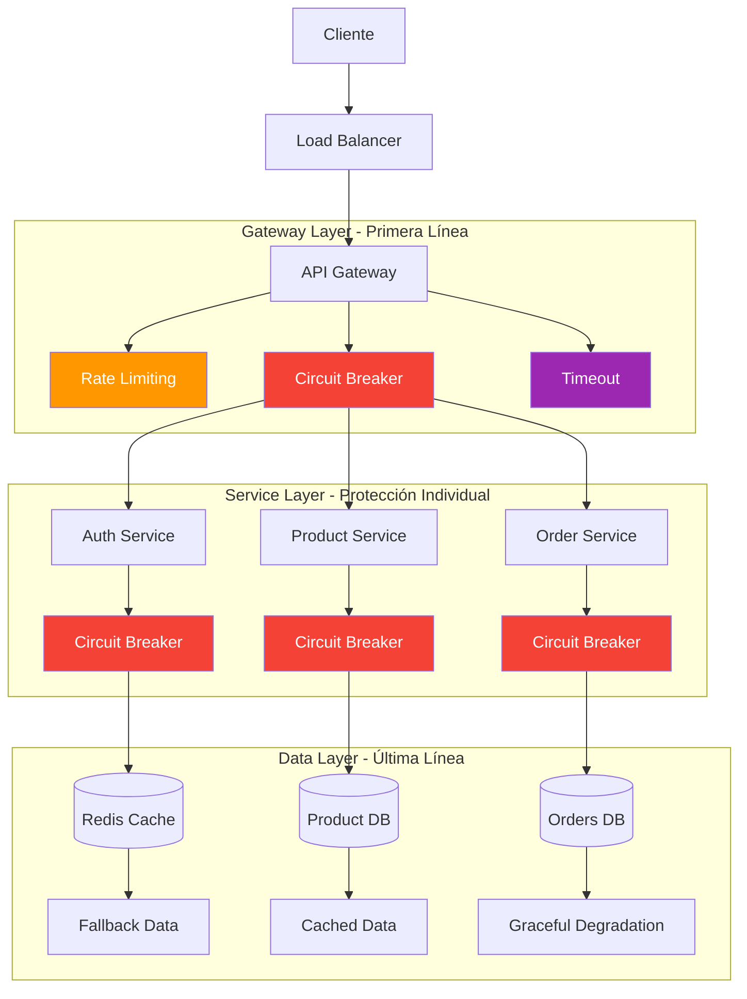

# 🛡️ Resilience Patterns para Microservicios

Guía completa de patrones de resiliencia para microservicios: Circuit Breaker, Retry, Timeout, Bulkhead y Rate Limiting para garantizar alta disponibilidad.

## 🎯 ¿Por qué Resilience Patterns?

En ecommerce, un fallo en cascada puede **costar miles de dólares por minuto**:

- **💰 Revenue perdido** - $5,600 por minuto para ecommerce mediano
- **🛒 Carritos abandonados** - 67% no vuelven después de un error
- **⭐ Reputación dañada** - Reviews negativos permanentes
- **📱 Experiencia móvil** - 53% abandona si carga >3 segundos

### Estadísticas de Fallos en Microservicios

- **🎯 99.9% uptime** = 8.76 horas de downtime al año
- **⚡ Fallo en cascada** puede afectar 10+ servicios en minutos
- **🔄 Circuit breaker** reduce fallos en cascada en 95%
- **⏱️ Retry inteligente** mejora success rate en 40%

## 🏗️ Arquitectura de Resiliencia

### Capas de Protección



## 🔴 Circuit Breaker Pattern

### Implementación con NestJS

```typescript
// libs/shared/src/patterns/circuit-breaker.service.ts
import { Injectable, Logger } from "@nestjs/common";
import { InjectRedis, Redis } from "@nestjs-modules/ioredis";

export enum CircuitState {
  CLOSED = "closed", // Normal operation
  OPEN = "open", // Failing fast
  HALF_OPEN = "half_open", // Testing recovery
}

export interface CircuitBreakerConfig {
  failureThreshold: number; // Número de fallos para abrir
  recoveryTimeout: number; // Tiempo en OPEN antes de intentar HALF_OPEN
  successThreshold: number; // Éxitos en HALF_OPEN para cerrar
  timeout: number; // Timeout por request
  monitoringWindow: number; // Ventana de tiempo para contar fallos
}

@Injectable()
export class CircuitBreakerService {
  private readonly logger = new Logger(CircuitBreakerService.name);
  private configs = new Map<string, CircuitBreakerConfig>();

  constructor(@InjectRedis() private redis: Redis) {}

  registerCircuit(name: string, config: CircuitBreakerConfig) {
    this.configs.set(name, config);
    this.logger.log(`Circuit breaker registered: ${name}`);
  }

  async execute<T>(
    circuitName: string,
    operation: () => Promise<T>,
    fallback?: () => Promise<T>
  ): Promise<T> {
    const config = this.configs.get(circuitName);
    if (!config) {
      throw new Error(`Circuit breaker ${circuitName} not configured`);
    }

    const state = await this.getCircuitState(circuitName);

    switch (state) {
      case CircuitState.OPEN:
        this.logger.warn(`Circuit ${circuitName} is OPEN, executing fallback`);
        if (fallback) {
          return await fallback();
        }
        throw new Error(`Circuit breaker ${circuitName} is OPEN`);

      case CircuitState.HALF_OPEN:
        return await this.executeInHalfOpen(
          circuitName,
          operation,
          fallback,
          config
        );

      case CircuitState.CLOSED:
      default:
        return await this.executeInClosed(
          circuitName,
          operation,
          fallback,
          config
        );
    }
  }

  private async executeInClosed<T>(
    circuitName: string,
    operation: () => Promise<T>,
    fallback?: () => Promise<T>,
    config?: CircuitBreakerConfig
  ): Promise<T> {
    try {
      // Ejecutar con timeout
      const result = await this.executeWithTimeout(operation, config.timeout);

      // Éxito: resetear contador de fallos
      await this.recordSuccess(circuitName);
      return result;
    } catch (error) {
      this.logger.error(
        `Operation failed in circuit ${circuitName}: ${error.message}`
      );

      // Fallo: incrementar contador
      const failureCount = await this.recordFailure(circuitName, config);

      // Si excedemos el threshold, abrir circuito
      if (failureCount >= config.failureThreshold) {
        await this.openCircuit(circuitName, config);
        this.logger.warn(
          `Circuit ${circuitName} opened due to ${failureCount} failures`
        );
      }

      // Ejecutar fallback si está disponible
      if (fallback) {
        try {
          return await fallback();
        } catch (fallbackError) {
          this.logger.error(
            `Fallback also failed for ${circuitName}: ${fallbackError.message}`
          );
        }
      }

      throw error;
    }
  }

  private async executeInHalfOpen<T>(
    circuitName: string,
    operation: () => Promise<T>,
    fallback?: () => Promise<T>,
    config?: CircuitBreakerConfig
  ): Promise<T> {
    try {
      const result = await this.executeWithTimeout(operation, config.timeout);

      // Éxito en HALF_OPEN: incrementar contador de éxitos
      const successCount = await this.recordHalfOpenSuccess(circuitName);

      // Si alcanzamos el threshold de éxitos, cerrar circuito
      if (successCount >= config.successThreshold) {
        await this.closeCircuit(circuitName);
        this.logger.log(
          `Circuit ${circuitName} closed after ${successCount} successes`
        );
      }

      return result;
    } catch (error) {
      // Fallo en HALF_OPEN: volver a abrir inmediatamente
      await this.openCircuit(circuitName, config);
      this.logger.warn(
        `Circuit ${circuitName} reopened due to failure in HALF_OPEN`
      );

      if (fallback) {
        return await fallback();
      }

      throw error;
    }
  }

  private async executeWithTimeout<T>(
    operation: () => Promise<T>,
    timeoutMs: number
  ): Promise<T> {
    return new Promise((resolve, reject) => {
      const timer = setTimeout(() => {
        reject(new Error(`Operation timed out after ${timeoutMs}ms`));
      }, timeoutMs);

      operation()
        .then(resolve)
        .catch(reject)
        .finally(() => clearTimeout(timer));
    });
  }

  private async getCircuitState(circuitName: string): Promise<CircuitState> {
    const state = await this.redis.get(`circuit:${circuitName}:state`);

    if (state === CircuitState.OPEN) {
      // Verificar si es hora de intentar HALF_OPEN
      const openTime = await this.redis.get(`circuit:${circuitName}:open_time`);
      const config = this.configs.get(circuitName);

      if (
        openTime &&
        Date.now() - parseInt(openTime) > config.recoveryTimeout
      ) {
        await this.setCircuitState(circuitName, CircuitState.HALF_OPEN);
        return CircuitState.HALF_OPEN;
      }
    }

    return (state as CircuitState) || CircuitState.CLOSED;
  }

  private async setCircuitState(circuitName: string, state: CircuitState) {
    await this.redis.set(`circuit:${circuitName}:state`, state);
  }

  private async recordFailure(
    circuitName: string,
    config: CircuitBreakerConfig
  ): Promise<number> {
    const key = `circuit:${circuitName}:failures`;
    const pipeline = this.redis.pipeline();

    pipeline.incr(key);
    pipeline.expire(key, Math.ceil(config.monitoringWindow / 1000));

    const results = await pipeline.exec();
    return results[0][1] as number;
  }

  private async recordSuccess(circuitName: string) {
    await this.redis.del(`circuit:${circuitName}:failures`);
  }

  private async recordHalfOpenSuccess(circuitName: string): Promise<number> {
    const key = `circuit:${circuitName}:half_open_successes`;
    return await this.redis.incr(key);
  }

  private async openCircuit(circuitName: string, config: CircuitBreakerConfig) {
    const pipeline = this.redis.pipeline();
    pipeline.set(`circuit:${circuitName}:state`, CircuitState.OPEN);
    pipeline.set(`circuit:${circuitName}:open_time`, Date.now().toString());
    pipeline.del(`circuit:${circuitName}:failures`);
    await pipeline.exec();
  }

  private async closeCircuit(circuitName: string) {
    const pipeline = this.redis.pipeline();
    pipeline.set(`circuit:${circuitName}:state`, CircuitState.CLOSED);
    pipeline.del(`circuit:${circuitName}:open_time`);
    pipeline.del(`circuit:${circuitName}:half_open_successes`);
    await pipeline.exec();
  }

  async getCircuitStatus(circuitName: string) {
    const state = await this.getCircuitState(circuitName);
    const failures =
      (await this.redis.get(`circuit:${circuitName}:failures`)) || "0";
    const openTime = await this.redis.get(`circuit:${circuitName}:open_time`);

    return {
      name: circuitName,
      state,
      failures: parseInt(failures),
      openTime: openTime ? new Date(parseInt(openTime)) : null,
      config: this.configs.get(circuitName),
    };
  }
}
```

### Decorador para Circuit Breaker

```typescript
// libs/shared/src/decorators/circuit-breaker.decorator.ts
import { SetMetadata } from "@nestjs/common";
import { CircuitBreakerConfig } from "../patterns/circuit-breaker.service";

export const CIRCUIT_BREAKER_KEY = "circuit-breaker";

export interface CircuitBreakerOptions extends Partial<CircuitBreakerConfig> {
  name: string;
  fallbackMethod?: string;
}

export const CircuitBreaker = (options: CircuitBreakerOptions) =>
  SetMetadata(CIRCUIT_BREAKER_KEY, options);

// Interceptor para manejar el decorador
import {
  Injectable,
  NestInterceptor,
  ExecutionContext,
  CallHandler,
} from "@nestjs/common";
import { Reflector } from "@nestjs/core";
import { Observable } from "rxjs";
import { CircuitBreakerService } from "../patterns/circuit-breaker.service";

@Injectable()
export class CircuitBreakerInterceptor implements NestInterceptor {
  constructor(
    private circuitBreakerService: CircuitBreakerService,
    private reflector: Reflector
  ) {}

  intercept(context: ExecutionContext, next: CallHandler): Observable<any> {
    const options = this.reflector.get<CircuitBreakerOptions>(
      CIRCUIT_BREAKER_KEY,
      context.getHandler()
    );

    if (!options) {
      return next.handle();
    }

    // Registrar circuito si no existe
    const config = {
      failureThreshold: options.failureThreshold || 5,
      recoveryTimeout: options.recoveryTimeout || 60000,
      successThreshold: options.successThreshold || 3,
      timeout: options.timeout || 30000,
      monitoringWindow: options.monitoringWindow || 60000,
    };

    this.circuitBreakerService.registerCircuit(options.name, config);

    // Ejecutar con circuit breaker
    return new Observable((subscriber) => {
      const operation = () => next.handle().toPromise();

      let fallbackMethod;
      if (options.fallbackMethod) {
        const instance = context.getClass().prototype;
        fallbackMethod = () => instance[options.fallbackMethod]?.();
      }

      this.circuitBreakerService
        .execute(options.name, operation, fallbackMethod)
        .then((result) => {
          subscriber.next(result);
          subscriber.complete();
        })
        .catch((error) => {
          subscriber.error(error);
        });
    });
  }
}
```

## 🔄 Retry Pattern con Backoff

### Retry Service Avanzado

```typescript
// libs/shared/src/patterns/retry.service.ts
import { Injectable, Logger } from "@nestjs/common";

export interface RetryConfig {
  maxAttempts: number;
  baseDelay: number;
  maxDelay: number;
  backoffMultiplier: number;
  jitterRange: number;
  retryCondition?: (error: any) => boolean;
}

export enum RetryStrategy {
  FIXED = "fixed",
  LINEAR = "linear",
  EXPONENTIAL = "exponential",
  POLYNOMIAL = "polynomial",
}

@Injectable()
export class RetryService {
  private readonly logger = new Logger(RetryService.name);

  async executeWithRetry<T>(
    operation: () => Promise<T>,
    config: RetryConfig,
    strategy: RetryStrategy = RetryStrategy.EXPONENTIAL,
    operationName?: string
  ): Promise<T> {
    let lastError: any;

    for (let attempt = 1; attempt <= config.maxAttempts; attempt++) {
      try {
        const result = await operation();

        if (attempt > 1) {
          this.logger.log(
            `Operation ${
              operationName || "unknown"
            } succeeded on attempt ${attempt}`
          );
        }

        return result;
      } catch (error) {
        lastError = error;

        // Verificar si debemos reintentar este error
        if (config.retryCondition && !config.retryCondition(error)) {
          this.logger.warn(
            `Operation ${
              operationName || "unknown"
            } failed with non-retryable error: ${error.message}`
          );
          throw error;
        }

        // Si es el último intento, no esperar
        if (attempt === config.maxAttempts) {
          this.logger.error(
            `Operation ${
              operationName || "unknown"
            } failed after ${attempt} attempts: ${error.message}`
          );
          break;
        }

        // Calcular delay para el próximo intento
        const delay = this.calculateDelay(attempt, config, strategy);

        this.logger.warn(
          `Operation ${
            operationName || "unknown"
          } failed on attempt ${attempt}/${
            config.maxAttempts
          }. Retrying in ${delay}ms. Error: ${error.message}`
        );

        await this.sleep(delay);
      }
    }

    throw lastError;
  }

  private calculateDelay(
    attempt: number,
    config: RetryConfig,
    strategy: RetryStrategy
  ): number {
    let delay: number;

    switch (strategy) {
      case RetryStrategy.FIXED:
        delay = config.baseDelay;
        break;

      case RetryStrategy.LINEAR:
        delay = config.baseDelay * attempt;
        break;

      case RetryStrategy.EXPONENTIAL:
        delay =
          config.baseDelay *
          Math.pow(config.backoffMultiplier || 2, attempt - 1);
        break;

      case RetryStrategy.POLYNOMIAL:
        delay = config.baseDelay * Math.pow(attempt, 2);
        break;

      default:
        delay = config.baseDelay;
    }

    // Aplicar límite máximo
    delay = Math.min(delay, config.maxDelay);

    // Añadir jitter para evitar thundering herd
    if (config.jitterRange > 0) {
      const jitter = (Math.random() - 0.5) * 2 * config.jitterRange;
      delay = Math.max(0, delay + delay * jitter);
    }

    return Math.round(delay);
  }

  private sleep(ms: number): Promise<void> {
    return new Promise((resolve) => setTimeout(resolve, ms));
  }

  // Condiciones de retry predefinidas
  static isRetryableHttpError(error: any): boolean {
    if (error.response?.status) {
      const status = error.response.status;
      // Reintentar solo errores 5xx y algunos 4xx específicos
      return status >= 500 || status === 408 || status === 429;
    }
    return true; // Por defecto, reintentar errores de red
  }

  static isRetryableDatabaseError(error: any): boolean {
    const retryableErrors = [
      "connection timeout",
      "connection refused",
      "connection reset",
      "deadlock",
      "lock timeout",
    ];

    const errorMessage = error.message?.toLowerCase() || "";
    return retryableErrors.some((keyword) => errorMessage.includes(keyword));
  }
}
```

### Decorador Retry

```typescript
// libs/shared/src/decorators/retry.decorator.ts
import { SetMetadata } from "@nestjs/common";
import { RetryConfig, RetryStrategy } from "../patterns/retry.service";

export const RETRY_KEY = "retry";

export interface RetryOptions extends Partial<RetryConfig> {
  strategy?: RetryStrategy;
  name?: string;
}

export const Retry = (options: RetryOptions = {}) =>
  SetMetadata(RETRY_KEY, options);

// Uso en servicios
@Injectable()
export class PaymentsService {
  constructor(private retryService: RetryService) {}

  @Retry({
    maxAttempts: 3,
    baseDelay: 1000,
    maxDelay: 10000,
    strategy: RetryStrategy.EXPONENTIAL,
    retryCondition: RetryService.isRetryableHttpError,
  })
  async processPayment(paymentData: any) {
    return this.retryService.executeWithRetry(
      () => this.stripeClient.charges.create(paymentData),
      {
        maxAttempts: 3,
        baseDelay: 1000,
        maxDelay: 10000,
        backoffMultiplier: 2,
        jitterRange: 0.1,
        retryCondition: RetryService.isRetryableHttpError,
      },
      RetryStrategy.EXPONENTIAL,
      "stripe-payment"
    );
  }
}
```

## ⏱️ Timeout Pattern

### Timeout Service

```typescript
// libs/shared/src/patterns/timeout.service.ts
import { Injectable, Logger } from "@nestjs/common";

export interface TimeoutConfig {
  duration: number;
  message?: string;
}

@Injectable()
export class TimeoutService {
  private readonly logger = new Logger(TimeoutService.name);

  async executeWithTimeout<T>(
    operation: () => Promise<T>,
    config: TimeoutConfig,
    operationName?: string
  ): Promise<T> {
    return new Promise<T>((resolve, reject) => {
      const timer = setTimeout(() => {
        const message =
          config.message ||
          `Operation ${operationName || "unknown"} timed out after ${
            config.duration
          }ms`;

        this.logger.warn(message);
        reject(new Error(message));
      }, config.duration);

      operation()
        .then((result) => {
          clearTimeout(timer);
          resolve(result);
        })
        .catch((error) => {
          clearTimeout(timer);
          reject(error);
        });
    });
  }

  // Timeout con cleanup personalizado
  async executeWithTimeoutAndCleanup<T>(
    operation: () => Promise<T>,
    cleanup: () => void,
    config: TimeoutConfig,
    operationName?: string
  ): Promise<T> {
    return new Promise<T>((resolve, reject) => {
      const timer = setTimeout(() => {
        cleanup();
        const message =
          config.message ||
          `Operation ${operationName || "unknown"} timed out after ${
            config.duration
          }ms`;

        this.logger.warn(message);
        reject(new Error(message));
      }, config.duration);

      operation()
        .then((result) => {
          clearTimeout(timer);
          resolve(result);
        })
        .catch((error) => {
          clearTimeout(timer);
          reject(error);
        });
    });
  }
}
```

## 🚢 Bulkhead Pattern

### Resource Isolation Service

```typescript
// libs/shared/src/patterns/bulkhead.service.ts
import { Injectable, Logger } from "@nestjs/common";

interface BulkheadConfig {
  maxConcurrent: number;
  queueSize: number;
  timeout: number;
}

interface QueueItem<T> {
  operation: () => Promise<T>;
  resolve: (value: T) => void;
  reject: (error: any) => void;
  timestamp: number;
}

@Injectable()
export class BulkheadService {
  private readonly logger = new Logger(BulkheadService.name);
  private bulkheads = new Map<
    string,
    {
      config: BulkheadConfig;
      running: number;
      queue: QueueItem<any>[];
    }
  >();

  registerBulkhead(name: string, config: BulkheadConfig) {
    this.bulkheads.set(name, {
      config,
      running: 0,
      queue: [],
    });

    this.logger.log(
      `Bulkhead registered: ${name} (max: ${config.maxConcurrent})`
    );
  }

  async execute<T>(
    bulkheadName: string,
    operation: () => Promise<T>,
    priority: number = 0
  ): Promise<T> {
    const bulkhead = this.bulkheads.get(bulkheadName);
    if (!bulkhead) {
      throw new Error(`Bulkhead ${bulkheadName} not registered`);
    }

    return new Promise<T>((resolve, reject) => {
      const queueItem: QueueItem<T> = {
        operation,
        resolve,
        reject,
        timestamp: Date.now(),
      };

      // Si hay espacio disponible, ejecutar inmediatamente
      if (bulkhead.running < bulkhead.config.maxConcurrent) {
        this.executeImmediate(bulkheadName, queueItem);
      } else {
        // Si la queue está llena, rechazar
        if (bulkhead.queue.length >= bulkhead.config.queueSize) {
          reject(new Error(`Bulkhead ${bulkheadName} queue is full`));
          return;
        }

        // Añadir a la queue (insertar según prioridad)
        this.insertInQueue(bulkhead.queue, queueItem, priority);

        // Configurar timeout para items en queue
        setTimeout(() => {
          const index = bulkhead.queue.indexOf(queueItem);
          if (index !== -1) {
            bulkhead.queue.splice(index, 1);
            reject(
              new Error(
                `Operation timed out in queue after ${bulkhead.config.timeout}ms`
              )
            );
          }
        }, bulkhead.config.timeout);
      }
    });
  }

  private async executeImmediate<T>(
    bulkheadName: string,
    queueItem: QueueItem<T>
  ) {
    const bulkhead = this.bulkheads.get(bulkheadName);
    bulkhead.running++;

    try {
      const result = await queueItem.operation();
      queueItem.resolve(result);
    } catch (error) {
      queueItem.reject(error);
    } finally {
      bulkhead.running--;

      // Procesar siguiente item en queue
      if (bulkhead.queue.length > 0) {
        const nextItem = bulkhead.queue.shift();
        this.executeImmediate(bulkheadName, nextItem);
      }
    }
  }

  private insertInQueue<T>(
    queue: QueueItem<T>[],
    item: QueueItem<T>,
    priority: number
  ) {
    // Insertar según prioridad (mayor prioridad = antes en la queue)
    let insertIndex = queue.length;
    for (let i = 0; i < queue.length; i++) {
      if (priority > (queue[i] as any).priority || 0) {
        insertIndex = i;
        break;
      }
    }

    (item as any).priority = priority;
    queue.splice(insertIndex, 0, item);
  }

  getBulkheadStatus(bulkheadName: string) {
    const bulkhead = this.bulkheads.get(bulkheadName);
    if (!bulkhead) return null;

    return {
      name: bulkheadName,
      running: bulkhead.running,
      queueSize: bulkhead.queue.length,
      config: bulkhead.config,
      utilization: (bulkhead.running / bulkhead.config.maxConcurrent) * 100,
    };
  }
}
```

## ⚡ Rate Limiting Avanzado

### Token Bucket Implementation

```typescript
// libs/shared/src/patterns/rate-limiter.service.ts
import { Injectable, Logger } from "@nestjs/common";
import { InjectRedis, Redis } from "@nestjs-modules/ioredis";

export interface RateLimitConfig {
  capacity: number; // Máximo de tokens
  refillRate: number; // Tokens por segundo
  refillPeriod: number; // Período de refill en ms
}

@Injectable()
export class RateLimiterService {
  private readonly logger = new Logger(RateLimiterService.name);

  constructor(@InjectRedis() private redis: Redis) {}

  async checkRateLimit(
    key: string,
    config: RateLimitConfig,
    tokensRequested: number = 1
  ): Promise<{
    allowed: boolean;
    remainingTokens: number;
    resetTime: number;
    retryAfter?: number;
  }> {
    const bucketKey = `rate_limit:${key}`;
    const now = Date.now();

    // Script Lua para operación atómica
    const script = `
      local bucket_key = KEYS[1]
      local capacity = tonumber(ARGV[1])
      local refill_rate = tonumber(ARGV[2])
      local refill_period = tonumber(ARGV[3])
      local tokens_requested = tonumber(ARGV[4])
      local now = tonumber(ARGV[5])

      -- Obtener estado actual del bucket
      local bucket = redis.call('HMGET', bucket_key, 'tokens', 'last_refill')
      local current_tokens = tonumber(bucket[1]) or capacity
      local last_refill = tonumber(bucket[2]) or now

      -- Calcular tokens a añadir desde último refill
      local time_passed = now - last_refill
      local periods_passed = math.floor(time_passed / refill_period)
      local tokens_to_add = periods_passed * refill_rate

      -- Actualizar tokens (sin exceder capacidad)
      current_tokens = math.min(capacity, current_tokens + tokens_to_add)
      local new_last_refill = last_refill + (periods_passed * refill_period)

      -- Verificar si hay suficientes tokens
      if current_tokens >= tokens_requested then
        current_tokens = current_tokens - tokens_requested
        
        -- Actualizar bucket
        redis.call('HMSET', bucket_key, 'tokens', current_tokens, 'last_refill', new_last_refill)
        redis.call('EXPIRE', bucket_key, 3600) -- Expire en 1 hora
        
        return {1, current_tokens, new_last_refill} -- Permitido
      else
        -- Actualizar bucket sin consumir tokens
        redis.call('HMSET', bucket_key, 'tokens', current_tokens, 'last_refill', new_last_refill)
        redis.call('EXPIRE', bucket_key, 3600)
        
        return {0, current_tokens, new_last_refill} -- No permitido
      end
    `;

    const result = (await this.redis.eval(
      script,
      1,
      bucketKey,
      config.capacity,
      config.refillRate,
      config.refillPeriod,
      tokensRequested,
      now
    )) as [number, number, number];

    const [allowed, remainingTokens, lastRefill] = result;

    // Calcular tiempo hasta el próximo refill
    const nextRefill = lastRefill + config.refillPeriod;
    const retryAfter = allowed
      ? undefined
      : Math.ceil((nextRefill - now) / 1000);

    return {
      allowed: Boolean(allowed),
      remainingTokens,
      resetTime: nextRefill,
      retryAfter,
    };
  }

  // Rate limiting con ventana deslizante
  async checkSlidingWindowRateLimit(
    key: string,
    limit: number,
    windowMs: number
  ): Promise<{
    allowed: boolean;
    count: number;
    resetTime: number;
  }> {
    const windowKey = `sliding_window:${key}`;
    const now = Date.now();
    const windowStart = now - windowMs;

    const script = `
      local window_key = KEYS[1]
      local window_start = tonumber(ARGV[1])
      local now = tonumber(ARGV[2])
      local limit = tonumber(ARGV[3])

      -- Remover entradas fuera de la ventana
      redis.call('ZREMRANGEBYSCORE', window_key, '-inf', window_start)

      -- Contar entradas en la ventana actual
      local current_count = redis.call('ZCARD', window_key)

      if current_count < limit then
        -- Añadir nueva entrada
        redis.call('ZADD', window_key, now, now)
        redis.call('EXPIRE', window_key, math.ceil(${windowMs} / 1000))
        return {1, current_count + 1} -- Permitido
      else
        return {0, current_count} -- No permitido
      end
    `;

    const result = (await this.redis.eval(
      script,
      1,
      windowKey,
      windowStart,
      now,
      limit
    )) as [number, number];

    const [allowed, count] = result;

    return {
      allowed: Boolean(allowed),
      count,
      resetTime: now + windowMs,
    };
  }
}
```

## 📊 Fallback y Graceful Degradation

### Fallback Service

```typescript
// libs/shared/src/patterns/fallback.service.ts
import { Injectable, Logger } from "@nestjs/common";
import { InjectRedis, Redis } from "@nestjs-modules/ioredis";

export interface FallbackConfig {
  cacheExpiry: number; // TTL para cache de fallback
  staleWhileRevalidate: number; // Tiempo para servir datos stale
  enableGracefulDegradation: boolean;
}

@Injectable()
export class FallbackService {
  private readonly logger = new Logger(FallbackService.name);

  constructor(@InjectRedis() private redis: Redis) {}

  async executeWithFallback<T>(
    operation: () => Promise<T>,
    fallbackOperation: () => Promise<T>,
    cacheKey: string,
    config: FallbackConfig
  ): Promise<T> {
    try {
      // Intentar operación principal
      const result = await operation();

      // Cache del resultado exitoso
      await this.cacheResult(cacheKey, result, config.cacheExpiry);

      return result;
    } catch (error) {
      this.logger.warn(`Primary operation failed: ${error.message}`);

      try {
        // Intentar fallback
        const fallbackResult = await fallbackOperation();

        this.logger.log("Fallback operation succeeded");
        return fallbackResult;
      } catch (fallbackError) {
        this.logger.error(
          `Fallback operation also failed: ${fallbackError.message}`
        );

        // Intentar servir desde cache
        const cachedResult = await this.getCachedResult<T>(cacheKey);
        if (cachedResult) {
          this.logger.log("Serving stale data from cache");
          return cachedResult;
        }

        // Si el graceful degradation está habilitado, devolver datos mínimos
        if (config.enableGracefulDegradation) {
          return this.getGracefulDegradationData<T>();
        }

        // Si todo falla, re-throw el error original
        throw error;
      }
    }
  }

  async executeWithStaleWhileRevalidate<T>(
    operation: () => Promise<T>,
    cacheKey: string,
    config: FallbackConfig
  ): Promise<T> {
    const cached = await this.getCachedResultWithTimestamp<T>(cacheKey);

    if (cached) {
      const { data, timestamp } = cached;
      const age = Date.now() - timestamp;

      // Si los datos están frescos, devolverlos
      if (age < config.cacheExpiry) {
        return data;
      }

      // Si están stale pero dentro del período SWR, devolverlos y revalidar en background
      if (age < config.cacheExpiry + config.staleWhileRevalidate) {
        // Revalidar en background
        setImmediate(async () => {
          try {
            const freshData = await operation();
            await this.cacheResult(cacheKey, freshData, config.cacheExpiry);
            this.logger.log(
              `Background revalidation completed for ${cacheKey}`
            );
          } catch (error) {
            this.logger.warn(
              `Background revalidation failed for ${cacheKey}: ${error.message}`
            );
          }
        });

        return data;
      }
    }

    // No hay cache o está muy stale, ejecutar operación
    try {
      const result = await operation();
      await this.cacheResult(cacheKey, result, config.cacheExpiry);
      return result;
    } catch (error) {
      // Si falla y tenemos datos stale, usarlos
      if (cached) {
        this.logger.warn(
          `Using stale data due to operation failure: ${error.message}`
        );
        return cached.data;
      }

      throw error;
    }
  }

  private async cacheResult<T>(key: string, data: T, ttlSeconds: number) {
    const cacheData = {
      data,
      timestamp: Date.now(),
    };

    await this.redis.setex(
      `fallback:${key}`,
      ttlSeconds,
      JSON.stringify(cacheData)
    );
  }

  private async getCachedResult<T>(key: string): Promise<T | null> {
    try {
      const cached = await this.redis.get(`fallback:${key}`);
      if (cached) {
        const parsed = JSON.parse(cached);
        return parsed.data;
      }
    } catch (error) {
      this.logger.warn(
        `Failed to retrieve cached data for ${key}: ${error.message}`
      );
    }

    return null;
  }

  private async getCachedResultWithTimestamp<T>(key: string): Promise<{
    data: T;
    timestamp: number;
  } | null> {
    try {
      const cached = await this.redis.get(`fallback:${key}`);
      if (cached) {
        return JSON.parse(cached);
      }
    } catch (error) {
      this.logger.warn(
        `Failed to retrieve cached data for ${key}: ${error.message}`
      );
    }

    return null;
  }

  private getGracefulDegradationData<T>(): T {
    // Retornar datos mínimos genéricos
    return {
      error: "Service temporarily unavailable",
      data: null,
      degraded: true,
    } as any;
  }
}
```

## 🎯 Ejemplo de Uso Integrado

### Products Service con Todos los Patterns

```typescript
// apps/products-service/src/products/products.service.ts
import { Injectable } from "@nestjs/common";
import { InjectRepository } from "@nestjs/typeorm";
import { Repository } from "typeorm";

import { Product } from "./entities/product.entity";
import {
  CircuitBreaker,
  Retry,
  RetryStrategy,
  CircuitBreakerService,
  RetryService,
  FallbackService,
  BulkheadService,
} from "@ecommerce/shared";

@Injectable()
export class ProductsService {
  constructor(
    @InjectRepository(Product)
    private productsRepository: Repository<Product>,
    private circuitBreakerService: CircuitBreakerService,
    private retryService: RetryService,
    private fallbackService: FallbackService,
    private bulkheadService: BulkheadService
  ) {
    // Configurar bulkheads
    this.bulkheadService.registerBulkhead("database-operations", {
      maxConcurrent: 10,
      queueSize: 50,
      timeout: 30000,
    });

    this.bulkheadService.registerBulkhead("external-api", {
      maxConcurrent: 5,
      queueSize: 20,
      timeout: 15000,
    });
  }

  @CircuitBreaker({
    name: "product-database",
    failureThreshold: 5,
    recoveryTimeout: 30000,
    fallbackMethod: "getProductsFromCache",
  })
  async findAll(filters: any): Promise<Product[]> {
    return this.bulkheadService.execute("database-operations", async () => {
      return this.fallbackService.executeWithStaleWhileRevalidate(
        () => this.productsRepository.find({ where: filters }),
        `products:list:${JSON.stringify(filters)}`,
        {
          cacheExpiry: 300, // 5 minutos
          staleWhileRevalidate: 600, // 10 minutos adicionales
          enableGracefulDegradation: true,
        }
      );
    });
  }

  @Retry({
    maxAttempts: 3,
    baseDelay: 1000,
    strategy: RetryStrategy.EXPONENTIAL,
  })
  async enrichProductWithExternalData(productId: string): Promise<any> {
    return this.bulkheadService.execute(
      "external-api",
      async () => {
        return this.circuitBreakerService.execute(
          "external-enrichment-api",
          async () => {
            // Simular llamada a API externa
            const response = await fetch(
              `https://api.example.com/products/${productId}`
            );

            if (!response.ok) {
              throw new Error(`API returned ${response.status}`);
            }

            return response.json();
          },
          async () => {
            // Fallback: retornar datos básicos
            return { enriched: false, basicData: true };
          }
        );
      },
      1 // Prioridad alta
    );
  }

  async getProductsFromCache(): Promise<Product[]> {
    // Método de fallback para circuit breaker
    const cached = await this.fallbackService["getCachedResult"](
      "products:list:{}"
    );
    return cached || [];
  }

  async updateStock(productId: string, quantity: number): Promise<Product> {
    return this.retryService.executeWithRetry(
      async () => {
        return this.bulkheadService.execute(
          "database-operations",
          async () => {
            // Transacción crítica con retry
            return this.productsRepository.manager.transaction(
              async (manager) => {
                const product = await manager.findOne(Product, {
                  where: { id: productId },
                  lock: { mode: "pessimistic_write" },
                });

                if (!product) {
                  throw new Error("Product not found");
                }

                product.stock = quantity;
                return manager.save(product);
              }
            );
          },
          2 // Prioridad alta para updates de stock
        );
      },
      {
        maxAttempts: 5,
        baseDelay: 500,
        maxDelay: 5000,
        backoffMultiplier: 2,
        jitterRange: 0.1,
        retryCondition: (error) => {
          // Solo reintentar deadlocks y connection errors
          const message = error.message.toLowerCase();
          return (
            message.includes("deadlock") ||
            message.includes("connection") ||
            message.includes("timeout")
          );
        },
      },
      RetryStrategy.EXPONENTIAL,
      "update-product-stock"
    );
  }
}
```

## 📊 Monitoreo de Resilience

### Metrics Service

```typescript
// libs/shared/src/monitoring/resilience-metrics.service.ts
import { Injectable } from "@nestjs/common";
import * as client from "prom-client";

@Injectable()
export class ResilienceMetricsService {
  private circuitBreakerState: client.Gauge<string>;
  private circuitBreakerTrips: client.Counter<string>;
  private retryAttempts: client.Counter<string>;
  private bulkheadUtilization: client.Gauge<string>;
  private rateLimitRejects: client.Counter<string>;

  constructor() {
    this.initializeMetrics();
  }

  private initializeMetrics() {
    this.circuitBreakerState = new client.Gauge({
      name: "circuit_breaker_state",
      help: "Circuit breaker state (0=closed, 1=open, 2=half-open)",
      labelNames: ["circuit_name"],
    });

    this.circuitBreakerTrips = new client.Counter({
      name: "circuit_breaker_trips_total",
      help: "Total number of circuit breaker trips",
      labelNames: ["circuit_name"],
    });

    this.retryAttempts = new client.Counter({
      name: "retry_attempts_total",
      help: "Total number of retry attempts",
      labelNames: ["operation_name", "attempt_number", "result"],
    });

    this.bulkheadUtilization = new client.Gauge({
      name: "bulkhead_utilization_percent",
      help: "Bulkhead utilization percentage",
      labelNames: ["bulkhead_name"],
    });

    this.rateLimitRejects = new client.Counter({
      name: "rate_limit_rejects_total",
      help: "Total number of rate limit rejections",
      labelNames: ["limit_key"],
    });
  }

  recordCircuitBreakerState(
    circuitName: string,
    state: "closed" | "open" | "half-open"
  ) {
    const stateValue = state === "closed" ? 0 : state === "open" ? 1 : 2;
    this.circuitBreakerState.set({ circuit_name: circuitName }, stateValue);
  }

  recordCircuitBreakerTrip(circuitName: string) {
    this.circuitBreakerTrips.inc({ circuit_name: circuitName });
  }

  recordRetryAttempt(
    operationName: string,
    attemptNumber: number,
    result: "success" | "failure"
  ) {
    this.retryAttempts.inc({
      operation_name: operationName,
      attempt_number: attemptNumber.toString(),
      result,
    });
  }

  recordBulkheadUtilization(bulkheadName: string, utilizationPercent: number) {
    this.bulkheadUtilization.set(
      { bulkhead_name: bulkheadName },
      utilizationPercent
    );
  }

  recordRateLimitReject(limitKey: string) {
    this.rateLimitRejects.inc({ limit_key: limitKey });
  }
}
```

## 🎯 Checklist de Implementación

### ✅ Circuit Breaker

- [ ] Implementar CircuitBreakerService con Redis
- [ ] Configurar thresholds por servicio crítico
- [ ] Añadir fallbacks para operaciones importantes
- [ ] Métricas de estado y trips
- [ ] Dashboard de monitoreo

### ✅ Retry Pattern

- [ ] Implementar RetryService con múltiples estrategias
- [ ] Configurar condiciones de retry específicas
- [ ] Añadir jitter para evitar thundering herd
- [ ] Logging detallado de intentos
- [ ] Métricas de success/failure rates

### ✅ Timeout Management

- [ ] TimeoutService para operaciones críticas
- [ ] Timeouts específicos por tipo de operación
- [ ] Cleanup automático de recursos
- [ ] Logging de timeouts

### ✅ Bulkhead Pattern

- [ ] BulkheadService para isolación de recursos
- [ ] Pools separados por tipo de operación
- [ ] Queue con prioridades
- [ ] Métricas de utilización

### ✅ Rate Limiting

- [ ] RateLimiterService con token bucket
- [ ] Rate limiting por usuario/IP/endpoint
- [ ] Sliding window para casos específicos
- [ ] Headers informativos de límites

### ✅ Fallback & Graceful Degradation

- [ ] FallbackService con cache inteligente
- [ ] Stale-while-revalidate pattern
- [ ] Datos mínimos en modo degradado
- [ ] Background revalidation

---

**🎯 Próximo paso**: Implementa [Database Design](./database-design.md) para patrones de base de datos en microservicios.
