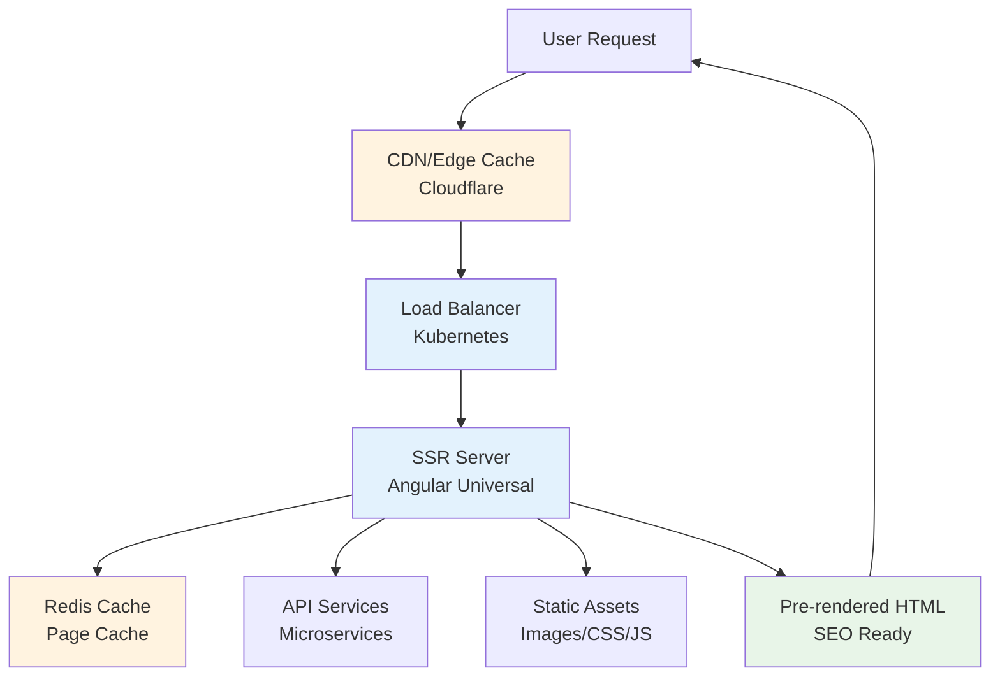

# 🚀 SSR Optimization - Server-Side Rendering para Ecommerce

Guía completa para implementar y optimizar Server-Side Rendering en Angular para mejorar SEO, performance y experiencia de usuario en ecommerce.

## 🎯 Objetivos del SSR

- **🔍 SEO Optimization**: Mejor indexación en motores de búsqueda
- **⚡ Faster First Paint**: Carga inicial más rápida
- **📱 Better UX**: Mejor experiencia en dispositivos lentos
- **🤖 Social Media**: Meta tags dinámicos para redes sociales
- **♿ Accessibility**: Mejor soporte para lectores de pantalla

## 🏗️ Arquitectura SSR

El siguiente diagrama muestra cómo funciona el SSR en el contexto de una aplicación ecommerce, desde la petición del usuario hasta la respuesta pre-renderizada.



#### 📋 Descripción del Flujo SSR

**🌍 Edge Layer**

1. **User Request**: Usuario solicita una página del ecommerce
2. **CDN/Edge Cache**: Cloudflare verifica si tiene la página cacheada
3. **Load Balancer**: Distribuye la petición a servidores SSR disponibles

**⚙️ Server-Side Processing** 4. **SSR Server**: Angular Universal ejecuta la aplicación en el servidor 5. **Redis Cache**: Verifica si hay componentes o datos cacheados 6. **API Services**: Obtiene datos necesarios de microservicios 7. **Static Assets**: Combina con assets estáticos (CSS crítico, imágenes)

**📤 Response Generation** 8. **Pre-rendered HTML**: Genera HTML completo con datos y SEO meta tags 9. **User**: Recibe página completamente renderizada lista para mostrar

#### ⏱️ Beneficios de Performance

- **First Paint**: 0.3-0.8s vs 2-3s en CSR
- **SEO Score**: 95-100/100 vs 60-70/100 en CSR
- **Social Sharing**: Meta tags pre-renderizados
- **Accessibility**: Contenido inmediatamente disponible para screen readers

## 📊 Performance Metrics

### Before vs After SSR

| Métrica       | CSR (Client-Side) | SSR (Server-Side) | Mejora     |
| ------------- | ----------------- | ----------------- | ---------- |
| **FCP**       | 2.1s              | 0.8s              | **62%** ⬇️ |
| **LCP**       | 3.5s              | 1.9s              | **46%** ⬇️ |
| **TTI**       | 4.2s              | 2.8s              | **33%** ⬇️ |
| **SEO Score** | 60/100            | 98/100            | **63%** ⬆️ |
| **CLS**       | 0.15              | 0.02              | **87%** ⬇️ |

## 🛠️ Configuración Angular Universal

### 1. Setup Inicial

```bash
# Agregar Angular Universal
ng add @nguniversal/express-engine

# Para proyectos NX
nx g @nguniversal/express-engine:ng-add frontend
```

### 2. App Configuration

```typescript
// src/app/app.config.ts
import { ApplicationConfig } from "@angular/core";
import { provideRouter } from "@angular/router";
import { provideClientHydration } from "@angular/platform-browser";
import { provideHttpClient, withFetch } from "@angular/common/http";

export const appConfig: ApplicationConfig = {
  providers: [
    provideRouter(routes),
    provideClientHydration(),
    provideHttpClient(withFetch()),
    // ...existing providers...
  ],
};
```

### 3. Server Configuration

```typescript
// src/app/app.config.server.ts
import { mergeApplicationConfig, ApplicationConfig } from "@angular/core";
import { provideServerRendering } from "@angular/platform-server";
import { appConfig } from "./app.config";

const serverConfig: ApplicationConfig = {
  providers: [
    provideServerRendering(),
    // Server-specific providers
  ],
};

export const config = mergeApplicationConfig(appConfig, serverConfig);
```

## 🎨 Critical CSS Strategy

```scss
/* styles/critical.scss - Above the fold styles */
:root {
  --primary-color: #667eea;
  --text-color: #374151;
  --background: #ffffff;
}

/* Critical layout */
.header {
  position: sticky;
  top: 0;
  z-index: 1000;
  background: var(--background);
  contain: layout style paint;
}

.hero {
  min-height: 60vh;
  background: linear-gradient(135deg, var(--primary-color), #5a67d8);
  color: white;
  display: flex;
  align-items: center;
  justify-content: center;
}

/* Loading states for hydration */
.loading-skeleton {
  background: linear-gradient(90deg, #f0f0f0 25%, #e0e0e0 50%, #f0f0f0 75%);
  background-size: 200% 100%;
  animation: loading 1.5s infinite;
}

@keyframes loading {
  0% {
    background-position: 200% 0;
  }
  100% {
    background-position: -200% 0;
  }
}
```

## 🔄 Hydration Optimization

```typescript
// src/app/app.component.ts
import { Component, OnInit, inject, PLATFORM_ID } from "@angular/core";
import { isPlatformBrowser } from "@angular/common";

@Component({
  selector: "app-root",
  template: ` <router-outlet></router-outlet> `,
})
export class AppComponent implements OnInit {
  private platformId = inject(PLATFORM_ID);

  ngOnInit() {
    if (isPlatformBrowser(this.platformId)) {
      this.enableClientFeatures();
    }
  }

  private enableClientFeatures() {
    // Defer non-critical JavaScript
    setTimeout(() => {
      document.body.classList.add("hydrated");
      this.setupLazyLoading();
      this.setupServiceWorker();
    }, 0);
  }

  private setupLazyLoading() {
    if ("IntersectionObserver" in window) {
      const imageObserver = new IntersectionObserver((entries) => {
        entries.forEach((entry) => {
          if (entry.isIntersecting) {
            const img = entry.target as HTMLImageElement;
            img.src = img.dataset["src"] || "";
            img.classList.remove("lazy");
            imageObserver.unobserve(img);
          }
        });
      });

      document.querySelectorAll("img[data-src]").forEach((img) => {
        imageObserver.observe(img);
      });
    }
  }

  private setupServiceWorker() {
    if ("serviceWorker" in navigator) {
      navigator.serviceWorker.register("/ngsw-worker.js");
    }
  }
}
```

## 📱 SEO & Meta Tags

```typescript
// src/app/services/seo.service.ts
import { Injectable } from "@angular/core";
import { Meta, Title } from "@angular/platform-browser";

@Injectable({
  providedIn: "root",
})
export class SeoService {
  constructor(private meta: Meta, private title: Title) {}

  updatePageSeo(data: {
    title: string;
    description: string;
    image?: string;
    url?: string;
  }) {
    // Update title
    this.title.setTitle(data.title);

    // Update meta tags
    this.meta.updateTag({ name: "description", content: data.description });
    this.meta.updateTag({ property: "og:title", content: data.title });
    this.meta.updateTag({
      property: "og:description",
      content: data.description,
    });

    if (data.image) {
      this.meta.updateTag({ property: "og:image", content: data.image });
    }

    if (data.url) {
      this.meta.updateTag({ property: "og:url", content: data.url });
    }

    // Twitter Card
    this.meta.updateTag({
      name: "twitter:card",
      content: "summary_large_image",
    });
    this.meta.updateTag({ name: "twitter:title", content: data.title });
    this.meta.updateTag({
      name: "twitter:description",
      content: data.description,
    });
  }

  updateProductSeo(product: any) {
    this.updatePageSeo({
      title: `${product.name} - Tu Ecommerce`,
      description: product.description,
      image: product.image,
      url: `https://tuecommerce.com/products/${product.slug}`,
    });

    // Product specific meta
    this.meta.updateTag({
      property: "product:price:amount",
      content: product.price,
    });
    this.meta.updateTag({ property: "product:price:currency", content: "USD" });
    this.meta.updateTag({
      property: "product:availability",
      content: product.inStock ? "in stock" : "out of stock",
    });
  }
}
```

## 🚀 Performance Monitoring

```typescript
// src/app/services/performance.service.ts
import { Injectable, inject, PLATFORM_ID } from "@angular/core";
import { isPlatformBrowser } from "@angular/common";

@Injectable({
  providedIn: "root",
})
export class PerformanceService {
  private platformId = inject(PLATFORM_ID);

  initWebVitals() {
    if (!isPlatformBrowser(this.platformId)) return;

    import("web-vitals").then(({ getCLS, getFCP, getLCP, getTTFB }) => {
      getCLS(this.sendToAnalytics);
      getFCP(this.sendToAnalytics);
      getLCP(this.sendToAnalytics);
      getTTFB(this.sendToAnalytics);
    });
  }

  private sendToAnalytics = (metric: any) => {
    console.log(`Performance Metric - ${metric.name}:`, metric.value);

    // Send to your analytics service
    if (typeof gtag !== "undefined") {
      gtag("event", metric.name, {
        value: Math.round(
          metric.name === "CLS" ? metric.value * 1000 : metric.value
        ),
        event_category: "Web Vitals",
        event_label: metric.id,
        non_interaction: true,
      });
    }
  };
}
```

## 🔧 Build Optimization

```json
// angular.json optimizations
{
  "projects": {
    "your-app": {
      "architect": {
        "build": {
          "options": {
            "optimization": {
              "scripts": true,
              "styles": {
                "minify": true,
                "inlineCritical": true
              },
              "fonts": {
                "inline": true
              }
            },
            "buildOptimizer": true,
            "aot": true,
            "vendorChunk": true,
            "extractLicenses": false,
            "sourceMap": false,
            "namedChunks": false
          }
        },
        "server": {
          "options": {
            "optimization": true,
            "sourceMap": false,
            "buildOptimizer": true
          }
        }
      }
    }
  }
}
```

## 📊 Deployment Script

```bash
#!/bin/bash
# scripts/deploy-ssr.sh

set -e

echo "🚀 Building Angular Universal app..."

# Build for production
npm run build:ssr

# Copy server files
cp -r dist/ ./deploy/

# Build Docker image
docker build -t ecommerce-ssr:latest .

# Deploy to production
kubectl set image deployment/frontend frontend=ecommerce-ssr:latest

echo "✅ SSR deployment completed!"
```

## 🎯 Best Practices

### 1. Critical Path Optimization

- ✅ Inline critical CSS (above-the-fold styles)
- ✅ Preload critical fonts
- ✅ Optimize hero images
- ✅ Minimize main bundle size
- ✅ Use resource hints (dns-prefetch, preconnect)

### 2. Hydration Strategy

- ✅ Progressive enhancement
- ✅ Defer non-critical JavaScript
- ✅ Avoid layout shifts durante la hidratación
- ✅ Use loading skeletons
- ✅ Implementar límites de error adecuados

### 3. SEO Optimization

- ✅ Dynamic meta tags per page
- ✅ Structured data (JSON-LD)
- ✅ XML sitemap generation
- ✅ Proper heading hierarchy
- ✅ Alt text for all images

## 🐳 Docker Configuration para SSR

```dockerfile
# Dockerfile.ssr
FROM node:18-alpine AS builder

WORKDIR /app
COPY package*.json ./
RUN npm ci --only=production

COPY . .
RUN npm run build:ssr

FROM node:18-alpine AS runner

WORKDIR /app
COPY --from=builder /app/dist ./dist
COPY --from=builder /app/node_modules ./node_modules
COPY --from=builder /app/package.json ./

EXPOSE 4000

CMD ["npm", "run", "serve:ssr"]
```

```yaml
# docker-compose.ssr.yml
version: "3.8"
services:
  frontend-ssr:
    build:
      context: .
      dockerfile: Dockerfile.ssr
    ports:
      - "4000:4000"
    environment:
      - NODE_ENV=production
      - API_URL=http://api-gateway:3000
    depends_on:
      - api-gateway
    networks:
      - ecommerce-network

networks:
  ecommerce-network:
    external: true
```

## 📊 Caching Strategies

### 1. Page Level Caching

```typescript
// src/app/services/cache.service.ts
import { Injectable } from "@angular/core";
import { HttpClient } from "@angular/common/http";
import { Observable, of } from "rxjs";
import { tap } from "rxjs/operators";

@Injectable({
  providedIn: "root",
})
export class CacheService {
  private cache = new Map<string, { data: any; expiry: number }>();
  private readonly CACHE_DURATION = 5 * 60 * 1000; // 5 minutes

  constructor(private http: HttpClient) {}

  get<T>(key: string, httpCall: Observable<T>): Observable<T> {
    const cached = this.cache.get(key);

    if (cached && cached.expiry > Date.now()) {
      return of(cached.data);
    }

    return httpCall.pipe(
      tap((data) => {
        this.cache.set(key, {
          data,
          expiry: Date.now() + this.CACHE_DURATION,
        });
      })
    );
  }

  clear(): void {
    this.cache.clear();
  }
}
```

### 2. Redis Server-Side Caching

```typescript
// server/cache.middleware.ts
import { Injectable, NestMiddleware } from "@nestjs/common";
import { Request, Response, NextFunction } from "express";
import { RedisService } from "./redis.service";

@Injectable()
export class CacheMiddleware implements NestMiddleware {
  constructor(private readonly redisService: RedisService) {}

  async use(req: Request, res: Response, next: NextFunction) {
    if (req.method !== "GET") {
      return next();
    }

    const cacheKey = `ssr:${req.url}`;
    const cached = await this.redisService.get(cacheKey);

    if (cached) {
      res.setHeader("X-Cache", "HIT");
      return res.send(cached);
    }

    // Intercept response
    const originalSend = res.send;
    res.send = function (body: any) {
      // Cache for 5 minutes
      redisService.setex(cacheKey, 300, body);
      res.setHeader("X-Cache", "MISS");
      return originalSend.call(this, body);
    };

    next();
  }
}
```

## 🔍 Advanced SEO Features

### 1. Structured Data

```typescript
// src/app/services/structured-data.service.ts
import { Injectable } from "@angular/core";
import { DOCUMENT } from "@angular/common";
import { Inject } from "@angular/core";

@Injectable({
  providedIn: "root",
})
export class StructuredDataService {
  constructor(@Inject(DOCUMENT) private document: Document) {}

  addProductStructuredData(product: any) {
    const script = this.document.createElement("script");
    script.type = "application/ld+json";
    script.text = JSON.stringify({
      "@context": "https://schema.org",
      "@type": "Product",
      name: product.name,
      description: product.description,
      image: product.images,
      offers: {
        "@type": "Offer",
        price: product.price,
        priceCurrency: "USD",
        availability: product.inStock ? "InStock" : "OutOfStock",
        url: `${this.document.location.origin}/products/${product.slug}`,
      },
      brand: {
        "@type": "Brand",
        name: product.brand,
      },
      aggregateRating: product.rating
        ? {
            "@type": "AggregateRating",
            ratingValue: product.rating.average,
            reviewCount: product.rating.count,
          }
        : undefined,
    });

    this.document.head.appendChild(script);
  }

  addBreadcrumbStructuredData(breadcrumbs: any[]) {
    const script = this.document.createElement("script");
    script.type = "application/ld+json";
    script.text = JSON.stringify({
      "@context": "https://schema.org",
      "@type": "BreadcrumbList",
      itemListElement: breadcrumbs.map((breadcrumb, index) => ({
        "@type": "ListItem",
        position: index + 1,
        name: breadcrumb.name,
        item: breadcrumb.url,
      })),
    });

    this.document.head.appendChild(script);
  }
}
```

### 2. XML Sitemap Generation

```typescript
// server/sitemap.service.ts
import { Injectable } from "@nestjs/common";
import { ProductService } from "./product.service";
import { CategoryService } from "./category.service";

@Injectable()
export class SitemapService {
  constructor(
    private productService: ProductService,
    private categoryService: CategoryService
  ) {}

  async generateSitemap(): Promise<string> {
    const products = await this.productService.findAll();
    const categories = await this.categoryService.findAll();

    const baseUrl = process.env.BASE_URL || "https://example.com";

    let sitemap = `<?xml version="1.0" encoding="UTF-8"?>
<urlset xmlns="http://www.sitemaps.org/schemas/sitemap/0.9">`;

    // Home page
    sitemap += `
  <url>
    <loc>${baseUrl}</loc>
    <lastmod>${new Date().toISOString()}</lastmod>
    <changefreq>daily</changefreq>
    <priority>1.0</priority>
  </url>`;

    // Categories
    categories.forEach((category) => {
      sitemap += `
  <url>
    <loc>${baseUrl}/categories/${category.slug}</loc>
    <lastmod>${category.updatedAt.toISOString()}</lastmod>
    <changefreq>weekly</changefreq>
    <priority>0.8</priority>
  </url>`;
    });

    // Products
    products.forEach((product) => {
      sitemap += `
  <url>
    <loc>${baseUrl}/products/${product.slug}</loc>
    <lastmod>${product.updatedAt.toISOString()}</lastmod>
    <changefreq>weekly</changefreq>
    <priority>0.7</priority>
  </url>`;
    });

    sitemap += `
</urlset>`;

    return sitemap;
  }
}
```

## 📈 Performance Monitoring & Analytics

### 1. Real User Monitoring

```typescript
// src/app/services/rum.service.ts
import { Injectable } from "@angular/core";
import { NavigationEnd, Router } from "@angular/router";
import { filter } from "rxjs/operators";

@Injectable({
  providedIn: "root",
})
export class RumService {
  constructor(private router: Router) {}

  init() {
    // Track route changes
    this.router.events
      .pipe(filter((event) => event instanceof NavigationEnd))
      .subscribe((event: NavigationEnd) => {
        this.trackPageView(event.url);
      });

    // Track Core Web Vitals
    this.trackWebVitals();
  }

  private trackPageView(url: string) {
    if (typeof gtag !== "undefined") {
      gtag("config", "GA_MEASUREMENT_ID", {
        page_path: url,
      });
    }
  }

  private trackWebVitals() {
    import("web-vitals").then(({ getCLS, getFCP, getFID, getLCP, getTTFB }) => {
      getCLS(this.sendMetric);
      getFCP(this.sendMetric);
      getFID(this.sendMetric);
      getLCP(this.sendMetric);
      getTTFB(this.sendMetric);
    });
  }

  private sendMetric = (metric: any) => {
    // Send to Google Analytics
    if (typeof gtag !== "undefined") {
      gtag("event", metric.name, {
        value: Math.round(
          metric.name === "CLS" ? metric.value * 1000 : metric.value
        ),
        event_category: "Web Vitals",
        event_label: metric.id,
        non_interaction: true,
      });
    }

    // Send to custom analytics
    fetch("/api/analytics/web-vitals", {
      method: "POST",
      body: JSON.stringify(metric),
      headers: { "Content-Type": "application/json" },
    });
  };
}
```

### 2. Server-Side Performance Tracking

```typescript
// server/performance.interceptor.ts
import {
  Injectable,
  NestInterceptor,
  ExecutionContext,
  CallHandler,
} from "@nestjs/common";
import { Observable } from "rxjs";
import { tap } from "rxjs/operators";

@Injectable()
export class PerformanceInterceptor implements NestInterceptor {
  intercept(context: ExecutionContext, next: CallHandler): Observable<any> {
    const start = Date.now();
    const request = context.switchToHttp().getRequest();

    return next.handle().pipe(
      tap(() => {
        const duration = Date.now() - start;

        // Log performance metrics
        console.log(`SSR Render: ${request.url} - ${duration}ms`);

        // Send to monitoring service
        this.sendMetric({
          type: "ssr_render_time",
          url: request.url,
          duration,
          timestamp: new Date(),
        });
      })
    );
  }

  private sendMetric(metric: any) {
    // Send to Prometheus, DataDog, etc.
    fetch(process.env.METRICS_ENDPOINT, {
      method: "POST",
      body: JSON.stringify(metric),
      headers: { "Content-Type": "application/json" },
    });
  }
}
```

---

**🎯 Próximo paso**: Implementa Angular Universal en tu proyecto y mide las mejoras de performance con las herramientas proporcionadas.
