# 🗂️ State Management con NgRx - Ecommerce Patterns

Guía completa para implementar state management escalable en ecommerce usando NgRx con patrones avanzados, optimización de performance y arquitectura limpia.

## 🎯 ¿Por qué NgRx en Ecommerce?

En ecommerce, el estado es **complejo y crítico**:

- **🛒 Carrito persistente** - Estado compartido entre páginas
- **👤 Usuario autenticado** - Datos de sesión y preferencias
- **📦 Catálogo dinámico** - Productos, filtros, paginación
- **💳 Proceso de pago** - Multi-step checkout flow
- **🔔 Notificaciones** - Alerts, toasts, loading states

### Beneficios de NgRx para Ecommerce

- **🔄 Predictable State**: Cambios controlados con acciones inmutables
- **⚡ Performance**: OnPush strategy + memoized selectors
- **🐛 Debugging**: DevTools con time-travel debugging
- **🧪 Testing**: Estado testeable y mockeable
- **📱 Offline Support**: Estado local persistente

### NgRx vs Alternatives

```mermaid
graph LR
    subgraph "❌ Service + BehaviorSubject"
        SERVICE[Service] --> COMPONENT1[Component A]
        SERVICE --> COMPONENT2[Component B]
        SERVICE --> COMPONENT3[Component C]
        COMPONENT1 -.->|Side effects| SERVICE
        COMPONENT2 -.->|Side effects| SERVICE
    end

    subgraph "✅ NgRx Pattern"
        STORE[Store] --> SELECTOR1[Selector A]
        STORE --> SELECTOR2[Selector B]
        STORE --> SELECTOR3[Selector C]
        COMP_A[Component A] --> ACTION1[Action]
        COMP_B[Component B] --> ACTION2[Action]
        ACTION1 --> EFFECT[Effect]
        ACTION2 --> EFFECT
        EFFECT --> REDUCER[Reducer]
        REDUCER --> STORE
    end

    style SERVICE fill:#ffcdd2,color:#000
    style STORE fill:#c8e6c9,color:#000
```



## 🏗️ Arquitectura NgRx para Ecommerce

### Store Structure

```typescript
// State shape del ecommerce
interface AppState {
  auth: AuthState;
  cart: CartState;
  products: ProductsState;
  orders: OrdersState;
  ui: UIState;
  notifications: NotificationState;
}

interface AuthState {
  user: User | null;
  token: string | null;
  isAuthenticated: boolean;
  isLoading: boolean;
  error: string | null;
  permissions: string[];
}

interface CartState {
  items: CartItem[];
  totalItems: number;
  totalPrice: number;
  shippingCost: number;
  discount: number;
  isLoading: boolean;
  lastModified: Date;
}

interface ProductsState {
  products: Product[];
  selectedProduct: Product | null;
  categories: Category[];
  filters: ProductFilters;
  pagination: PaginationState;
  searchTerm: string;
  isLoading: boolean;
  error: string | null;
  cache: {
    [key: string]: {
      data: Product[];
      timestamp: number;
      expiresIn: number;
    };
  };
}
```

### Feature-Based Organization

```
src/app/store/
├── auth/
│   ├── auth.actions.ts
│   ├── auth.effects.ts
│   ├── auth.reducer.ts
│   ├── auth.selectors.ts
│   └── auth.facade.ts
├── cart/
│   ├── cart.actions.ts
│   ├── cart.effects.ts
│   ├── cart.reducer.ts
│   ├── cart.selectors.ts
│   └── cart.facade.ts
├── products/
│   ├── products.actions.ts
│   ├── products.effects.ts
│   ├── products.reducer.ts
│   ├── products.selectors.ts
│   └── products.facade.ts
└── index.ts              # Root store configuration
```

## 🛒 Cart State Implementation

### Cart Actions

```typescript
// src/app/store/cart/cart.actions.ts
import { createActionGroup, emptyProps, props } from "@ngrx/store";
import { CartItem, Product } from "@app/models";

export const CartActions = createActionGroup({
  source: "Cart",
  events: {
    // Load cart from storage
    "Load Cart": emptyProps(),
    "Load Cart Success": props<{ items: CartItem[]; timestamp: number }>(),
    "Load Cart Failure": props<{ error: string }>(),

    // Add/Update items
    "Add Item": props<{ product: Product; quantity: number }>(),
    "Add Item Success": props<{ item: CartItem }>(),
    "Add Item Failure": props<{ error: string }>(),

    "Update Item Quantity": props<{ itemId: string; quantity: number }>(),
    "Update Item Success": props<{ itemId: string; quantity: number }>(),

    "Remove Item": props<{ itemId: string }>(),
    "Remove Item Success": props<{ itemId: string }>(),

    // Cart operations
    "Clear Cart": emptyProps(),
    "Clear Cart Success": emptyProps(),

    "Apply Coupon": props<{ couponCode: string }>(),
    "Apply Coupon Success": props<{ discount: number; couponCode: string }>(),
    "Apply Coupon Failure": props<{ error: string }>(),

    "Calculate Shipping": props<{ shippingAddress: Address }>(),
    "Calculate Shipping Success": props<{ shippingCost: number }>(),

    // Sync operations
    "Sync Cart": emptyProps(),
    "Sync Cart Success": emptyProps(),
    "Sync Cart Failure": props<{ error: string }>(),

    // Checkout
    "Start Checkout": emptyProps(),
    "Complete Checkout": props<{ orderId: string }>(),
    "Checkout Cancelled": emptyProps(),
  },
});
```

### Cart Reducer

```typescript
// src/app/store/cart/cart.reducer.ts
import { createReducer, on } from "@ngrx/store";
import { CartActions } from "./cart.actions";
import { CartItem } from "@app/models";

export interface CartState {
  items: CartItem[];
  totalItems: number;
  totalPrice: number;
  shippingCost: number;
  discount: number;
  couponCode: string | null;
  isLoading: boolean;
  isSyncing: boolean;
  error: string | null;
  lastModified: Date | null;
  checkoutInProgress: boolean;
}

const initialState: CartState = {
  items: [],
  totalItems: 0,
  totalPrice: 0,
  shippingCost: 0,
  discount: 0,
  couponCode: null,
  isLoading: false,
  isSyncing: false,
  error: null,
  lastModified: null,
  checkoutInProgress: false,
};

export const cartReducer = createReducer(
  initialState,

  // Load cart
  on(CartActions.loadCart, (state) => ({
    ...state,
    isLoading: true,
    error: null,
  })),

  on(CartActions.loadCartSuccess, (state, { items, timestamp }) => {
    const calculatedState = calculateCartTotals(items);
    return {
      ...state,
      ...calculatedState,
      isLoading: false,
      lastModified: new Date(timestamp),
    };
  }),

  on(CartActions.loadCartFailure, (state, { error }) => ({
    ...state,
    isLoading: false,
    error,
  })),

  // Add item
  on(CartActions.addItem, (state) => ({
    ...state,
    isLoading: true,
    error: null,
  })),

  on(CartActions.addItemSuccess, (state, { item }) => {
    const existingItem = state.items.find((i) => i.id === item.id);

    let updatedItems: CartItem[];
    if (existingItem) {
      // Update quantity if item exists
      updatedItems = state.items.map((i) =>
        i.id === item.id ? { ...i, quantity: i.quantity + item.quantity } : i
      );
    } else {
      // Add new item
      updatedItems = [...state.items, item];
    }

    const calculatedState = calculateCartTotals(updatedItems);
    return {
      ...state,
      ...calculatedState,
      isLoading: false,
      lastModified: new Date(),
    };
  }),

  // Update quantity
  on(CartActions.updateItemSuccess, (state, { itemId, quantity }) => {
    const updatedItems =
      quantity === 0
        ? state.items.filter((item) => item.id !== itemId)
        : state.items.map((item) =>
            item.id === itemId ? { ...item, quantity } : item
          );

    const calculatedState = calculateCartTotals(updatedItems);
    return {
      ...state,
      ...calculatedState,
      lastModified: new Date(),
    };
  }),

  // Remove item
  on(CartActions.removeItemSuccess, (state, { itemId }) => {
    const updatedItems = state.items.filter((item) => item.id !== itemId);
    const calculatedState = calculateCartTotals(updatedItems);

    return {
      ...state,
      ...calculatedState,
      lastModified: new Date(),
    };
  }),

  // Clear cart
  on(CartActions.clearCartSuccess, (state) => ({
    ...initialState,
    lastModified: new Date(),
  })),

  // Apply coupon
  on(CartActions.applyCouponSuccess, (state, { discount, couponCode }) => ({
    ...state,
    discount,
    couponCode,
    totalPrice: state.totalPrice - discount,
  })),

  // Shipping calculation
  on(CartActions.calculateShippingSuccess, (state, { shippingCost }) => ({
    ...state,
    shippingCost,
  })),

  // Checkout
  on(CartActions.startCheckout, (state) => ({
    ...state,
    checkoutInProgress: true,
  })),

  on(CartActions.completeCheckout, (state) => ({
    ...initialState,
    lastModified: new Date(),
  })),

  on(CartActions.checkoutCancelled, (state) => ({
    ...state,
    checkoutInProgress: false,
  }))
);

// Helper function to calculate totals
function calculateCartTotals(items: CartItem[]) {
  const totalItems = items.reduce((sum, item) => sum + item.quantity, 0);
  const totalPrice = items.reduce(
    (sum, item) => sum + item.price * item.quantity,
    0
  );

  return {
    items,
    totalItems,
    totalPrice,
  };
}
```

### Cart Effects

```typescript
// src/app/store/cart/cart.effects.ts
import { Injectable } from "@angular/core";
import { Actions, createEffect, ofType } from "@ngrx/effects";
import { Store } from "@ngrx/store";
import {
  switchMap,
  map,
  catchError,
  withLatestFrom,
  debounceTime,
  tap,
  filter,
} from "rxjs/operators";
import { of, timer } from "rxjs";

import { CartActions } from "./cart.actions";
import { CartService } from "@app/services/cart.service";
import { LocalStorageService } from "@app/services/local-storage.service";
import { NotificationService } from "@app/services/notification.service";
import { selectCartItems, selectIsAuthenticated } from "../selectors";

@Injectable()
export class CartEffects {
  constructor(
    private actions$: Actions,
    private store: Store,
    private cartService: CartService,
    private localStorage: LocalStorageService,
    private notifications: NotificationService
  ) {}

  // Load cart from localStorage or API
  loadCart$ = createEffect(() =>
    this.actions$.pipe(
      ofType(CartActions.loadCart),
      withLatestFrom(this.store.select(selectIsAuthenticated)),
      switchMap(([_, isAuthenticated]) => {
        if (isAuthenticated) {
          // Load from API if authenticated
          return this.cartService.loadCart().pipe(
            map(({ items, timestamp }) =>
              CartActions.loadCartSuccess({ items, timestamp })
            ),
            catchError((error) =>
              of(CartActions.loadCartFailure({ error: error.message }))
            )
          );
        } else {
          // Load from localStorage for guest users
          const localCart = this.localStorage.getItem("cart");
          if (localCart) {
            return of(
              CartActions.loadCartSuccess({
                items: localCart.items,
                timestamp: localCart.timestamp,
              })
            );
          } else {
            return of(
              CartActions.loadCartSuccess({ items: [], timestamp: Date.now() })
            );
          }
        }
      })
    )
  );

  // Add item to cart
  addItem$ = createEffect(() =>
    this.actions$.pipe(
      ofType(CartActions.addItem),
      withLatestFrom(this.store.select(selectIsAuthenticated)),
      switchMap(([{ product, quantity }, isAuthenticated]) => {
        const cartItem: CartItem = {
          id: product.id,
          productId: product.id,
          name: product.name,
          price: product.price,
          quantity,
          image: product.primaryImage,
          sku: product.sku,
        };

        if (isAuthenticated) {
          // Save to API if authenticated
          return this.cartService.addItem(cartItem).pipe(
            map(() => CartActions.addItemSuccess({ item: cartItem })),
            catchError((error) =>
              of(CartActions.addItemFailure({ error: error.message }))
            )
          );
        } else {
          // Just add to local state for guest users
          return of(CartActions.addItemSuccess({ item: cartItem }));
        }
      })
    )
  );

  // Persist cart to localStorage after changes
  persistCart$ = createEffect(
    () =>
      this.actions$.pipe(
        ofType(
          CartActions.addItemSuccess,
          CartActions.updateItemSuccess,
          CartActions.removeItemSuccess,
          CartActions.clearCartSuccess
        ),
        withLatestFrom(this.store.select(selectCartItems)),
        debounceTime(1000), // Debounce to avoid excessive writes
        tap(([_, items]) => {
          this.localStorage.setItem("cart", {
            items,
            timestamp: Date.now(),
          });
        })
      ),
    { dispatch: false }
  );

  // Sync cart with API periodically for authenticated users
  syncCart$ = createEffect(() =>
    timer(0, 300000).pipe(
      // Every 5 minutes
      withLatestFrom(this.store.select(selectIsAuthenticated)),
      filter(([_, isAuthenticated]) => isAuthenticated),
      map(() => CartActions.syncCart())
    )
  );

  syncCartEffect$ = createEffect(() =>
    this.actions$.pipe(
      ofType(CartActions.syncCart),
      withLatestFrom(this.store.select(selectCartItems)),
      switchMap(([_, localItems]) =>
        this.cartService.syncCart(localItems).pipe(
          map(() => CartActions.syncCartSuccess()),
          catchError((error) =>
            of(CartActions.syncCartFailure({ error: error.message }))
          )
        )
      )
    )
  );

  // Show notifications
  showAddedNotification$ = createEffect(
    () =>
      this.actions$.pipe(
        ofType(CartActions.addItemSuccess),
        tap(({ item }) => {
          this.notifications.success(
            `${item.name} added to cart`,
            "Cart Updated"
          );
        })
      ),
    { dispatch: false }
  );

  showErrorNotification$ = createEffect(
    () =>
      this.actions$.pipe(
        ofType(CartActions.addItemFailure, CartActions.loadCartFailure),
        tap(({ error }) => {
          this.notifications.error(error, "Cart Error");
        })
      ),
    { dispatch: false }
  );
}
```

### Cart Selectors

```typescript
// src/app/store/cart/cart.selectors.ts
import { createFeatureSelector, createSelector } from "@ngrx/store";
import { CartState } from "./cart.reducer";

export const selectCartState = createFeatureSelector<CartState>("cart");

// Basic selectors
export const selectCartItems = createSelector(
  selectCartState,
  (state) => state.items
);

export const selectCartTotalItems = createSelector(
  selectCartState,
  (state) => state.totalItems
);

export const selectCartTotalPrice = createSelector(
  selectCartState,
  (state) => state.totalPrice
);

export const selectCartShippingCost = createSelector(
  selectCartState,
  (state) => state.shippingCost
);

export const selectCartDiscount = createSelector(
  selectCartState,
  (state) => state.discount
);

export const selectCartIsLoading = createSelector(
  selectCartState,
  (state) => state.isLoading
);

export const selectCartError = createSelector(
  selectCartState,
  (state) => state.error
);

// Computed selectors
export const selectCartGrandTotal = createSelector(
  selectCartTotalPrice,
  selectCartShippingCost,
  selectCartDiscount,
  (totalPrice, shippingCost, discount) => totalPrice + shippingCost - discount
);

export const selectCartItemCount = createSelector(
  selectCartItems,
  (items) => items.length
);

export const selectCartIsEmpty = createSelector(
  selectCartItems,
  (items) => items.length === 0
);

// Specific item selectors
export const selectCartItemById = (itemId: string) =>
  createSelector(selectCartItems, (items) =>
    items.find((item) => item.id === itemId)
  );

export const selectCartItemQuantity = (itemId: string) =>
  createSelector(selectCartItemById(itemId), (item) => item?.quantity || 0);

// Cart summary for checkout
export const selectCartSummary = createSelector(
  selectCartItems,
  selectCartTotalItems,
  selectCartTotalPrice,
  selectCartShippingCost,
  selectCartDiscount,
  selectCartGrandTotal,
  (items, totalItems, totalPrice, shippingCost, discount, grandTotal) => ({
    items,
    totalItems,
    totalPrice,
    shippingCost,
    discount,
    grandTotal,
    canCheckout: items.length > 0 && grandTotal > 0,
  })
);

// Performance optimized selectors
export const selectCartItemsForDisplay = createSelector(
  selectCartItems,
  (items) =>
    items.map((item) => ({
      id: item.id,
      name: item.name,
      price: item.price,
      quantity: item.quantity,
      total: item.price * item.quantity,
      image: item.image,
    }))
);
```

## 📦 Products State Implementation

### Products Facade Pattern

```typescript
// src/app/store/products/products.facade.ts
import { Injectable } from "@angular/core";
import { Store } from "@ngrx/store";
import { Observable } from "rxjs";

import { ProductsActions } from "./products.actions";
import * as ProductsSelectors from "./products.selectors";
import { Product, ProductFilters, Category } from "@app/models";

@Injectable({
  providedIn: "root",
})
export class ProductsFacade {
  // Selectors
  products$ = this.store.select(ProductsSelectors.selectAllProducts);
  selectedProduct$ = this.store.select(ProductsSelectors.selectSelectedProduct);
  categories$ = this.store.select(ProductsSelectors.selectAllCategories);
  filters$ = this.store.select(ProductsSelectors.selectFilters);
  isLoading$ = this.store.select(ProductsSelectors.selectProductsLoading);
  error$ = this.store.select(ProductsSelectors.selectProductsError);

  // Computed selectors
  filteredProducts$ = this.store.select(
    ProductsSelectors.selectFilteredProducts
  );
  featuredProducts$ = this.store.select(
    ProductsSelectors.selectFeaturedProducts
  );
  pagination$ = this.store.select(ProductsSelectors.selectPagination);
  searchResults$ = this.store.select(ProductsSelectors.selectSearchResults);

  constructor(private store: Store) {}

  // Actions dispatchers
  loadProducts(filters?: ProductFilters): void {
    this.store.dispatch(ProductsActions.loadProducts({ filters }));
  }

  loadProduct(id: string): void {
    this.store.dispatch(ProductsActions.loadProduct({ id }));
  }

  searchProducts(searchTerm: string): void {
    this.store.dispatch(ProductsActions.searchProducts({ searchTerm }));
  }

  applyFilters(filters: ProductFilters): void {
    this.store.dispatch(ProductsActions.applyFilters({ filters }));
  }

  clearFilters(): void {
    this.store.dispatch(ProductsActions.clearFilters());
  }

  loadCategories(): void {
    this.store.dispatch(ProductsActions.loadCategories());
  }

  changePage(page: number): void {
    this.store.dispatch(ProductsActions.changePage({ page }));
  }

  changePageSize(pageSize: number): void {
    this.store.dispatch(ProductsActions.changePageSize({ pageSize }));
  }

  sortProducts(sortBy: string, sortDirection: "asc" | "desc"): void {
    this.store.dispatch(
      ProductsActions.sortProducts({ sortBy, sortDirection })
    );
  }

  // Helper methods
  isProductInCart$(productId: string): Observable<boolean> {
    return this.store.select(ProductsSelectors.isProductInCart(productId));
  }

  getProductRating$(productId: string): Observable<number> {
    return this.store.select(ProductsSelectors.selectProductRating(productId));
  }
}
```

## 👤 Auth State with JWT

### Auth Effects with Token Management

```typescript
// src/app/store/auth/auth.effects.ts
import { Injectable } from "@angular/core";
import { Router } from "@angular/router";
import { Actions, createEffect, ofType } from "@ngrx/effects";
import { Store } from "@ngrx/store";
import {
  switchMap,
  map,
  catchError,
  tap,
  filter,
  exhaustMap,
} from "rxjs/operators";
import { of, timer } from "rxjs";

import { AuthActions } from "./auth.actions";
import { AuthService } from "@app/services/auth.service";
import { TokenService } from "@app/services/token.service";
import { NotificationService } from "@app/services/notification.service";

@Injectable()
export class AuthEffects {
  constructor(
    private actions$: Actions,
    private store: Store,
    private router: Router,
    private authService: AuthService,
    private tokenService: TokenService,
    private notifications: NotificationService
  ) {}

  // Login
  login$ = createEffect(() =>
    this.actions$.pipe(
      ofType(AuthActions.login),
      exhaustMap(({ credentials }) =>
        this.authService.login(credentials).pipe(
          map(({ user, tokens }) => AuthActions.loginSuccess({ user, tokens })),
          catchError((error) =>
            of(AuthActions.loginFailure({ error: error.message }))
          )
        )
      )
    )
  );

  // Login success - store tokens and redirect
  loginSuccess$ = createEffect(
    () =>
      this.actions$.pipe(
        ofType(AuthActions.loginSuccess),
        tap(({ tokens }) => {
          this.tokenService.setTokens(tokens);
          this.router.navigate(["/dashboard"]);
          this.notifications.success("Welcome back!", "Login Successful");
        })
      ),
    { dispatch: false }
  );

  // Auto-login from stored token
  autoLogin$ = createEffect(() =>
    this.actions$.pipe(
      ofType(AuthActions.autoLogin),
      switchMap(() => {
        const token = this.tokenService.getAccessToken();
        if (token && !this.tokenService.isTokenExpired(token)) {
          return this.authService.validateToken(token).pipe(
            map((user) => AuthActions.autoLoginSuccess({ user })),
            catchError(() => of(AuthActions.autoLoginFailure()))
          );
        } else {
          return of(AuthActions.autoLoginFailure());
        }
      })
    )
  );

  // Token refresh
  refreshToken$ = createEffect(() =>
    this.actions$.pipe(
      ofType(AuthActions.refreshToken),
      switchMap(() => {
        const refreshToken = this.tokenService.getRefreshToken();
        if (refreshToken) {
          return this.authService.refreshToken(refreshToken).pipe(
            map((tokens) => AuthActions.refreshTokenSuccess({ tokens })),
            catchError((error) =>
              of(AuthActions.refreshTokenFailure({ error: error.message }))
            )
          );
        } else {
          return of(AuthActions.logout());
        }
      })
    )
  );

  // Auto token refresh timer
  startTokenRefreshTimer$ = createEffect(() =>
    this.actions$.pipe(
      ofType(AuthActions.loginSuccess, AuthActions.refreshTokenSuccess),
      switchMap(({ tokens }) => {
        const expiresIn = this.tokenService.getTokenExpirationTime(
          tokens.accessToken
        );
        const refreshTime = expiresIn - 60000; // Refresh 1 minute before expiry

        return timer(refreshTime).pipe(
          map(() => AuthActions.refreshToken()),
          filter(() => !this.tokenService.isTokenExpired(tokens.accessToken))
        );
      })
    )
  );

  // Logout
  logout$ = createEffect(
    () =>
      this.actions$.pipe(
        ofType(AuthActions.logout),
        tap(() => {
          this.tokenService.clearTokens();
          this.router.navigate(["/login"]);
          this.notifications.info("You have been logged out", "Goodbye!");
        })
      ),
    { dispatch: false }
  );

  // Handle auth errors
  authError$ = createEffect(
    () =>
      this.actions$.pipe(
        ofType(
          AuthActions.loginFailure,
          AuthActions.refreshTokenFailure,
          AuthActions.autoLoginFailure
        ),
        tap(({ error }) => {
          if (error) {
            this.notifications.error(error, "Authentication Error");
          }
        })
      ),
    { dispatch: false }
  );
}
```

## 🚀 Performance Optimizations

### Memoized Selectors

```typescript
// Performance-optimized selectors with memoization
export const selectExpensiveComputation = createSelector(
  selectProducts,
  selectFilters,
  selectUserPreferences,
  (products, filters, preferences) => {
    // This will only recalculate when inputs change
    return products
      .filter((product) => matchesFilters(product, filters))
      .sort((a, b) => sortByPreference(a, b, preferences))
      .slice(0, 20); // Limit results for performance
  }
);

// Selector with custom memoization for large datasets
export const selectProductsWithReviews = createSelector(
  selectProducts,
  selectReviews,
  (products, reviews) => {
    const reviewsMap = new Map(reviews.map((r) => [r.productId, r]));

    return products.map((product) => ({
      ...product,
      reviews: reviewsMap.get(product.id) || [],
      averageRating: calculateAverageRating(reviewsMap.get(product.id)),
    }));
  },
  {
    // Custom equality check for better memoization
    memoize: (fn) => {
      const cache = new Map();
      return (...args) => {
        const key = JSON.stringify(args);
        if (cache.has(key)) {
          return cache.get(key);
        }
        const result = fn(...args);
        cache.set(key, result);
        return result;
      };
    },
  }
);
```

### OnPush Strategy Components

```typescript
// Component optimized for OnPush
@Component({
  selector: "app-product-list",
  template: `
    <div class="product-grid">
      <app-product-card
        *ngFor="let product of products$ | async; trackBy: trackByProductId"
        [product]="product"
        [isInCart]="isInCart(product.id) | async"
        (addToCart)="onAddToCart($event)"
        (viewDetails)="onViewDetails($event)"
      >
      </app-product-card>
    </div>

    <app-pagination
      [pagination]="pagination$ | async"
      (pageChange)="onPageChange($event)"
    >
    </app-pagination>
  `,
  changeDetection: ChangeDetectionStrategy.OnPush,
})
export class ProductListComponent {
  products$ = this.productsFacade.filteredProducts$;
  pagination$ = this.productsFacade.pagination$;

  constructor(
    private productsFacade: ProductsFacade,
    private cartFacade: CartFacade
  ) {}

  // Optimized trackBy function
  trackByProductId(index: number, product: Product): string {
    return product.id;
  }

  // Optimized cart check
  isInCart(productId: string): Observable<boolean> {
    return this.cartFacade.isProductInCart(productId);
  }

  onAddToCart(product: Product): void {
    this.cartFacade.addItem(product, 1);
  }

  onViewDetails(productId: string): void {
    this.productsFacade.loadProduct(productId);
  }

  onPageChange(page: number): void {
    this.productsFacade.changePage(page);
  }
}
```

## 🧪 Testing NgRx

### Testing Reducers

```typescript
// src/app/store/cart/cart.reducer.spec.ts
import { CartActions } from "./cart.actions";
import { cartReducer, CartState } from "./cart.reducer";

describe("Cart Reducer", () => {
  const initialState: CartState = {
    items: [],
    totalItems: 0,
    totalPrice: 0,
    shippingCost: 0,
    discount: 0,
    couponCode: null,
    isLoading: false,
    isSyncing: false,
    error: null,
    lastModified: null,
    checkoutInProgress: false,
  };

  describe("Add Item Actions", () => {
    it("should set loading state when adding item", () => {
      const action = CartActions.addItem({
        product: mockProduct,
        quantity: 1,
      });

      const result = cartReducer(initialState, action);

      expect(result.isLoading).toBe(true);
      expect(result.error).toBe(null);
    });

    it("should add new item to empty cart", () => {
      const cartItem = mockCartItem;
      const action = CartActions.addItemSuccess({ item: cartItem });

      const result = cartReducer(initialState, action);

      expect(result.items).toEqual([cartItem]);
      expect(result.totalItems).toBe(1);
      expect(result.totalPrice).toBe(cartItem.price);
      expect(result.isLoading).toBe(false);
    });

    it("should increase quantity for existing item", () => {
      const existingItem = { ...mockCartItem, quantity: 2 };
      const stateWithItem: CartState = {
        ...initialState,
        items: [existingItem],
        totalItems: 2,
        totalPrice: existingItem.price * 2,
      };

      const newItem = { ...mockCartItem, quantity: 1 };
      const action = CartActions.addItemSuccess({ item: newItem });

      const result = cartReducer(stateWithItem, action);

      expect(result.items[0].quantity).toBe(3);
      expect(result.totalItems).toBe(3);
      expect(result.totalPrice).toBe(existingItem.price * 3);
    });
  });

  describe("Remove Item Actions", () => {
    it("should remove item from cart", () => {
      const cartItem = mockCartItem;
      const stateWithItem: CartState = {
        ...initialState,
        items: [cartItem],
        totalItems: 1,
        totalPrice: cartItem.price,
      };

      const action = CartActions.removeItemSuccess({ itemId: cartItem.id });
      const result = cartReducer(stateWithItem, action);

      expect(result.items).toEqual([]);
      expect(result.totalItems).toBe(0);
      expect(result.totalPrice).toBe(0);
    });
  });
});
```

### Testing Effects

```typescript
// src/app/store/cart/cart.effects.spec.ts
import { TestBed } from "@angular/core/testing";
import { provideMockActions } from "@ngrx/effects/testing";
import { MockStore, provideMockStore } from "@ngrx/store/testing";
import { Observable } from "rxjs";
import { TestScheduler } from "rxjs/testing";

import { CartEffects } from "./cart.effects";
import { CartActions } from "./cart.actions";
import { CartService } from "@app/services/cart.service";

describe("CartEffects", () => {
  let actions$: Observable<any>;
  let effects: CartEffects;
  let cartService: jasmine.SpyObj<CartService>;
  let store: MockStore;
  let testScheduler: TestScheduler;

  beforeEach(() => {
    const cartServiceSpy = jasmine.createSpyObj("CartService", [
      "loadCart",
      "addItem",
      "syncCart",
    ]);

    TestBed.configureTestingModule({
      providers: [
        CartEffects,
        provideMockActions(() => actions$),
        provideMockStore({
          initialState: {
            auth: { isAuthenticated: true },
            cart: { items: [] },
          },
        }),
        { provide: CartService, useValue: cartServiceSpy },
      ],
    });

    effects = TestBed.inject(CartEffects);
    cartService = TestBed.inject(CartService) as jasmine.SpyObj<CartService>;
    store = TestBed.inject(MockStore);

    testScheduler = new TestScheduler((actual, expected) => {
      expect(actual).toEqual(expected);
    });
  });

  describe("loadCart$", () => {
    it("should load cart from API for authenticated users", () => {
      testScheduler.run(({ hot, cold, expectObservable }) => {
        const action = CartActions.loadCart();
        const completion = CartActions.loadCartSuccess({
          items: [mockCartItem],
          timestamp: Date.now(),
        });

        actions$ = hot("-a", { a: action });
        const response = cold("-a|", {
          a: { items: [mockCartItem], timestamp: Date.now() },
        });
        cartService.loadCart.and.returnValue(response);

        expectObservable(effects.loadCart$).toBe("--b", { b: completion });
      });
    });

    it("should handle load cart failure", () => {
      testScheduler.run(({ hot, cold, expectObservable }) => {
        const action = CartActions.loadCart();
        const error = new Error("Network error");
        const completion = CartActions.loadCartFailure({
          error: "Network error",
        });

        actions$ = hot("-a", { a: action });
        const response = cold("-#|", {}, error);
        cartService.loadCart.and.returnValue(response);

        expectObservable(effects.loadCart$).toBe("--b", { b: completion });
      });
    });
  });
});
```

### Testing Selectors

```typescript
// src/app/store/cart/cart.selectors.spec.ts
import * as CartSelectors from "./cart.selectors";
import { CartState } from "./cart.reducer";

describe("Cart Selectors", () => {
  const mockCartState: CartState = {
    items: [
      { id: "1", productId: "1", name: "Product 1", price: 10, quantity: 2 },
      { id: "2", productId: "2", name: "Product 2", price: 20, quantity: 1 },
    ],
    totalItems: 3,
    totalPrice: 40,
    shippingCost: 5,
    discount: 5,
    couponCode: "SAVE5",
    isLoading: false,
    isSyncing: false,
    error: null,
    lastModified: new Date(),
    checkoutInProgress: false,
  };

  const mockAppState = {
    cart: mockCartState,
  };

  describe("selectCartItems", () => {
    it("should select cart items", () => {
      const result = CartSelectors.selectCartItems.projector(mockCartState);
      expect(result).toEqual(mockCartState.items);
    });
  });

  describe("selectCartGrandTotal", () => {
    it("should calculate grand total correctly", () => {
      const result = CartSelectors.selectCartGrandTotal.projector(
        mockCartState.totalPrice,
        mockCartState.shippingCost,
        mockCartState.discount
      );
      expect(result).toBe(40); // 40 + 5 - 5 = 40
    });
  });

  describe("selectCartItemById", () => {
    it("should select specific cart item", () => {
      const selector = CartSelectors.selectCartItemById("1");
      const result = selector.projector(mockCartState.items);
      expect(result).toEqual(mockCartState.items[0]);
    });

    it("should return undefined for non-existent item", () => {
      const selector = CartSelectors.selectCartItemById("999");
      const result = selector.projector(mockCartState.items);
      expect(result).toBeUndefined();
    });
  });
});
```

## 🎯 Checklist de Implementación

### ✅ **Setup Base**

- [ ] Instalar NgRx packages (`@ngrx/store`, `@ngrx/effects`, `@ngrx/store-devtools`)
- [ ] Configurar root store module
- [ ] Implementar feature modules (auth, cart, products)
- [ ] Configurar DevTools para desarrollo
- [ ] Configurar metareducers para logging/debugging

### ✅ **State Design**

- [ ] Diseñar shape del estado normalizado
- [ ] Implementar actions con createActionGroup
- [ ] Crear reducers con createReducer e immutability
- [ ] Desarrollar effects para side effects
- [ ] Crear selectors memoized para performance

### ✅ **Features Core**

- [ ] Auth state con JWT token management
- [ ] Cart state con persistencia localStorage
- [ ] Products state con cache y filtros
- [ ] UI state para loading/error states
- [ ] Notifications state para toasts/alerts

### ✅ **Performance**

- [ ] OnPush change detection strategy
- [ ] TrackBy functions en \*ngFor
- [ ] Memoized selectors para expensive computations
- [ ] Lazy loading de feature states
- [ ] Debouncing en effects para API calls

### ✅ **Testing**

- [ ] Unit tests para reducers
- [ ] Integration tests para effects
- [ ] Selector tests con mock data
- [ ] Component tests con MockStore
- [ ] E2E tests para user flows

---

**🎯 Próximo paso**: Con el state management implementado, considera revisar [PWA & SEO](./pwa-seo.md) para mejorar la experiencia de usuario y discoverability.

**💡 Tip**: NgRx puede parecer verbose al principio, pero la predictabilidad y debuggability que proporciona son invaluables en aplicaciones complejas como ecommerce.
