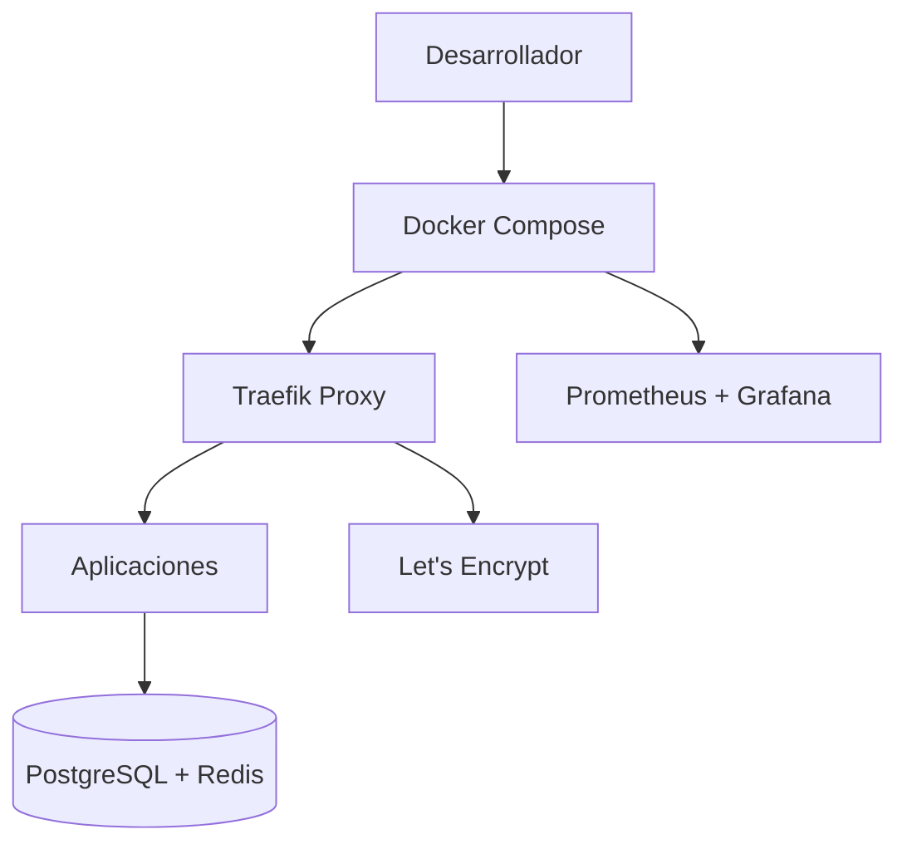
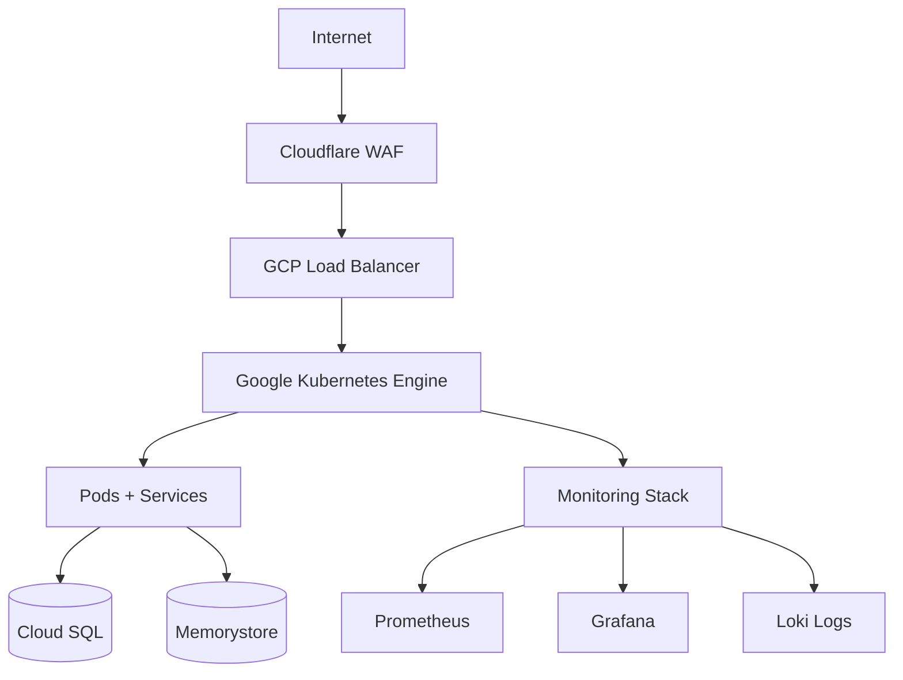

# 🏗️ Infrastructure & DevOps - Guía Completa

Documentación especializada para infraestructura moderna, desde Docker local hasta Kubernetes en producción.

## 🎯 Objetivos

- 🐳 Contenedorización con Docker
- ☸️ Orquestación con Kubernetes
- 🔄 CI/CD automatizado
- 📊 Observabilidad completa
- 🔐 Seguridad hardened

## 📚 Guías Especializadas

### 🛠️ **Desarrollo**

- **[Docker Development](./docker-development.md)** - Entorno local optimizado
- **[CI/CD Pipelines](./ci-cd-pipelines.md)** - GitHub Actions avanzado

### ☁️ **Producción**

- **[Kubernetes Production](./kubernetes-production.md)** - GKE y escalabilidad
- **[Terraform IaC](./terraform-iac.md)** - Infrastructure as Code

### 📊 **Observabilidad**

- **[Monitoring & Observability](./monitoring-observability.md)** - Prometheus, Grafana, Loki
- **[Security Hardening](./security-hardening.md)** - Seguridad y best practices

## 🏢 Arquitectura de Entornos

### 🛠️ Desarrollo (VPS/Local)



### ☁️ Producción (Google Cloud)



## 🛠️ Stack de Infraestructura

| Tecnología     | Desarrollo       | Producción         | Propósito        |
| -------------- | ---------------- | ------------------ | ---------------- |
| **Containers** | Docker Compose   | Kubernetes (GKE)   | Orquestación     |
| **Proxy**      | Traefik          | Traefik + GCP LB   | Load balancing   |
| **SSL**        | Let's Encrypt    | Cert-manager       | Certificados TLS |
| **DNS**        | Local hosts      | Cloudflare         | DNS y CDN        |
| **Monitoring** | Prometheus local | Prometheus cluster | Métricas         |
| **Logs**       | Docker logs      | Loki + Grafana     | Centralized logs |
| **CI/CD**      | GitHub Actions   | GitHub Actions     | Automatización   |

## ⚡ Quick Start Infrastructure

### 🛠️ Desarrollo Local

```bash
# 1. Clonar repositorio
git clone <repo-url>
cd ecommerce-platform

# 2. Configurar variables
cp .env.example .env

# 3. Levantar infraestructura
docker-compose up -d

# 4. Verificar servicios
curl https://dev.implementos.cl
curl https://api.dev.implementos.cl/health
```

### ☁️ Producción GCP

```bash
# 1. Configurar Terraform
cd terraform/
terraform init
terraform plan

# 2. Crear infraestructura
terraform apply

# 3. Configurar kubectl
gcloud container clusters get-credentials ecommerce-cluster

# 4. Deploy con Helm
helmfile -e production apply
```

## 🎯 Características Implementadas

### ✅ Desarrollo

- [x] Docker Compose multi-servicio
- [x] Traefik con SSL automático
- [x] Hot reload para desarrollo
- [x] Base de datos persistentes
- [x] Monitoring básico

### ✅ Producción

- [x] Kubernetes cluster (GKE)
- [x] Auto-scaling horizontal/vertical
- [x] Rolling deployments
- [x] Health checks automáticos
- [x] Backup automático

### ✅ CI/CD

- [x] Pipeline multi-stage
- [x] Testing automatizado
- [x] Build optimizado
- [x] Deploy por ambiente
- [x] Rollback automático

### ✅ Observabilidad

- [x] Métricas de aplicación
- [x] Logs centralizados
- [x] Distributed tracing
- [x] Alertas inteligentes
- [x] Dashboards business

## 🔐 Seguridad Implementada

### 🛡️ **Network Security**

- **Network Policies**: Micro-segmentación en K8s
- **WAF**: Cloudflare Web Application Firewall
- **DDoS Protection**: Cloudflare + GCP shielding

### 🔒 **Application Security**

- **TLS Everywhere**: Cert-manager + Let's Encrypt
- **RBAC**: Role-Based Access Control
- **Secrets Management**: Sealed Secrets + Google Secret Manager
- **Image Scanning**: Vulnerability scanning en CI/CD

### 📊 **Monitoring Security**

- **Audit Logs**: Todos los accesos registrados
- **Intrusion Detection**: Alertas por patrones anómalos
- **Compliance**: Logs para auditorías

## 🚀 Roadmap de Implementación

### 📅 **Semana 1**: Fundamentos

- [ ] Docker Compose funcional
- [ ] SSL automático con Traefik
- [ ] Bases de datos persistentes
- [ ] Monitoring básico

### 📅 **Semana 2**: CI/CD

- [ ] Pipeline GitHub Actions
- [ ] Testing automatizado
- [ ] Build multi-arch
- [ ] Deploy automático

### 📅 **Semana 3**: Producción

- [ ] Infraestructura GKE
- [ ] Helm charts completos
- [ ] Observabilidad avanzada
- [ ] Backup y disaster recovery

### 📅 **Semana 4**: Optimización

- [ ] Performance tuning
- [ ] Security hardening
- [ ] Cost optimization
- [ ] Documentation completa

## 🔗 Enlaces Rápidos

### Implementación

- [🛠️ Production Configs](../../examples/production-configs/) - Configuraciones reales
- [📦 Infrastructure Template](../../templates/infrastructure-template/) - Template K8s completo

### Otras Áreas

- [⚙️ Backend Services](../backend/) - Microservicios para deploy
- [🎨 Frontend Apps](../frontend/) - Apps para build y deploy

---

**🎯 Próximo paso**: Comienza con [Docker Development](./docker-development.md) para setup local rápido.
