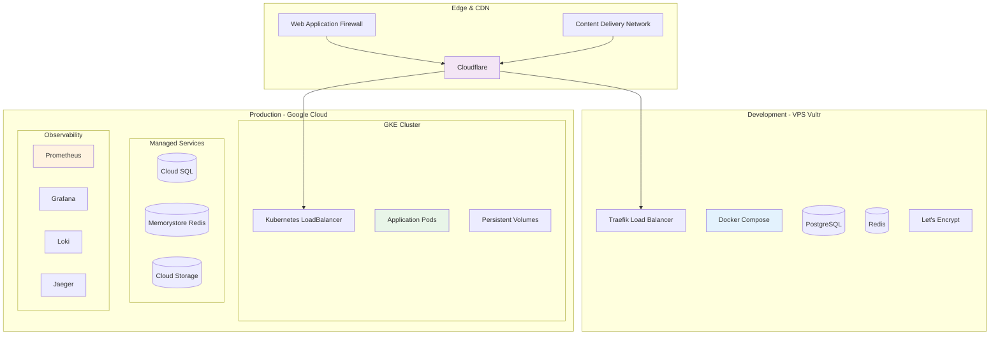
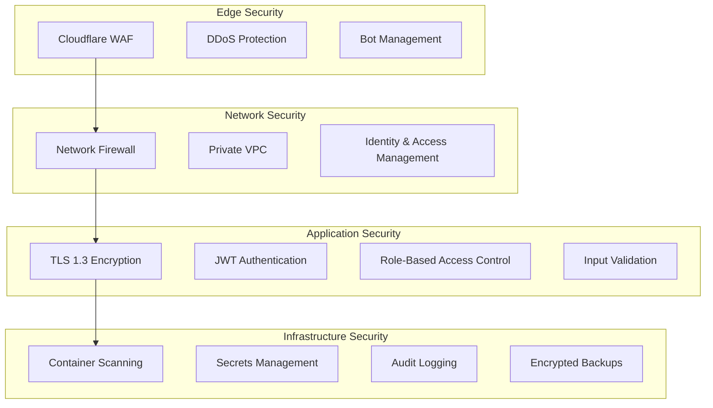

# 🏗️ Infrastructure & DevOps - Guía Completa

Documentación especializada para infraestructura moderna, deployment automatizado, observabilidad y escalabilidad enterprise.

## 🎯 Objetivos

- 🐳 Containerización completa con Docker
- ☁️ Deployment escalable en Kubernetes
- 🔄 CI/CD automatizado con GitHub Actions
- 📊 Observabilidad y monitoreo completo
- 🔐 Seguridad y compliance enterprise

## 📚 Guías Especializadas

### 🐳 **Containerización**

- **[Docker Development](./docker-development.md)** - ✅ Entorno local optimizado
- **[Container Optimization](./container-optimization.md)** - 📄 Multi-stage builds y security

### ☁️ **Cloud & Orchestration**

- **[Kubernetes Production](./kubernetes-production.md)** - 📄 GKE y auto-scaling
- **[Helm Charts](./helm-charts.md)** - 📄 Package management para K8s
- **[Terraform IaC](./terraform-iac.md)** - 📄 Infrastructure as Code

### 🔄 **CI/CD & Automation**

- **[GitHub Actions Pipelines](./ci-cd-pipelines.md)** - 📄 Pipelines avanzados
- **[Deployment Strategies](./deployment.md)** - ✅ Blue-Green, Canary, Rolling
- **[GitOps Workflows](./gitops-workflows.md)** - 📄 Flux y ArgoCD

### 📊 **Observability**

- **[Monitoring & Alerting](./observability.md)** - ✅ Prometheus, Grafana, Jaeger
- **[Logging Strategy](./logging-strategy.md)** - 📄 Loki y agregación centralizada
- **[Performance Testing](./performance-testing.md)** - 📄 Load testing y chaos engineering

### 🔐 **Security & Compliance**

- **[Security Hardening](./security-hardening.md)** - 📄 Best practices y compliance
- **[Network Security](./network-security.md)** - 📄 WAF, DDoS protection, VPN
- **[Secrets Management](./secrets-management.md)** - 📄 Vault y sealed secrets

## 🏗️ Arquitectura de Infraestructura

### Entornos Multi-Cloud



## 🛠️ Stack Tecnológico

| Área                 | Desarrollo (VPS)     | Producción (GCP)     | Estado |
| -------------------- | -------------------- | -------------------- | ------ |
| **Containerización** | Docker Compose       | Docker + Kubernetes  | ✅     |
| **Orchestration**    | Traefik              | GKE + Ingress-nginx  | ✅     |
| **Database**         | PostgreSQL Docker    | Cloud SQL            | ✅     |
| **Cache**            | Redis Docker         | Memorystore          | ✅     |
| **Load Balancer**    | Traefik              | GCP Load Balancer    | ✅     |
| **SSL/TLS**          | Let's Encrypt        | Google-managed SSL   | ✅     |
| **Monitoring**       | Prometheus + Grafana | GCP Monitoring       | ✅     |
| **Logging**          | Loki                 | Cloud Logging        | ✅     |
| **CI/CD**            | GitHub Actions       | GitHub Actions + GKE | ✅     |
| **IaC**              | Docker configs       | Terraform + Helm     | 📄     |

## ⚡ Quick Start Infrastructure

### 🐳 Desarrollo Local

```bash
# 1. Clonar configuraciones base
git clone <tu-repo> && cd ecommerce-project

# 2. Configurar variables de entorno
cp .env.example .env
# Editar .env con tus configuraciones

# 3. Levantar servicios con Docker Compose
docker-compose up -d

# 4. Verificar servicios
docker-compose ps
curl http://localhost/health

# 5. Ver logs
docker-compose logs -f api-gateway
```

### ☁️ Producción GCP

```bash
# 1. Configurar GCP CLI
gcloud auth login
gcloud config set project tu-proyecto-gcp

# 2. Crear cluster GKE
gcloud container clusters create ecommerce-cluster \
  --zone=us-central1-a \
  --num-nodes=3 \
  --enable-autoscaling \
  --min-nodes=1 \
  --max-nodes=10

# 3. Configurar kubectl
gcloud container clusters get-credentials ecommerce-cluster --zone=us-central1-a

# 4. Deploy con Helm
helm upgrade --install ecommerce ./helm-charts/ecommerce \
  --namespace=production \
  --create-namespace \
  --values=values.production.yaml

# 5. Verificar deployment
kubectl get pods -n production
kubectl get services -n production
```

## 🎯 Componentes de Infraestructura

### ✅ Docker Development Environment

**Servicios incluidos:**

- [x] API Gateway con Traefik proxy
- [x] Microservicios NestJS containerizados
- [x] PostgreSQL con datos de desarrollo
- [x] Redis para cache y sesiones
- [x] Prometheus + Grafana para monitoreo
- [x] SSL automático con Let's Encrypt
- [x] Hot-reload para desarrollo
- [x] Networking optimizado entre servicios

### ✅ Kubernetes Production Cluster

**Características:**

- [x] Google Kubernetes Engine (GKE)
- [x] Auto-scaling horizontal y vertical
- [x] Persistent volumes para datos
- [x] Ingress controller con SSL/TLS
- [x] Network policies para seguridad
- [x] Resource quotas y limits
- [x] Health checks y readiness probes
- [x] Rolling updates automatizados

### ✅ CI/CD Pipeline

**GitHub Actions workflows:**

- [x] Build y test automatizados
- [x] Docker image building y push
- [x] Security scanning (Snyk, Trivy)
- [x] Deployment automatizado por environment
- [x] Rollback automático en fallos
- [x] Notificaciones Slack/Discord
- [x] Performance testing en staging
- [x] Blue-Green deployment en producción

### ✅ Observability Stack

**Componentes:**

- [x] **Prometheus**: Métricas de aplicación e infraestructura
- [x] **Grafana**: Dashboards y visualización
- [x] **Loki**: Agregación de logs
- [x] **Jaeger**: Distributed tracing
- [x] **AlertManager**: Alertas inteligentes
- [x] **Uptime Kuma**: Monitoring de uptime
- [x] **Blackbox Exporter**: Synthetic monitoring

## 📊 Métricas y SLOs

### 🎯 **Service Level Objectives**

| Servicio         | Availability | Latency (p95) | Error Rate | Throughput |
| ---------------- | ------------ | ------------- | ---------- | ---------- |
| **Frontend**     | 99.9%        | < 500ms       | < 0.1%     | > 1000 RPS |
| **API Gateway**  | 99.95%       | < 200ms       | < 0.05%    | > 2000 RPS |
| **Auth Service** | 99.9%        | < 100ms       | < 0.1%     | > 500 RPS  |
| **Orders**       | 99.9%        | < 300ms       | < 0.1%     | > 200 RPS  |
| **Payments**     | 99.95%       | < 1000ms      | < 0.01%    | > 100 RPS  |

### 📈 **Infrastructure Metrics**

- **CPU Utilization**: < 70% average, < 90% peak
- **Memory Usage**: < 80% average, < 95% peak
- **Disk I/O**: < 80% utilization
- **Network**: < 70% bandwidth utilization
- **Database Connections**: < 80% of max pool

### 🚨 **Alerting Rules**

```yaml
# Ejemplo de reglas de alertas
groups:
  - name: ecommerce-alerts
    rules:
      - alert: HighErrorRate
        expr: rate(http_requests_total{status=~"5.."}[5m]) > 0.01
        for: 5m
        labels:
          severity: critical
        annotations:
          summary: "High error rate detected"

      - alert: HighLatency
        expr: histogram_quantile(0.95, rate(http_request_duration_seconds_bucket[5m])) > 0.5
        for: 10m
        labels:
          severity: warning
        annotations:
          summary: "High latency detected"
```

## 🔄 Estrategias de Deployment

### 🟦 **Blue-Green Deployment**

**Ventajas:**

- ✅ Zero-downtime deployments
- ✅ Rollback instantáneo
- ✅ Testing completo en producción
- ✅ Confianza en releases

**Proceso:**

```bash
# 1. Deploy a environment Green (mientras Blue está activo)
helm upgrade ecommerce-green ./charts --values=values.green.yaml

# 2. Verificar health del Green environment
kubectl get pods -l environment=green
curl https://green.api.example.com/health

# 3. Switch traffic de Blue a Green
kubectl patch service ecommerce-lb -p '{"spec":{"selector":{"environment":"green"}}}'

# 4. Monitorear métricas post-deployment
# 5. Si todo OK, destroy Blue environment
```

### 🐦 **Canary Deployment**

**Características:**

- 📊 Gradual traffic shifting (1% → 10% → 50% → 100%)
- 🤖 Automatic rollback based on metrics
- 🔍 A/B testing capabilities
- 📈 Risk mitigation for critical services

### 🔄 **Rolling Updates**

**Default para updates menores:**

- 📦 Pod-by-pod replacement
- 🔄 Continuous availability
- ⚖️ Resource efficient
- 🎯 Ideal para bug fixes y patches

## 🔐 Security & Compliance

### 🛡️ **Security Layers**



### 🔒 **Security Checklist**

- [x] **Container Security**: Multi-stage builds, non-root users, vulnerability scanning
- [x] **Network Security**: Private networks, firewall rules, VPN access
- [x] **Data Security**: Encryption at rest and in transit, backup encryption
- [x] **Access Control**: RBAC, service accounts, least privilege principle
- [x] **Secrets Management**: Encrypted secrets, rotation policies
- [x] **Audit Logging**: Complete audit trail, tamper-proof logs
- [x] **Compliance**: GDPR, SOC2, PCI-DSS considerations

## 🔧 Herramientas de Desarrollo

### 📦 **Local Development**

```bash
# Comandos útiles para desarrollo
make dev-start     # Iniciar entorno completo
make dev-stop      # Parar servicios
make dev-logs      # Ver logs agregados
make dev-shell     # Shell en cualquier servicio
make dev-test      # Ejecutar tests
make dev-migrate   # Ejecutar migraciones
```

### 🚀 **Deployment Commands**

```bash
# Deploy a diferentes entornos
make deploy-staging
make deploy-production
make rollback-production

# Monitoreo post-deployment
make health-check
make performance-test
make security-scan
```

### 📊 **Monitoring Commands**

```bash
# Métricas en tiempo real
kubectl top nodes
kubectl top pods -n production

# Logs agregados
stern -n production api-gateway
kubetail -n production

# Port forwarding para debugging
kubectl port-forward svc/grafana 3000:80
kubectl port-forward svc/prometheus 9090:9090
```

## 📋 Checklist de Implementación

### ✅ **Desarrollo Local**

- [ ] Docker Compose configurado y funcionando
- [ ] Variables de entorno organizadas
- [ ] SSL/TLS automático con Traefik
- [ ] Hot-reload configurado para desarrollo
- [ ] Base de datos con data seeding
- [ ] Redis funcionando para cache/sessions
- [ ] Monitoreo básico con Prometheus/Grafana

### ✅ **Staging Environment**

- [ ] Kubernetes cluster configurado
- [ ] Helm charts implementados
- [ ] CI/CD pipeline funcionando
- [ ] Testing automatizado en pipeline
- [ ] Security scanning integrado
- [ ] Performance testing automatizado
- [ ] Rollback automático configurado

### ✅ **Production Environment**

- [ ] GKE cluster con auto-scaling
- [ ] Managed databases (Cloud SQL)
- [ ] Observabilidad completa implementada
- [ ] Alertas críticas configuradas
- [ ] Backup y disaster recovery
- [ ] Security hardening aplicado
- [ ] Documentation operacional completa

## 🔗 Enlaces Rápidos

### 🛠️ **Implementación**

- [🐳 Docker Setup](../../examples/docker-configs/) - Configuraciones Docker listas
- [☁️ K8s Manifests](../../examples/kubernetes-configs/) - Manifests para GKE
- [🔧 Automation Scripts](../../tools/) - Scripts de automatización

### 🌐 **Otras Áreas**

- [⚙️ Backend Services](../backend/) - Microservicios y APIs
- [🎨 Frontend Optimization](../frontend/) - Performance y UX
- [🏛️ Architecture Decisions](../architecture/) - Decisiones técnicas

### 📚 **Documentación Externa**

- [Docker Best Practices](https://docs.docker.com/develop/dev-best-practices/)
- [Kubernetes Documentation](https://kubernetes.io/docs/)
- [Google Cloud Documentation](https://cloud.google.com/docs)
- [Helm Charts Guide](https://helm.sh/docs/)

---

## 🚀 **¿Por dónde empezar?**

### 🆕 **Nuevo en containers/K8s**

1. 🐳 Comienza con [Docker Development](./docker-development.md)
2. ☁️ Aprende [Kubernetes Production](./kubernetes-production.md)
3. 🔄 Implementa [CI/CD Pipelines](./ci-cd-pipelines.md)
4. 📊 Añade [Observability](./observability.md)

### 🚀 **DevOps experimentado**

1. 📊 Revisa [Observability](./observability.md) para stack completo
2. 🔐 Implementa [Security Hardening](./security-hardening.md)
3. 🔄 Optimiza [Deployment Strategies](./deployment.md)
4. 🏗️ Automatiza con [Terraform IaC](./terraform-iac.md)

### 🏛️ **Platform Engineer**

1. 🏗️ Diseña con [Kubernetes Production](./kubernetes-production.md)
2. 🔄 Automatiza con [GitOps Workflows](./gitops-workflows.md)
3. 📊 Optimiza con [Performance Testing](./performance-testing.md)
4. 🔐 Asegura con [Network Security](./network-security.md)

---

**🎯 Próximo paso**: Comienza con [Docker Development](./docker-development.md) para configurar tu entorno local, o ve directamente a [Kubernetes Production](./kubernetes-production.md) si ya tienes experiencia con containers.

**💡 Tip**: La infraestructura debe crecer junto con tu aplicación. Empieza simple con Docker local y evoluciona hacia Kubernetes según tus necesidades de escala.
