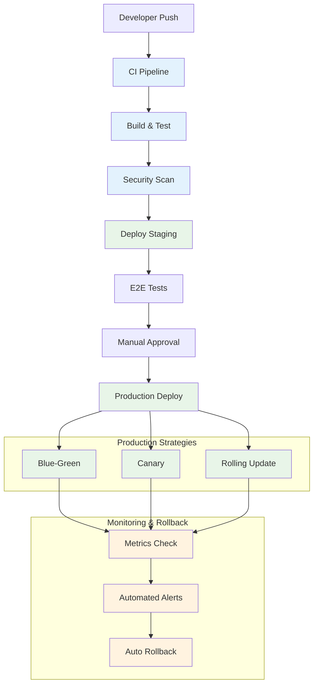
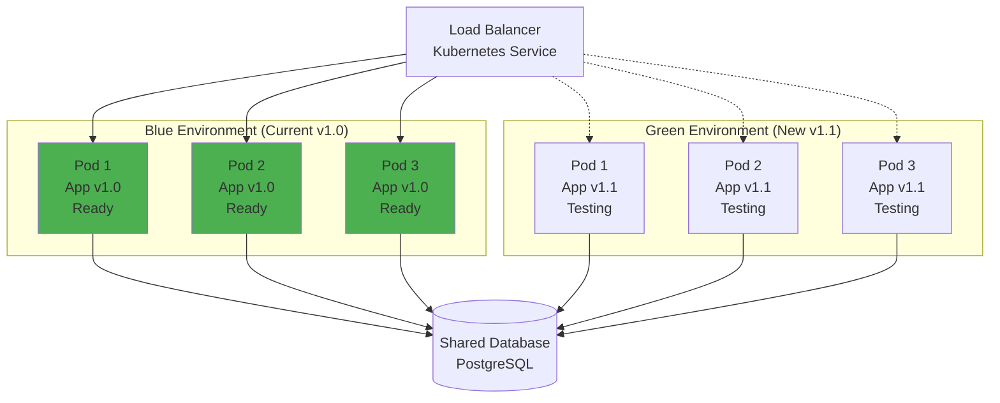
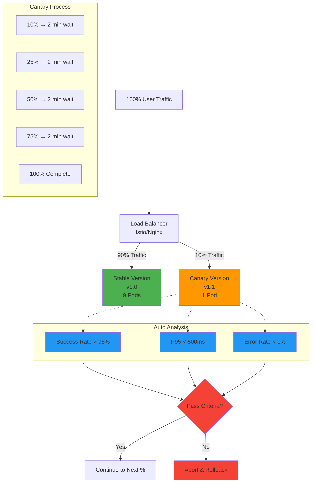
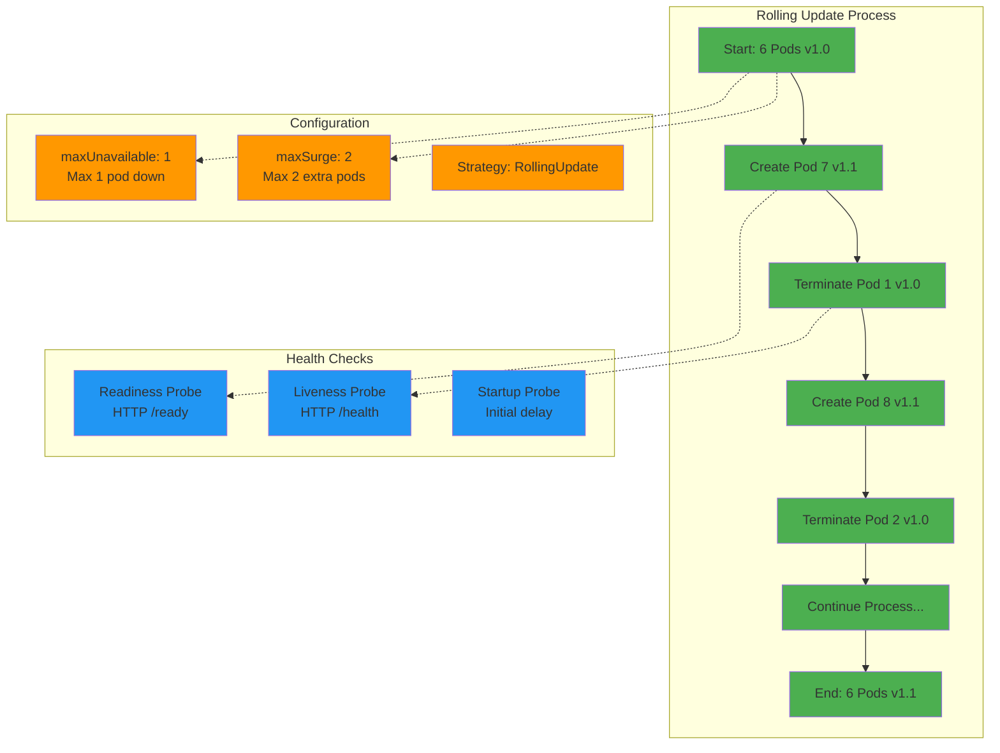

# 🚀 Deployment Strategies - Estrategias de Despliegue

Guía completa para deployments de ecommerce desde desarrollo hasta producción, con estrategias zero-downtime y rollback automático.

## 🎯 Objetivos de Deployment

- **🔄 Zero Downtime**: Deployments sin interrumpir el servicio
- **🛡️ Risk Mitigation**: Rollback automático en caso de problemas
- **📊 Observability**: Monitoring completo durante deployments
- **⚡ Speed**: Deployments rápidos y eficientes
- **🔒 Security**: Deployments seguros con validaciones

## 📊 Pipeline Overview

El siguiente diagrama muestra el flujo completo de CI/CD desde que un desarrollador hace push hasta que el código llega a producción, incluyendo todas las validaciones y estrategias de deployment.



#### 📋 Descripción del Pipeline

**🔄 CI Pipeline (Azul)**

1. **Developer Push**: Desarrollador hace push a main o crea PR
2. **CI Pipeline**: GitHub Actions se activa automáticamente
3. **Build & Test**: Compilación, tests unitarios, linting, coverage
4. **Security Scan**: Trivy escanea vulnerabilidades en dependencias e imagen Docker

**🚀 Deployment Pipeline (Verde)**

1. **Deploy Staging**: Deployment automático a ambiente de staging idéntico a producción
2. **E2E Tests**: Tests end-to-end automáticos que validan flujos críticos del usuario
3. **Manual Approval**: Gate manual para producción (solo se activa en tags de versión)
4. **Production Deploy**: Deployment a producción usando la estrategia configurada

**📊 Monitoring & Rollback (Amarillo)**

1. **Metrics Check**: Monitoreo automático de métricas clave por 5-10 minutos
2. **Automated Alerts**: Sistema de alertas basado en thresholds de error rate, latencia y availability
3. **Auto Rollback**: Rollback automático si las métricas superan los umbrales definidos

#### 🎯 Estrategias de Deployment Disponibles

- **Blue-Green**: Dos ambientes idénticos, switch instantáneo de tráfico
- **Canary**: Despliegue gradual por porcentajes (10% → 25% → 50% → 100%)
- **Rolling Update**: Actualización pod por pod sin downtime, más conservador

#### ⏱️ Tiempos Típicos del Pipeline

- **CI Pipeline**: 5-10 minutos
- **Staging Deploy**: 2-3 minutos
- **E2E Tests**: 10-15 minutos
- **Production Deploy**: 3-8 minutos (según estrategia)
- **Monitoring**: 5-10 minutos de validación automática

## 🏗️ Estrategias de Deployment

### 1. Blue-Green Deployment

Este diagrama muestra cómo funciona el deployment Blue-Green, donde mantenemos dos ambientes idénticos y switcheamos el tráfico instantáneamente entre ellos.



#### 📋 Proceso Blue-Green Detallado

**🔵 Estado Inicial (Blue Activo)**

- Todo el tráfico de usuarios (100%) va al ambiente Blue con versión v1.0
- Ambiente Green está inactivo o ejecutando la versión anterior
- Load Balancer (Kubernetes Service) apunta selectores a pods Blue

**🚀 Deployment Process**

1. **Preparar Green**: Deploy nueva versión v1.1 al ambiente Green en paralelo
2. **Health Checks**: Validar que todos los pods Green están Ready y pasan health checks
3. **Smoke Tests**: Ejecutar tests automáticos contra el ambiente Green
4. **Switch Tráfico**: Actualizar Load Balancer para apuntar de Blue → Green (cambio atómico)
5. **Monitorear**: Observar métricas por período de estabilización (5-10 min)
6. **Cleanup**: Blue queda como backup para rollback inmediato si es necesario

**✅ Ventajas**

- **Zero Downtime**: Switch instantáneo sin pérdida de conexiones
- **Rollback Inmediato**: Volver a Blue en <30 segundos si hay problemas
- **Testing Completo**: Validar Green environment antes del switch
- **Confidence High**: Ambiente idéntico a producción para testing

**❌ Desventajas**

- **Double Resources**: Requiere 2x infraestructura durante deployment
- **Database Complexity**: Shared database puede crear problemas con schema changes
- **Cost Higher**: Más caro durante el período de deployment
- **State Management**: Sessions y state pueden perderse en el switch

#### 🔧 Implementación Kubernetes

```yaml
# k8s/blue-green/frontend-blue.yaml
apiVersion: apps/v1
kind: Deployment
metadata:
  name: frontend-blue
  labels:
    app: frontend
    version: blue
spec:
  replicas: 3
  selector:
    matchLabels:
      app: frontend
      version: blue
  template:
    metadata:
      labels:
        app: frontend
        version: blue
    spec:
      containers:
        - name: frontend
          image: ecommerce/frontend:v1.0.0
          ports:
            - containerPort: 80
          env:
            - name: VERSION
              value: "v1.0.0"
            - name: ENVIRONMENT
              value: "blue"
          resources:
            requests:
              memory: "256Mi"
              cpu: "250m"
            limits:
              memory: "512Mi"
              cpu: "500m"
          livenessProbe:
            httpGet:
              path: /health
              port: 80
            initialDelaySeconds: 30
            periodSeconds: 10
          readinessProbe:
            httpGet:
              path: /ready
              port: 80
            initialDelaySeconds: 5
            periodSeconds: 5
---
apiVersion: v1
kind: Service
metadata:
  name: frontend-service
spec:
  selector:
    app: frontend
    version: blue # Switch to green during deployment
  ports:
    - port: 80
      targetPort: 80
  type: ClusterIP
```

**Blue-Green Switch Script:**

```bash
#!/bin/bash
# scripts/blue-green-switch.sh

set -e

NAMESPACE="ecommerce"
SERVICE_NAME="frontend-service"
NEW_VERSION=$1
CURRENT_VERSION=$(kubectl get service $SERVICE_NAME -n $NAMESPACE -o jsonpath='{.spec.selector.version}')

if [ "$CURRENT_VERSION" = "blue" ]; then
    NEW_COLOR="green"
    OLD_COLOR="blue"
else
    NEW_COLOR="blue"
    OLD_COLOR="green"
fi

echo "🚀 Starting Blue-Green deployment..."
echo "Current: $OLD_COLOR, Target: $NEW_COLOR"

# 1. Deploy new version to inactive environment
echo "📦 Deploying $NEW_VERSION to $NEW_COLOR environment..."
kubectl set image deployment/frontend-$NEW_COLOR frontend=ecommerce/frontend:$NEW_VERSION -n $NAMESPACE

# 2. Wait for rollout to complete
echo "⏳ Waiting for rollout to complete..."
kubectl rollout status deployment/frontend-$NEW_COLOR -n $NAMESPACE --timeout=300s

# 3. Run smoke tests
echo "🧪 Running smoke tests..."
NEW_POD=$(kubectl get pods -n $NAMESPACE -l app=frontend,version=$NEW_COLOR -o jsonpath='{.items[0].metadata.name}')
kubectl port-forward $NEW_POD 8080:80 -n $NAMESPACE &
PORT_FORWARD_PID=$!

sleep 5

# Health check
if curl -f http://localhost:8080/health; then
    echo "✅ Health check passed"
else
    echo "❌ Health check failed"
    kill $PORT_FORWARD_PID
    exit 1
fi

# Basic functionality test
if curl -f http://localhost:8080/api/products | jq '.length > 0'; then
    echo "✅ API test passed"
else
    echo "❌ API test failed"
    kill $PORT_FORWARD_PID
    exit 1
fi

kill $PORT_FORWARD_PID

# 4. Switch traffic
echo "🔄 Switching traffic to $NEW_COLOR environment..."
kubectl patch service $SERVICE_NAME -n $NAMESPACE -p '{"spec":{"selector":{"version":"'$NEW_COLOR'"}}}'

# 5. Verify switch
echo "✅ Traffic switched successfully!"
echo "🔍 Monitoring for 2 minutes..."

# Monitor for issues
for i in {1..24}; do
    sleep 5
    ERROR_RATE=$(curl -s http://your-monitoring-endpoint/error-rate || echo "0")
    if (( $(echo "$ERROR_RATE > 0.05" | bc -l) )); then
        echo "❌ High error rate detected: $ERROR_RATE"
        echo "🔙 Rolling back to $OLD_COLOR"
        kubectl patch service $SERVICE_NAME -n $NAMESPACE -p '{"spec":{"selector":{"version":"'$OLD_COLOR'"}}}'
        exit 1
    fi
    echo "📊 Error rate: $ERROR_RATE ($(($i * 5))s)"
done

echo "🎉 Deployment successful!"
echo "💡 Old version ($OLD_COLOR) can be cleaned up after validation period"
```

### 2. Canary Deployment

Este diagrama muestra cómo funciona un Canary deployment, donde gradualmente aumentamos el porcentaje de tráfico que va a la nueva versión.



#### 📋 Proceso Canary Detallado

**🎯 Estrategia Gradual**

- **Fase 1**: 10% de usuarios → nueva versión, 90% → versión estable
- **Fase 2**: 25% → nueva versión, 75% → versión estable
- **Fase 3**: 50% → nueva versión, 50% → versión estable
- **Fase 4**: 75% → nueva versión, 25% → versión estable
- **Fase 5**: 100% → nueva versión (deployment completo)

**📊 Análisis Automático en Cada Fase**

- **Success Rate**: Debe mantenerse > 95%
- **Response Time**: P95 debe ser < 500ms
- **Error Rate**: Debe mantenerse < 1%
- **Business Metrics**: Conversión, checkout success, etc.

**⏸️ Pausas Automáticas**

- Cada fase tiene una pausa de 2-5 minutos para observar métricas
- Si alguna métrica falla → rollback automático
- Si todas las métricas pasan → continúa a la siguiente fase

**✅ Ventajas**

- **Risk Minimization**: Solo un pequeño % de usuarios afectados si hay problemas
- **Real User Testing**: Feedback real de usuarios en producción
- **Gradual Confidence**: Construir confianza fase por fase
- **Automated Decisions**: Criterios objetivos para continuar o abortar

**❌ Desventajas**

- **Longer Deployment**: Proceso más lento (20-40 minutos total)
- **Complex Setup**: Requiere service mesh (Istio) o ingress avanzado
- **Partial State**: Durante el proceso, usuarios tienen experiencias diferentes
- **Monitoring Required**: Necesita observabilidad robusta para decisiones automáticas

### 3. Rolling Deployment

Este diagrama muestra cómo funciona un Rolling Update, donde actualizamos pods uno por uno manteniendo siempre un número mínimo de pods disponibles.



#### 📋 Proceso Rolling Update Detallado

**🔄 Secuencia de Actualización**

1. **Crear Pod Nuevo**: Kubernetes crea un nuevo pod con la imagen v1.1
2. **Wait for Ready**: Espera que el nuevo pod pase readiness probe
3. **Terminate Old Pod**: Una vez ready, termina un pod con versión anterior
4. **Repeat Process**: Repite hasta que todos los pods estén actualizados
5. **Graceful Shutdown**: Los pods antiguos reciben SIGTERM para shutdown limpio

**⚙️ Configuración Clave**

- **maxUnavailable: 1**: Máximo 1 pod puede estar down simultáneamente
- **maxSurge: 2**: Máximo 2 pods extra durante el proceso
- **progressDeadlineSeconds: 600**: Timeout de 10 minutos para completar

**🏥 Health Checks**

- **Readiness Probe**: `/ready` endpoint - determina si pod puede recibir tráfico
- **Liveness Probe**: `/health` endpoint - determina si pod está funcionando
- **Startup Probe**: Período inicial para que la app se inicie completamente

**✅ Ventajas**

- **Simple Setup**: Configuración nativa de Kubernetes, no requiere herramientas extra
- **Resource Efficient**: Solo usa recursos extra temporalmente
- **Gradual Update**: Cambio gradual minimiza impacto
- **Built-in Rollback**: Kubernetes maneja rollback automáticamente si falla

**❌ Desventajas**

- **Slower Process**: Más lento que Blue-Green (5-15 minutos según replicas)
- **Mixed Versions**: Durante el proceso, múltiples versiones coexisten
- **Limited Control**: Menos control granular sobre el tráfico
- **Potential Issues**: Si hay problemas de compatibilidad entre versiones

#### ⏱️ Timing del Rolling Update

- **Pod Creation**: 30-60 segundos por pod
- **Health Check Wait**: 10-30 segundos por pod
- **Graceful Shutdown**: 15-30 segundos por pod
- **Total Time**: 5-15 minutos para 6-10 pods

## 🔧 CI/CD Pipeline

### GitHub Actions Workflow

```yaml
# .github/workflows/deploy.yml
name: Deploy to Production
on:
  push:
    branches: [main]
    tags: ["v*"]

env:
  REGISTRY: ghcr.io
  NAMESPACE: ecommerce

jobs:
  build:
    runs-on: ubuntu-latest
    outputs:
      image-tag: ${{ steps.meta.outputs.tags }}
      image-digest: ${{ steps.build.outputs.digest }}
    steps:
      - name: Checkout
        uses: actions/checkout@v3

      - name: Set up Docker Buildx
        uses: docker/setup-buildx-action@v2

      - name: Log in to Container Registry
        uses: docker/login-action@v2
        with:
          registry: ${{ env.REGISTRY }}
          username: ${{ github.actor }}
          password: ${{ secrets.GITHUB_TOKEN }}

      - name: Extract metadata
        id: meta
        uses: docker/metadata-action@v4
        with:
          images: ${{ env.REGISTRY }}/${{ github.repository }}
          tags: |
            type=ref,event=branch
            type=ref,event=pr
            type=semver,pattern={{version}}
            type=semver,pattern={{major}}.{{minor}}
            type=sha,prefix={{branch}}-

      - name: Build and push
        id: build
        uses: docker/build-push-action@v4
        with:
          context: .
          push: true
          tags: ${{ steps.meta.outputs.tags }}
          labels: ${{ steps.meta.outputs.labels }}
          cache-from: type=gha
          cache-to: type=gha,mode=max
          platforms: linux/amd64,linux/arm64

  security-scan:
    needs: build
    runs-on: ubuntu-latest
    steps:
      - name: Run Trivy vulnerability scanner
        uses: aquasecurity/trivy-action@master
        with:
          image-ref: ${{ needs.build.outputs.image-tag }}
          format: "sarif"
          output: "trivy-results.sarif"

      - name: Upload Trivy scan results
        uses: github/codeql-action/upload-sarif@v2
        with:
          sarif_file: "trivy-results.sarif"

  deploy-staging:
    needs: [build, security-scan]
    runs-on: ubuntu-latest
    environment: staging
    steps:
      - name: Checkout
        uses: actions/checkout@v3

      - name: Configure kubectl
        run: |
          mkdir -p $HOME/.kube
          echo "${{ secrets.KUBE_CONFIG_STAGING }}" | base64 -d > $HOME/.kube/config

      - name: Deploy to staging
        run: |
          helm upgrade --install ecommerce-staging ./helm/ecommerce \
            --namespace staging \
            --set image.tag=${{ needs.build.outputs.image-tag }} \
            --set environment=staging \
            --wait --timeout=10m

      - name: Run smoke tests
        run: |
          ./scripts/smoke-tests.sh staging

  deploy-production:
    needs: [build, security-scan, deploy-staging]
    runs-on: ubuntu-latest
    environment: production
    if: startsWith(github.ref, 'refs/tags/v')
    steps:
      - name: Checkout
        uses: actions/checkout@v3

      - name: Configure kubectl
        run: |
          mkdir -p $HOME/.kube
          echo "${{ secrets.KUBE_CONFIG_PROD }}" | base64 -d > $HOME/.kube/config

      - name: Blue-Green Deploy
        run: |
          ./scripts/blue-green-deploy.sh ${{ needs.build.outputs.image-tag }}

      - name: Notify deployment
        uses: 8398a7/action-slack@v3
        with:
          status: custom
          custom_payload: |
            {
              text: "🚀 Production deployment successful!",
              attachments: [{
                color: 'good',
                fields: [{
                  title: 'Version',
                  value: '${{ github.ref_name }}',
                  short: true
                }, {
                  title: 'Image',
                  value: '${{ needs.build.outputs.image-tag }}',
                  short: true
                }]
              }]
            }
        env:
          SLACK_WEBHOOK_URL: ${{ secrets.SLACK_WEBHOOK }}
```

### Helm Charts

```yaml
# helm/ecommerce/values.yaml
replicaCount: 3

image:
  repository: ghcr.io/your-org/ecommerce
  tag: "latest"
  pullPolicy: IfNotPresent

nameOverride: ""
fullnameOverride: ""

service:
  type: ClusterIP
  port: 80

ingress:
  enabled: true
  className: "nginx"
  annotations:
    cert-manager.io/cluster-issuer: "letsencrypt-prod"
    nginx.ingress.kubernetes.io/rate-limit: "100"
    nginx.ingress.kubernetes.io/rate-limit-window: "1m"
  hosts:
    - host: api.ecommerce.com
      paths:
        - path: /
          pathType: Prefix
  tls:
    - secretName: ecommerce-tls
      hosts:
        - api.ecommerce.com

resources:
  limits:
    cpu: 500m
    memory: 512Mi
  requests:
    cpu: 250m
    memory: 256Mi

autoscaling:
  enabled: true
  minReplicas: 3
  maxReplicas: 20
  targetCPUUtilizationPercentage: 70
  targetMemoryUtilizationPercentage: 80

nodeSelector: {}

tolerations: []

affinity:
  podAntiAffinity:
    preferredDuringSchedulingIgnoredDuringExecution:
      - weight: 100
        podAffinityTerm:
          labelSelector:
            matchExpressions:
              - key: app.kubernetes.io/name
                operator: In
                values:
                  - ecommerce
          topologyKey: kubernetes.io/hostname

# Database configuration
postgresql:
  enabled: true
  auth:
    username: ecommerce
    database: ecommerce
  primary:
    persistence:
      enabled: true
      size: 20Gi
  readReplicas:
    replicaCount: 2

# Redis configuration
redis:
  enabled: true
  auth:
    enabled: true
  master:
    persistence:
      enabled: true
      size: 8Gi

# Monitoring
monitoring:
  enabled: true
  serviceMonitor:
    enabled: true
    interval: 30s
    path: /metrics

# Environment specific values
environment: production

config:
  logLevel: info
  features:
    newCheckout: true
    recommendationEngine: true
```

```yaml
# helm/ecommerce/templates/deployment.yaml
apiVersion: apps/v1
kind: Deployment
metadata:
  name: {{ include "ecommerce.fullname" . }}
  labels:
    {{- include "ecommerce.labels" . | nindent 4 }}
spec:
  {{- if not .Values.autoscaling.enabled }}
  replicas: {{ .Values.replicaCount }}
  {{- end }}
  strategy:
    type: RollingUpdate
    rollingUpdate:
      maxUnavailable: 1
      maxSurge: 2
  selector:
    matchLabels:
      {{- include "ecommerce.selectorLabels" . | nindent 6 }}
  template:
    metadata:
      annotations:
        checksum/config: {{ include (print $.Template.BasePath "/configmap.yaml") . | sha256sum }}
        prometheus.io/scrape: "true"
        prometheus.io/port: "3000"
        prometheus.io/path: "/metrics"
      labels:
        {{- include "ecommerce.selectorLabels" . | nindent 8 }}
    spec:
      securityContext:
        runAsNonRoot: true
        runAsUser: 1001
        fsGroup: 1001
      containers:
        - name: {{ .Chart.Name }}
          securityContext:
            allowPrivilegeEscalation: false
            readOnlyRootFilesystem: true
            capabilities:
              drop:
              - ALL
          image: "{{ .Values.image.repository }}:{{ .Values.image.tag | default .Chart.AppVersion }}"
          imagePullPolicy: {{ .Values.image.pullPolicy }}
          ports:
            - name: http
              containerPort: 3000
              protocol: TCP
          env:
            - name: NODE_ENV
              value: {{ .Values.environment }}
            - name: LOG_LEVEL
              value: {{ .Values.config.logLevel }}
            - name: DATABASE_URL
              valueFrom:
                secretKeyRef:
                  name: {{ include "ecommerce.fullname" . }}-secrets
                  key: database-url
            - name: REDIS_URL
              valueFrom:
                secretKeyRef:
                  name: {{ include "ecommerce.fullname" . }}-secrets
                  key: redis-url
          livenessProbe:
            httpGet:
              path: /health
              port: http
            initialDelaySeconds: 30
            periodSeconds: 10
            timeoutSeconds: 5
            failureThreshold: 3
          readinessProbe:
            httpGet:
              path: /ready
              port: http
            initialDelaySeconds: 5
            periodSeconds: 5
            timeoutSeconds: 3
            failureThreshold: 3
          resources:
            {{- toYaml .Values.resources | nindent 12 }}
          volumeMounts:
          - name: tmp
            mountPath: /tmp
          - name: cache
            mountPath: /app/.cache
      volumes:
      - name: tmp
        emptyDir: {}
      - name: cache
        emptyDir: {}
      {{- with .Values.nodeSelector }}
      nodeSelector:
        {{- toYaml . | nindent 8 }}
      {{- end }}
      {{- with .Values.affinity }}
      affinity:
        {{- toYaml . | nindent 8 }}
      {{- end }}
      {{- with .Values.tolerations }}
      tolerations:
        {{- toYaml . | nindent 8 }}
      {{- end }}
```

## 📊 Monitoring & Observability

### Deployment Metrics

```yaml
# k8s/monitoring/deployment-monitor.yaml
apiVersion: monitoring.coreos.com/v1
kind: ServiceMonitor
metadata:
  name: deployment-metrics
spec:
  selector:
    matchLabels:
      app: ecommerce
  endpoints:
    - port: metrics
      interval: 30s
      path: /metrics
---
apiVersion: monitoring.coreos.com/v1
kind: PrometheusRule
metadata:
  name: deployment-alerts
spec:
  groups:
    - name: deployment.rules
      rules:
        - alert: DeploymentReplicasMismatch
          expr: |
            kube_deployment_spec_replicas{job="kube-state-metrics"}
            !=
            kube_deployment_status_replicas_available{job="kube-state-metrics"}
          for: 15m
          labels:
            severity: warning
          annotations:
            summary: "Deployment has mismatched replicas"
            description: "Deployment {{ $labels.deployment }} in {{ $labels.namespace }} has {{ $value }} replicas available, but {{ $labels.spec_replicas }} were requested."

        - alert: PodCrashLooping
          expr: |
            rate(kube_pod_container_status_restarts_total[5m]) * 60 * 5 > 0
          for: 15m
          labels:
            severity: critical
          annotations:
            summary: "Pod is crash looping"
            description: "Pod {{ $labels.pod }} in {{ $labels.namespace }} is crash looping."

        - alert: HighErrorRate
          expr: |
            sum(rate(http_requests_total{status=~"5.."}[5m])) by (service)
            /
            sum(rate(http_requests_total[5m])) by (service)
            > 0.05
          for: 5m
          labels:
            severity: critical
          annotations:
            summary: "High error rate detected"
            description: "Service {{ $labels.service }} has error rate above 5%"
```

### Deployment Dashboard

```json
{
  "dashboard": {
    "title": "Deployment Monitoring",
    "panels": [
      {
        "title": "Deployment Status",
        "type": "stat",
        "targets": [
          {
            "expr": "kube_deployment_status_replicas_available{deployment=\"frontend\"}",
            "legendFormat": "Available Replicas"
          }
        ]
      },
      {
        "title": "Pod Restart Rate",
        "type": "graph",
        "targets": [
          {
            "expr": "rate(kube_pod_container_status_restarts_total[5m])",
            "legendFormat": "{{ pod }}"
          }
        ]
      },
      {
        "title": "Request Success Rate",
        "type": "graph",
        "targets": [
          {
            "expr": "sum(rate(http_requests_total{status!~\"5..\"}[5m])) / sum(rate(http_requests_total[5m]))",
            "legendFormat": "Success Rate"
          }
        ]
      },
      {
        "title": "Response Time P95",
        "type": "graph",
        "targets": [
          {
            "expr": "histogram_quantile(0.95, sum(rate(http_request_duration_seconds_bucket[5m])) by (le))",
            "legendFormat": "P95 Response Time"
          }
        ]
      }
    ]
  }
}
```

## 🛡️ Rollback Strategies

### Automatic Rollback Script

```bash
#!/bin/bash
# scripts/auto-rollback.sh

set -e

NAMESPACE="ecommerce"
DEPLOYMENT="frontend"
ERROR_THRESHOLD=0.05
RESPONSE_TIME_THRESHOLD=1.0  # 1 second
CHECK_DURATION=300  # 5 minutes

echo "🔍 Starting deployment monitoring for auto-rollback..."

REVISION=$(kubectl rollout history deployment/$DEPLOYMENT -n $NAMESPACE --format=json | jq -r '.items | length')
echo "📋 Current revision: $REVISION"

# Monitor deployment for issues
for i in $(seq 1 60); do  # 5 minutes (60 * 5s intervals)
    sleep 5

    # Check error rate
    ERROR_RATE=$(curl -s "http://prometheus:9090/api/v1/query?query=sum(rate(http_requests_total{status=~\"5..\"}[2m]))/sum(rate(http_requests_total[2m]))" | jq -r '.data.result[0].value[1] // "0"')

    # Check response time
    RESPONSE_TIME=$(curl -s "http://prometheus:9090/api/v1/query?query=histogram_quantile(0.95,sum(rate(http_request_duration_seconds_bucket[2m]))by(le))" | jq -r '.data.result[0].value[1] // "0"')

    echo "📊 Error Rate: $ERROR_RATE, Response Time: $RESPONSE_TIME (${i}0s)"

    # Check if rollback is needed
    if (( $(echo "$ERROR_RATE > $ERROR_THRESHOLD" | bc -l) )); then
        echo "❌ Error rate exceeded threshold! Initiating rollback..."
        kubectl rollout undo deployment/$DEPLOYMENT -n $NAMESPACE --to-revision=$((REVISION-1))
        kubectl rollout status deployment/$DEPLOYMENT -n $NAMESPACE

        # Send alert
        curl -X POST "$SLACK_WEBHOOK" -H 'Content-type: application/json' \
             --data "{\"text\":\"🚨 Auto-rollback triggered for $DEPLOYMENT due to high error rate: $ERROR_RATE\"}"

        exit 1
    fi

    if (( $(echo "$RESPONSE_TIME > $RESPONSE_TIME_THRESHOLD" | bc -l) )); then
        echo "❌ Response time exceeded threshold! Initiating rollback..."
        kubectl rollout undo deployment/$DEPLOYMENT -n $NAMESPACE --to-revision=$((REVISION-1))
        kubectl rollout status deployment/$DEPLOYMENT -n $NAMESPACE

        # Send alert
        curl -X POST "$SLACK_WEBHOOK" -H 'Content-type: application/json' \
             --data "{\"text\":\"🚨 Auto-rollback triggered for $DEPLOYMENT due to high response time: $RESPONSE_TIME\"}"

        exit 1
    fi
done

echo "✅ Deployment monitoring completed successfully!"

# Send success notification
curl -X POST "$SLACK_WEBHOOK" -H 'Content-type: application/json' \
     --data "{\"text\":\"✅ Deployment of $DEPLOYMENT completed successfully and is stable\"}"
```

### Manual Rollback Commands

```bash
# Ver historial de deployments
kubectl rollout history deployment/frontend -n ecommerce

# Rollback a la versión anterior
kubectl rollout undo deployment/frontend -n ecommerce

# Rollback a una versión específica
kubectl rollout undo deployment/frontend -n ecommerce --to-revision=3

# Ver status del rollback
kubectl rollout status deployment/frontend -n ecommerce

# Verificar que el rollback fue exitoso
kubectl get pods -n ecommerce -l app=frontend
```

## 🎯 Best Practices

### 1. Pre-Deployment Checks

```bash
#!/bin/bash
# scripts/pre-deployment-checks.sh

echo "🔍 Running pre-deployment checks..."

# 1. Check cluster health
if ! kubectl get nodes | grep -q "Ready"; then
    echo "❌ Cluster nodes not ready"
    exit 1
fi

# 2. Check resource availability
CPU_USAGE=$(kubectl top nodes --no-headers | awk '{sum+=$3} END {print sum/NR}')
if (( $(echo "$CPU_USAGE > 80" | bc -l) )); then
    echo "❌ High CPU usage: $CPU_USAGE%"
    exit 1
fi

# 3. Check database connectivity
if ! kubectl exec -n ecommerce deployment/api-gateway -- curl -f http://postgres:5432; then
    echo "❌ Database connectivity failed"
    exit 1
fi

# 4. Check external dependencies
if ! curl -f https://api.stripe.com/v1; then
    echo "❌ Stripe API unavailable"
    exit 1
fi

echo "✅ All pre-deployment checks passed"
```

### 2. Post-Deployment Validation

```bash
#!/bin/bash
# scripts/post-deployment-validation.sh

NAMESPACE="ecommerce"
APP_URL="https://api.ecommerce.com"

echo "🧪 Running post-deployment validation..."

# 1. Health check
if ! curl -f "$APP_URL/health"; then
    echo "❌ Health check failed"
    exit 1
fi

# 2. API functionality test
PRODUCT_COUNT=$(curl -s "$APP_URL/api/products" | jq '. | length')
if [ "$PRODUCT_COUNT" -lt 1 ]; then
    echo "❌ Products API returned no results"
    exit 1
fi

# 3. Database connectivity
if ! curl -f "$APP_URL/api/health/database"; then
    echo "❌ Database connectivity check failed"
    exit 1
fi

# 4. Critical user journey test
ORDER_RESPONSE=$(curl -s -X POST "$APP_URL/api/orders/test" -H "Content-Type: application/json" -d '{"test": true}')
if ! echo "$ORDER_RESPONSE" | jq -e '.success'; then
    echo "❌ Order creation test failed"
    exit 1
fi

echo "✅ All post-deployment validations passed"
```

### 3. Emergency Procedures

```yaml
# k8s/emergency/circuit-breaker.yaml
apiVersion: networking.istio.io/v1beta1
kind: DestinationRule
metadata:
  name: frontend-circuit-breaker
spec:
  host: frontend
  trafficPolicy:
    outlierDetection:
      consecutiveGatewayErrors: 5
      consecutive5xxErrors: 5
      interval: 30s
      baseEjectionTime: 30s
      maxEjectionPercent: 50
    connectionPool:
      tcp:
        maxConnections: 100
      http:
        http1MaxPendingRequests: 100
        maxRequestsPerConnection: 10
        maxRetries: 3
        consecutiveGatewayErrors: 5
        interval: 30s
        baseEjectionTime: 30s
```

## 🚀 Deployment Checklist

### Pre-Production

- [ ] **Code Quality**

  - [ ] All tests passing
  - [ ] Code review completed
  - [ ] Security scan passed
  - [ ] Performance benchmarks met

- [ ] **Infrastructure Ready**

  - [ ] Target environment healthy
  - [ ] Resources available
  - [ ] Dependencies accessible
  - [ ] Monitoring configured

- [ ] **Deployment Plan**
  - [ ] Strategy selected (Blue-Green/Canary/Rolling)
  - [ ] Rollback plan documented
  - [ ] Communication plan ready
  - [ ] Emergency contacts available

### During Deployment

- [ ] **Monitor Metrics**

  - [ ] Error rates within SLA
  - [ ] Response times acceptable
  - [ ] Resource utilization normal
  - [ ] External dependencies healthy

- [ ] **Validate Functionality**
  - [ ] Health checks passing
  - [ ] Critical paths working
  - [ ] Database connectivity confirmed
  - [ ] External integrations functional

### Post-Deployment

- [ ] **Stability Check**

  - [ ] No error spikes
  - [ ] Performance stable
  - [ ] User feedback positive
  - [ ] Business metrics normal

- [ ] **Documentation**
  - [ ] Deployment notes updated
  - [ ] Runbook updated
  - [ ] Known issues documented
  - [ ] Next steps planned

---

**🎯 Próximo paso**: Elige la estrategia de deployment que mejor se adapte a tu caso y implementa el pipeline CI/CD completo.
