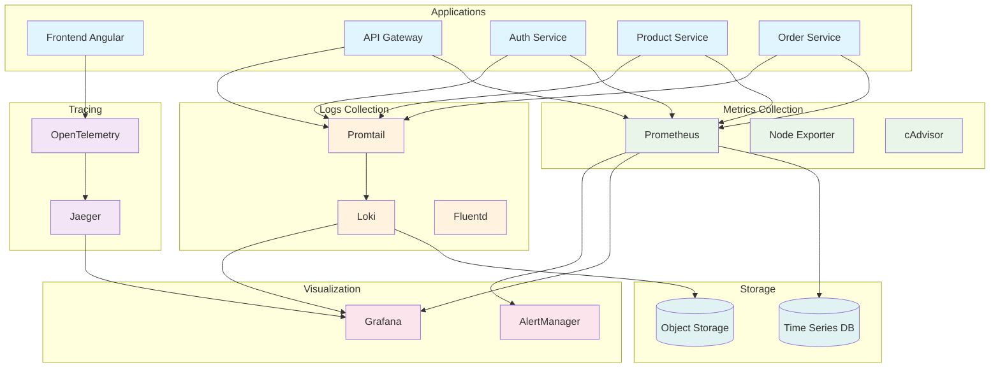

# 📊 Observability & Performance Infrastructure

Guía completa para implementar observabilidad a nivel de infraestructura, incluyendo métricas de servidor, logs centralizados y distributed tracing para microservicios.

## 🎯 Stack de Observabilidad

- **Metrics**: Prometheus + Grafana + AlertManager
- **Logs**: Loki + Promtail + Grafana
- **Traces**: Jaeger + OpenTelemetry
- **APM**: Application Performance Monitoring
- **Dashboards**: Grafana + Custom dashboards

## 🏗️ Arquitectura de Observabilidad



## 🔧 Configuración Prometheus

### prometheus.yml

```yaml
# infrastructure/monitoring/prometheus/prometheus.yml
global:
  scrape_interval: 15s
  evaluation_interval: 15s

rule_files:
  - "alerts/*.yml"

alerting:
  alertmanagers:
    - static_configs:
        - targets:
            - alertmanager:9093

scrape_configs:
  # API Gateway metrics
  - job_name: "api-gateway"
    static_configs:
      - targets: ["api-gateway:3000"]
    metrics_path: "/metrics"
    scrape_interval: 10s

  # Microservices
  - job_name: "auth-service"
    static_configs:
      - targets: ["auth-service:3001"]
    metrics_path: "/metrics"

  - job_name: "product-service"
    static_configs:
      - targets: ["product-service:3002"]
    metrics_path: "/metrics"

  - job_name: "order-service"
    static_configs:
      - targets: ["order-service:3003"]
    metrics_path: "/metrics"

  # Infrastructure metrics
  - job_name: "node-exporter"
    static_configs:
      - targets: ["node-exporter:9100"]

  - job_name: "cadvisor"
    static_configs:
      - targets: ["cadvisor:8080"]

  # Database metrics
  - job_name: "postgres-exporter"
    static_configs:
      - targets: ["postgres-exporter:9187"]

  - job_name: "redis-exporter"
    static_configs:
      - targets: ["redis-exporter:9121"]
```

### Alerting Rules

```yaml
# infrastructure/monitoring/prometheus/alerts/performance.yml
groups:
  - name: performance.rules
    rules:
      # High latency alerts
      - alert: HighLatency
        expr: histogram_quantile(0.95, http_request_duration_seconds_bucket) > 1
        for: 5m
        labels:
          severity: warning
        annotations:
          summary: "High latency detected"
          description: "95th percentile latency is above 1 second"

      # High error rate
      - alert: HighErrorRate
        expr: rate(http_requests_total{status=~"5.."}[5m]) > 0.1
        for: 2m
        labels:
          severity: critical
        annotations:
          summary: "High error rate detected"
          description: "Error rate is above 10% for 2 minutes"

      # Low success rate
      - alert: LowSuccessRate
        expr: rate(http_requests_total{status=~"2.."}[5m]) / rate(http_requests_total[5m]) < 0.95
        for: 5m
        labels:
          severity: warning
        annotations:
          summary: "Low success rate"
          description: "Success rate is below 95%"

      # Database connection issues
      - alert: DatabaseConnectionHigh
        expr: postgresql_active_connections > 80
        for: 2m
        labels:
          severity: warning
        annotations:
          summary: "High database connections"
          description: "PostgreSQL active connections are above 80"
```

## 📊 Dashboards Grafana

### Performance Dashboard

```json
{
  "dashboard": {
    "title": "Ecommerce Performance Dashboard",
    "panels": [
      {
        "title": "Request Rate",
        "type": "graph",
        "targets": [
          {
            "expr": "rate(http_requests_total[5m])",
            "legendFormat": "{{service}} - {{method}}"
          }
        ]
      },
      {
        "title": "Response Time (95th percentile)",
        "type": "graph",
        "targets": [
          {
            "expr": "histogram_quantile(0.95, rate(http_request_duration_seconds_bucket[5m]))",
            "legendFormat": "{{service}}"
          }
        ]
      },
      {
        "title": "Error Rate",
        "type": "graph",
        "targets": [
          {
            "expr": "rate(http_requests_total{status=~\"5..\"}[5m]) / rate(http_requests_total[5m])",
            "legendFormat": "{{service}}"
          }
        ]
      }
    ]
  }
}
```

## 🔍 Distributed Tracing

### OpenTelemetry Setup

```typescript
// libs/observability/src/lib/tracing.service.ts
import { Injectable } from "@nestjs/common";
import { NodeSDK } from "@opentelemetry/auto-instrumentations-node";
import { Resource } from "@opentelemetry/resources";
import { SemanticResourceAttributes } from "@opentelemetry/semantic-conventions";
import { JaegerExporter } from "@opentelemetry/exporter-jaeger";

@Injectable()
export class TracingService {
  private sdk: NodeSDK;

  constructor() {
    this.initializeTracing();
  }

  private initializeTracing() {
    const jaegerExporter = new JaegerExporter({
      endpoint: process.env.JAEGER_ENDPOINT || "http://jaeger:14268/api/traces",
    });

    this.sdk = new NodeSDK({
      resource: Resource.default().merge(
        new Resource({
          [SemanticResourceAttributes.SERVICE_NAME]:
            process.env.SERVICE_NAME || "unknown-service",
          [SemanticResourceAttributes.SERVICE_VERSION]:
            process.env.SERVICE_VERSION || "1.0.0",
          [SemanticResourceAttributes.DEPLOYMENT_ENVIRONMENT]:
            process.env.NODE_ENV || "development",
        })
      ),
      traceExporter: jaegerExporter,
      instrumentations: [
        // Auto-instrumentations will be added here
      ],
    });

    this.sdk.start();
  }

  shutdown() {
    this.sdk.shutdown();
  }
}
```

## 📝 Centralized Logging

### Loki Configuration

```yaml
# infrastructure/monitoring/loki/loki.yml
auth_enabled: false

server:
  http_listen_port: 3100
  grpc_listen_port: 9096

common:
  path_prefix: /loki
  storage:
    filesystem:
      chunks_directory: /loki/chunks
      rules_directory: /loki/rules
  replication_factor: 1
  ring:
    instance_addr: 127.0.0.1
    kvstore:
      store: inmemory

query_range:
  results_cache:
    cache:
      embedded_cache:
        enabled: true
        max_size_mb: 100

schema_config:
  configs:
    - from: 2020-10-24
      store: boltdb-shipper
      object_store: filesystem
      schema: v11
      index:
        prefix: index_
        period: 24h

ruler:
  alertmanager_url: http://alertmanager:9093

limits_config:
  enforce_metric_name: false
  reject_old_samples: true
  reject_old_samples_max_age: 168h
```

### Promtail Configuration

```yaml
# infrastructure/monitoring/promtail/promtail.yml
server:
  http_listen_port: 9080
  grpc_listen_port: 0

positions:
  filename: /tmp/positions.yaml

clients:
  - url: http://loki:3100/loki/api/v1/push

scrape_configs:
  # API Gateway logs
  - job_name: api-gateway
    static_configs:
      - targets:
          - localhost
        labels:
          job: api-gateway
          service: api-gateway
          __path__: /var/log/api-gateway/*.log

  # Microservices logs
  - job_name: microservices
    static_configs:
      - targets:
          - localhost
        labels:
          job: microservices
          __path__: /var/log/services/*.log

  # Nginx logs
  - job_name: nginx
    static_configs:
      - targets:
          - localhost
        labels:
          job: nginx
          __path__: /var/log/nginx/*.log

    pipeline_stages:
      - regex:
          expression: '^(?P<remote_addr>[\w\.]+) - (?P<remote_user>[^ ]*) \[(?P<time_local>[^\]]*)\] "(?P<method>[^ ]*) (?P<request>[^ ]*) (?P<protocol>[^ ]*)" (?P<status>[\d]+) (?P<body_bytes_sent>[\d]+) "(?P<http_referer>[^"]*)" "(?P<http_user_agent>[^"]*)"'
      - labels:
          method:
          status:
          remote_addr:
```

## 🚨 AlertManager Configuration

```yaml
# infrastructure/monitoring/alertmanager/alertmanager.yml
global:
  smtp_smarthost: "localhost:587"
  smtp_from: "alerts@ecommerce.com"

route:
  group_by: ["alertname"]
  group_wait: 10s
  group_interval: 10s
  repeat_interval: 1h
  receiver: "web.hook"
  routes:
    - match:
        severity: critical
      receiver: "critical-alerts"
    - match:
        severity: warning
      receiver: "warning-alerts"

receivers:
  - name: "web.hook"
    webhook_configs:
      - url: "http://webhook-server:5001/webhook"

  - name: "critical-alerts"
    slack_configs:
      - api_url: "YOUR_SLACK_WEBHOOK_URL"
        channel: "#critical-alerts"
        title: "Critical Alert"
        text: "{{ range .Alerts }}{{ .Annotations.summary }}{{ end }}"
    email_configs:
      - to: "oncall@ecommerce.com"
        subject: "Critical Alert: {{ .GroupLabels.alertname }}"
        body: "{{ range .Alerts }}{{ .Annotations.description }}{{ end }}"

  - name: "warning-alerts"
    slack_configs:
      - api_url: "YOUR_SLACK_WEBHOOK_URL"
        channel: "#performance-alerts"
        title: "Warning Alert"
        text: "{{ range .Alerts }}{{ .Annotations.summary }}{{ end }}"
```

## 🐳 Docker Compose Setup

```yaml
# infrastructure/monitoring/docker-compose.monitoring.yml
version: "3.8"

services:
  prometheus:
    image: prom/prometheus:v2.40.0
    container_name: prometheus
    ports:
      - "9090:9090"
    volumes:
      - ./prometheus:/etc/prometheus
      - prometheus_data:/prometheus
    command:
      - "--config.file=/etc/prometheus/prometheus.yml"
      - "--storage.tsdb.path=/prometheus"
      - "--web.console.libraries=/etc/prometheus/console_libraries"
      - "--web.console.templates=/etc/prometheus/consoles"
      - "--storage.tsdb.retention.time=200h"
      - "--web.enable-lifecycle"

  grafana:
    image: grafana/grafana:9.2.0
    container_name: grafana
    ports:
      - "3001:3000"
    environment:
      - GF_SECURITY_ADMIN_PASSWORD=admin123
    volumes:
      - grafana_data:/var/lib/grafana
      - ./grafana/dashboards:/etc/grafana/provisioning/dashboards
      - ./grafana/datasources:/etc/grafana/provisioning/datasources

  loki:
    image: grafana/loki:2.6.1
    container_name: loki
    ports:
      - "3100:3100"
    volumes:
      - ./loki:/etc/loki
      - loki_data:/loki
    command: -config.file=/etc/loki/loki.yml

  promtail:
    image: grafana/promtail:2.6.1
    container_name: promtail
    volumes:
      - ./promtail:/etc/promtail
      - /var/log:/var/log:ro
    command: -config.file=/etc/promtail/promtail.yml

  jaeger:
    image: jaegertracing/all-in-one:1.37
    container_name: jaeger
    ports:
      - "16686:16686"
      - "14268:14268"
    environment:
      - COLLECTOR_OTLP_ENABLED=true

  alertmanager:
    image: prom/alertmanager:v0.25.0
    container_name: alertmanager
    ports:
      - "9093:9093"
    volumes:
      - ./alertmanager:/etc/alertmanager
    command:
      - "--config.file=/etc/alertmanager/alertmanager.yml"

  node-exporter:
    image: prom/node-exporter:v1.4.0
    container_name: node-exporter
    ports:
      - "9100:9100"
    volumes:
      - /proc:/host/proc:ro
      - /sys:/host/sys:ro
      - /:/rootfs:ro
    command:
      - "--path.procfs=/host/proc"
      - "--path.rootfs=/rootfs"
      - "--path.sysfs=/host/sys"
      - "--collector.filesystem.mount-points-exclude=^/(sys|proc|dev|host|etc)($$|/)"

volumes:
  prometheus_data:
  grafana_data:
  loki_data:

networks:
  monitoring:
    driver: bridge
```

---

**🎯 Próximo paso**: Implementa la observabilidad gradualmente, empezando por métricas básicas y expandiendo a logs y tracing.
