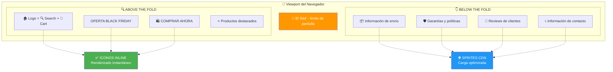

# 🎨 Sistema de Iconos SVG - Guía Principal

Sistema escalable de iconos SVG optimizado para rendimiento máximo (Lighthouse 100/100) usando sprites servidos desde Cloudflare CDN, compatible con Angular SSR y arquitectura NX.

## 🎯 Estrategia Clave

### Above-the-fold vs Below-the-fold

El concepto de "fold" es crucial para el rendimiento. Todo lo que el usuario ve sin hacer scroll debe cargarse instantáneamente, mientras que el contenido inferior puede cargarse de forma optimizada.



**¿Por qué esta separación?**

- **Above-the-fold**: El usuario debe ver estos elementos inmediatamente. Un retraso de 100ms puede reducir las conversiones.
- **Below-the-fold**: El usuario llegará aquí después de interactuar con la página. Podemos optimizar la carga inicial.

## 📊 Estrategia de Rendimiento

| Método          | FCP            | LCP            | Cuándo Usar                       |
| --------------- | -------------- | -------------- | --------------------------------- |
| **SVG inline**  | ⚡ Instantáneo | ⚡ Instantáneo | ✅ Iconos críticos above-the-fold |
| **Sprites CDN** | ⏱️ +100-200ms  | ⏱️ +100-200ms  | ✅ Iconos below-the-fold          |

### Análisis de impacto

**SVG Inline (Críticos)**:

- ✅ **Ventajas**: Sin requests HTTP, renderizado inmediato, cacheable con el HTML
- ⚠️ **Consideraciones**: Aumenta el tamaño del bundle inicial (~2KB por página)
- 🎯 **Ideal para**: Logo, carrito, menú hamburguesa, CTAs principales

**Sprites CDN (No críticos)**:

- ✅ **Ventajas**: Cache infinito, compresión óptima, no aumenta bundle inicial
- ⚠️ **Consideraciones**: Requiere request HTTP adicional
- 🎯 **Ideal para**: Footer, redes sociales, features, iconos decorativos

## 🏗️ Arquitectura

```
libs/
  icons/
    src/
      assets/individual/     # SVGs fuente organizados por sección
        core/               # Iconos comunes (carrito, user, etc.)
        home/               # Iconos específicos del home
        admin/              # Iconos del panel admin
      lib/
        components/
          icon.component.ts  # Componente para sprites
        config/
          icon.config.ts     # Configuración CDN
        references/
          critical-icons.md  # ✨ Referencia para copy/paste
      tools/
        generate-sprites.mjs # Script generación
        validate-icons.mjs   # Validaciones
scripts/
  deploy-icons.mjs          # Deploy a CDN
```

## 🎯 Clasificación de Iconos

### ✅ Críticos (Inline en template)

- Logo principal
- Iconos del header (búsqueda, carrito, menú)
- CTAs principales del hero
- Iconos de navegación principal

### 🌐 No Críticos (Sprites CDN)

- Iconos del footer
- Features/beneficios
- Redes sociales
- Iconos decorativos

## 🚀 Implementación Rápida

### 1. Iconos Críticos (Ejemplo)

```typescript
// ✅ CORRECTO - header.component.ts
@Component({
  template: `
    <!-- Logo crítico inline -->
    <svg viewBox="0 0 120 40" width="120" height="40">
      <path d="M12 0L24 12L12 24L0 12Z" fill="currentColor" />
      <text x="30" y="28" font-size="24" fill="currentColor">ACME</text>
    </svg>

    <!-- Carrito crítico inline -->
    <svg viewBox="0 0 24 24" width="24" height="24">
      <path d="M7 4V2C7 1.45 7.45 1 8 1H16C16.55 1..." fill="currentColor" />
    </svg>
  `,
})
export class HeaderComponent {}
```

### 2. Iconos No Críticos (Componente)

```typescript
// icon.component.ts
@Component({
  selector: "ui-icon",
  template: `
    <svg [attr.width]="size" [attr.height]="size">
      <use [attr.href]="spriteUrl + '#icon-' + name"></use>
    </svg>
  `,
})
export class IconComponent {
  @Input() name!: string;
  @Input() section: "core" | "home" | "admin" = "core";
  @Input() size = "24";

  get spriteUrl() {
    return `${this.config.cdnUrl}/sprite-${this.section}`;
  }
}
```

### 3. Uso en Templates

```html
<!-- Hero con iconos críticos inline -->
<section class="hero">
  <button class="cta">
    <!-- ✅ Inline para above-the-fold -->
    <svg viewBox="0 0 24 24" width="20" height="20">
      <path d="M19 7h-3V6a4 4..." fill="currentColor" />
    </svg>
    Comprar Ahora
  </button>
</section>

<!-- Footer con sprites -->
<footer>
  <!-- 🌐 Sprites para below-the-fold -->
  <ui-icon name="facebook" section="core" size="24" />
  <ui-icon name="twitter" section="core" size="24" />
</footer>
```

## 📋 Scripts Principales

```json
{
  "scripts": {
    "icons:build": "npm run icons:validate && npm run icons:generate",
    "icons:generate": "node libs/icons/tools/generate-sprites.mjs",
    "icons:validate": "node libs/icons/tools/validate-icons.mjs",
    "icons:deploy": "node scripts/deploy-icons.mjs",
    "icons:preview": "node libs/icons/tools/preview-icons.mjs"
  }
}
```

## 📊 Métricas Esperadas

| Métrica | Antes | Después | Mejora      |
| ------- | ----- | ------- | ----------- |
| **FCP** | 2.1s  | 0.8s    | **62%** ⬇️  |
| **LCP** | 3.2s  | 1.9s    | **41%** ⬇️  |
| **CLS** | 0.05  | 0       | **100%** ⬇️ |

## 🔗 Guías Relacionadas

- [📋 Implementación de Iconos Críticos](./critical-icons.md)
- [☁️ Automatización CDN](./cdn-automation.md)
- [🎛️ Iconos Dinámicos con CMS](./dynamic-icons-cms.md)

---

**Siguiente paso**: Revisa la [implementación detallada de iconos críticos](./critical-icons.md)
