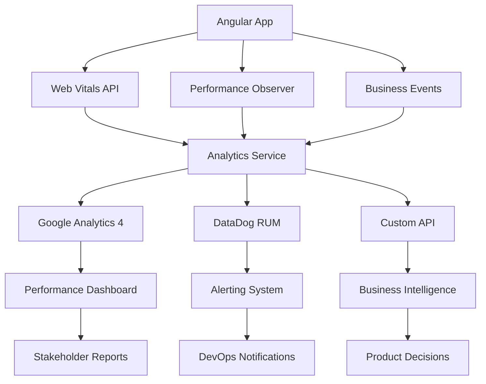

# 📊 Monitoreo y Analytics de Performance

Guía completa para implementar monitoreo de rendimiento en aplicaciones e-commerce Angular con métricas RUM, alertas automáticas y dashboards de performance.

## 🎯 Objetivos del Monitoreo

- **RUM (Real User Monitoring)**: Métricas de usuarios reales vs sintéticas
- **Core Web Vitals**: FCP, LCP, CLS, FID en producción
- **Business Metrics**: Conversión, abandono de carrito, revenue
- **Alertas Proactivas**: Detección temprana de degradación
- **Performance Budget**: Prevención de regresiones

## 📈 Arquitectura de Monitoreo



## 🔧 Implementación Core

### 1. Servicio Base de Analytics

```typescript
// libs/analytics/src/lib/performance-analytics.service.ts
import { Injectable, Inject, PLATFORM_ID } from "@angular/core";
import { isPlatformBrowser } from "@angular/common";
import {
  BehaviorSubject,
  Observable,
  debounceTime,
  distinctUntilChanged,
} from "rxjs";

export interface PerformanceMetric {
  name: string;
  value: number;
  rating: "good" | "needs-improvement" | "poor";
  timestamp: number;
  url: string;
  userAgent: string;
  connection?: NetworkInformation;
  sessionId: string;
  userId?: string;
}

export interface BusinessMetric {
  event: string;
  category: "ecommerce" | "navigation" | "interaction";
  value?: number;
  metadata?: Record<string, any>;
  timestamp: number;
  sessionId: string;
  userId?: string;
}

@Injectable({
  providedIn: "root",
})
export class PerformanceAnalyticsService {
  private isBrowser: boolean;
  private sessionId: string;
  private userId?: string;

  private metricsSubject = new BehaviorSubject<PerformanceMetric[]>([]);
  private businessEventsSubject = new BehaviorSubject<BusinessMetric[]>([]);

  public metrics$ = this.metricsSubject.asObservable();
  public businessEvents$ = this.businessEventsSubject.asObservable();

  private performanceObserver?: PerformanceObserver;
  private navigationObserver?: PerformanceObserver;

  constructor(@Inject(PLATFORM_ID) platformId: Object) {
    this.isBrowser = isPlatformBrowser(platformId);
    this.sessionId = this.generateSessionId();

    if (this.isBrowser) {
      this.initializeMonitoring();
      this.setupPerformanceObservers();
      this.trackNavigationTiming();
    }
  }

  private generateSessionId(): string {
    return `${Date.now()}-${Math.random().toString(36).substr(2, 9)}`;
  }

  private initializeMonitoring() {
    // Web Vitals monitoring
    this.setupWebVitals();

    // Custom performance monitoring
    this.setupCustomMetrics();

    // Error tracking
    this.setupErrorTracking();

    // Network monitoring
    this.setupNetworkMonitoring();
  }

  private setupWebVitals() {
    import("web-vitals").then(({ getCLS, getFCP, getFID, getLCP, getTTFB }) => {
      getCLS((metric) =>
        this.recordMetric({
          name: "CLS",
          value: metric.value,
          rating: this.getRating("CLS", metric.value),
          timestamp: Date.now(),
          url: window.location.href,
          userAgent: navigator.userAgent,
          connection: (navigator as any).connection,
          sessionId: this.sessionId,
          userId: this.userId,
        })
      );

      getFCP((metric) =>
        this.recordMetric({
          name: "FCP",
          value: metric.value,
          rating: this.getRating("FCP", metric.value),
          timestamp: Date.now(),
          url: window.location.href,
          userAgent: navigator.userAgent,
          connection: (navigator as any).connection,
          sessionId: this.sessionId,
          userId: this.userId,
        })
      );

      getFID((metric) =>
        this.recordMetric({
          name: "FID",
          value: metric.value,
          rating: this.getRating("FID", metric.value),
          timestamp: Date.now(),
          url: window.location.href,
          userAgent: navigator.userAgent,
          connection: (navigator as any).connection,
          sessionId: this.sessionId,
          userId: this.userId,
        })
      );

      getLCP((metric) =>
        this.recordMetric({
          name: "LCP",
          value: metric.value,
          rating: this.getRating("LCP", metric.value),
          timestamp: Date.now(),
          url: window.location.href,
          userAgent: navigator.userAgent,
          connection: (navigator as any).connection,
          sessionId: this.sessionId,
          userId: this.userId,
        })
      );

      getTTFB((metric) =>
        this.recordMetric({
          name: "TTFB",
          value: metric.value,
          rating: this.getRating("TTFB", metric.value),
          timestamp: Date.now(),
          url: window.location.href,
          userAgent: navigator.userAgent,
          connection: (navigator as any).connection,
          sessionId: this.sessionId,
          userId: this.userId,
        })
      );
    });
  }

  private setupCustomMetrics() {
    // Angular-specific metrics
    this.trackAngularBootstrap();
    this.trackRouteChanges();
    this.trackComponentMounts();
  }

  private setupPerformanceObservers() {
    if ("PerformanceObserver" in window) {
      // Navigation timing
      this.navigationObserver = new PerformanceObserver((list) => {
        list.getEntries().forEach((entry) => {
          if (entry.entryType === "navigation") {
            this.processNavigationEntry(entry as PerformanceNavigationTiming);
          }
        });
      });

      this.navigationObserver.observe({ entryTypes: ["navigation"] });

      // Resource timing
      this.performanceObserver = new PerformanceObserver((list) => {
        list.getEntries().forEach((entry) => {
          if (entry.entryType === "resource") {
            this.processResourceEntry(entry as PerformanceResourceTiming);
          }
        });
      });

      this.performanceObserver.observe({ entryTypes: ["resource"] });
    }
  }

  private processNavigationEntry(entry: PerformanceNavigationTiming) {
    const metrics = {
      "DNS Lookup": entry.domainLookupEnd - entry.domainLookupStart,
      "TCP Connect": entry.connectEnd - entry.connectStart,
      "SSL Handshake": entry.connectEnd - entry.secureConnectionStart,
      Request: entry.responseStart - entry.requestStart,
      Response: entry.responseEnd - entry.responseStart,
      "DOM Processing": entry.domComplete - entry.responseEnd,
      "Load Complete": entry.loadEventEnd - entry.loadEventStart,
    };

    Object.entries(metrics).forEach(([name, value]) => {
      if (value > 0) {
        this.recordMetric({
          name: `Navigation.${name}`,
          value,
          rating: this.getRatingForNavigationMetric(name, value),
          timestamp: Date.now(),
          url: window.location.href,
          userAgent: navigator.userAgent,
          sessionId: this.sessionId,
          userId: this.userId,
        });
      }
    });
  }

  private processResourceEntry(entry: PerformanceResourceTiming) {
    // Track slow resources
    const duration = entry.responseEnd - entry.startTime;

    if (duration > 1000) {
      // Resources taking more than 1s
      this.recordMetric({
        name: "Slow Resource",
        value: duration,
        rating: "poor",
        timestamp: Date.now(),
        url: entry.name,
        userAgent: navigator.userAgent,
        sessionId: this.sessionId,
        userId: this.userId,
      });
    }

    // Track icon sprite loads specifically
    if (entry.name.includes("sprite-") && entry.name.endsWith(".svg")) {
      this.recordMetric({
        name: "Icon Sprite Load",
        value: duration,
        rating:
          duration < 200
            ? "good"
            : duration < 500
            ? "needs-improvement"
            : "poor",
        timestamp: Date.now(),
        url: entry.name,
        userAgent: navigator.userAgent,
        sessionId: this.sessionId,
        userId: this.userId,
      });
    }
  }

  private trackAngularBootstrap() {
    // Measure Angular bootstrap time
    const navigationStart = performance.timeOrigin;
    const bootstrapEnd = performance.now();

    this.recordMetric({
      name: "Angular Bootstrap",
      value: bootstrapEnd,
      rating:
        bootstrapEnd < 1000
          ? "good"
          : bootstrapEnd < 2000
          ? "needs-improvement"
          : "poor",
      timestamp: Date.now(),
      url: window.location.href,
      userAgent: navigator.userAgent,
      sessionId: this.sessionId,
      userId: this.userId,
    });
  }

  private trackRouteChanges() {
    // Hook into Router events for SPA navigation timing
    let routeStartTime = 0;

    if (typeof window !== "undefined" && window.addEventListener) {
      window.addEventListener("beforeunload", () => {
        routeStartTime = performance.now();
      });

      window.addEventListener("load", () => {
        if (routeStartTime > 0) {
          const routeTime = performance.now() - routeStartTime;
          this.recordMetric({
            name: "Route Change",
            value: routeTime,
            rating:
              routeTime < 500
                ? "good"
                : routeTime < 1000
                ? "needs-improvement"
                : "poor",
            timestamp: Date.now(),
            url: window.location.href,
            userAgent: navigator.userAgent,
            sessionId: this.sessionId,
            userId: this.userId,
          });
        }
      });
    }
  }

  private trackComponentMounts() {
    // Track component lifecycle metrics
    // This would integrate with Angular's lifecycle hooks
  }

  private setupErrorTracking() {
    window.addEventListener("error", (event) => {
      this.trackBusinessEvent({
        event: "JavaScript Error",
        category: "interaction",
        metadata: {
          message: event.message,
          filename: event.filename,
          lineno: event.lineno,
          colno: event.colno,
          stack: event.error?.stack,
        },
        timestamp: Date.now(),
        sessionId: this.sessionId,
        userId: this.userId,
      });
    });

    window.addEventListener("unhandledrejection", (event) => {
      this.trackBusinessEvent({
        event: "Promise Rejection",
        category: "interaction",
        metadata: {
          reason: event.reason?.toString(),
          stack: event.reason?.stack,
        },
        timestamp: Date.now(),
        sessionId: this.sessionId,
        userId: this.userId,
      });
    });
  }

  private setupNetworkMonitoring() {
    if ("navigator" in window && "connection" in navigator) {
      const connection = (navigator as any).connection;

      if (connection) {
        this.recordMetric({
          name: "Network.EffectiveType",
          value: this.networkTypeToValue(connection.effectiveType),
          rating: "good",
          timestamp: Date.now(),
          url: window.location.href,
          userAgent: navigator.userAgent,
          connection,
          sessionId: this.sessionId,
          userId: this.userId,
        });

        connection.addEventListener("change", () => {
          this.recordMetric({
            name: "Network.Change",
            value: this.networkTypeToValue(connection.effectiveType),
            rating: "good",
            timestamp: Date.now(),
            url: window.location.href,
            userAgent: navigator.userAgent,
            connection,
            sessionId: this.sessionId,
            userId: this.userId,
          });
        });
      }
    }
  }

  private networkTypeToValue(type: string): number {
    const typeMap: Record<string, number> = {
      "slow-2g": 1,
      "2g": 2,
      "3g": 3,
      "4g": 4,
      "5g": 5,
    };
    return typeMap[type] || 0;
  }

  private getRating(
    metric: string,
    value: number
  ): "good" | "needs-improvement" | "poor" {
    const thresholds: Record<string, [number, number]> = {
      CLS: [0.1, 0.25],
      FCP: [1800, 3000],
      FID: [100, 300],
      LCP: [2500, 4000],
      TTFB: [800, 1800],
    };

    const [good, poor] = thresholds[metric] || [1000, 2000];

    if (value <= good) return "good";
    if (value <= poor) return "needs-improvement";
    return "poor";
  }

  private getRatingForNavigationMetric(
    name: string,
    value: number
  ): "good" | "needs-improvement" | "poor" {
    const thresholds: Record<string, [number, number]> = {
      "DNS Lookup": [50, 200],
      "TCP Connect": [100, 300],
      "SSL Handshake": [200, 500],
      Request: [100, 300],
      Response: [200, 500],
      "DOM Processing": [500, 1500],
      "Load Complete": [100, 300],
    };

    const [good, poor] = thresholds[name] || [200, 1000];

    if (value <= good) return "good";
    if (value <= poor) return "needs-improvement";
    return "poor";
  }

  // Public API methods
  recordMetric(metric: PerformanceMetric) {
    const currentMetrics = this.metricsSubject.value;
    this.metricsSubject.next([...currentMetrics, metric]);

    // Send to external services
    this.sendToAnalytics(metric);
  }

  trackBusinessEvent(event: BusinessMetric) {
    const currentEvents = this.businessEventsSubject.value;
    this.businessEventsSubject.next([...currentEvents, event]);

    // Send to external services
    this.sendBusinessEventToAnalytics(event);
  }

  setUserId(userId: string) {
    this.userId = userId;
  }

  // E-commerce specific tracking methods
  trackAddToCart(productId: string, price: number, quantity: number = 1) {
    this.trackBusinessEvent({
      event: "add_to_cart",
      category: "ecommerce",
      value: price * quantity,
      metadata: {
        productId,
        price,
        quantity,
        currency: "USD",
      },
      timestamp: Date.now(),
      sessionId: this.sessionId,
      userId: this.userId,
    });
  }

  trackPurchase(transactionId: string, value: number, items: any[]) {
    this.trackBusinessEvent({
      event: "purchase",
      category: "ecommerce",
      value,
      metadata: {
        transactionId,
        items,
        currency: "USD",
      },
      timestamp: Date.now(),
      sessionId: this.sessionId,
      userId: this.userId,
    });
  }

  trackSearchPerformance(
    query: string,
    resultsCount: number,
    searchTime: number
  ) {
    this.trackBusinessEvent({
      event: "search",
      category: "interaction",
      value: searchTime,
      metadata: {
        query,
        resultsCount,
        searchTime,
      },
      timestamp: Date.now(),
      sessionId: this.sessionId,
      userId: this.userId,
    });
  }

  private sendToAnalytics(metric: PerformanceMetric) {
    // Google Analytics 4
    if (typeof gtag !== "undefined") {
      gtag("event", "performance_metric", {
        custom_parameter_metric_name: metric.name,
        custom_parameter_metric_value: metric.value,
        custom_parameter_metric_rating: metric.rating,
        custom_parameter_session_id: metric.sessionId,
      });
    }

    // DataDog RUM
    if (typeof (window as any).DD_RUM !== "undefined") {
      (window as any).DD_RUM.addRumGlobalContext("performance_metric", {
        name: metric.name,
        value: metric.value,
        rating: metric.rating,
        sessionId: metric.sessionId,
      });
    }

    // Custom API
    this.sendToCustomAPI("metrics", metric);
  }

  private sendBusinessEventToAnalytics(event: BusinessMetric) {
    // Google Analytics 4
    if (typeof gtag !== "undefined") {
      gtag("event", event.event, {
        event_category: event.category,
        value: event.value,
        ...event.metadata,
      });
    }

    // DataDog RUM
    if (typeof (window as any).DD_RUM !== "undefined") {
      (window as any).DD_RUM.addUserAction(event.event, event.metadata);
    }

    // Custom API
    this.sendToCustomAPI("events", event);
  }

  private sendToCustomAPI(endpoint: string, data: any) {
    // Batch and send to custom analytics API
    if (typeof fetch !== "undefined") {
      // Debounce and batch requests
      this.batchedSend(endpoint, data);
    }
  }

  private batchQueue: Record<string, any[]> = {};
  private batchTimeout: Record<string, any> = {};

  private batchedSend(endpoint: string, data: any) {
    if (!this.batchQueue[endpoint]) {
      this.batchQueue[endpoint] = [];
    }

    this.batchQueue[endpoint].push(data);

    // Clear existing timeout
    if (this.batchTimeout[endpoint]) {
      clearTimeout(this.batchTimeout[endpoint]);
    }

    // Set new timeout
    this.batchTimeout[endpoint] = setTimeout(() => {
      this.flushBatch(endpoint);
    }, 5000); // Send every 5 seconds

    // Send immediately if batch is full
    if (this.batchQueue[endpoint].length >= 10) {
      this.flushBatch(endpoint);
    }
  }

  private flushBatch(endpoint: string) {
    if (!this.batchQueue[endpoint] || this.batchQueue[endpoint].length === 0) {
      return;
    }

    const batch = [...this.batchQueue[endpoint]];
    this.batchQueue[endpoint] = [];

    fetch(`/api/analytics/${endpoint}`, {
      method: "POST",
      headers: {
        "Content-Type": "application/json",
      },
      body: JSON.stringify({
        batch,
        timestamp: Date.now(),
        sessionId: this.sessionId,
      }),
    }).catch((error) => {
      console.error(`Failed to send analytics batch for ${endpoint}:`, error);
    });
  }

  // Performance budget checking
  checkPerformanceBudgets() {
    const budgets = {
      LCP: 2500,
      FCP: 1800,
      CLS: 0.1,
      FID: 100,
    };

    const violations: string[] = [];
    const currentMetrics = this.metricsSubject.value;

    Object.entries(budgets).forEach(([metric, budget]) => {
      const latestMetric = currentMetrics
        .filter((m) => m.name === metric)
        .sort((a, b) => b.timestamp - a.timestamp)[0];

      if (latestMetric && latestMetric.value > budget) {
        violations.push(`${metric}: ${latestMetric.value} > ${budget}`);
      }
    });

    if (violations.length > 0) {
      this.trackBusinessEvent({
        event: "performance_budget_violation",
        category: "interaction",
        metadata: {
          violations,
          url: window.location.href,
        },
        timestamp: Date.now(),
        sessionId: this.sessionId,
        userId: this.userId,
      });
    }

    return violations;
  }

  // Get performance summary
  getPerformanceSummary(): Observable<any> {
    return this.metrics$.pipe(
      debounceTime(1000),
      distinctUntilChanged(),
      map((metrics) => {
        const summary: Record<string, any> = {};

        ["LCP", "FCP", "CLS", "FID", "TTFB"].forEach((metricName) => {
          const metricValues = metrics
            .filter((m) => m.name === metricName)
            .map((m) => m.value);

          if (metricValues.length > 0) {
            summary[metricName] = {
              latest: metricValues[metricValues.length - 1],
              average:
                metricValues.reduce((a, b) => a + b, 0) / metricValues.length,
              count: metricValues.length,
            };
          }
        });

        return summary;
      })
    );
  }
}
```

### 2. Integración con Google Analytics 4

```typescript
// libs/analytics/src/lib/ga4-integration.service.ts
import { Injectable } from "@angular/core";
import { PerformanceAnalyticsService } from "./performance-analytics.service";

@Injectable({
  providedIn: "root",
})
export class GA4IntegrationService {
  constructor(private performanceService: PerformanceAnalyticsService) {
    this.setupGA4();
  }

  private setupGA4() {
    // Enhanced E-commerce tracking
    this.setupEcommerceTracking();

    // Custom performance events
    this.setupPerformanceTracking();

    // User journey tracking
    this.setupUserJourneyTracking();
  }

  private setupEcommerceTracking() {
    this.performanceService.businessEvents$.subscribe((events) => {
      events.forEach((event) => {
        switch (event.event) {
          case "add_to_cart":
            this.trackGA4Event("add_to_cart", {
              currency: event.metadata?.currency || "USD",
              value: event.value,
              items: [
                {
                  item_id: event.metadata?.productId,
                  price: event.metadata?.price,
                  quantity: event.metadata?.quantity,
                },
              ],
            });
            break;

          case "purchase":
            this.trackGA4Event("purchase", {
              transaction_id: event.metadata?.transactionId,
              currency: event.metadata?.currency || "USD",
              value: event.value,
              items: event.metadata?.items,
            });
            break;

          case "search":
            this.trackGA4Event("search", {
              search_term: event.metadata?.query,
              custom_parameter_results_count: event.metadata?.resultsCount,
              custom_parameter_search_time: event.metadata?.searchTime,
            });
            break;
        }
      });
    });
  }

  private setupPerformanceTracking() {
    this.performanceService.metrics$.subscribe((metrics) => {
      metrics.forEach((metric) => {
        // Only send poor performing metrics to reduce data volume
        if (metric.rating === "poor") {
          this.trackGA4Event("poor_performance", {
            custom_parameter_metric_name: metric.name,
            custom_parameter_metric_value: metric.value,
            custom_parameter_page_url: metric.url,
          });
        }
      });
    });
  }

  private setupUserJourneyTracking() {
    // Track critical user paths
    const criticalPaths = [
      "/",
      "/productos",
      "/producto/",
      "/cart",
      "/checkout",
    ];

    let previousPath = "";

    // Listen to route changes
    if (typeof window !== "undefined") {
      const observer = new MutationObserver(() => {
        const currentPath = window.location.pathname;

        if (currentPath !== previousPath) {
          // Check if this is a critical path transition
          const fromCritical = criticalPaths.some((path) =>
            previousPath.startsWith(path)
          );
          const toCritical = criticalPaths.some((path) =>
            currentPath.startsWith(path)
          );

          if (fromCritical && toCritical) {
            this.trackGA4Event("critical_path_navigation", {
              custom_parameter_from_path: previousPath,
              custom_parameter_to_path: currentPath,
              custom_parameter_session_id: this.performanceService["sessionId"],
            });
          }

          previousPath = currentPath;
        }
      });

      observer.observe(document, { subtree: true, childList: true });
    }
  }

  private trackGA4Event(eventName: string, parameters: any) {
    if (typeof gtag !== "undefined") {
      gtag("event", eventName, parameters);
    }
  }

  // Public methods for manual tracking
  trackPageView(path: string, title: string) {
    this.trackGA4Event("page_view", {
      page_title: title,
      page_location: window.location.origin + path,
    });
  }

  trackCustomEvent(eventName: string, parameters: Record<string, any>) {
    this.trackGA4Event(eventName, parameters);
  }

  // Enhanced E-commerce methods
  trackViewItem(
    productId: string,
    productName: string,
    category: string,
    price: number
  ) {
    this.trackGA4Event("view_item", {
      currency: "USD",
      value: price,
      items: [
        {
          item_id: productId,
          item_name: productName,
          item_category: category,
          price: price,
          quantity: 1,
        },
      ],
    });
  }

  trackBeginCheckout(value: number, items: any[]) {
    this.trackGA4Event("begin_checkout", {
      currency: "USD",
      value: value,
      items: items,
    });
  }
}
```

### 3. Dashboard de Performance en Tiempo Real

```typescript
// libs/analytics/src/lib/performance-dashboard.component.ts
import {
  Component,
  OnInit,
  OnDestroy,
  ChangeDetectionStrategy,
} from "@angular/core";
import { CommonModule } from "@angular/common";
import {
  PerformanceAnalyticsService,
  PerformanceMetric,
} from "./performance-analytics.service";
import {
  Observable,
  Subject,
  combineLatest,
  map,
  startWith,
  takeUntil,
} from "rxjs";

interface DashboardData {
  currentMetrics: Record<string, number>;
  trends: Record<string, number[]>;
  alerts: string[];
  summary: {
    performanceScore: number;
    issues: number;
    improvements: string[];
  };
}

@Component({
  selector: "performance-dashboard",
  standalone: true,
  imports: [CommonModule],
  changeDetection: ChangeDetectionStrategy.OnPush,
  template: `
    <div class="performance-dashboard" *ngIf="dashboardData$ | async as data">
      <!-- Real-time status -->
      <div class="status-header">
        <div
          class="status-item"
          [class]="getStatusClass(data.summary.performanceScore)"
        >
          <h3>Performance Score</h3>
          <div class="score">{{ data.summary.performanceScore }}/100</div>
        </div>

        <div class="status-item" [class.warning]="data.summary.issues > 0">
          <h3>Active Issues</h3>
          <div class="score">{{ data.summary.issues }}</div>
        </div>

        <div class="status-item">
          <h3>Session ID</h3>
          <div class="session-id">{{ sessionId }}</div>
        </div>
      </div>

      <!-- Core Web Vitals -->
      <div class="metrics-grid">
        <div class="metric-card" *ngFor="let metric of coreWebVitals">
          <div class="metric-header">
            <h4>{{ metric.name }}</h4>
            <span class="metric-unit">{{ metric.unit }}</span>
          </div>

          <div
            class="metric-value"
            [class]="
              getMetricClass(metric.name, data.currentMetrics[metric.name])
            "
          >
            {{
              formatMetricValue(metric.name, data.currentMetrics[metric.name])
            }}
          </div>

          <div class="metric-trend" *ngIf="data.trends[metric.name]">
            <div class="trend-chart">
              <div
                class="trend-bar"
                *ngFor="let value of data.trends[metric.name]; let i = index"
                [style.height.%]="
                  getTrendHeight(value, data.trends[metric.name])
                "
                [class]="getMetricClass(metric.name, value)"
              ></div>
            </div>
          </div>

          <div class="metric-threshold">
            <span class="good">Good: &lt; {{ metric.goodThreshold }}</span>
            <span class="poor">Poor: &gt; {{ metric.poorThreshold }}</span>
          </div>
        </div>
      </div>

      <!-- Performance Alerts -->
      <div class="alerts-section" *ngIf="data.alerts.length > 0">
        <h3>🚨 Performance Alerts</h3>
        <div class="alert-list">
          <div class="alert-item" *ngFor="let alert of data.alerts">
            {{ alert }}
          </div>
        </div>
      </div>

      <!-- Improvement Suggestions -->
      <div
        class="improvements-section"
        *ngIf="data.summary.improvements.length > 0"
      >
        <h3>💡 Suggested Improvements</h3>
        <ul class="improvement-list">
          <li *ngFor="let improvement of data.summary.improvements">
            {{ improvement }}
          </li>
        </ul>
      </div>

      <!-- Real-time Network Info -->
      <div class="network-info" *ngIf="networkInfo">
        <h3>📶 Network Information</h3>
        <div class="network-details">
          <span>Type: {{ networkInfo.effectiveType }}</span>
          <span>Downlink: {{ networkInfo.downlink }} Mbps</span>
          <span>RTT: {{ networkInfo.rtt }}ms</span>
        </div>
      </div>

      <!-- Export/Share Options -->
      <div class="actions-section">
        <button class="btn-primary" (click)="exportReport()">
          📊 Export Report
        </button>
        <button class="btn-secondary" (click)="shareMetrics()">
          🔗 Share Metrics
        </button>
        <button class="btn-secondary" (click)="resetMetrics()">
          🔄 Reset Session
        </button>
      </div>
    </div>
  `,
  styles: [
    `
      .performance-dashboard {
        padding: 2rem;
        font-family: -apple-system, BlinkMacSystemFont, "Segoe UI", sans-serif;
        background: #f8fafc;
        min-height: 100vh;
      }

      .status-header {
        display: grid;
        grid-template-columns: repeat(auto-fit, minmax(200px, 1fr));
        gap: 1rem;
        margin-bottom: 2rem;
      }

      .status-item {
        background: white;
        padding: 1.5rem;
        border-radius: 8px;
        box-shadow: 0 2px 4px rgba(0, 0, 0, 0.1);
        text-align: center;
      }

      .status-item.good {
        border-left: 4px solid #10b981;
      }
      .status-item.needs-improvement {
        border-left: 4px solid #f59e0b;
      }
      .status-item.poor {
        border-left: 4px solid #ef4444;
      }
      .status-item.warning {
        border-left: 4px solid #f59e0b;
      }

      .score {
        font-size: 2rem;
        font-weight: bold;
        margin-top: 0.5rem;
      }

      .session-id {
        font-family: monospace;
        font-size: 0.875rem;
        background: #f1f5f9;
        padding: 0.25rem 0.5rem;
        border-radius: 4px;
        margin-top: 0.5rem;
      }

      .metrics-grid {
        display: grid;
        grid-template-columns: repeat(auto-fit, minmax(300px, 1fr));
        gap: 1.5rem;
        margin-bottom: 2rem;
      }

      .metric-card {
        background: white;
        padding: 1.5rem;
        border-radius: 8px;
        box-shadow: 0 2px 4px rgba(0, 0, 0, 0.1);
      }

      .metric-header {
        display: flex;
        justify-content: space-between;
        align-items: center;
        margin-bottom: 1rem;
      }

      .metric-header h4 {
        margin: 0;
        font-size: 1.125rem;
      }

      .metric-unit {
        color: #6b7280;
        font-size: 0.875rem;
      }

      .metric-value {
        font-size: 2.5rem;
        font-weight: bold;
        margin-bottom: 1rem;
      }

      .metric-value.good {
        color: #10b981;
      }
      .metric-value.needs-improvement {
        color: #f59e0b;
      }
      .metric-value.poor {
        color: #ef4444;
      }

      .trend-chart {
        display: flex;
        align-items: end;
        height: 60px;
        gap: 2px;
        margin-bottom: 1rem;
      }

      .trend-bar {
        flex: 1;
        min-height: 4px;
        border-radius: 2px;
        transition: height 0.3s ease;
      }

      .trend-bar.good {
        background: #10b981;
      }
      .trend-bar.needs-improvement {
        background: #f59e0b;
      }
      .trend-bar.poor {
        background: #ef4444;
      }

      .metric-threshold {
        display: flex;
        justify-content: space-between;
        font-size: 0.75rem;
        color: #6b7280;
      }

      .metric-threshold .good {
        color: #10b981;
      }
      .metric-threshold .poor {
        color: #ef4444;
      }

      .alerts-section,
      .improvements-section {
        background: white;
        padding: 1.5rem;
        border-radius: 8px;
        box-shadow: 0 2px 4px rgba(0, 0, 0, 0.1);
        margin-bottom: 2rem;
      }

      .alert-list {
        margin-top: 1rem;
      }

      .alert-item {
        background: #fef2f2;
        border: 1px solid #fecaca;
        padding: 0.75rem;
        border-radius: 4px;
        margin-bottom: 0.5rem;
        color: #991b1b;
      }

      .improvement-list {
        margin-top: 1rem;
        padding-left: 1.5rem;
      }

      .improvement-list li {
        margin-bottom: 0.5rem;
        color: #374151;
      }

      .network-info {
        background: white;
        padding: 1.5rem;
        border-radius: 8px;
        box-shadow: 0 2px 4px rgba(0, 0, 0, 0.1);
        margin-bottom: 2rem;
      }

      .network-details {
        display: flex;
        gap: 2rem;
        margin-top: 1rem;
        font-family: monospace;
        font-size: 0.875rem;
      }

      .actions-section {
        display: flex;
        gap: 1rem;
        justify-content: center;
      }

      .btn-primary,
      .btn-secondary {
        padding: 0.75rem 1.5rem;
        border: none;
        border-radius: 4px;
        font-weight: 500;
        cursor: pointer;
        transition: all 0.2s;
      }

      .btn-primary {
        background: #3b82f6;
        color: white;
      }

      .btn-primary:hover {
        background: #2563eb;
      }

      .btn-secondary {
        background: #f1f5f9;
        color: #374151;
      }

      .btn-secondary:hover {
        background: #e2e8f0;
      }
    `,
  ],
})
export class PerformanceDashboardComponent implements OnInit, OnDestroy {
  private destroy$ = new Subject<void>();

  dashboardData$!: Observable<DashboardData>;
  sessionId: string = "";
  networkInfo: any = null;

  coreWebVitals = [
    { name: "LCP", unit: "ms", goodThreshold: 2500, poorThreshold: 4000 },
    { name: "FCP", unit: "ms", goodThreshold: 1800, poorThreshold: 3000 },
    { name: "CLS", unit: "score", goodThreshold: 0.1, poorThreshold: 0.25 },
    { name: "FID", unit: "ms", goodThreshold: 100, poorThreshold: 300 },
    { name: "TTFB", unit: "ms", goodThreshold: 800, poorThreshold: 1800 },
  ];

  constructor(private performanceService: PerformanceAnalyticsService) {}

  ngOnInit() {
    this.sessionId = this.performanceService["sessionId"];
    this.setupNetworkInfo();
    this.setupDashboardData();
  }

  ngOnDestroy() {
    this.destroy$.next();
    this.destroy$.complete();
  }

  private setupNetworkInfo() {
    if ("navigator" in window && "connection" in navigator) {
      this.networkInfo = (navigator as any).connection;
    }
  }

  private setupDashboardData() {
    this.dashboardData$ = combineLatest([
      this.performanceService.metrics$,
      this.performanceService.businessEvents$,
    ]).pipe(
      takeUntil(this.destroy$),
      map(([metrics, events]) => this.processDashboardData(metrics, events)),
      startWith(this.getInitialDashboardData())
    );
  }

  private processDashboardData(
    metrics: PerformanceMetric[],
    events: any[]
  ): DashboardData {
    const currentMetrics: Record<string, number> = {};
    const trends: Record<string, number[]> = {};
    const alerts: string[] = [];

    // Process current metrics
    this.coreWebVitals.forEach((vital) => {
      const vitalMetrics = metrics.filter((m) => m.name === vital.name);
      if (vitalMetrics.length > 0) {
        const latest = vitalMetrics[vitalMetrics.length - 1];
        currentMetrics[vital.name] = latest.value;

        // Build trend data (last 10 measurements)
        trends[vital.name] = vitalMetrics.slice(-10).map((m) => m.value);

        // Check for alerts
        if (latest.rating === "poor") {
          alerts.push(
            `${vital.name} is performing poorly: ${this.formatMetricValue(
              vital.name,
              latest.value
            )}`
          );
        }
      }
    });

    // Calculate performance score
    const performanceScore = this.calculatePerformanceScore(currentMetrics);

    // Generate improvement suggestions
    const improvements = this.generateImprovements(currentMetrics, metrics);

    return {
      currentMetrics,
      trends,
      alerts,
      summary: {
        performanceScore,
        issues: alerts.length,
        improvements,
      },
    };
  }

  private getInitialDashboardData(): DashboardData {
    return {
      currentMetrics: {},
      trends: {},
      alerts: [],
      summary: {
        performanceScore: 0,
        issues: 0,
        improvements: [],
      },
    };
  }

  private calculatePerformanceScore(metrics: Record<string, number>): number {
    const weights = {
      LCP: 0.25,
      FCP: 0.25,
      CLS: 0.25,
      FID: 0.25,
    };

    let totalScore = 0;
    let totalWeight = 0;

    Object.entries(weights).forEach(([metric, weight]) => {
      if (metrics[metric] !== undefined) {
        const vital = this.coreWebVitals.find((v) => v.name === metric)!;
        const score = this.getMetricScore(
          metric,
          metrics[metric],
          vital.goodThreshold,
          vital.poorThreshold
        );
        totalScore += score * weight;
        totalWeight += weight;
      }
    });

    return totalWeight > 0 ? Math.round(totalScore / totalWeight) : 0;
  }

  private getMetricScore(
    metric: string,
    value: number,
    good: number,
    poor: number
  ): number {
    if (value <= good) return 100;
    if (value >= poor) return 0;

    // Linear interpolation between good and poor
    return Math.round(100 - ((value - good) / (poor - good)) * 100);
  }

  private generateImprovements(
    currentMetrics: Record<string, number>,
    allMetrics: PerformanceMetric[]
  ): string[] {
    const improvements: string[] = [];

    // LCP improvements
    if (currentMetrics["LCP"] > 2500) {
      improvements.push(
        "Optimize Largest Contentful Paint: consider image optimization and preloading critical resources"
      );
    }

    // FCP improvements
    if (currentMetrics["FCP"] > 1800) {
      improvements.push(
        "Improve First Contentful Paint: reduce render-blocking resources and inline critical CSS"
      );
    }

    // CLS improvements
    if (currentMetrics["CLS"] > 0.1) {
      improvements.push(
        "Reduce Cumulative Layout Shift: set size attributes on images and reserve space for dynamic content"
      );
    }

    // Icon-specific improvements
    const iconMetrics = allMetrics.filter((m) => m.name === "Icon Sprite Load");
    if (iconMetrics.some((m) => m.value > 500)) {
      improvements.push(
        "Optimize icon loading: consider preloading critical icon sprites or using inline SVGs for above-the-fold icons"
      );
    }

    return improvements;
  }

  // Template helper methods
  getStatusClass(score: number): string {
    if (score >= 90) return "good";
    if (score >= 70) return "needs-improvement";
    return "poor";
  }

  getMetricClass(metricName: string, value: number): string {
    if (value === undefined) return "";

    const vital = this.coreWebVitals.find((v) => v.name === metricName);
    if (!vital) return "";

    if (value <= vital.goodThreshold) return "good";
    if (value <= vital.poorThreshold) return "needs-improvement";
    return "poor";
  }

  formatMetricValue(metricName: string, value: number): string {
    if (value === undefined) return "N/A";

    if (metricName === "CLS") {
      return value.toFixed(3);
    }

    return Math.round(value).toString();
  }

  getTrendHeight(value: number, series: number[]): number {
    const max = Math.max(...series);
    const min = Math.min(...series);

    if (max === min) return 50;

    return ((value - min) / (max - min)) * 100;
  }

  // Action methods
  exportReport() {
    this.dashboardData$.pipe(takeUntil(this.destroy$)).subscribe((data) => {
      const report = {
        timestamp: new Date().toISOString(),
        sessionId: this.sessionId,
        performanceScore: data.summary.performanceScore,
        metrics: data.currentMetrics,
        alerts: data.alerts,
        improvements: data.summary.improvements,
        networkInfo: this.networkInfo,
      };

      const blob = new Blob([JSON.stringify(report, null, 2)], {
        type: "application/json",
      });
      const url = URL.createObjectURL(blob);
      const link = document.createElement("a");
      link.href = url;
      link.download = `performance-report-${this.sessionId}.json`;
      link.click();
      URL.revokeObjectURL(url);
    });
  }

  shareMetrics() {
    if (navigator.share) {
      this.dashboardData$.pipe(takeUntil(this.destroy$)).subscribe((data) => {
        navigator.share({
          title: "Performance Metrics",
          text: `Performance Score: ${data.summary.performanceScore}/100`,
          url: window.location.href,
        });
      });
    } else {
      // Fallback: copy to clipboard
      this.dashboardData$.pipe(takeUntil(this.destroy$)).subscribe((data) => {
        const text = `Performance Score: ${data.summary.performanceScore}/100\nSession: ${this.sessionId}`;
        navigator.clipboard.writeText(text);
        alert("Metrics copied to clipboard");
      });
    }
  }

  resetMetrics() {
    if (confirm("Reset current performance metrics session?")) {
      window.location.reload();
    }
  }
}
```

### 4. Alertas Automáticas

```typescript
// libs/analytics/src/lib/performance-alerts.service.ts
import { Injectable } from "@angular/core";
import { PerformanceAnalyticsService } from "./performance-analytics.service";
import { filter, debounceTime, distinctUntilChanged } from "rxjs/operators";

interface AlertRule {
  metric: string;
  threshold: number;
  condition: "greater" | "less" | "equal";
  severity: "low" | "medium" | "high" | "critical";
  description: string;
}

@Injectable({
  providedIn: "root",
})
export class PerformanceAlertsService {
  private alertRules: AlertRule[] = [
    {
      metric: "LCP",
      threshold: 4000,
      condition: "greater",
      severity: "critical",
      description: "Largest Contentful Paint is critically slow",
    },
    {
      metric: "FCP",
      threshold: 3000,
      condition: "greater",
      severity: "high",
      description: "First Contentful Paint is too slow",
    },
    {
      metric: "CLS",
      threshold: 0.25,
      condition: "greater",
      severity: "high",
      description: "Cumulative Layout Shift is causing poor UX",
    },
    {
      metric: "FID",
      threshold: 300,
      condition: "greater",
      severity: "medium",
      description: "First Input Delay is affecting interactivity",
    },
  ];

  constructor(private performanceService: PerformanceAnalyticsService) {
    this.setupAlerts();
  }

  private setupAlerts() {
    this.performanceService.metrics$
      .pipe(
        debounceTime(2000), // Wait 2 seconds to avoid spam
        distinctUntilChanged(
          (prev, curr) => JSON.stringify(prev) === JSON.stringify(curr)
        )
      )
      .subscribe((metrics) => {
        this.checkAlerts(metrics);
      });
  }

  private checkAlerts(metrics: any[]) {
    this.alertRules.forEach((rule) => {
      const relevantMetrics = metrics.filter((m) => m.name === rule.metric);

      if (relevantMetrics.length > 0) {
        const latestMetric = relevantMetrics[relevantMetrics.length - 1];

        if (this.shouldTriggerAlert(latestMetric.value, rule)) {
          this.triggerAlert(rule, latestMetric);
        }
      }
    });
  }

  private shouldTriggerAlert(value: number, rule: AlertRule): boolean {
    switch (rule.condition) {
      case "greater":
        return value > rule.threshold;
      case "less":
        return value < rule.threshold;
      case "equal":
        return value === rule.threshold;
      default:
        return false;
    }
  }

  private triggerAlert(rule: AlertRule, metric: any) {
    const alert = {
      rule,
      metric,
      timestamp: Date.now(),
      severity: rule.severity,
      message: `${rule.description}: ${metric.value} ${this.getUnit(
        rule.metric
      )}`,
    };

    // Send to different channels based on severity
    switch (rule.severity) {
      case "critical":
        this.sendCriticalAlert(alert);
        break;
      case "high":
        this.sendHighPriorityAlert(alert);
        break;
      case "medium":
        this.sendMediumPriorityAlert(alert);
        break;
      case "low":
        this.sendLowPriorityAlert(alert);
        break;
    }

    // Track the alert as a business event
    this.performanceService.trackBusinessEvent({
      event: "performance_alert",
      category: "interaction",
      metadata: {
        rule: rule.metric,
        severity: rule.severity,
        value: metric.value,
        threshold: rule.threshold,
      },
      timestamp: Date.now(),
      sessionId: metric.sessionId,
    });
  }

  private sendCriticalAlert(alert: any) {
    // Send to Slack, PagerDuty, email
    this.sendSlackAlert(alert, "#critical-alerts");
    this.sendEmailAlert(alert, [
      "dev-team@company.com",
      "ops-team@company.com",
    ]);

    if (typeof window !== "undefined") {
      // Show browser notification for critical alerts
      this.showBrowserNotification(alert);
    }
  }

  private sendHighPriorityAlert(alert: any) {
    this.sendSlackAlert(alert, "#performance-alerts");
    this.sendEmailAlert(alert, ["dev-team@company.com"]);
  }

  private sendMediumPriorityAlert(alert: any) {
    this.sendSlackAlert(alert, "#performance-monitoring");
  }

  private sendLowPriorityAlert(alert: any) {
    // Just log for now
    console.warn("Performance Alert:", alert);
  }

  private sendSlackAlert(alert: any, channel: string) {
    const webhookUrl = process.env["SLACK_WEBHOOK_URL"];

    if (webhookUrl && typeof fetch !== "undefined") {
      const payload = {
        channel,
        username: "Performance Monitor",
        icon_emoji: ":warning:",
        attachments: [
          {
            color: this.getSeverityColor(alert.severity),
            title: `Performance Alert - ${alert.rule.metric}`,
            text: alert.message,
            fields: [
              {
                title: "Metric",
                value: alert.rule.metric,
                short: true,
              },
              {
                title: "Value",
                value: `${alert.metric.value} ${this.getUnit(
                  alert.rule.metric
                )}`,
                short: true,
              },
              {
                title: "Threshold",
                value: `${alert.rule.threshold} ${this.getUnit(
                  alert.rule.metric
                )}`,
                short: true,
              },
              {
                title: "Page",
                value: alert.metric.url,
                short: false,
              },
            ],
            timestamp: alert.timestamp / 1000,
          },
        ],
      };

      fetch(webhookUrl, {
        method: "POST",
        headers: {
          "Content-Type": "application/json",
        },
        body: JSON.stringify(payload),
      }).catch((error) => {
        console.error("Failed to send Slack alert:", error);
      });
    }
  }

  private sendEmailAlert(alert: any, recipients: string[]) {
    // Send email via API
    if (typeof fetch !== "undefined") {
      fetch("/api/alerts/email", {
        method: "POST",
        headers: {
          "Content-Type": "application/json",
        },
        body: JSON.stringify({
          recipients,
          subject: `Performance Alert: ${alert.rule.metric}`,
          body: this.generateEmailBody(alert),
        }),
      }).catch((error) => {
        console.error("Failed to send email alert:", error);
      });
    }
  }

  private showBrowserNotification(alert: any) {
    if ("Notification" in window && Notification.permission === "granted") {
      new Notification(`Performance Alert: ${alert.rule.metric}`, {
        body: alert.message,
        icon: "/assets/icons/warning.png",
        badge: "/assets/icons/performance.png",
      });
    }
  }

  private getSeverityColor(severity: string): string {
    const colors = {
      critical: "#ff0000",
      high: "#ff8c00",
      medium: "#ffa500",
      low: "#ffff00",
    };
    return colors[severity as keyof typeof colors] || "#cccccc";
  }

  private getUnit(metric: string): string {
    const units = {
      LCP: "ms",
      FCP: "ms",
      FID: "ms",
      TTFB: "ms",
      CLS: "score",
    };
    return units[metric as keyof typeof units] || "";
  }

  private generateEmailBody(alert: any): string {
    return `
      <h2>Performance Alert</h2>
      <p><strong>Metric:</strong> ${alert.rule.metric}</p>
      <p><strong>Current Value:</strong> ${alert.metric.value} ${this.getUnit(
      alert.rule.metric
    )}</p>
      <p><strong>Threshold:</strong> ${alert.rule.threshold} ${this.getUnit(
      alert.rule.metric
    )}</p>
      <p><strong>Severity:</strong> ${alert.severity.toUpperCase()}</p>
      <p><strong>Page:</strong> ${alert.metric.url}</p>
      <p><strong>Time:</strong> ${new Date(alert.timestamp).toISOString()}</p>
      <p><strong>Session ID:</strong> ${alert.metric.sessionId}</p>
      
      <h3>Description</h3>
      <p>${alert.rule.description}</p>
      
      <h3>Recommendations</h3>
      <ul>
        ${this.getRecommendations(alert.rule.metric)
          .map((rec) => `<li>${rec}</li>`)
          .join("")}
      </ul>
    `;
  }

  private getRecommendations(metric: string): string[] {
    const recommendations: Record<string, string[]> = {
      LCP: [
        "Optimize images and use next-gen formats (WebP, AVIF)",
        "Preload critical resources",
        "Reduce server response times",
        "Remove render-blocking JavaScript",
      ],
      FCP: [
        "Eliminate render-blocking resources",
        "Inline critical CSS",
        "Reduce server response times",
        "Use a CDN",
      ],
      CLS: [
        "Set size attributes on images and videos",
        "Reserve space for dynamic content",
        "Avoid inserting content above existing content",
        "Use CSS aspect-ratio for responsive images",
      ],
      FID: [
        "Reduce JavaScript execution time",
        "Remove unused JavaScript",
        "Use code splitting",
        "Optimize third-party scripts",
      ],
    };

    return recommendations[metric] || ["Review performance best practices"];
  }

  // Public API for custom alerts
  addCustomAlert(rule: AlertRule) {
    this.alertRules.push(rule);
  }

  removeAlert(metric: string) {
    this.alertRules = this.alertRules.filter((rule) => rule.metric !== metric);
  }

  updateAlertThreshold(metric: string, newThreshold: number) {
    const rule = this.alertRules.find((r) => r.metric === metric);
    if (rule) {
      rule.threshold = newThreshold;
    }
  }
}
```

## 🎯 Checklist de Implementación

- [ ] **Servicio base de analytics configurado**
- [ ] **Web Vitals tracking activo**
- [ ] **Google Analytics 4 integrado**
- [ ] **Dashboard de performance implementado**
- [ ] **Sistema de alertas configurado**
- [ ] **Monitoreo de iconos específico**
- [ ] **Métricas de negocio (e-commerce) tracked**
- [ ] **Alertas automáticas funcionando**
- [ ] **Reportes exportables**
- [ ] **Integration con herramientas externas (Slack, email)**

---

**Siguiente**: [Scripts y Automatización](../tools/scripts.md)
